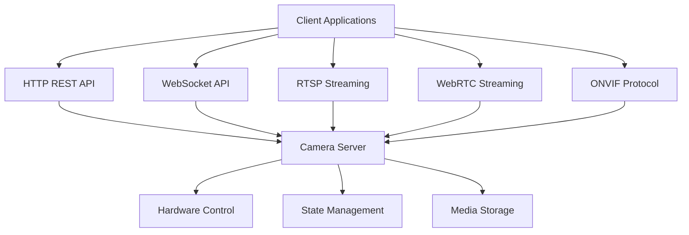

# API Reference Overview

**Complete API documentation for the RotorDream camera server, covering all integration methods and protocols.**

## Available APIs

The C Pro camera server provides multiple API interfaces to support different integration scenarios and client capabilities:



### API Comparison

| API | Protocol | Use Case | Latency | Complexity |
|-----|----------|----------|---------|------------|
| **[HTTP REST](#http-rest-api)** | HTTP/HTTPS | Configuration, file operations | 10-100ms | Low |
| **[WebSocket](#websocket-api)** | WS/WSS | Real-time control, state sync | <10ms | Low |
| **[RTSP](#rtsp-streaming)** | RTSP/RTP | Video streaming (VLC, FFmpeg) | 100-500ms | Medium |
| **[WebRTC](#webrtc-streaming)** | WebRTC/STUN | Browser video streaming | 50-200ms | High |
| **[ONVIF](#onvif-protocol)** | SOAP/HTTP | NVR/VMS integration | 50-200ms | Medium |

## Quick Start

### Choose Your API

**For Web Applications**:
- Use **WebSocket API** for real-time camera control
- Use **WebRTC** for live video in browser
- Use **HTTP API** for configuration and file downloads

**For Mobile Applications**:
- Use **WebSocket API** for control
- Use **RTSP** for video playback
- Use **HTTP API** for file operations

**For Desktop Applications**:
- Use **RTSP** for reliable video streaming
- Use **WebSocket API** for control
- Use **HTTP API** for configuration

**For NVR/VMS Integration**:
- Use **ONVIF** for standard integration
- Use **RTSP** for video feeds
- Use **HTTP API** for custom features

### Basic Connection Examples

#### HTTP REST API

```bash
# Get system information
curl http://localhost/api/info

# Start recording
curl -X POST http://localhost/api/recording/start \
  -u admin:password

# Get list of recordings
curl http://localhost/api/recordings
```

#### WebSocket API

```javascript
// Connect to WebSocket
const ws = new WebSocket('ws://localhost/api/v1');

// Send control commands
ws.onopen = () => {
    ws.send(JSON.stringify({ brightness: 75 }));
    ws.send(JSON.stringify({ record: true }));
};

// Receive state updates
ws.onmessage = (event) => {
    const data = JSON.parse(event.data);
    console.log('State update:', data);
};
```

#### RTSP Streaming

```bash
# Open RTSP stream with VLC
vlc rtsp://localhost:554/stream1

# Or with FFmpeg
ffplay rtsp://localhost:554/stream1

# Or with GStreamer
gst-launch-1.0 playbin uri=rtsp://localhost:554/stream1
```

## HTTP REST API

**Base URL**: `http://<host>/api`  
**Documentation**: [http-api.md](http-api.md)

### Key Endpoints

| Endpoint | Method | Description |
|----------|--------|-------------|
| `/api/info` | GET | System information and capabilities |
| `/api/status` | GET | Current system status |
| `/api/recording/start` | POST | Start video recording |
| `/api/recording/stop` | POST | Stop video recording |
| `/api/recordings` | GET | List all recordings |
| `/api/recordings/{id}` | GET | Download recording |
| `/api/snapshot` | GET | Capture still image |
| `/api/settings` | GET/POST | System configuration |

### Authentication

```bash
# Basic Authentication
curl -u username:password http://localhost/api/info

# Digest Authentication
curl --digest -u username:password http://localhost/api/info

# Bearer Token
curl -H "Authorization: Bearer <token>" http://localhost/api/info
```

### Response Format

```json
{
    "status": "success",
    "data": {
        "key": "value"
    },
    "timestamp": 1704067200000
}
```

**See**: [Complete HTTP API Documentation](http-api.md)

## WebSocket API

**Endpoint**: `ws://<host>/api/v1`  
**Documentation**: [websocket-api.md](websocket-api.md)

### Features

- **Real-time bidirectional communication**
- **Sub-100ms state update latency**
- **Automatic broadcast to all clients**
- **JSON message format**
- **Permission-based access control**

### Common Operations

```javascript
// Camera control
ws.send(JSON.stringify({ 'cam1-light': true }));
ws.send(JSON.stringify({ brightness: 75 }));
ws.send(JSON.stringify({ resolution: '1920x1080' }));

// Recording control
ws.send(JSON.stringify({ record: true }));
ws.send(JSON.stringify({ snap: true }));

// Get current state
ws.send(JSON.stringify({ 
    get: ['brightness', 'contrast', 'resolution'] 
}));
```

### State Mappings

| WebSocket Key | Description | Type | Range |
|---------------|-------------|------|-------|
| `brightness` | Image brightness | integer | 0-100 |
| `contrast` | Image contrast | integer | 0-100 |
| `saturation` | Color saturation | integer | 0-100 |
| `resolution` | Video resolution | string | - |
| `fps` | Frame rate | integer | 5-60 |
| `record` | Recording state | boolean/string | - |
| `cam1-light` | Camera 1 light | boolean | - |

**See**: [Complete WebSocket API Documentation](websocket-api.md)

## RTSP Streaming

**URL Format**: `rtsp://<host>:554/stream1`  
**Documentation**: [rtsp-streaming.md](rtsp-streaming.md)

### Stream URLs

| Stream | URL | Description |
|--------|-----|-------------|
| Main | `rtsp://host:554/stream1` | Primary video stream |
| Secondary | `rtsp://host:554/stream2` | Secondary/low-res stream |
| Recording | `rtsp://host:554/recording` | Recording playback |

### Client Examples

**VLC Media Player**:
```bash
vlc rtsp://192.168.1.100:554/stream1
```

**FFmpeg**:
```bash
# Play stream
ffplay rtsp://192.168.1.100:554/stream1

# Record stream
ffmpeg -i rtsp://192.168.1.100:554/stream1 \
  -c copy output.mp4

# Transcode stream
ffmpeg -i rtsp://192.168.1.100:554/stream1 \
  -c:v libx264 -preset fast -crf 23 \
  output.mp4
```

**GStreamer**:
```bash
gst-launch-1.0 rtspsrc location=rtsp://192.168.1.100:554/stream1 ! \
  rtph264depay ! h264parse ! avdec_h264 ! autovideosink
```

**Python (OpenCV)**:
```python
import cv2

cap = cv2.VideoCapture('rtsp://192.168.1.100:554/stream1')

while True:
    ret, frame = cap.read()
    if not ret:
        break
    cv2.imshow('RTSP Stream', frame)
    if cv2.waitKey(1) & 0xFF == ord('q'):
        break

cap.release()
cv2.destroyAllWindows()
```

**See**: [Complete RTSP Documentation](rtsp-streaming.md)

## WebRTC Streaming

**Protocol**: WebRTC with STUN/TURN  
**Use Case**: Browser-based low-latency streaming

### Browser Integration

```javascript
// Get WebRTC offer from server
const response = await fetch('/api/webrtc/offer');
const offer = await response.json();

// Create peer connection
const pc = new RTCPeerConnection({
    iceServers: [{ urls: 'stun:stun.l.google.com:19302' }]
});

// Set remote description
await pc.setRemoteDescription(offer);

// Create answer
const answer = await pc.createAnswer();
await pc.setLocalDescription(answer);

// Send answer to server
await fetch('/api/webrtc/answer', {
    method: 'POST',
    body: JSON.stringify(answer)
});

// Handle incoming video track
pc.ontrack = (event) => {
    document.getElementById('video').srcObject = event.streams[0];
};
```

### Features

- **Low latency**: 50-200ms typical
- **Browser native**: No plugins required
- **Adaptive bitrate**: Automatic quality adjustment
- **P2P capable**: Direct client-to-client (with TURN)

## ONVIF Protocol

**Standard**: ONVIF Profile S  
**Endpoint**: `http://<host>/onvif/device_service`  
**Documentation**: [ONVIF Integration Guide](../integration/onvif-protocol.md)

### Supported Features

- Device discovery (WS-Discovery)
- Device management
- Media profiles
- PTZ control (motor rotation)
- Event handling
- Imaging settings

### ONVIF Device Discovery

```python
from onvif import ONVIFCamera

# Create ONVIF camera instance
cam = ONVIFCamera(
    '192.168.1.100',
    80,
    'admin',
    'password'
)

# Get device information
device_info = cam.devicemgmt.GetDeviceInformation()
print(f"Manufacturer: {device_info.Manufacturer}")
print(f"Model: {device_info.Model}")

# Get media profiles
media = cam.create_media_service()
profiles = media.GetProfiles()

for profile in profiles:
    print(f"Profile: {profile.Name}")
    print(f"Resolution: {profile.VideoEncoderConfiguration.Resolution}")
```

### NVR/VMS Integration

Compatible with:
- **Milestone XProtect**
- **Genetec Security Center**
- **Avigilon Control Center**
- **Blue Iris**
- **Synology Surveillance Station**
- **QNAP QVR Pro**

## Client Libraries & SDKs

### Official Examples

We provide client examples in multiple languages:

- **[Python Client](examples/python-client.md)** - Complete Python SDK
- **[JavaScript Client](examples/javascript-client.md)** - Browser and Node.js
- **[C# Client](examples/csharp-client.md)** - .NET integration

### Community Libraries

Third-party integrations:

| Language | Library | Repository |
|----------|---------|------------|
| Python | `rotoclear-py` | [github.com/...](https://github.com) |
| JavaScript | `rotoclear-js` | [github.com/...](https://github.com) |
| Go | `go-rotoclear` | [github.com/...](https://github.com) |
| Java | `rotoclear-java` | [github.com/...](https://github.com) |

## Authentication & Security

### Authentication Methods

| Method | Use Case | Security Level |
|--------|----------|----------------|
| **Basic Auth** | Development, testing | Low (use HTTPS) |
| **Digest Auth** | Production HTTP | Medium |
| **Bearer Token** | API integrations | High |
| **Session Cookie** | Web applications | High |

### Best Practices

```javascript
// Good: Use HTTPS/WSS in production
const ws = new WebSocket('wss://camera.example.com/api/v1');

// Bad: Plain HTTP/WS in production
const ws = new WebSocket('ws://camera.example.com/api/v1');

// Good: Store tokens securely
const token = sessionStorage.getItem('authToken');

// Bad: Hardcode credentials
const password = 'admin123';
```

### SSL/TLS Configuration

See [SSL Certificates Documentation](../security/ssl-certificates.md) for:
- Certificate installation
- HTTPS configuration
- RTSPS (RTSP over TLS)
- WSS (WebSocket Secure)

## Rate Limiting & Quotas

### Default Limits

| Resource | Limit | Period |
|----------|-------|--------|
| HTTP API requests | 100 | per minute |
| WebSocket messages | 100 | per second |
| RTSP connections | 10 | concurrent |
| Failed login attempts | 5 | per 5 minutes |

### Error Responses

```json
{
    "error": "Rate limit exceeded",
    "limit": 100,
    "period": "minute",
    "retry_after": 45
}
```

## Error Handling

### HTTP Status Codes

| Code | Meaning | Action |
|------|---------|--------|
| 200 | Success | Continue |
| 400 | Bad Request | Check request format |
| 401 | Unauthorized | Authenticate |
| 403 | Forbidden | Check permissions |
| 404 | Not Found | Verify endpoint |
| 429 | Rate Limited | Wait and retry |
| 500 | Server Error | Contact support |

### WebSocket Errors

```javascript
ws.onerror = (error) => {
    console.error('WebSocket error:', error);
    // Implement reconnection logic
};

ws.onclose = (event) => {
    if (event.code === 1000) {
        // Normal closure
    } else if (event.code === 1006) {
        // Abnormal closure - reconnect
        setTimeout(() => connectWebSocket(), 5000);
    }
};
```

### RTSP Errors

| Error | Cause | Solution |
|-------|-------|----------|
| Connection refused | Server not running | Check service status |
| Authentication failed | Invalid credentials | Verify username/password |
| Stream not found | Invalid URL | Check stream path |
| Timeout | Network issue | Check firewall/network |

## API Versioning

### Current Version

- **API Version**: v1
- **Release Date**: 2024-01-15
- **Status**: Stable

### Version History

| Version | Release | Changes |
|---------|---------|---------|
| v1 | 2024-01-15 | Initial stable release |
| v1.1 | 2024-03-20 | Added WebRTC support |
| v1.2 | 2024-06-10 | Enhanced ONVIF features |

### Backward Compatibility

We maintain backward compatibility within major versions:
- API v1.x guarantees compatibility
- Deprecation warnings provided 6 months before removal
- Migration guides provided for breaking changes

## Performance Tips

### HTTP API

```javascript
// Batch operations
await Promise.all([
    fetch('/api/settings/brightness', { method: 'POST', body: '75' }),
    fetch('/api/settings/contrast', { method: 'POST', body: '60' })
]);

// Sequential requests
await fetch('/api/settings/brightness', { method: 'POST', body: '75' });
await fetch('/api/settings/contrast', { method: 'POST', body: '60' });
```

### WebSocket API

```javascript
// Batch state updates
ws.send(JSON.stringify({
    brightness: 75,
    contrast: 60,
    saturation: 50
}));

// Multiple separate messages
ws.send(JSON.stringify({ brightness: 75 }));
ws.send(JSON.stringify({ contrast: 60 }));
ws.send(JSON.stringify({ saturation: 50 }));
```

### RTSP Streaming

```bash
# Use appropriate transport
rtsp://host/stream1?tcp  # TCP for reliable delivery
rtsp://host/stream1?udp  # UDP for lower latency

# Request lower resolution if needed
rtsp://host/stream2  # Secondary stream (lower resolution)
```

## Testing Your Integration

### API Test Tools

**HTTP Testing**:
```bash
# Using curl
curl -v http://localhost/api/info

# Using httpie
http GET http://localhost/api/info

# Using Postman
# Import our Postman collection from docs/api/postman/
```

**WebSocket Testing**:
```bash
# Using websocat
websocat ws://localhost/api/v1

# Using wscat
wscat -c ws://localhost/api/v1
```

**RTSP Testing**:
```bash
# Using VLC
vlc rtsp://localhost:554/stream1

# Using FFprobe
ffprobe rtsp://localhost:554/stream1
```

### Example Test Scripts

**Python Test Suite**:
```python
import requests
import websockets
import asyncio

def test_http_api():
    response = requests.get('http://localhost/api/info')
    assert response.status_code == 200
    assert 'version' in response.json()

async def test_websocket_api():
    async with websockets.connect('ws://localhost/api/v1') as ws:
        await ws.send('{"get": ["brightness"]}')
        response = await ws.recv()
        assert 'brightness' in response

# Run tests
test_http_api()
asyncio.run(test_websocket_api())
```

## Common Integration Patterns

### Pattern 1: Web Dashboard

```javascript
// Use WebSocket for real-time control
const ws = new WebSocket('wss://camera.local/api/v1');

// Use WebRTC for video display
const video = document.getElementById('video');
const pc = new RTCPeerConnection();
// ... WebRTC setup

// Use HTTP for file downloads
fetch('/api/recordings')
    .then(r => r.json())
    .then(recordings => displayRecordings(recordings));
```

### Pattern 2: Mobile App

```kotlin
// Android example
// WebSocket for control
val ws = WebSocket("wss://camera.local/api/v1")

// ExoPlayer for RTSP video
val player = ExoPlayer.Builder(context).build()
player.setMediaItem(MediaItem.fromUri("rtsp://camera.local:554/stream1"))

// Retrofit for HTTP API
interface CameraApi {
    @GET("/api/recordings")
    suspend fun getRecordings(): List<Recording>
}
```

### Pattern 3: NVR Integration

```python
# ONVIF for device management
from onvif import ONVIFCamera

camera = ONVIFCamera('192.168.1.100', 80, 'admin', 'pass')
profiles = camera.create_media_service().GetProfiles()

# RTSP for video recording
ffmpeg -i rtsp://192.168.1.100:554/stream1 \
    -c copy -f segment -segment_time 300 \
    recording_%03d.mp4
```

### Pattern 4: Automation Script

```bash
#!/bin/bash
# Start recording at specific time

# Authenticate
TOKEN=$(curl -s -X POST http://camera.local/api/login \
    -d '{"username":"admin","password":"pass"}' | jq -r .token)

# Start recording
curl -X POST http://camera.local/api/recording/start \
    -H "Authorization: Bearer $TOKEN"

# Wait 1 hour
sleep 3600

# Stop recording
curl -X POST http://camera.local/api/recording/stop \
    -H "Authorization: Bearer $TOKEN"
```

## Troubleshooting

### Common Issues

**Cannot Connect**:
```bash
# Check if server is running
curl http://localhost/api/status

# Check firewall
sudo ufw status
sudo ufw allow 80/tcp
sudo ufw allow 554/tcp
```

**Authentication Failed**:
```bash
# Verify credentials
curl -u admin:password http://localhost/api/info

# Check user permissions
curl http://localhost/api/users/admin/permissions
```

**No Video Stream**:
```bash
# Test RTSP endpoint
ffprobe rtsp://localhost:554/stream1

# Check camera status
curl http://localhost/api/camera/status

# Verify stream is active
curl http://localhost/api/streams
```

---
