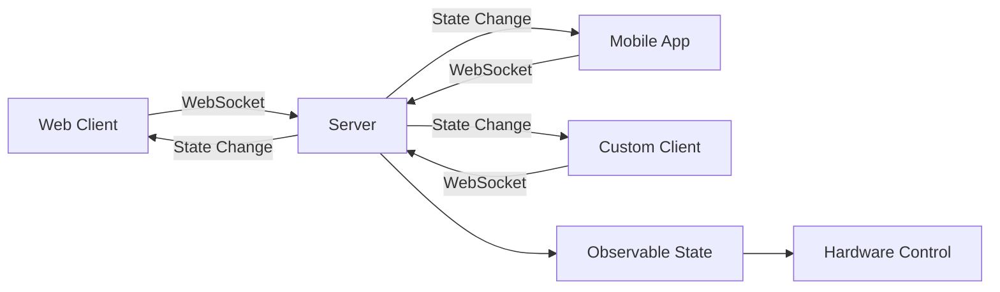
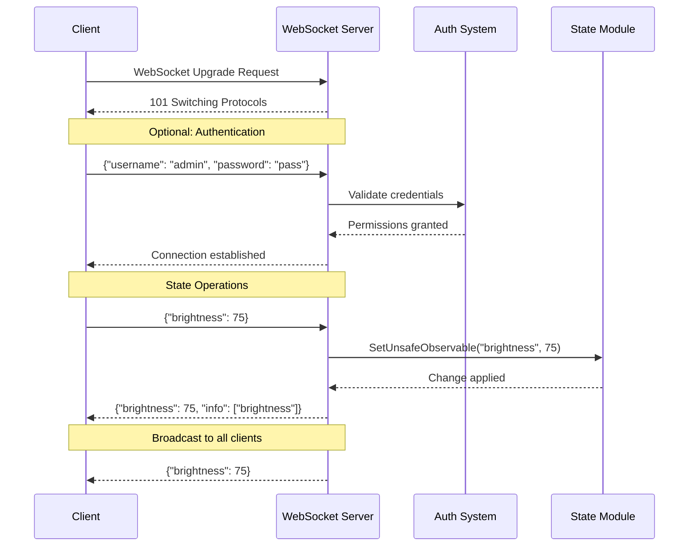

# WebSocket API

**Real-time bidirectional communication API for state synchronization and camera control.**

## Overview

The WebSocket API provides low-latency, real-time communication between clients and the C Pro camera server. It enables instant state updates, camera control, and automatic change notifications to all connected clients.



**Key Features**:
- **Real-time Updates**: Sub-100ms state change propagation
- **Bidirectional**: Both client and server can initiate messages
- **Auto-broadcast**: State changes automatically sent to all connected clients
- **Permission-based**: Access control on per-state basis
- **JSON Protocol**: Simple text-based message format
- **Session Support**: Persistent authentication across reconnections

## Connection Endpoints

### WebSocket URL

```
ws://<host>/api/v1
wss://<host>/api/v1  (SSL/TLS)
```

**Examples**:
```javascript
// Development
ws://localhost/api/v1

// Production (embedded)
ws://192.168.1.100/api/v1
wss://rotoclear-device.local/api/v1

// Secure connection
wss://camera.example.com/api/v1
```

### Connection Flow



## Authentication

### Anonymous Connection

Anonymous connections have limited **read-only** permissions:

```javascript
const ws = new WebSocket('ws://localhost/api/v1');

ws.onopen = () => {
    console.log('Connected as anonymous user');
    // Limited to reading public state
};
```

### Authenticated Connection

For full access, authenticate after connection:

```javascript
const ws = new WebSocket('ws://localhost/api/v1');

ws.onopen = () => {
    // Send credentials
    ws.send(JSON.stringify({
        username: 'admin',
        password: 'your_password'
    }));
};

ws.onmessage = (event) => {
    const data = JSON.parse(event.data);
    if (data.authenticated) {
        console.log('Authentication successful');
        console.log('Permissions:', data.permissions);
    }
};
```

### Session-based Authentication

Use session token from HTTP login:

```javascript
// 1. Login via HTTP API to get session token
const response = await fetch('/api/login', {
    method: 'POST',
    headers: { 'Content-Type': 'application/json' },
    body: JSON.stringify({ username: 'admin', password: 'pass' })
});
const { token } = await response.json();

// 2. Connect WebSocket with token
const ws = new WebSocket('ws://localhost/api/v1');
ws.onopen = () => {
    ws.send(JSON.stringify({ token: token }));
};
```

## Message Format

### Request Message (Client → Server)

**State Update**:
```json
{
    "state-key": value
}
```

**Multiple State Updates**:
```json
{
    "brightness": 75,
    "contrast": 60,
    "saturation": 50
}
```

**State Query**:
```json
{
    "get": ["brightness", "contrast", "resolution"]
}
```

### Response Message (Server → Client)

**State Update Confirmation**:
```json
{
    "brightness": 75,
    "info": ["brightness"]
}
```

**State Broadcast** (automatic on changes):
```json
{
    "brightness": 75
}
```

**Error Response**:
```json
{
    "error": "Permission denied",
    "key": "brightness"
}
```

## API V1 State Mappings

The WebSocket API uses simplified key names that map to internal observable state. Below is the complete mapping:

### Camera Control

| WebSocket Key | Observable | Type | Description |
|---------------|------------|------|-------------|
| `cam1-light` | `light0` | boolean | Camera 1 LED light on/off |
| `cam2-light` | `light1` | boolean | Camera 2 LED light on/off |
| `cam1-exists` | `cam0Exists` | boolean | Camera 1 detected (read-only) |
| `cam2-exists` | `cam1Exists` | boolean | Camera 2 detected (read-only) |
| `main-camera` | `cameraSwitch` | integer | Active camera (1 or 2) |
| `cam1-sensor` | `cam0SelectedSensor` | integer | Camera 1 sensor index (1-based) |
| `cam2-sensor` | `cam1SelectedSensor` | integer | Camera 2 sensor index (1-based) |

### Video Settings

| WebSocket Key | Observable | Type | Range | Description |
|---------------|------------|------|-------|-------------|
| `resolution` | `resolution` | string | - | Video resolution (e.g., "1920x1080") |
| `fps` | `fps` | integer | 5-60 | Frames per second |
| `pip-mode` | `pip` | string | - | Picture-in-picture mode |

### Image Quality

| WebSocket Key | Observable | Type | Range | Description |
|---------------|------------|------|-------|-------------|
| `brightness` | `brightness` | integer | 0-100 | Image brightness |
| `contrast` | `contrast` | integer | 0-100 | Image contrast |
| `sharpness` | `sharpness` | integer | 0-100 | Image sharpness |
| `saturation` | `saturation` | integer | 0-100 | Color saturation |
| `gain` | `gain` | integer | 0-100 | Sensor gain/ISO |
| `red-gain` | `redGain` | integer | 0-100 | Red channel gain |
| `blue-gain` | `blueGain` | integer | 0-100 | Blue channel gain |

### Auto Settings

| WebSocket Key | Observable | Type | Description |
|---------------|------------|------|-------------|
| `auto-exposure` | `exposure` | string/boolean | Auto exposure mode |
| `auto-white-balance` | `whiteBalance` | string/boolean | Auto white balance |
| `noise-supression` | `noiseSuppression` | boolean | Noise reduction enabled |

### Recording

| WebSocket Key | Observable | Type | Description |
|---------------|------------|------|-------------|
| `record` | `record` | string/boolean | Recording state ("on", "off", "pause", "pause_release") |
| `snap` | `takePicture` | boolean | Trigger snapshot |
| `jpeg-quality` | `pictureQuality` | integer | JPEG compression quality (0-100) |

## Usage Examples

### JavaScript/Browser

#### Basic Connection

```javascript
class RotoclearWebSocketClient {
    constructor(url) {
        this.url = url;
        this.ws = null;
        this.reconnectInterval = 5000;
    }
    
    connect(username, password) {
        this.ws = new WebSocket(this.url);
        
        this.ws.onopen = () => {
            console.log('WebSocket connected');
            
            // Authenticate if credentials provided
            if (username && password) {
                this.send({ username, password });
            }
        };
        
        this.ws.onmessage = (event) => {
            const data = JSON.parse(event.data);
            this.handleMessage(data);
        };
        
        this.ws.onerror = (error) => {
            console.error('WebSocket error:', error);
        };
        
        this.ws.onclose = () => {
            console.log('WebSocket closed, reconnecting...');
            setTimeout(() => this.connect(username, password), this.reconnectInterval);
        };
    }
    
    send(data) {
        if (this.ws.readyState === WebSocket.OPEN) {
            this.ws.send(JSON.stringify(data));
        } else {
            console.error('WebSocket not connected');
        }
    }
    
    handleMessage(data) {
        console.log('Received:', data);
        // Handle state updates
        if (data.brightness !== undefined) {
            this.onBrightnessChange(data.brightness);
        }
        if (data.record !== undefined) {
            this.onRecordingChange(data.record);
        }
    }
    
    // Camera control methods
    setLight(camera, on) {
        const key = camera === 1 ? 'cam1-light' : 'cam2-light';
        this.send({ [key]: on });
    }
    
    setBrightness(value) {
        this.send({ brightness: value });
    }
    
    setResolution(resolution) {
        this.send({ resolution: resolution });
    }
    
    startRecording() {
        this.send({ record: true });
    }
    
    stopRecording() {
        this.send({ record: false });
    }
    
    takeSnapshot() {
        this.send({ snap: true });
    }
    
    // Callbacks (override these)
    onBrightnessChange(value) {}
    onRecordingChange(state) {}
}

// Usage
const client = new RotoclearWebSocketClient('ws://localhost/api/v1');
client.connect('admin', 'password');

// Control camera
client.setLight(1, true);
client.setBrightness(75);
client.startRecording();
```

#### React Hook Example

```javascript
import { useEffect, useState, useRef } from 'react';

function useRotoclearWebSocket(url, username, password) {
    const [connected, setConnected] = useState(false);
    const [state, setState] = useState({});
    const ws = useRef(null);
    
    useEffect(() => {
        ws.current = new WebSocket(url);
        
        ws.current.onopen = () => {
            setConnected(true);
            if (username && password) {
                ws.current.send(JSON.stringify({ username, password }));
            }
        };
        
        ws.current.onmessage = (event) => {
            const data = JSON.parse(event.data);
            setState(prev => ({ ...prev, ...data }));
        };
        
        ws.current.onclose = () => {
            setConnected(false);
        };
        
        return () => {
            ws.current.close();
        };
    }, [url, username, password]);
    
    const send = (data) => {
        if (ws.current?.readyState === WebSocket.OPEN) {
            ws.current.send(JSON.stringify(data));
        }
    };
    
    return { connected, state, send };
}

// Usage in component
function CameraControl() {
    const { connected, state, send } = useRotoclearWebSocket(
        'ws://localhost/api/v1',
        'admin',
        'password'
    );
    
    return (
        <div>
            <p>Connected: {connected ? 'Yes' : 'No'}</p>
            <p>Brightness: {state.brightness}</p>
            <button onClick={() => send({ brightness: 75 })}>
                Set Brightness 75%
            </button>
            <button onClick={() => send({ record: true })}>
                Start Recording
            </button>
        </div>
    );
}
```

### Python

```python
import asyncio
import websockets
import json

class RotoclearWebSocketClient:
    def __init__(self, url, username=None, password=None):
        self.url = url
        self.username = username
        self.password = password
        self.ws = None
        
    async def connect(self):
        """Connect to WebSocket server"""
        self.ws = await websockets.connect(self.url)
        print(f"Connected to {self.url}")
        
        # Authenticate if credentials provided
        if self.username and self.password:
            await self.authenticate()
        
        # Start listening for messages
        await self.listen()
    
    async def authenticate(self):
        """Send authentication credentials"""
        auth_msg = {
            'username': self.username,
            'password': self.password
        }
        await self.ws.send(json.dumps(auth_msg))
        print("Authentication sent")
    
    async def send(self, data):
        """Send message to server"""
        if self.ws:
            await self.ws.send(json.dumps(data))
    
    async def listen(self):
        """Listen for incoming messages"""
        try:
            async for message in self.ws:
                data = json.loads(message)
                await self.handle_message(data)
        except websockets.exceptions.ConnectionClosed:
            print("Connection closed")
    
    async def handle_message(self, data):
        """Handle incoming message"""
        print(f"Received: {data}")
        
        # Handle specific state changes
        if 'brightness' in data:
            print(f"Brightness changed to: {data['brightness']}")
        if 'record' in data:
            print(f"Recording state: {data['record']}")
    
    # Camera control methods
    async def set_light(self, camera, on):
        """Turn camera light on/off"""
        key = f'cam{camera}-light'
        await self.send({key: on})
    
    async def set_brightness(self, value):
        """Set image brightness (0-100)"""
        await self.send({'brightness': value})
    
    async def set_resolution(self, resolution):
        """Set video resolution"""
        await self.send({'resolution': resolution})
    
    async def start_recording(self):
        """Start video recording"""
        await self.send({'record': True})
    
    async def stop_recording(self):
        """Stop video recording"""
        await self.send({'record': False})
    
    async def take_snapshot(self):
        """Take a snapshot"""
        await self.send({'snap': True})

# Usage
async def main():
    client = RotoclearWebSocketClient(
        'ws://localhost/api/v1',
        username='admin',
        password='password'
    )
    
    # Connect and authenticate
    await client.connect()
    
    # Control camera
    await client.set_light(1, True)
    await client.set_brightness(75)
    await client.start_recording()
    
    await asyncio.sleep(10)
    
    await client.stop_recording()

if __name__ == '__main__':
    asyncio.run(main())
```

### Node.js

```javascript
const WebSocket = require('ws');

class RotoclearClient {
    constructor(url, username, password) {
        this.url = url;
        this.username = username;
        this.password = password;
        this.ws = null;
    }
    
    connect() {
        return new Promise((resolve, reject) => {
            this.ws = new WebSocket(this.url);
            
            this.ws.on('open', () => {
                console.log('Connected');
                
                // Authenticate
                if (this.username && this.password) {
                    this.send({
                        username: this.username,
                        password: this.password
                    });
                }
                
                resolve();
            });
            
            this.ws.on('message', (data) => {
                const message = JSON.parse(data);
                this.handleMessage(message);
            });
            
            this.ws.on('error', (error) => {
                console.error('WebSocket error:', error);
                reject(error);
            });
            
            this.ws.on('close', () => {
                console.log('Connection closed');
                // Reconnect logic here
            });
        });
    }
    
    send(data) {
        if (this.ws.readyState === WebSocket.OPEN) {
            this.ws.send(JSON.stringify(data));
        }
    }
    
    handleMessage(data) {
        console.log('Received:', data);
    }
    
    // API methods
    setLight(camera, on) {
        const key = `cam${camera}-light`;
        this.send({ [key]: on });
    }
    
    setBrightness(value) {
        this.send({ brightness: value });
    }
    
    startRecording() {
        this.send({ record: true });
    }
}

// Usage
(async () => {
    const client = new RotoclearClient(
        'ws://localhost/api/v1',
        'admin',
        'password'
    );
    
    await client.connect();
    
    client.setLight(1, true);
    client.setBrightness(75);
    client.startRecording();
})();
```

## Advanced Features

### State Queries

Request current state values:

```javascript
// Request multiple state values
ws.send(JSON.stringify({
    get: ['brightness', 'contrast', 'resolution', 'record']
}));

// Response
{
    "brightness": 75,
    "contrast": 60,
    "resolution": "1920x1080",
    "record": false
}
```

### Batch Updates

Update multiple states in one message:

```javascript
ws.send(JSON.stringify({
    brightness: 75,
    contrast: 60,
    saturation: 50,
    sharpness: 45
}));

// Confirmation
{
    "brightness": 75,
    "contrast": 60,
    "saturation": 50,
    "sharpness": 45,
    "info": ["brightness", "contrast", "saturation", "sharpness"]
}
```

### Recording States

The `record` state has special values:

```javascript
// Start recording
{ "record": true }
{ "record": "on" }

// Stop recording
{ "record": false }
{ "record": "off" }

// Pause recording
{ "record": "pause" }

// Resume from pause
{ "record": "pause_release" }
```

### Automatic Broadcasts

When any client changes state, **all** connected clients receive the update:

```javascript
// Client A changes brightness
clientA.send({ brightness: 80 });

// All clients (A, B, C) receive:
{
    "brightness": 80
}
```

## Error Handling

### Connection Errors

```javascript
ws.onerror = (error) => {
    console.error('WebSocket error:', error);
    // Implement reconnection logic
};

ws.onclose = (event) => {
    console.log('Connection closed:', event.code, event.reason);
    
    // Reconnect after delay
    setTimeout(() => {
        connectWebSocket();
    }, 5000);
};
```

### Permission Errors

```javascript
ws.onmessage = (event) => {
    const data = JSON.parse(event.data);
    
    if (data.error) {
        console.error('Error:', data.error);
        if (data.error === 'Permission denied') {
            console.log('Insufficient permissions for:', data.key);
        }
    }
};
```

### Validation Errors

```javascript
// Invalid value range
ws.send(JSON.stringify({ brightness: 150 })); // Invalid: max is 100

// Response
{
    "error": "Invalid value",
    "key": "brightness",
    "message": "Value must be between 0 and 100"
}
```

## Best Practices

### 1. Implement Reconnection

```javascript
class RobustWebSocketClient {
    constructor(url) {
        this.url = url;
        this.reconnectDelay = 1000;
        this.maxReconnectDelay = 30000;
    }
    
    connect() {
        this.ws = new WebSocket(this.url);
        
        this.ws.onopen = () => {
            this.reconnectDelay = 1000; // Reset delay on successful connection
            console.log('Connected');
        };
        
        this.ws.onclose = () => {
            console.log(`Reconnecting in ${this.reconnectDelay}ms...`);
            setTimeout(() => {
                this.reconnectDelay = Math.min(
                    this.reconnectDelay * 2,
                    this.maxReconnectDelay
                );
                this.connect();
            }, this.reconnectDelay);
        };
    }
}
```

### 2. Handle Authentication State

```javascript
class AuthenticatedClient {
    constructor(url, credentials) {
        this.url = url;
        this.credentials = credentials;
        this.authenticated = false;
    }
    
    connect() {
        this.ws = new WebSocket(this.url);
        
        this.ws.onopen = () => {
            this.authenticate();
        };
        
        this.ws.onmessage = (event) => {
            const data = JSON.parse(event.data);
            
            if (data.authenticated) {
                this.authenticated = true;
                this.onReady();
            }
        };
    }
    
    authenticate() {
        this.ws.send(JSON.stringify(this.credentials));
    }
    
    onReady() {
        console.log('Authenticated and ready');
        // Start sending commands
    }
}
```

### 3. Queue Messages When Disconnected

```javascript
class QueuedWebSocketClient {
    constructor(url) {
        this.url = url;
        this.messageQueue = [];
        this.connected = false;
    }
    
    send(data) {
        if (this.connected) {
            this.ws.send(JSON.stringify(data));
        } else {
            this.messageQueue.push(data);
        }
    }
    
    onConnect() {
        this.connected = true;
        
        // Flush queued messages
        while (this.messageQueue.length > 0) {
            const message = this.messageQueue.shift();
            this.ws.send(JSON.stringify(message));
        }
    }
}
```

### 4. Throttle State Updates

```javascript
class ThrottledClient {
    constructor(url, throttleMs = 100) {
        this.url = url;
        this.throttleMs = throttleMs;
        this.pendingUpdates = {};
        this.throttleTimer = null;
    }
    
    send(data) {
        // Merge with pending updates
        Object.assign(this.pendingUpdates, data);
        
        // Clear existing timer
        if (this.throttleTimer) {
            clearTimeout(this.throttleTimer);
        }
        
        // Set new timer
        this.throttleTimer = setTimeout(() => {
            this.ws.send(JSON.stringify(this.pendingUpdates));
            this.pendingUpdates = {};
            this.throttleTimer = null;
        }, this.throttleMs);
    }
}
```

## Performance Considerations

### Message Frequency

**Recommendations**:
- Limit state updates to 10-20 per second
- Batch related changes together
- Throttle slider/input updates
- Use debouncing for text inputs

### Connection Limits

**Server Limits**:
- Maximum concurrent connections: 50+ (embedded)
- Per-client message rate: 100 msg/sec
- Broadcast to all clients: <100ms latency

### Bandwidth Usage

**Typical Usage**:
- State update: 50-200 bytes
- Broadcast overhead: minimal (JSON compression)
- Average bandwidth: <10 KB/s per client

## Security

### Transport Security

Always use **WSS** (WebSocket Secure) in production:

```javascript
const ws = new WebSocket('wss://camera.example.com/api/v1');
```

### Authentication Token

Store credentials securely:

```javascript
// Don't store plain text passwords
const credentials = {
    username: 'admin',
    token: sessionStorage.getItem('authToken')
};
```

### Permission Validation

Server validates every state change:

1. Check authentication
2. Verify permissions for specific observable
3. Validate value range/type
4. Apply change or reject

## Troubleshooting

### Connection Refused

**Problem**: Cannot connect to WebSocket

**Solutions**:
```bash
# Check if server is running
curl http://localhost/api/status

# Check firewall
sudo ufw allow 80/tcp

# Verify WebSocket endpoint
curl -i -N -H "Connection: Upgrade" -H "Upgrade: websocket" http://localhost/api/v1
```

### No State Updates Received

**Problem**: Connected but not receiving updates

**Solutions**:
1. Check authentication status
2. Verify permissions
3. Check message handler implementation
4. Test with simple state (e.g., `cam1-light`)

### Messages Not Sent

**Problem**: `send()` fails silently

**Solutions**:
```javascript
// Check connection state
if (ws.readyState === WebSocket.OPEN) {
    ws.send(message);
} else {
    console.log('Not connected, state:', ws.readyState);
    // 0: CONNECTING, 1: OPEN, 2: CLOSING, 3: CLOSED
}
```

## Related Documentation

- **[HTTP API](http-api.md)**: REST API endpoints
- **[RTSP Streaming](rtsp-streaming.md)**: Video streaming protocol
- **[State Observables](../reference/state-observables.md)**: Complete observable reference
- **[Authentication](../security/authentication.md)**: Authentication system details
- **[Permissions](../security/permissions.md)**: Permission model

---

*WebSocket API documentation derived from `src/servers/websocketApiV1Handler.nim` and `src/servers/clients.nim`*
