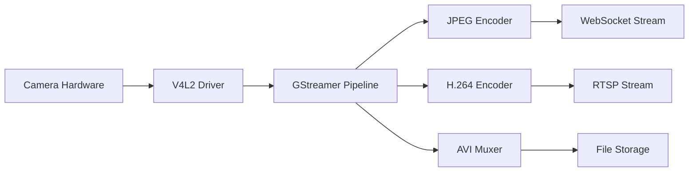

# Camera Pipeline Architecture

**V4L2 and GStreamer integration for high-performance video capture and streaming.**

## Overview

The C Pro camera pipeline provides real-time video capture, processing, and streaming for industrial/medical imaging applications using V4L2 drivers and GStreamer multimedia framework.



## Hardware Interface

### V4L2 Integration
Located in `src/camserver/`:

- **Device Detection**: `v4l2_dev_interface.c` - Camera enumeration and capability detection
- **Control Interface**: `v4l2_m2m_dev.c` - Memory-to-memory device operations  
- **UDev Monitoring**: `udev_monitor.c` - Hot-plug device detection
- **Hardware Controls**: Exposure, gain, white balance, focus controls

### Camera Types Supported
- **USB Cameras**: UVC-compatible devices via `/dev/video*`
- **CSI Cameras**: Direct camera sensor interface
- **IP Cameras**: ONVIF-compatible network cameras
- **Multiple Heads**: Simultaneous multi-camera operation

### Device Capabilities
```c
// From v4l2_dev_interface.c
struct camera_caps {
    char device_path[256];
    uint32_t capabilities;
    struct v4l2_fmtdesc formats[16];
    struct v4l2_frmsizeenum frame_sizes[32];
    struct v4l2_frmivalenum frame_intervals[64];
};
```

## GStreamer Pipeline

### Pipeline Architecture
The system uses dynamic GStreamer pipelines built in `src/camserver/streamer.nim`:

```bash
# Main capture pipeline
v4l2src device=/dev/video0 ! 
    video/x-raw,width=1920,height=1080,framerate=30/1 !
    tee name=t
    
# JPEG encoding branch  
t. ! queue ! jpegenc quality=85 ! 
    appsink name=jpeg_sink

# H.264 streaming branch
t. ! queue ! x264enc bitrate=2000 tune=zerolatency !
    rtph264pay ! udpsink host=224.1.1.1 port=5004

# Recording branch
t. ! queue ! x264enc bitrate=4000 !
    avimux ! filesink location=recording.avi
```

### GStreamer Components

| Component | Purpose | Configuration |
|-----------|---------|---------------|
| `v4l2src` | Video capture from V4L2 device | Device path, format, resolution |
| `jpegenc` | JPEG compression for snapshots | Quality level, timestamp overlay |
| `x264enc` | H.264 video encoding | Bitrate, tune parameters, GOP size |
| `rtph264pay` | RTP packetization | MTU size, payload type |
| `avimux` | AVI container multiplexing | Metadata embedding |

### Timestamp Integration
Custom timestamp overlays implemented in `timestamp_bitmaps.h`:

```c
// Timestamp bitmap rendering
typedef struct {
    uint8_t* bitmap_data;
    int width;
    int height;
    uint64_t timestamp_us;
} timestamp_overlay_t;

void render_timestamp(uint8_t* frame_data, timestamp_overlay_t* overlay);
```

## Image Processing

### JPEG Encoding
High-performance JPEG encoding in `jpg_encoder.c`:

```c
// Hardware-accelerated JPEG encoding
int encode_jpeg_frame(
    uint8_t* yuv_data,
    int width, int height,
    uint8_t* jpeg_buffer,
    size_t* jpeg_size,
    int quality
);
```

### Format Support
- **Input Formats**: YUV420, YUV422, RGB24, MJPEG
- **Output Formats**: JPEG, H.264, AVI
- **Resolutions**: 640x480 to 3840x2160 (4K)
- **Frame Rates**: 1-30 FPS configurable

### NV12 Rendering
Optimized NV12 format handling in `nv12_render.h`:

```c
// NV12 to RGB conversion with SIMD optimization
void nv12_to_rgb_simd(
    uint8_t* nv12_data,
    uint8_t* rgb_data,  
    int width, int height
);
```

## Streaming Protocols

### RTSP Server
Standards-compliant RTSP server with RTP streaming:

- **Port**: 8554 (configurable)
- **Transport**: RTP/UDP and RTP/TCP
- **Codecs**: H.264 baseline profile
- **Authentication**: Optional basic authentication

### WebSocket Streaming
Real-time JPEG frames over WebSocket:

```nim
# From src/camserver/cam.nim
proc streamJpegFrame*(): seq[byte] =
  let frame = captureV4L2Frame()
  result = encodeJpegWithTimestamp(frame, jpegQuality)

proc broadcastFrame*() {.async.} =
  let frameData = streamJpegFrame()
  for client in streamingClients:
    await client.sendBinary(frameData)
```

## Recording System

### Video Recording
AVI recording with configurable parameters:

```nim
# Recording configuration
type RecordingConfig = object
  filename: string
  resolution: string  
  framerate: int
  bitrate: int
  codec: string  # "h264", "mjpeg"
  duration: int  # seconds, 0 = unlimited
```

### Snapshot Capture
High-resolution image capture:

```nim
proc takeSnapshot*(quality: int = 95): seq[byte] =
  # Capture full-resolution frame
  let fullFrame = captureFullResFrame()
  
  # Add timestamp overlay
  addTimestampOverlay(fullFrame)
  
  # Encode as high-quality JPEG
  result = encodeJpeg(fullFrame, quality)
```

## Performance Optimization

### Hardware Acceleration
- **V4L2 M2M**: Memory-to-memory hardware encoding
- **GPU Acceleration**: VAAPI/NVENC support where available
- **SIMD Instructions**: Optimized color space conversion
- **Zero-copy**: Direct memory access to reduce copies

### Memory Management
```c
// Ring buffer for frame management
typedef struct {
    uint8_t* buffers[RING_BUFFER_SIZE];
    int write_index;
    int read_index;
    int frame_size;
} frame_ring_buffer_t;
```

### Threading Model
- **Capture Thread**: V4L2 frame acquisition
- **Encoding Thread**: JPEG/H.264 encoding
- **Streaming Thread**: Network transmission
- **Main Thread**: Control and coordination

## Camera Control

### V4L2 Controls
Direct hardware control via V4L2 interface:

```c
// Camera control implementation
int set_camera_control(int device_fd, uint32_t control_id, int32_t value) {
    struct v4l2_control ctrl;
    ctrl.id = control_id;
    ctrl.value = value;
    return ioctl(device_fd, VIDIOC_S_CTRL, &ctrl);
}
```

### Supported Controls
- **V4L2_CID_EXPOSURE**: Exposure time control
- **V4L2_CID_GAIN**: Sensor gain/ISO
- **V4L2_CID_BRIGHTNESS**: Image brightness
- **V4L2_CID_CONTRAST**: Image contrast
- **V4L2_CID_SATURATION**: Color saturation
- **V4L2_CID_WHITE_BALANCE_TEMPERATURE**: White balance

### State Integration
Camera controls are integrated with the observable state system:

```nim
# Camera control state observers
exposureState.addObserver(proc(oldVal, newVal: int) =
  setCameraExposure(newVal)
)

gainState.addObserver(proc(oldVal, newVal: float) =
  setCameraGain(int32(newVal * 100))
)
```

## Pipeline Management

### Dynamic Reconfiguration
The pipeline supports runtime reconfiguration without stopping:

```nim
proc reconfigurePipeline*(newResolution: string, newFramerate: int) =
  # Pause current pipeline
  pauseGStreamerPipeline()
  
  # Update pipeline elements
  updateCameraCaps(newResolution, newFramerate)
  
  # Resume with new settings
  resumeGStreamerPipeline()
```

### Error Recovery
Robust error handling and automatic recovery:

```nim
proc handlePipelineError*(error: GStreamerError) =
  case error.code:
  of GST_STREAM_ERROR_DEVICE_BUSY:
    # Retry after delay
    scheduleRetry(reconnectCamera, delay = 5000)
  of GST_RESOURCE_ERROR_OPEN_READ:
    # Switch to backup camera
    switchToBackupCamera()
  else:
    # Full pipeline restart
    restartCameraPipeline()
```

## Troubleshooting

### Common Issues

**Camera Not Detected**
```bash
# Check V4L2 devices
v4l2-ctl --list-devices

# Verify permissions
ls -l /dev/video*

# Test basic capture
v4l2-ctl --device=/dev/video0 --stream-mmap --stream-count=1
```

**Pipeline Errors**
```bash
# Enable GStreamer debug
export GST_DEBUG=3
./rotordream

# Check pipeline state
gst-inspect-1.0 v4l2src
```

**Performance Issues**
- Monitor CPU usage during encoding
- Check memory bandwidth utilization  
- Verify USB bus speed for USB cameras
- Consider hardware encoding acceleration

### Debug Tools
```bash
# V4L2 debugging
v4l2-ctl --device=/dev/video0 --all

# GStreamer pipeline testing
gst-launch-1.0 v4l2src device=/dev/video0 ! jpegenc ! filesink location=test.jpg

# Frame rate monitoring
gst-launch-1.0 v4l2src ! fpsdisplaysink
```

## Related Documentation

- [Hardware Interface Details](../camera/hardware-interface.md)
- [Streaming Configuration](../camera/streaming.md)
- [Image Processing](../camera/image-processing.md)
- [Architecture Overview](overview.md)

---

*Camera pipeline documentation derived from `src/camserver/` C code and Nim integration*
