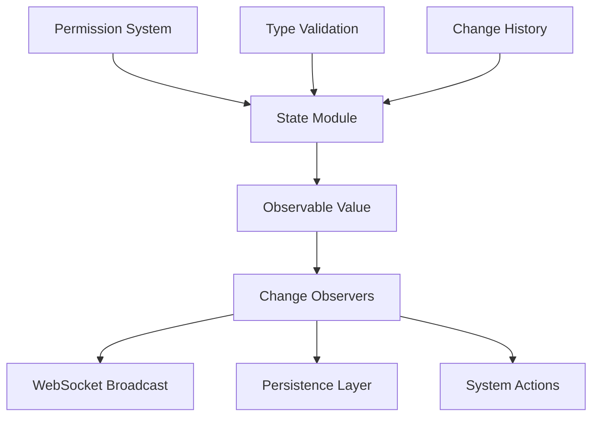

# ADR-0003: Observable State Management Pattern

**Status**: Accepted  
**Date**: 2024-01-25  
**Deciders**: Engineering Team  

## Context

The C Pro camera server needs to synchronize state between:

- Multiple WebSocket clients (web interfaces, mobile apps)
- Internal system components (camera, recording, network)
- External APIs (ONVIF, REST endpoints)
- Persistent configuration storage

Requirements:
- **Real-time Updates**: State changes must propagate to all clients instantly
- **Granular Permissions**: Different user roles need different access levels
- **Type Safety**: Prevent invalid state modifications
- **Persistence**: Critical state must survive application restarts
- **Conflict Resolution**: Handle simultaneous state modifications

## Decision

We implemented a **centralized observable state management pattern** with automatic change propagation and permission-based access control.

## Architecture



## Implementation

### Observable Base Functions
From `src/state/observable.nim`:
```nim
# Core observable functions
proc GetUnsafeObservable*(key: string): JsonNode
proc SetUnsafeObservable*(key: string, value: JsonNode)

# Observable with change notification
proc addObserver*(key: string, observer: proc(oldVal, newVal: JsonNode))
proc notifyObservers*(key: string, oldVal, newVal: JsonNode)
```

### State Module Structure
```nim
# Example state module pattern
import ../observable

# Initialize state values
proc initCameraState*() =
  SetUnsafeObservable("light0", %false)
  SetUnsafeObservable("brightness", %50)
  SetUnsafeObservable("exposure", %100)
  
  # Add hardware sync observers
  addObserver("light0", proc(oldVal, newVal: JsonNode) =
    setCameraLight(0, newVal.getBool())
  )
  
  addObserver("brightness", proc(oldVal, newVal: JsonNode) =
    setCameraBrightness(newVal.getInt())
  )
```

## Permission System

### Permission Levels
From `src/state/permissions.nim`:
```nim
type StatePermission* = enum
  StreamSettings_r, StreamSettings_rw
  HeadFeatures_r, HeadFeatures_rw  
  Recording_rw
  Media_r, Media_rw
  NetworkSettings_r, NetworkSettings_rw
  UserSettings_r, UserSettings_rw
```

### User Context Validation
```nim
type UserContext* = object
  permissions*: set[StatePermission]
  sessionId*: string
  ipAddress*: string

proc canDo*(ctx: UserContext, required: StatePermission): bool =
  required in ctx.permissions
```

## WebSocket Integration

### Real-time Broadcasting
From `src/servers/websocketApiV1Handler.nim`:
```nim
# Automatic state synchronization
proc evaluateApiV1Setter*(reqKeys: JsonNode, info: var seq[string]) =
  for key, val in reqKeys.pairs:
    case key:
    of "cam1-light":
      SetUnsafeObservable("light0", val)
      info.add("cam1-light")
    of "brightness":
      SetUnsafeObservable("brightness", val)
      info.add("brightness")
    # ... additional mappings
```

### Client Synchronization
```nim
# State change broadcasting
proc broadcastStateChange*(changedStates: seq[string]) =
  let message = %*{
    "type": "stateUpdate",
    "changes": changedStates,
    "timestamp": now().toUnix()
  }
  
  for client in connectedClients:
    if client.hasPermissionForStates(changedStates):
      client.send($message)
```

## State Persistence

### Configuration Persistence
Critical state values are automatically persisted:

```nim
# Factory configuration persistence
proc persistFactoryConfig*() =
  let config = %*{
    "httpOn": GetUnsafeObservable("httpServerEnabled"),
    "httpsOn": GetUnsafeObservable("httpsServerEnabled"),
    "httpPort": GetUnsafeObservable("httpPort"),
    "httpsPort": GetUnsafeObservable("httpsPort")
  }
  writeFile("factory_config.json", $config)

# State restoration on startup
proc restorePersistedState*() =
  if fileExists("factory_config.json"):
    let config = parseJson(readFile("factory_config.json"))
    for key, value in config:
      SetUnsafeObservable(key, value)
```

## Alternatives Considered

### Redux-style State Management
- **Pros**: Predictable state updates, time-travel debugging
- **Cons**: Overhead for simple operations, action/reducer complexity

### Direct Database Integration
- **Pros**: Automatic persistence, ACID properties
- **Cons**: Latency for real-time updates, complexity for embedded systems

### Message Passing (Actors)
- **Pros**: Isolated state, concurrent safety
- **Cons**: Complexity, memory overhead, difficult debugging

### Pub/Sub System
- **Pros**: Decoupled components, scalable
- **Cons**: Message ordering issues, delivery guarantees

## Benefits Realized

### Performance
- **Sub-millisecond** state propagation to local components
- **<10ms** WebSocket broadcast to connected clients
- **Zero-copy** state access for read operations

### Type Safety
```nim
# Compile-time type checking through JsonNode validation
proc validateStateValue(key: string, value: JsonNode): bool =
  case key:
  of "brightness":
    return value.kind == JInt and value.getInt() in 0..100
  of "resolution":
    return value.kind == JString and value.getStr() in validResolutions
```

### Permission Enforcement
```nim
# Runtime permission checking
proc setValue*(key: string, value: JsonNode, ctx: UserContext) =
  let required = getRequiredPermission(key)
  if not ctx.canDo(required):
    raise newException(PermissionError, "Access denied")
  
  SetUnsafeObservable(key, value)
```

## State Modules

Current implementation includes 40+ state modules in `src/state/`:

| Module | Purpose | Key States |
|--------|---------|------------|
| `rc_light` | LED lighting control | light0, light1 |
| `rc_image_settings` | Camera image settings | brightness, contrast, exposure |
| `rc_recording` | Recording control | record, takePicture |
| `rc_stream_settings` | Stream configuration | resolution, fps |
| `rc_network` | Network configuration | ipAddress, hostname |
| `rc_user` | User management | sessions, tokens |

## Consequences

### Positive
- **Real-time Sync**: All clients automatically receive state updates
- **Permission Control**: Granular access control per state item
- **Maintainability**: Clear separation of state logic and business logic
- **Debugging**: Observable pattern makes state flow traceable

### Negative
- **Memory Usage**: ~2MB additional RAM for state management system
- **Complexity**: Learning curve for new team members
- **Debug Traces**: State change chains can be complex to follow

### Neutral
- **Performance**: Slight overhead for state access, but negligible in practice
- **Scalability**: Currently handles 25+ concurrent clients efficiently

## Monitoring

### State Change Metrics
```nim
# Performance tracking for state operations
proc recordStateMetric(operation: string, duration: float) =
  case operation:
  of "set": recordMetric("state.set.duration", duration)
  of "get": recordMetric("state.get.duration", duration)
  of "broadcast": recordMetric("state.broadcast.duration", duration)
```

### Key Metrics Monitored
- **Change Rate**: State modifications per second
- **Broadcast Latency**: Time from state change to client notification
- **Permission Violations**: Failed access attempts
- **Memory Usage**: Observable system memory consumption

## Future Enhancements

### Planned Improvements
- **State History**: Change tracking and rollback capability
- **Conflict Resolution**: Automatic merge strategies for concurrent modifications
- **Batch Updates**: Atomic multi-state changes
- **State Snapshots**: Point-in-time state export/import

### Migration Path
```nim
# Example future enhancement: state versioning
type StateVersion = object
  timestamp: DateTime
  states: JsonNode
  changeset: seq[StateChange]

proc createStateSnapshot*(): StateVersion =
  result.timestamp = now()
  result.states = getAllStates()
  result.changeset = getRecentChanges()
```

## Review Date

This decision will be reviewed in Q3 2025 based on:
- Client scalability requirements (100+ concurrent users)
- Performance under high-frequency state changes
- Team feedback on development experience
- Requirements for distributed deployments
