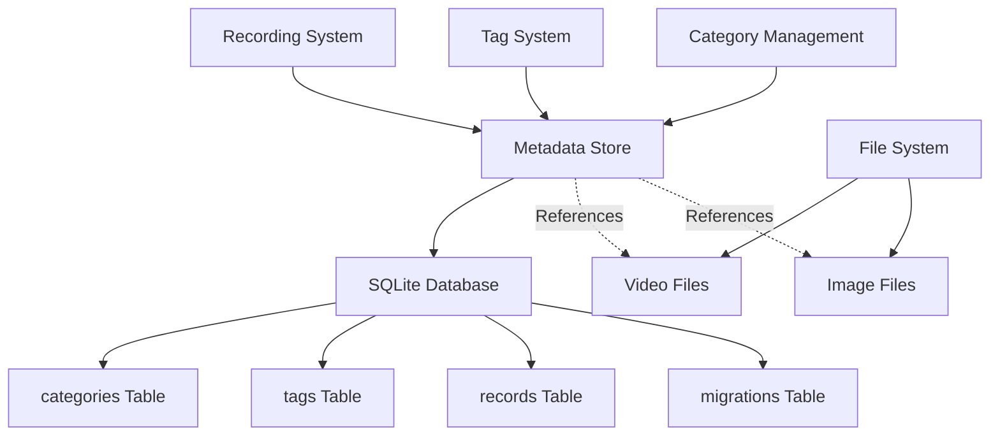
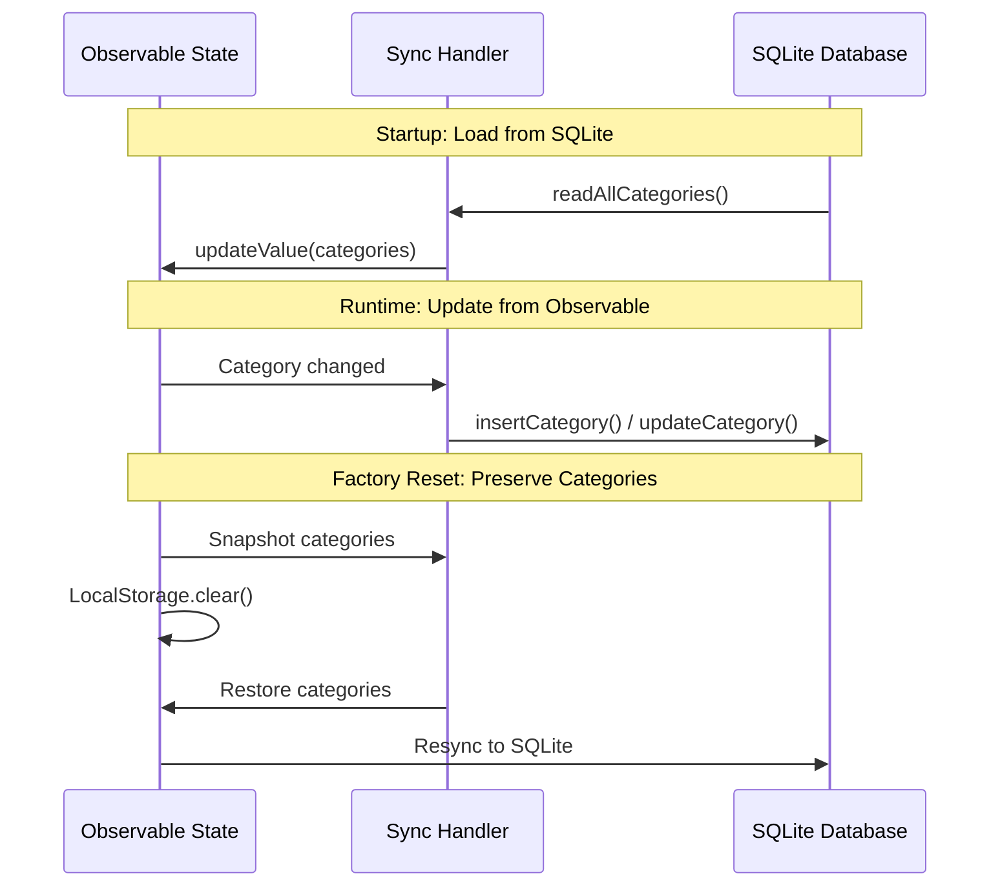

# Metadata SQLite Database Architecture

**SQLite-based metadata storage system for recording management, tag organization, and search functionality.**

## Overview

The C Pro camera system uses SQLite for structured metadata storage separate from the video files themselves. This provides fast querying, relational integrity, and efficient search capabilities for recordings, tags, and categories.



**Key Characteristics**:
- **Separate from Video Data**: Metadata in SQLite, media files on filesystem
- **Relational Integrity**: Foreign keys ensure data consistency
- **Fast Queries**: Indexed searches on timestamps, categories, filenames
- **Transactional**: ACID guarantees for metadata operations
- **Dual Storage**: SQLite for metadata, filesystem for actual media

## Database Location

**File**: `src/storage/metadata_store.nim`

```nim
const
  dbFileEmbedded = "/media/data/metadata.db"
  dbFileDesktop = "metadata.db"

proc metadataDbPath*(): string =
  when defined(embeddedSystem): 
    dbFileEmbedded 
  else: 
    getCurrentDir() / dbFileDesktop
```

**Storage Paths**:
- **Embedded Systems**: `/media/data/metadata.db` (persistent storage partition)
- **Desktop/Development**: `./metadata.db` (current working directory)

## Database Schema

### Tables Overview

| Table | Purpose | Row Count (Typical) |
|-------|---------|---------------------|
| **migrations** | Schema version tracking | 1-10 |
| **categories** | Tag categories (user-defined) | 5-50 |
| **tags** | Recording markers/annotations | 100-10,000 |
| **records** | Video/image metadata | 500-100,000 |

### migrations Table

Tracks database schema versions for migration management.

```sql
CREATE TABLE IF NOT EXISTS migrations (
  version INTEGER PRIMARY KEY,
  applied_at INTEGER NOT NULL  -- Unix timestamp in milliseconds
);
```

**Columns**:
- `version`: Schema version number (incremental)
- `applied_at`: Timestamp when migration was applied

**Purpose**: Enables safe schema evolution without data loss.

**Example Data**:
```
version | applied_at
--------|-------------
1       | 1704067200000
2       | 1706745600000
```

### categories Table

User-defined categories for organizing recording tags.

```sql
CREATE TABLE IF NOT EXISTS categories (
  id INTEGER PRIMARY KEY,
  name TEXT NOT NULL UNIQUE,
  color TEXT NOT NULL,
  created_at INTEGER NOT NULL  -- Unix timestamp in milliseconds
);
```

**Columns**:
- `id`: Unique category identifier (user-assigned, not auto-increment)
- `name`: Category name (e.g., "Procedure Start", "Complication", "Device Placement")
- `color`: Hex color code for UI display (e.g., "#FF5733")
- `created_at`: Creation timestamp in milliseconds

**Constraints**:
- `UNIQUE(name)`: Prevents duplicate category names

**Example Data**:
```
id | name              | color    | created_at
---|-------------------|----------|-------------
1  | Procedure Start   | #4CAF50  | 1704067200000
2  | Important Event   | #FF9800  | 1704070800000
3  | Complication      | #F44336  | 1704074400000
```

**Nim Type**:
```nim
type SqlCategory* = object
  id*: int
  name*: string
  color*: string
  createdAt*: int64
```

### tags Table

Recording markers/annotations associated with categories.

```sql
CREATE TABLE IF NOT EXISTS tags (
  id INTEGER PRIMARY KEY,
  category_id INTEGER NOT NULL,
  timestamp INTEGER NOT NULL,  -- Unix timestamp in milliseconds
  title TEXT,
  note TEXT,
  created_by TEXT,
  deleted INTEGER DEFAULT 0,   -- Soft delete flag (0=active, 1=deleted)
  FOREIGN KEY(category_id) REFERENCES categories(id)
);
```

**Columns**:
- `id`: Auto-increment tag identifier
- `category_id`: Foreign key to categories table
- `timestamp`: When the tag was created (recording timestamp)
- `title`: Short tag title (optional)
- `note`: Detailed note/description (optional)
- `created_by`: Username who created the tag
- `deleted`: Soft delete flag (0=active, 1=deleted)

**Constraints**:
- `FOREIGN KEY(category_id)`: Ensures referential integrity with categories

**Example Data**:
```
id | category_id | timestamp     | title           | note                    | created_by | deleted
---|-------------|---------------|-----------------|-------------------------|------------|--------
1  | 1           | 1704067215000 | Surgery Start   | Patient positioned      | Dr. Smith  | 0
2  | 2           | 1704067890000 | Device Inserted | 5mm trocar, left side   | Dr. Smith  | 0
3  | 3           | 1704068120000 | Minor Bleeding  | Controlled with cautery | Dr. Smith  | 0
```

**Nim Type**:
```nim
type SqlTag* = object
  id*: int
  categoryId*: int
  timestamp*: int64
  title*: string
  note*: string
  createdBy*: string
  deleted*: bool
```

### records Table

Video and image file metadata for recordings.

```sql
CREATE TABLE IF NOT EXISTS records (
  id INTEGER PRIMARY KEY,
  filename TEXT NOT NULL,
  media_type TEXT,              -- "video", "timelapse", "slowmotion", "image", "backup"
  encoding TEXT,                -- "mp4", "avi", "jpg", "jpeg", "png"
  timestamp_start INTEGER,      -- Recording start time (milliseconds)
  timestamp_end INTEGER,        -- Recording end time (milliseconds)
  duration INTEGER,             -- Duration in milliseconds
  size INTEGER,                 -- File size in bytes
  resolution TEXT,              -- e.g., "1920x1080"
  fps REAL,                     -- Frames per second
  state TEXT,                   -- "ready", "recording", "defect"
  tag_markers INTEGER           -- Count of associated tags
);
```

**Columns**:
- `id`: Auto-increment record identifier
- `filename`: Base filename (without path)
- `media_type`: Type of recording (video, timelapse, slowmotion, image, backup)
- `encoding`: File format (mp4, avi, jpg, jpeg, png)
- `timestamp_start`: Recording start timestamp (milliseconds)
- `timestamp_end`: Recording end timestamp (milliseconds)
- `duration`: Total duration in milliseconds
- `size`: File size in bytes
- `resolution`: Video resolution (e.g., "1920x1080")
- `fps`: Frame rate (e.g., 30.0, 60.0)
- `state`: Recording state (ready, recording, defect)
- `tag_markers`: Number of tags associated with this recording

**Example Data**:
```
id | filename                    | media_type | encoding | timestamp_start | timestamp_end  | duration | size      | resolution | fps  | state | tag_markers
---|----------------------------|------------|----------|-----------------|----------------|----------|-----------|------------|------|-------|------------
1  | Video_03_Jan_2024_10-30.avi | video      | avi      | 1704267000000   | 1704270600000  | 3600000  | 524288000 | 1920x1080  | 30.0 | ready | 5
2  | Timelapse_03_Jan_10-45.mp4 | timelapse  | mp4      | 1704267900000   | 1704271500000  | 3600000  | 104857600 | 1920x1080  | 5.0  | ready | 2
3  | Image_03_Jan_11-15.jpg     | image      | jpg      | 1704269700000   | 1704269700000  | 0        | 2097152   | 1920x1080  | 0.0  | ready | 1
```

**Nim Type**:
```nim
type RecordMetadata* = object
  id*: int64
  mediaType*: MetadataMediaType
  mediaEncoding*: MetadataMediaEncoding
  timestampStartMs*: int64
  timestampEndMs*: int64
  durationMs*: int64
  size*: int64
  filename*: string
  resolution*: string
  fps*: float32
  state*: RecordMediaState
  tagMarkers*: uint32
```

## Database Operations

### Initialization

```nim
proc initMetadataStore*() =
  let path = metadataDbPath()
  db = open(path, "", "", "")
  
  # Create schema if not exists
  ensureSchema()
  
  # Integrity check
  for row in db.fastRows(sql"PRAGMA integrity_check;"):
    if row[0] != "ok":
      raise newException(IOError, "SQLite integrity check failed: " & row[0])
  
  # Initialize migrations table
  var version = 1
  var found = false
  for row in db.fastRows(sql"SELECT version FROM migrations ORDER BY version DESC LIMIT 1"):
    found = true
    version = row[0].parseInt
  
  if not found:
    db.exec(sql"INSERT INTO migrations(version, applied_at) VALUES(?, ?)", 
            version, $(epochTime().int64 * 1000))
  
  StateLogger.info("MetadataStore initialized at " & path & ", schema version " & $version)
```

**Startup Sequence**:
1. Open database connection
2. Create tables if they don't exist (idempotent)
3. Run integrity check
4. Initialize migrations tracking
5. Log initialization success

### Category Operations

#### Read All Categories

```nim
proc readAllCategories*(): seq[SqlCategory] =
  for row in db.fastRows(sql"SELECT id, name, color, created_at FROM categories ORDER BY id"):
    var c: SqlCategory
    c.id = row[0].parseInt
    c.name = row[1]
    c.color = row[2]
    c.createdAt = row[3].parseInt
    result.add(c)
```

#### Insert Category

```nim
proc insertCategory*(id: int, name, color: string): int =
  let nowMs = (epochTime().int64 * 1000)
  db.exec(sql"INSERT INTO categories(id, name, color, created_at) VALUES(?,?,?,?)", 
          id, name, color, $nowMs)
  result = id
```

#### Update Category

```nim
proc updateCategory*(id: int, name, color: string) =
  db.exec(sql"UPDATE categories SET name = ?, color = ? WHERE id = ?", 
          name, color, id)
```

#### Delete Category

```nim
proc deleteCategory*(id: int) =
  db.exec(sql"DELETE FROM categories WHERE id = ?", id)
```

**Note**: Deleting a category with associated tags will fail due to foreign key constraint. Application must handle cascading deletes or prevent deletion.

### Tag Operations

#### Insert Tag

```nim
proc insertTag*(categoryId: int, timestamp: int64, title, note, createdBy: string): int =
  db.exec(sql"INSERT INTO tags(category_id, timestamp, title, note, created_by) VALUES(?,?,?,?,?)", 
          categoryId, $timestamp, title, note, createdBy)
  
  # Get auto-generated ID
  for row in db.fastRows(sql"SELECT last_insert_rowid()"):
    return row[0].parseInt
```

#### Read All Tags

```nim
proc readAllTags*(): seq[SqlTag] =
  for row in db.fastRows(sql"SELECT id, category_id, timestamp, title, note, created_by, deleted FROM tags"):
    var t: SqlTag
    t.id = row[0].parseInt
    t.categoryId = row[1].parseInt
    t.timestamp = row[2].parseInt
    t.title = row[3]
    t.note = row[4]
    t.createdBy = row[5]
    t.deleted = row[6].parseInt != 0
    result.add(t)
```

**Soft Delete Pattern**: Tags use `deleted` flag instead of actual deletion to preserve history.

### Record Operations

#### Insert Record

```nim
proc insertRecord*(filename, mediaType, encoding: string, 
                   timestampStart, timestampEnd, duration, size: int64, 
                   resolution: string, fps: float, state: string, 
                   tagMarkers: int): int =
  db.exec(sql"INSERT INTO records(filename, media_type, encoding, timestamp_start, timestamp_end, duration, size, resolution, fps, state, tag_markers) VALUES(?,?,?,?,?,?,?,?,?,?,?)", 
          filename, mediaType, encoding, $timestampStart, $timestampEnd, 
          $duration, $size, resolution, $fps, state, $tagMarkers)
  
  for row in db.fastRows(sql"SELECT last_insert_rowid()"):
    return row[0].parseInt
```

#### Read All Records

```nim
proc readAllRecords*(): seq[SqlRecord] =
  for row in db.fastRows(sql"SELECT id, filename, media_type, encoding, timestamp_start, timestamp_end, duration, size, resolution, fps, state, tag_markers FROM records"):
    var r: SqlRecord
    r.id = row[0].parseInt
    r.filename = row[1]
    r.mediaType = row[2]
    r.encoding = row[3]
    r.timestampStart = row[4].parseInt
    r.timestampEnd = row[5].parseInt
    r.duration = row[6].parseInt
    r.size = row[7].parseInt
    r.resolution = row[8]
    r.fps = row[9].parseFloat
    r.state = row[10]
    r.tagMarkers = row[11].parseInt
    result.add(r)
```

## State Synchronization

### Observable-SQLite Sync

The system maintains categories in both **LevelDB** (via Observables) and **SQLite** (for structured queries). Synchronization ensures consistency.



### Bootstrap Categories

On first startup, categories are bootstrapped from Observable state to SQLite:

```nim
proc bootstrapCategoriesFromObservable*() =
  # Only run if table empty
  var count = 0
  for row in db.fastRows(sql"SELECT COUNT(1) FROM categories"):
    count = row[0].parseInt
  if count > 0: return

  let categoriesState = State.getUnsafe("categories")
  if categoriesState.isNil or categoriesState.value.isNil: return
  
  for k, v in categoriesState.value:
    try:
      let id = k.parseInt
      let name = v{"name"}.getStr("")
      let color = v{"color"}.getStr("#FFFFFF")
      if name.len > 0:
        insertCategory(id, name, color)
    except CatchableError:
      StateLogger.warn("Bootstrap category error: ", getCurrentExceptionMsg())
  
  StateLogger.info("Bootstrapped categories into SQLite")
```

### Load Categories into Observable

On startup, load categories from SQLite into Observable state:

```nim
proc loadCategoriesIntoObservable*() =
  let categoriesState = State.getUnsafe("categories")
  if categoriesState.isNil: return
  
  var obj = newJObject()
  for c in readAllCategories():
    obj[$c.id] = %*{ 
      "id": c.id, 
      "name": c.name, 
      "color": c.color 
    }
  
  categoriesState.updateValue(obj, force = true)
```

### Sync Operations

Real-time synchronization from Observable changes to SQLite:

```nim
proc syncCreateCategory*(id: int, name, color: string) =
  insertCategory(id, name, color)

proc syncUpdateCategory*(id: int, name, color: string) =
  updateCategory(id, name, color)

proc syncDeleteCategory*(id: int) =
  deleteCategory(id)
```

**Trigger Points**: Called from Observable observers when category state changes.

## Query Patterns

### Search by Date Range

```sql
-- Find recordings in a specific date range
SELECT * FROM records 
WHERE timestamp_start >= ? AND timestamp_end <= ?
ORDER BY timestamp_start DESC;
```

### Find Tagged Recordings

```sql
-- Find all recordings with tags in a specific category
SELECT DISTINCT r.* 
FROM records r
JOIN tags t ON t.timestamp BETWEEN r.timestamp_start AND r.timestamp_end
WHERE t.category_id = ? AND t.deleted = 0
ORDER BY r.timestamp_start DESC;
```

### Search by Media Type

```sql
-- Find all timelapse recordings
SELECT * FROM records 
WHERE media_type = 'timelapse' AND state = 'ready'
ORDER BY timestamp_start DESC;
```

### Calculate Storage Statistics

```sql
-- Total storage by media type
SELECT 
  media_type,
  COUNT(*) as count,
  SUM(size) as total_bytes,
  SUM(duration) as total_duration_ms
FROM records 
WHERE state = 'ready'
GROUP BY media_type;
```

### Find Untagged Recordings

```sql
-- Recordings without any tags
SELECT * FROM records 
WHERE tag_markers = 0 AND state = 'ready'
ORDER BY timestamp_start DESC;
```

## Performance Optimization

### Indexes

**Recommended Indexes** (not currently in schema, but should be added):

```sql
-- Improve date range queries
CREATE INDEX IF NOT EXISTS idx_records_timestamp_start 
ON records(timestamp_start);

CREATE INDEX IF NOT EXISTS idx_records_timestamp_end 
ON records(timestamp_end);

-- Improve tag lookups
CREATE INDEX IF NOT EXISTS idx_tags_category_id 
ON tags(category_id);

CREATE INDEX IF NOT EXISTS idx_tags_timestamp 
ON tags(timestamp);

-- Improve filename searches
CREATE INDEX IF NOT EXISTS idx_records_filename 
ON records(filename);
```

### Query Optimization

```nim
# Use prepared statements for repeated queries
let stmt = db.prepare("SELECT * FROM records WHERE timestamp_start >= ? AND timestamp_end <= ?")
defer: stmt.finalize()

for row in db.fastRows(stmt, startTime, endTime):
  # Process rows
```

### Batch Operations

```nim
# Batch inserts in transaction for better performance
db.exec(sql"BEGIN TRANSACTION")
for record in recordsBatch:
  insertRecord(record.filename, record.mediaType, ...)
db.exec(sql"COMMIT")
```

## Data Integrity

### Foreign Key Constraints

```sql
-- Enforced by SQLite when enabled
PRAGMA foreign_keys = ON;
```

**Impact**: Prevents orphaned tags when categories are deleted.

### Integrity Checks

Run on initialization and periodically:

```nim
for row in db.fastRows(sql"PRAGMA integrity_check;"):
  if row[0] != "ok":
    raise newException(IOError, "SQLite integrity check failed: " & row[0])
```

### Soft Deletes

Tags use soft delete pattern to preserve history:

```nim
# Don't actually delete
proc softDeleteTag*(id: int) =
  db.exec(sql"UPDATE tags SET deleted = 1 WHERE id = ?", id)

# Query active tags only
proc readActiveTags*(): seq[SqlTag] =
  for row in db.fastRows(sql"SELECT * FROM tags WHERE deleted = 0"):
    # ...
```

## Backup and Recovery

### Database Backup

```bash
# Copy database file (ensure no active writes)
cp /media/data/metadata.db /backup/metadata_$(date +%Y%m%d_%H%M%S).db
```

### SQLite Backup Command

```bash
# Using SQLite CLI
sqlite3 /media/data/metadata.db ".backup /backup/metadata.db"
```

### Export to SQL

```bash
# Export schema and data
sqlite3 /media/data/metadata.db .dump > metadata_backup.sql
```

### Restore from Backup

```bash
# Replace database file
cp /backup/metadata.db /media/data/metadata.db

# Or restore from SQL dump
sqlite3 /media/data/metadata.db < metadata_backup.sql
```

## Migration Strategy

### Schema Version Tracking

```nim
proc getCurrentSchemaVersion*(): int =
  for row in db.fastRows(sql"SELECT MAX(version) FROM migrations"):
    return row[0].parseInt
  return 0

proc recordMigration*(version: int) =
  let timestamp = epochTime().int64 * 1000
  db.exec(sql"INSERT INTO migrations(version, applied_at) VALUES(?, ?)", 
          version, $timestamp)
```

### Migration Example

```nim
proc migrateToVersion2*() =
  let currentVersion = getCurrentSchemaVersion()
  if currentVersion >= 2: return
  
  # Add new column
  db.exec(sql"ALTER TABLE records ADD COLUMN thumbnail_path TEXT")
  
  # Record migration
  recordMigration(2)
  StateLogger.info("Migrated database to version 2")
```

## Troubleshooting

### Database Locked

**Issue**: `database is locked` error

**Solution**:
```nim
# Set busy timeout
db.exec(sql"PRAGMA busy_timeout = 5000")  # Wait up to 5 seconds
```

### Corrupted Database

**Issue**: Integrity check fails

**Solution**:
```bash
# Dump and recreate
sqlite3 /media/data/metadata.db ".dump" | sqlite3 /media/data/metadata_fixed.db
mv /media/data/metadata_fixed.db /media/data/metadata.db
```

### Missing Foreign Keys

**Issue**: Foreign key constraint violations

**Check**:
```sql
PRAGMA foreign_keys;        -- Check if enabled
PRAGMA foreign_key_check;   -- Find violations
```

## Related Documentation

- **[Recording System](../camera/recording.md)**: How recordings interact with metadata
- **[State Management](state-management.md)**: Observable state synchronization
- **[Storage Configuration](../configuration/storage-backup.md)**: Storage setup
- **[Factory Reset Fix](../camera/recording.md#issue-150-factory-reset-preservation)**: Category preservation
- **[Architecture Overview](overview.md)**: System-wide architecture

---

*Metadata SQLite documentation derived from `src/storage/metadata_store.nim` and `src/state/record_data.nim`*
