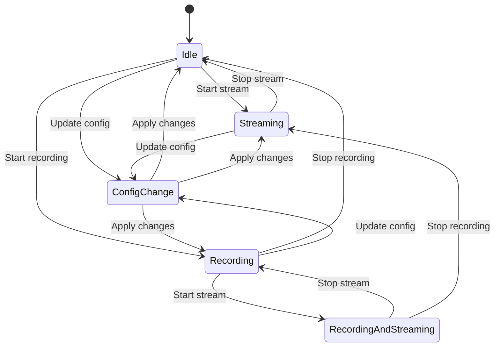

# Architecture Overview

**Comprehensive system architecture documentation covering the RotorDream camera server design, components, interactions, and lifecycle.**

## System Overview

The RotorDream camera server is a high-performance, embedded-first camera management system built with the Nim programming language. It provides real-time video streaming, recording, hardware control, and remote management through multiple API protocols.


## System Architecture Principles

### 1. Embedded-First Design
- **Minimal Resource Footprint**: Optimized for ARM64 embedded systems with limited RAM/CPU
- **Static Compilation**: Single binary deployment with no runtime dependencies
- **Cross-Platform**: Runs on Linux x86_64, ARM64, and embedded platforms

### 2. Real-Time Synchronization
- **Observable State Pattern**: Automatic change propagation to all connected clients
- **WebSocket Push**: Sub-100ms state update latency
- **Conflict Resolution**: Last-write-wins with permission validation

### 3. High-Performance Video Processing
- **Zero-Copy Pipeline**: Minimal memory allocations in video path
- **Hardware Acceleration**: FPGA offloading for image processing (rc_DMG variant)
- **Parallel Streaming**: Multiple simultaneous RTSP/WebRTC streams

### 4. Security by Design
- **Multi-Layer Authentication**: Basic, Digest, Bearer, Session authentication
- **Granular Permissions**: 9 permission types with role-based access
- **Encrypted Storage**: TLS/SSL for network transport, encrypted configuration

## Core Components

### Application Entry Point

**File**: `rotordream.nim`

The main application initializes core subsystems in a specific order:

```nim
# Application startup sequence
when defined(embeddedSystem):
  rescueOldSystemSettings()

import corun  # Async runtime

CamClient.start()  # Initialize camera subsystem
initState()        # Initialize all state modules

setUpdate proc() =
  # Main event loop
  HttpApiSynchronizer.poll()
  updateState()
```

**Initialization Order**:
1. **Factory Configuration** - Load build-time variant settings
2. **Camera Client** - Start V4L2/GStreamer camera pipeline
3. **State Modules** - Initialize 50+ observable state modules
4. **Network Services** - Start HTTP, WebSocket, RTSP, ONVIF servers
5. **Event Loop** - Enter Corun async event loop

### State Management System

**Location**: `src/state/`

The heart of the system is the centralized observable state management pattern. See [State Management Architecture](state-management.md) for details.

**Key Characteristics**:
- **50+ State Modules**: Each managing a specific domain (camera, network, recording, etc.)
- **Type-Safe Updates**: JSON-based with validation
- **Permission-Controlled**: Every observable has read/write permissions
- **Persistent**: Critical state saved to LevelDB
- **Change Observers**: Automatic notification on state transitions

**Example State Module Structure**:
```nim
# src/state/rc_light.nim
import ./observable

var light0* = newObservable(false, StatePermission.readWrite)

proc initRCLight*() =
  initObservable("light0",
    permissionRead = {Light_r, Light_rw},
    permissionWrite = {Light_rw},
    default = %*false,
    save = true
  )
  
  light0.addObserver(proc(oldVal, newVal: bool) =
    # Apply hardware change when state updates
    setPwmLightLevel(0, if newVal: 100 else: 0)
  )
```

### Camera Pipeline

**Location**: `src/camserver/`

High-performance video capture and processing pipeline. See [Camera Pipeline](camera-pipeline.md) for details.


**Components**:
- **cam.nim**: Main camera interface
- **camClient.nim**: Camera client coordination
- **v4l2_dev_interface.c**: Low-level V4L2 device access
- **gst_device.c**: GStreamer device enumeration
- **streamer.nim**: RTSP/WebRTC streaming
- **jpg_encoder.c**: JPEG frame encoding

### API Servers

**Location**: `src/servers/`

Multiple protocol servers for different integration needs:

| Server | Protocol | Port | Purpose |
|--------|----------|------|---------|
| **HTTP** | REST/HTTP | 80 | Configuration, file upload/download |
| **HTTPS** | REST/HTTPS | 443 | Secure configuration access |
| **WebSocket** | WS/WSS | 80/443 | Real-time state synchronization |
| **RTSP** | RTSP/RTP | 554 | Video streaming (VLC, FFmpeg) |
| **WebRTC** | WebRTC/STUN | Dynamic | Browser-based streaming |
| **ONVIF** | SOAP/HTTP | 80 | NVR/VMS integration |

**Key Files**:
- `httpapi.nim`: HTTP REST API handler
- `webserver.nim`: HTTP/HTTPS server setup
- `websocketApiV1Handler.nim`: WebSocket state API
- `onvif.nim`: ONVIF protocol implementation
- `clients.nim`: Connected client management

### Storage System

**Location**: `src/storage/`, `src/state/binary_storage.nim`

Multi-tiered storage architecture:


**Storage Layers**:
1. **LevelDB** (`LocalStorage`): Fast key-value store for state persistence
2. **SQLite** (`metadata_store.nim`): Structured metadata for recordings
3. **Filesystem**: Video/image files organized by date
4. **Network Storage**: Optional SMB/NFS for centralized storage

## System Lifecycle

### Startup Sequence

```mermaid
sequenceDiagram
    participant Main as rotordream.nim
    participant Factory as Factory Config
    participant Cam as Camera Client
    participant State as State System
    participant Servers as API Servers
    participant Loop as Event Loop
    
    Main->>Factory: Load variant config
    Factory-->>Main: Configuration loaded
    
    Main->>Cam: CamClient.start()
    Cam->>Cam: Initialize V4L2/GStreamer
    Cam-->>Main: Camera ready
    
    Main->>State: initState()
    State->>State: Load factory config
    State->>State: Init 50+ modules in order
    State->>State: Load persisted state
    State->>State: Restore user sessions
    State-->>Main: State initialized
    
    Main->>Servers: Start HTTP/WS/RTSP
    Servers-->>Main: Servers listening
    
    Main->>Loop: Enter event loop
    Loop->>Loop: Process events indefinitely
```

**Detailed Initialization Order** (from `src/state/state.nim`):

```nim
proc initState*() =
  # 1. Factory configuration
  initFactoryConfig()
  initRCNotifications()
  
  # 2. Core system modules
  initRCApi()
  initRCSystemInfo()
  initRCVersion()
  
  # 3. Hardware abstraction
  initRCCameraHeads()
  initRCLight()
  initRCAutoRotate()
  initRCDiscRotation()
  
  # 4. Sensor monitoring
  initRCHeadSensors()
  initRCHeadTempDiagnose()
  initRCPressureDiagnose()
  initRCFpgaTemp()
  
  # 5. Camera configuration
  initRCImageSettings()
  initRCStreamSettings()
  initRCZoom()
  initRCPip()
  initRCStreamAlignment()
  
  # 6. Recording system
  initRCRecordingModus()
  initRCRecording()
  initRecords()
  initRCTagCategories()
  
  # 7. Storage configuration
  initRCDiskStorage()
  initRCStorageNet()
  initRCStorage()
  
  # 8. Network services
  initRCNetwork()
  initRCTime()
  initRCRtspStream()
  initWebrtcState()
  initRCOnvifStream()
  initKIStream()
  
  # 9. Security
  initRCUser()
  initRCLicenses()
  
  # 10. Servers and API
  initRCWebserver()
  initRCUrls()
  initRCUpdate()
  initRCRestart()
```

**Why Order Matters**:
- Factory config must load first (provides variant-specific defaults)
- Hardware initialization before configuration (detect capabilities)
- Storage before recording (metadata database ready)
- Network before servers (IP configuration ready)
- User management before API servers (authentication ready)

### Normal Operation



**Main Event Loop** (from `rotordream.nim`):
```nim
setUpdate proc() =
  try:
    # Poll HTTP API for keepalive/timeout
    HttpApiSynchronizer.poll()
    
    # Update all state modules
    updateState()
    
  except Exception:
    echo getCurrentException()
```

**State Update Cycle**:
1. **Client Requests**: WebSocket/HTTP requests modify state
2. **Validation**: Permission check + type validation
3. **State Change**: Observable value updated
4. **Observer Notification**: All observers notified
5. **Hardware Application**: Physical changes applied
6. **Persistence**: Critical state saved to LevelDB
7. **Client Broadcast**: All connected clients notified

### Shutdown Sequence

**Graceful Shutdown** (from `src/state/rc_restart.nim`):
```nim
proc shutdownApp*() =
  # 1. Stop accepting new connections
  stopAllServers()
  
  # 2. Complete in-flight recordings
  if isRecording():
    stopRecording()
    waitForRecordingFinalization()
  
  # 3. Disconnect active streams
  closeAllStreams()
  
  # 4. Flush state to storage
  LocalStorage.sync()
  
  # 5. Close camera devices
  CamClient.stop()
  
  # 6. Exit cleanly
  quit(0)
```

### System Restart and Factory Reset

**System Restart**:
```nim
proc restartApp*(args: seq[string]) =
  let executable = getAppFilename()
  discard startProcess(executable, args = args)
  quit(0)
```

**Factory Reset** (Issue #150 fix):
```nim
proc resetSystem*() =
  # Preserve user-created categories (Issue #150)
  const preserveKeys = ["categories", "categoryCounter"]
  var preserved: seq[(string, string)]
  
  for key in preserveKeys:
    let value = LocalStorage.getItem(key)
    if value.len > 0:
      preserved.add((key, value))
  
  # Clear all state
  LocalStorage.clear()
  
  # Restore preserved keys
  for (key, value) in preserved:
    LocalStorage.setItem(key, value)
  
  # Reset network and configuration
  clearNetConfig()
  clearOtherFiles()
  
  # Restart application
  setTimeout(500):
    restartApp(commandLineParams())
```

## Data Flow Architecture

### State Change Data Flow


### Recording Data Flow


### API Request Flow

**HTTP REST API**:


**WebSocket State API**:


## Error Handling and Recovery

### Exception Handling Strategy

```nim
# Global exception handler in main loop
setUpdate proc() =
  try:
    HttpApiSynchronizer.poll()
    updateState()
  except Exception:
    echo getCurrentException()
    # Log but continue running
```

### Hardware Failure Recovery

**Camera Disconnection**:
```nim
proc handleCameraDisconnection() =
  # 1. Detect device removal (udev monitor)
  # 2. Stop active streams gracefully
  # 3. Set state to "camera unavailable"
  # 4. Notify all clients
  # 5. Retry connection periodically
```

**Storage Full**:
```nim
proc handleStorageFull() =
  # 1. Stop active recording
  # 2. Delete oldest recordings (if enabled)
  # 3. Notify administrators
  # 4. Set storage state to "full"
```

### State Inconsistency Recovery

**Invalid State Detection**:
```nim
proc validateStateValue(key: string, value: JsonNode): bool =
  case key:
  of "brightness":
    return value.getInt() in 0..100
  of "resolution":
    return value.getStr() in supportedResolutions
  else:
    return true
```

**Automatic Correction**:
- Invalid values rejected with error message
- State reverted to last known good value
- Client notified of rejection reason

## Performance Characteristics

### Resource Usage

**Memory Footprint** (typical embedded deployment):
- Base application: ~40MB RSS
- Camera pipeline: ~60MB (with GStreamer)
- Per-client overhead: ~2MB (WebSocket) / ~500KB (RTSP)
- Maximum tested: 300MB with 10 concurrent streams

**CPU Usage** (ARM Cortex-A53 quad-core):
- Idle: 2-5%
- Single stream: 15-25%
- Recording + streaming: 35-50%
- FPGA offload: 10-15% (rc_DMG variant)

**Disk I/O**:
- Recording bandwidth: 8-12 Mbps (1080p H.264)
- State persistence: <1KB/s average
- Metadata writes: Batch commits every 5 seconds

### Latency Characteristics

| Operation | Typical Latency | Maximum |
|-----------|----------------|---------|
| State update (local) | <1ms | 5ms |
| WebSocket broadcast | 5-20ms | 100ms |
| RTSP stream start | 200-500ms | 2s |
| Recording start | 100-300ms | 1s |
| API response | 10-50ms | 200ms |
| Camera parameter change | 50-200ms | 1s |

### Scalability Limits

**Tested Limits** (embedded hardware):
- Concurrent WebSocket clients: 50+
- Concurrent RTSP streams: 10
- Concurrent recordings: 2 (with dual cameras)
- State updates per second: 1000+
- Recording metadata entries: 100,000+

## Deployment Variants

The system supports multiple build-time variants with different feature sets. See [Deployment Variants](../configuration/deployment-variants.md) for details.

| Variant | Target Platform | Key Features |
|---------|----------------|--------------|
| **DEFAULT** | Development | All features, debugging enabled |
| **DEMO** | Trade shows | Time-limited, watermarked |
| **DEV** | Testing | Factory test mode, diagnostics |
| **EDU** | Medical education | Multi-camera, PIP, enhanced UI |
| **rc_DMG** | Production | FPGA processing, full features |
| **VB** | OEM partners | Custom branding, limited UI |

## Technology Stack Summary

### Core Technologies

| Component | Technology | Purpose |
|-----------|-----------|---------|
| **Language** | Nim 1.6+ | Application code |
| **Async Runtime** | Corun | Event loop, networking |
| **Video Processing** | GStreamer 1.x | Camera pipeline |
| **Camera Interface** | V4L2, UVC | Device access |
| **State Storage** | LevelDB | Key-value persistence |
| **Metadata Storage** | SQLite 3 | Recording database |
| **Streaming** | RTSP, WebRTC | Video delivery |
| **API Protocols** | HTTP, WebSocket, ONVIF | Client integration |
| **Security** | OpenSSL/LibreSSL | TLS/SSL encryption |

### System Dependencies

**Runtime Requirements**:
- Linux kernel 4.9+ (for V4L2 subsystem)
- GStreamer 1.14+ with plugins (base, good, bad, ugly)
- SQLite 3.20+
- LevelDB 1.20+

**Build Requirements**:
- Nim compiler 1.6+
- GCC 7+ or Clang 10+
- pkg-config
- Linux kernel headers

## Related Documentation

- **[State Management](state-management.md)**: Observable state system details
- **[Camera Pipeline](camera-pipeline.md)**: Video processing architecture
- **[Metadata SQLite](metadata-sqlite.md)**: Recording database schema
- **[ADR-0001: Nim Language](decisions/ADR-0001-nim-language.md)**: Language selection rationale
- **[ADR-0002: Corun Framework](decisions/ADR-0002-corun-framework.md)**: Async runtime choice
- **[ADR-0003: Observable State](decisions/ADR-0003-observable-state.md)**: State pattern decision
- **[Deployment Variants](../configuration/deployment-variants.md)**: Build variants guide
- **[Getting Started](../getting-started.md)**: Quick start guide
- **[API Reference](../api/README.md)**: Complete API documentation

---

*Architecture overview derived from complete codebase analysis including `rotordream.nim`, `src/state/state.nim`, and all subsystem modules.*
