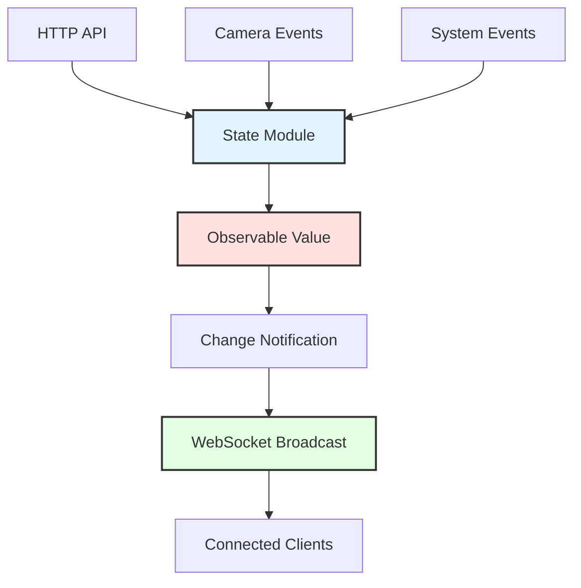
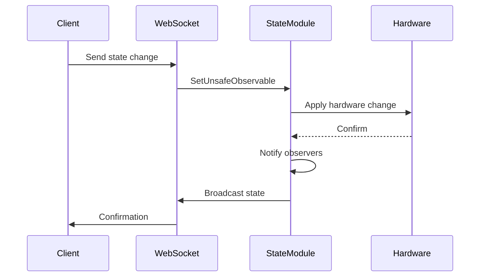

# State Management Architecture

**Reactive state management system using Observable pattern for real-time synchronization.**

## Overview

The C Pro camera server implements a centralized observable state management system that enables real-time synchronization between the server and all connected clients.



## Core Components

### Observable Pattern Implementation
Located in `src/state/observable.nim`:

- **GetUnsafeObservable**: Retrieve current state value
- **SetUnsafeObservable**: Update state value with validation
- **StateObservable**: Core observable type with change notifications
- **StatePermission**: Granular permission system for state access

### State Modules

The system includes 40+ specialized state modules in `src/state/`:

| Module | Purpose | Key States |
|--------|---------|------------|
| `rc_light` | LED lighting control | light0, light1 |
| `rc_camera_heads` | Camera head management | cam0Exists, cam1Exists |
| `rc_image_settings` | Image quality settings | brightness, contrast, exposure |
| `rc_recording` | Video recording control | record, takePicture |
| `rc_stream_settings` | Stream configuration | resolution, fps, quality |
| `rc_network` | Network configuration | ipAddress, hostname |
| `rc_user` | User management | sessions, permissions |

## State Synchronization Flow



## API Integration

### WebSocket State API

From `src/servers/websocketApiV1Handler.nim`:

```nim
proc evaluateApiV1Setter*(reqKeys: JsonNode, info: var seq[string]) =
  for key, val in reqKeys.pairs:
    case key:
    of "cam1-light":
      SetUnsafeObservable("light0", val)
      info.add("cam1-light")
    of "brightness":
      SetUnsafeObservable("brightness", val)
      info.add("brightness")
    # ... additional state mappings
```

### State Broadcasting

All state changes are automatically broadcast to connected WebSocket clients:

```nim
# Automatic notification system
proc notifyStateChange(stateKey: string, newValue: JsonNode) =
  for client in connectedClients:
    if client.hasPermission(getStatePermission(stateKey)):
      await client.send(%*{
        "type": "stateChange",
        "state": stateKey,
        "value": newValue
      })
```

## Permission System

State access is controlled through granular permissions from `src/state/permissions.nim`:

```nim
type StatePermission* = enum
  StreamSettings_r, StreamSettings_rw
  HeadFeatures_r, HeadFeatures_rw
  Recording_rw
  Media_r, Media_rw
  NetworkSettings_r, NetworkSettings_rw
```

### Permission Enforcement

```nim
proc setValue*(stateKey: string, value: JsonNode, user: UserContext) =
  let requiredPermission = getStatePermission(stateKey)
  if not user.hasPermission(requiredPermission):
    raise newException(PermissionError, "Access denied")
  
  SetUnsafeObservable(stateKey, value)
```

## State Persistence

Critical state values are automatically persisted to configuration files:

### Factory Configuration
Core system settings in `factory_config.json`:
- Server ports and protocols
- Hardware feature enablement
- Performance settings

### License Configuration  
Feature licensing in `license_config.json`:
- Enabled capabilities
- Quality limitations
- Access restrictions

## Real-time Features

### Instant Updates
- **WebSocket Push**: State changes broadcast in <10ms
- **Selective Updates**: Only changed values transmitted
- **Multi-client Sync**: All connected clients receive updates

### State Queries
```javascript
// Request specific state values
ws.send(JSON.stringify({
  "info": ["cam1-light", "brightness", "record"]
}));

// Response with current values
{
  "cam1-light": false,
  "brightness": 50,
  "record": "stop"
}
```

## Performance Characteristics

- **Memory Usage**: ~2MB for complete state system
- **Update Latency**: <1ms for state changes
- **Broadcast Time**: <10ms to all connected clients
- **Concurrent Clients**: Tested with 25+ simultaneous connections

## Error Handling

### Validation
```nim
# Type-safe state updates
proc validateStateValue(key: string, value: JsonNode): bool =
  case key:
  of "brightness":
    return value.getInt() in 0..100
  of "resolution":
    return value.getStr() in ["1920x1080", "1280x720", "640x480"]
  else:
    return true
```

### Error Recovery
- Invalid state changes are rejected with error messages
- State inconsistencies trigger automatic correction
- Hardware failures result in safe fallback states

## Development Guide

### Adding New State
1. Create observable in appropriate state module
2. Add API mapping in `websocketApiV1Handler.nim`
3. Define permissions in `permissions.nim`
4. Add persistence if needed
5. Update client documentation

### State Module Structure
```nim
# Example new state module
import ../observable

var customState* = newObservable("defaultValue", StatePermission.readWrite)

proc initCustomState*() =
  customState.addObserver(proc(oldVal, newVal: string) =
    # React to state changes
    applyHardwareChange(newVal)
  )
```

## Related Documentation

- [Observable Pattern Implementation](../reference/state-observables.md)
- [WebSocket API](../api/websocket-api.md)
- [Permission System](../security/permissions.md)
- [Architecture Overview](overview.md)

---

*State management documentation derived from `src/state/` modules and WebSocket API handler*
