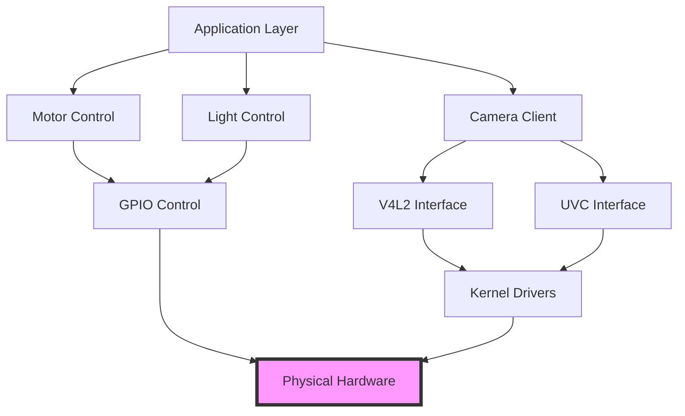

# Hardware Interface

## Overview

The C Pro camera system interfaces with various hardware components including camera sensors, rotation motors, lighting systems, and I/O controls. This document describes the hardware abstraction layer and device interfaces.

## Architecture



## Camera Interfaces

### V4L2 (Video4Linux2)

Primary interface for camera video capture on Linux:

**Device Discovery**:
```c
// src/camserver/v4l2_dev_interface.c
int enumerate_v4l2_devices() {
    struct v4l2_capability cap;
    int fd;
    
    for (int i = 0; i < MAX_DEVICES; i++) {
        char device[32];
        sprintf(device, "/dev/video%d", i);
        
        fd = open(device, O_RDWR);
        if (fd < 0) continue;
        
        if (ioctl(fd, VIDIOC_QUERYCAP, &cap) == 0) {
            if (cap.capabilities & V4L2_CAP_VIDEO_CAPTURE) {
                register_camera_device(device, &cap);
            }
        }
        close(fd);
    }
}
```

**Supported Formats**:
- YUV420 (I420, NV12)
- YUYV (YUV 4:2:2)
- MJPEG
- H.264 (hardware encode)

**Resolution Support**:
- 640x480 (VGA)
- 1280x720 (HD)
- 1920x1080 (Full HD)
- 3840x2160 (4K UHD)

### UVC (USB Video Class)

Support for USB cameras and microphones:

```nim
# src/state/rc_uvc_and_mic.nim
proc initUvcDevices*() =
  initObservable("uvcDevices",
    permissionRead = {Device_r, Device_rw},
    permissionWrite = {},
    isOnlyAskState = false,
    save = false,
    default = %[]
  )
  
  # Monitor for USB device hotplug
  startUdevMonitoring()
```

**Device Detection**:
```c
// src/camserver/udev_monitor.c
struct udev_monitor* setup_udev_monitor() {
    struct udev* udev = udev_new();
    struct udev_monitor* mon = udev_monitor_new_from_netlink(udev, "udev");
    
    // Filter for video devices
    udev_monitor_filter_add_match_subsystem_devtype(mon, "video4linux", NULL);
    udev_monitor_filter_add_match_subsystem_devtype(mon, "usb", NULL);
    
    udev_monitor_enable_receiving(mon);
    return mon;
}
```

### Camera Head Management

**Multi-Head Support** (rc_DMG variant):

```nim
# src/state/rc_camera_heads.nim
type
  CameraHead* = enum
    Primary = 0
    Secondary = 1

proc initCameraHeads*() =
  initObservable("activeCameraHead",
    permissionRead = {Device_r, Device_rw},
    permissionWrite = {Device_rw},
    default = %(ord(Primary))
  )
  
  initObservable("cameraHeadSettings",
    permissionRead = {Device_r, Device_rw},
    permissionWrite = {Device_rw},
    default = %{
      "primary": {
        "device": "/dev/video0",
        "format": "NV12",
        "resolution": "1920x1080",
        "fps": 60
      },
      "secondary": {
        "device": "/dev/video1",
        "format": "NV12",
        "resolution": "1920x1080",
        "fps": 60
      }
    }
  )
```

## Rotation Motor Control

### Motor Interface

```nim
# src/state/rc_disc_rotation.nim
type
  RotationDirection* = enum
    Clockwise
    CounterClockwise
    Stopped

proc initDiscRotation*() =
  initObservable("discRotation",
    permissionRead = {Device_r, Device_rw},
    permissionWrite = {Device_rw},
    default = %{
      "enabled": false,
      "direction": "stopped",
      "speed": 0,      # RPM
      "position": 0    # degrees
    }
  )
  
  initObservable("autoRotate",
    permissionRead = {Device_r, Device_rw},
    permissionWrite = {Device_rw},
    default = %{
      "enabled": false,
      "sensitivity": 5,
      "threshold": 10
    }
  )
```

### GPIO Control

Motor control via GPIO pins:

```c
// Motor control pins
#define GPIO_MOTOR_ENABLE    17
#define GPIO_MOTOR_DIR       27
#define GPIO_MOTOR_STEP      22
#define GPIO_MOTOR_FAULT     23

void motor_init() {
    gpio_export(GPIO_MOTOR_ENABLE);
    gpio_export(GPIO_MOTOR_DIR);
    gpio_export(GPIO_MOTOR_STEP);
    gpio_export(GPIO_MOTOR_FAULT);
    
    gpio_direction(GPIO_MOTOR_ENABLE, GPIO_OUT);
    gpio_direction(GPIO_MOTOR_DIR, GPIO_OUT);
    gpio_direction(GPIO_MOTOR_STEP, GPIO_OUT);
    gpio_direction(GPIO_MOTOR_FAULT, GPIO_IN);
}

void motor_start(int direction, int speed) {
    gpio_write(GPIO_MOTOR_DIR, direction);
    gpio_write(GPIO_MOTOR_ENABLE, 1);
    
    // Generate step pulses at specified rate
    setup_pwm(GPIO_MOTOR_STEP, speed);
}
```

### Auto-Rotation Detection

Automatic rotation detection based on image analysis:

```nim
proc detectRotation*(frame: DataView): float =
  # Analyze frame for rotation indicators
  let features = extractFeatures(frame)
  let angle = calculateRotationAngle(features)
  
  if angle > State.get("autoRotateThreshold").value.getFloat:
    # Trigger motor rotation
    setMotorRotation(angle)
  
  return angle
```

## Lighting Control

### Light Management

```nim
# src/state/rc_light.nim
proc initLightControl*() =
  initObservable("lightEnabled",
    permissionRead = {Device_r, Device_rw},
    permissionWrite = {Device_rw},
    default = %true
  )
  
  initObservable("lightIntensity",
    permissionRead = {Device_r, Device_rw},
    permissionWrite = {Device_rw},
    default = %100,  # 0-100%
    validateType = Int
  )
  
  initObservable("lightTemperature",
    permissionRead = {Device_r, Device_rw},
    permissionWrite = {Device_rw},
    default = %5500,  # Kelvin
    validateType = Int
  )
```

### PWM Control

Light intensity via PWM (Pulse Width Modulation):

```c
#define GPIO_LIGHT_PWM    18
#define PWM_FREQUENCY     1000  // Hz

void light_set_intensity(uint8_t percent) {
    // Convert percentage to duty cycle
    uint16_t duty = (percent * PWM_MAX) / 100;
    
    // Set PWM duty cycle
    pwm_write(GPIO_LIGHT_PWM, duty);
}

void light_set_temperature(uint16_t kelvin) {
    // Convert color temperature to RGB values
    rgb_t color = kelvin_to_rgb(kelvin);
    
    // Set multi-channel LED PWM
    pwm_write(GPIO_LED_RED, color.r);
    pwm_write(GPIO_LED_GREEN, color.g);
    pwm_write(GPIO_LED_BLUE, color.b);
}
```

## Sensor Interfaces

### Temperature Sensors

**FPGA Temperature**:
```nim
# src/state/rc_fpga_temp.nim
proc initFpgaTemp*() =
  initObservable("fpgaTemperature",
    permissionRead = {Device_r, Device_rw},
    permissionWrite = {},
    default = %25.0,
    validateType = Float
  )
  
  # Poll temperature every 5 seconds
  setInterval 5000:
    let temp = readFpgaTemperature()
    State.get("fpgaTemperature").updateValue(%temp)
    
    if temp > 85.0:
      Notification.trigger("systemWarning", "temperature", "FPGA overheating")
```

**CPU Temperature**:
```nim
proc readCpuTemperature*(): float =
  when defined(embeddedSystem):
    let tempStr = readFile("/sys/class/thermal/thermal_zone0/temp").strip()
    result = parseFloat(tempStr) / 1000.0
  else:
    result = 45.0  # Simulated
```

### Head Sensors

Position and proximity sensors:

```nim
# src/state/rc_head_sensors.nim
type
  SensorType* = enum
    Proximity
    Position
    Contact

proc initHeadSensors*() =
  initObservable("headSensors",
    permissionRead = {Device_r, Device_rw},
    permissionWrite = {},
    default = %{
      "proximity": false,
      "position": 0,
      "contact": false
    }
  )
```

## HDMI Output

### HDMI Interface

```nim
# src/state/rc_hdmi_monitor.nim
proc initHdmiMonitor*() =
  initObservable("hdmiEnabled",
    permissionRead = {Device_r, Device_rw},
    permissionWrite = {Device_rw},
    default = %true
  )
  
  initObservable("hdmiResolution",
    permissionRead = {Device_r, Device_rw},
    permissionWrite = {Device_rw},
    default = %"1920x1080"
  )
  
  initObservable("hdmiOverlay",
    permissionRead = {Device_r, Device_rw},
    permissionWrite = {Device_rw},
    default = %{
      "logo": true,
      "info": true,
      "timestamp": true
    }
  )
```

### Display Output

Render video to HDMI output:

```c
// GStreamer pipeline for HDMI output
const char* hdmi_pipeline = 
    "v4l2src device=/dev/video0 ! "
    "video/x-raw,format=NV12,width=1920,height=1080 ! "
    "textoverlay name=overlay ! "
    "videoconvert ! "
    "waylandsink";
```

## Storage Interface

### Media Storage

```nim
# src/state/rc_storage.nim
proc initStorage*() =
  initObservable("storageDevices",
    permissionRead = {Storage_r, Storage_rw},
    permissionWrite = {},
    default = %[]
  )
  
  # Monitor storage devices
  monitorBlockDevices()
```

### Block Device Detection

```c
// Monitor for storage device changes
void monitor_block_devices() {
    struct udev_monitor* mon = setup_block_monitor();
    
    while (1) {
        struct udev_device* dev = udev_monitor_receive_device(mon);
        if (dev) {
            const char* action = udev_device_get_action(dev);
            const char* devnode = udev_device_get_devnode(dev);
            
            if (strcmp(action, "add") == 0) {
                notify_device_added(devnode);
            } else if (strcmp(action, "remove") == 0) {
                notify_device_removed(devnode);
            }
            
            udev_device_unref(dev);
        }
    }
}
```

## Hardware Specifications

### Supported Hardware

**Camera Inputs**:
- MIPI CSI-2 cameras
- USB UVC cameras
- V4L2-compatible devices
- IP cameras (via ONVIF)

**Output**:
- HDMI 2.0 (up to 4K@60Hz)
- Network streaming (RTSP, WebRTC)
- USB storage

**Control**:
- GPIO pins (motor, lights, sensors)
- I2C devices
- SPI devices
- UART serial

**Storage**:
- eMMC internal storage
- USB mass storage
- Network storage (NFS, SMB)
- SD card

### Pin Assignments

```
GPIO Pinout (rc_DMG variant):
Pin  Function         Direction  Description
----------------------------------------------------
17   MOTOR_ENABLE     OUT        Motor power enable
27   MOTOR_DIR        OUT        Rotation direction
22   MOTOR_STEP       OUT        Step pulse
23   MOTOR_FAULT      IN         Motor fault signal
18   LIGHT_PWM        OUT        Light intensity PWM
24   SENSOR_PROX      IN         Proximity sensor
25   SENSOR_POS       IN         Position sensor
5    LED_STATUS       OUT        Status LED
6    BUTTON_RESET     IN         Reset button
```

## Troubleshooting

### Camera Not Detected

**Symptoms**: No video devices found.

**Solutions**:
- Check USB connection: `lsusb`
- Verify V4L2 devices: `ls /dev/video*`
- Check kernel drivers: `dmesg | grep video`
- Review permissions: `ls -l /dev/video0`

### Motor Not Responding

**Symptoms**: Rotation motor doesn't move.

**Solutions**:
- Check GPIO export: `cat /sys/class/gpio/gpio17/value`
- Verify power supply
- Check fault pin: read GPIO_MOTOR_FAULT
- Review motor controller logs

### HDMI No Signal

**Symptoms**: No output on HDMI display.

**Solutions**:
- Check HDMI cable connection
- Verify display resolution settings
- Test with different display
- Check GStreamer pipeline: `gst-launch-1.0 ...`

## Related Documentation

- [Camera Pipeline](../architecture/camera-pipeline.md)
- [Streaming](streaming.md)
- [Recording](recording.md)
- [Image Processing](image-processing.md)
