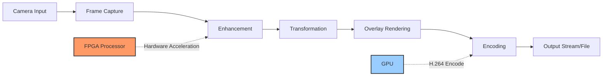

# Image Processing

## Overview

The C Pro camera system includes advanced image processing capabilities for enhancing video quality, adding overlays, and performing real-time transformations. Processing is performed using a combination of CPU, GPU, and FPGA acceleration.

## Image Processing Pipeline



## Image Enhancement

### Color Correction

```nim
# src/state/rc_image_settings.nim
proc initImageSettings*() =
  initObservable("brightness",
    permissionRead = {Device_r, Device_rw},
    permissionWrite = {Device_rw},
    default = %50,  # 0-100
    validateType = Int
  )
  
  initObservable("contrast",
    permissionRead = {Device_r, Device_rw},
    permissionWrite = {Device_rw},
    default = %50,  # 0-100
    validateType = Int
  )
  
  initObservable("saturation",
    permissionRead = {Device_r, Device_rw},
    permissionWrite = {Device_rw},
    default = %50,  # 0-100
    validateType = Int
  )
  
  initObservable("hue",
    permissionRead = {Device_r, Device_rw},
    permissionWrite = {Device_rw},
    default = %0,  # -180 to +180
    validateType = Int
  )
```

### V4L2 Control Implementation

```c
// src/camserver/v4l2_dev_interface.c
int apply_image_settings(int fd, struct image_settings* settings) {
    struct v4l2_control ctrl;
    
    // Brightness
    ctrl.id = V4L2_CID_BRIGHTNESS;
    ctrl.value = settings->brightness;
    if (ioctl(fd, VIDIOC_S_CTRL, &ctrl) < 0) {
        perror("Failed to set brightness");
    }
    
    // Contrast
    ctrl.id = V4L2_CID_CONTRAST;
    ctrl.value = settings->contrast;
    ioctl(fd, VIDIOC_S_CTRL, &ctrl);
    
    // Saturation
    ctrl.id = V4L2_CID_SATURATION;
    ctrl.value = settings->saturation;
    ioctl(fd, VIDIOC_S_CTRL, &ctrl);
    
    // Hue
    ctrl.id = V4L2_CID_HUE;
    ctrl.value = settings->hue;
    ioctl(fd, VIDIOC_S_CTRL, &ctrl);
    
    return 0;
}
```

### White Balance

```nim
initObservable("whiteBalance",
  permissionRead = {Device_r, Device_rw},
  permissionWrite = {Device_rw},
  default = %{
    "mode": "auto",  # auto, manual, daylight, cloudy, tungsten, fluorescent
    "temperature": 5500
  }
)

proc applyWhiteBalance*(mode: string, temperature: int = 5500) =
  case mode:
  of "auto":
    enableAutoWhiteBalance()
  of "manual":
    setColorTemperature(temperature)
  of "daylight":
    setColorTemperature(5500)
  of "cloudy":
    setColorTemperature(6500)
  of "tungsten":
    setColorTemperature(3200)
  of "fluorescent":
    setColorTemperature(4000)
```

## Image Transformations

### Zoom and Pan

```nim
# src/state/rc_zoom.nim
proc initZoom*() =
  initObservable("digitalZoom",
    permissionRead = {Device_r, Device_rw},
    permissionWrite = {Device_rw},
    default = %{
      "enabled": false,
      "level": 1.0,    # 1.0 - 10.0
      "panX": 0.0,     # -1.0 to +1.0 (normalized)
      "panY": 0.0      # -1.0 to +1.0 (normalized)
    }
  )
```

### GStreamer Zoom Implementation

```nim
proc applyDigitalZoom*(level: float, panX: float, panY: float) =
  # Calculate crop rectangle for zoom
  let width = 1920
  let height = 1080
  let cropWidth = (width.float / level).int
  let cropHeight = (height.float / level).int
  
  # Calculate pan offset
  let maxPanX = (width - cropWidth) div 2
  let maxPanY = (height - cropHeight) div 2
  let offsetX = (panX * maxPanX.float).int + maxPanX
  let offsetY = (panY * maxPanY.float).int + maxPanY
  
  # Apply crop filter
  let pipeline = fmt"""
    videocrop 
      left={offsetX} 
      right={width - offsetX - cropWidth}
      top={offsetY}
      bottom={height - offsetY - cropHeight} !
    videoscale ! 
    video/x-raw,width={width},height={height}
  """
  
  updatePipeline(pipeline)
```

### Rotation and Flip

```nim
initObservable("videoRotation",
  permissionRead = {Device_r, Device_rw},
  permissionWrite = {Device_rw},
  default = %0,  # 0, 90, 180, 270 degrees
  validateType = Int
)

initObservable("videoFlip",
  permissionRead = {Device_r, Device_rw},
  permissionWrite = {Device_rw},
  default = %{
    "horizontal": false,
    "vertical": false
  }
)

# GStreamer video transform
proc applyTransform*(rotation: int, flipH: bool, flipV: bool) =
  var method = case rotation:
    of 90: "clockwise"
    of 180: "rotate-180"
    of 270: "counterclockwise"
    else: "none"
  
  if flipH and flipV:
    method = "rotate-180"
  elif flipH:
    method = "horizontal-flip"
  elif flipV:
    method = "vertical-flip"
  
  let pipeline = fmt"videoflip method={method}"
  updatePipeline(pipeline)
```

## Timestamp Overlay

### Timestamp Configuration

```nim
initObservable("timestampOverlay",
  permissionRead = {Media_r, Media_rw},
  permissionWrite = {Media_rw},
  default = %{
    "enabled": true,
    "position": "bottom-left",  # top-left, top-right, bottom-left, bottom-right, center
    "format": "yyyy-MM-dd HH:mm:ss",
    "fontSize": 24,
    "color": "white",
    "background": "semi-transparent"
  }
)
```

### NV12 Timestamp Rendering

```c
// src/camserver/nv12Timestamp.c
#include "timestamp_bitmaps.h"

void render_timestamp_nv12(
    uint8_t* frame,
    int width,
    int height,
    int64_t timestamp_ms,
    struct timestamp_config* config
) {
    char time_str[32];
    format_timestamp(time_str, timestamp_ms, config->format);
    
    // Calculate position
    int x = 0, y = 0;
    switch (config->position) {
        case TOP_LEFT:
            x = 10; y = 10;
            break;
        case TOP_RIGHT:
            x = width - 200; y = 10;
            break;
        case BOTTOM_LEFT:
            x = 10; y = height - 40;
            break;
        case BOTTOM_RIGHT:
            x = width - 200; y = height - 40;
            break;
    }
    
    // Render background rectangle (optional)
    if (config->background) {
        render_rect_nv12(frame, width, height, x-5, y-5, 210, 35, 32, 128, 128);
    }
    
    // Render text
    render_text_nv12(frame, width, height, time_str, x, y, config->font_size);
}
```

### GStreamer Text Overlay

```nim
proc createTimestampPipeline*(): string =
  let format = State.get("timestampOverlay").value["format"].getStr
  let position = State.get("timestampOverlay").value["position"].getStr
  
  let (valign, halign) = case position:
    of "top-left": ("top", "left")
    of "top-right": ("top", "right")
    of "bottom-left": ("bottom", "left")
    of "bottom-right": ("bottom", "right")
    of "center": ("center", "center")
    else: ("bottom", "left")
  
  result = fmt"""
    textoverlay 
      text={format}
      valignment={valign}
      halignment={halign}
      font-desc="Sans 24"
      color=0xFFFFFFFF
      shaded-background=true
  """
```

## Logo and Graphics Overlay

### Logo Overlay

```nim
initObservable("logoOverlay",
  permissionRead = {Media_r, Media_rw},
  permissionWrite = {Media_rw},
  default = %{
    "enabled": false,
    "image": "/config/logo.png",
    "position": "top-right",
    "scale": 0.1,  # 10% of frame size
    "opacity": 0.8
  }
)
```

### GStreamer Logo Pipeline

```nim
proc createLogoPipeline*(): string =
  let config = State.get("logoOverlay").value
  let imagePath = config["image"].getStr
  let position = config["position"].getStr
  let scale = config["scale"].getFloat
  let opacity = config["opacity"].getFloat
  
  let (xpos, ypos) = calculateLogoPosition(position, scale)
  
  result = fmt"""
    gdkpixbufoverlay 
      location={imagePath}
      offset-x={xpos}
      offset-y={ypos}
      relative-x={scale}
      relative-y={scale}
      alpha={opacity}
  """
```

## FPGA Image Processing (rc_DMG Variant)

### FPGA Acceleration

The rc_DMG variant includes FPGA hardware for accelerated image processing:

```nim
initObservable("fpgaProcessing",
  permissionRead = {Device_r, Device_rw},
  permissionWrite = {Device_rw},
  default = %{
    "enabled": true,
    "denoise": true,
    "sharpen": true,
    "edgeEnhancement": false
  }
)
```

### FPGA Pipeline Configuration

```c
// Configure FPGA image processing pipeline
int configure_fpga_pipeline(struct fpga_config* config) {
    // Memory-mapped FPGA registers
    volatile uint32_t* fpga_base = (uint32_t*)FPGA_BASE_ADDR;
    
    uint32_t ctrl = 0;
    if (config->denoise) ctrl |= FPGA_DENOISE_EN;
    if (config->sharpen) ctrl |= FPGA_SHARPEN_EN;
    if (config->edge_enhancement) ctrl |= FPGA_EDGE_EN;
    
    // Write control register
    fpga_base[FPGA_CTRL_REG] = ctrl;
    
    // Configure processing parameters
    fpga_base[FPGA_DENOISE_STRENGTH] = config->denoise_strength;
    fpga_base[FPGA_SHARPEN_AMOUNT] = config->sharpen_amount;
    
    return 0;
}
```

### Denoise Filter

```nim
initObservable("denoiseStrength",
  permissionRead = {Device_r, Device_rw},
  permissionWrite = {Device_rw},
  default = %50,  # 0-100
  validateType = Int
)

proc applyDenoise*(strength: int) =
  when defined(embeddedSystem):
    # Use FPGA hardware denoise
    setFpgaDenoise(true, strength)
  else:
    # Software denoise (CPU)
    let pipeline = fmt"denoise strength={strength}"
    updatePipeline(pipeline)
```

### Sharpness Enhancement

```nim
initObservable("sharpness",
  permissionRead = {Device_r, Device_rw},
  permissionWrite = {Device_rw},
  default = %50,  # 0-100
  validateType = Int
)

proc applySharpness*(amount: int) =
  when defined(embeddedSystem):
    setFpgaSharpen(true, amount)
  else:
    # Software sharpening
    let pipeline = fmt"sharpen amount={amount}"
    updatePipeline(pipeline)
```

## Color Grading

### LUT (Look-Up Table) Support

```nim
initObservable("colorGrading",
  permissionRead = {Device_r, Device_rw},
  permissionWrite = {Device_rw},
  default = %{
    "enabled": false,
    "lut": "",  # Path to 3D LUT file (.cube)
    "intensity": 1.0
  }
)

proc applyColorGrading*(lutPath: string, intensity: float) =
  if lutPath.len > 0 and fileExists(lutPath):
    let pipeline = fmt"""
      lut3d 
        file={lutPath}
        interpolation=trilinear
        intensity={intensity}
    """
    updatePipeline(pipeline)
```

### Preset Color Profiles

```nim
type
  ColorProfile* = enum
    Standard
    Vivid
    Natural
    Cinema
    Medical

proc applyColorProfile*(profile: ColorProfile) =
  case profile:
  of Standard:
    applySettings(brightness=50, contrast=50, saturation=50)
  of Vivid:
    applySettings(brightness=55, contrast=60, saturation=70)
  of Natural:
    applySettings(brightness=50, contrast=45, saturation=40)
  of Cinema:
    applySettings(brightness=45, contrast=55, saturation=45)
  of Medical:
    applySettings(brightness=50, contrast=65, saturation=30)
```

## Exposure Control

### Auto Exposure

```nim
initObservable("autoExposure",
  permissionRead = {Device_r, Device_rw},
  permissionWrite = {Device_rw},
  default = %{
    "enabled": true,
    "mode": "average",  # average, center-weighted, spot
    "compensation": 0   # -3 to +3 EV
  }
)
```

### Manual Exposure

```nim
initObservable("manualExposure",
  permissionRead = {Device_r, Device_rw},
  permissionWrite = {Device_rw},
  default = %{
    "shutterSpeed": 16666,  # microseconds (1/60 sec)
    "iso": 400,
    "aperture": 2.8
  }
)
```

## Performance Optimization

### Hardware Acceleration

```nim
proc getOptimalEncoder*(): string =
  when defined(embeddedSystem):
    # Use hardware encoder on embedded systems
    if hasV4L2Encoder():
      return "v4l2h264enc"
    elif hasOMXEncoder():
      return "omxh264enc"
    else:
      return "x264enc speed-preset=ultrafast"
  else:
    # Desktop systems
    if hasNvidiaGPU():
      return "nvh264enc"
    elif hasIntelQSV():
      return "vaapih264enc"
    else:
      return "x264enc speed-preset=fast"
```

### Pipeline Optimization

```nim
proc optimizePipeline*(width: int, height: int, fps: int) =
  # Adjust buffer sizes based on resolution
  let bufferSize = (width * height * 3 div 2)  # NV12 size
  let numBuffers = 4
  
  # Configure V4L2 buffers
  configureV4L2Buffers(numBuffers, bufferSize)
  
  # Set queue sizes
  setQueueSize("video_queue", numBuffers * 2)
  setQueueSize("encode_queue", numBuffers)
```

## Image Quality Metrics

### Quality Assessment

```nim
proc calculateImageQuality*(frame: DataView): ImageQualityMetrics =
  result.sharpness = calculateSharpness(frame)
  result.brightness = calculateAverageBrightness(frame)
  result.contrast = calculateContrast(frame)
  result.colorfulness = calculateColorfulness(frame)
  result.noiseLevel = estimateNoiseLevel(frame)

type
  ImageQualityMetrics* = object
    sharpness*: float      # 0.0 - 1.0
    brightness*: float     # 0.0 - 1.0
    contrast*: float       # 0.0 - 1.0
    colorfulness*: float   # 0.0 - 1.0
    noiseLevel*: float     # 0.0 - 1.0
```

## Troubleshooting

### Poor Image Quality

**Symptoms**: Blurry or dark images.

**Solutions**:
- Adjust brightness and contrast
- Enable auto-exposure
- Check lighting conditions
- Clean camera lens
- Verify focus settings

### High CPU Usage

**Symptoms**: System slow during video processing.

**Solutions**:
- Enable hardware acceleration
- Reduce resolution or framerate
- Disable unnecessary filters
- Use FPGA processing (rc_DMG variant)

### Overlay Not Visible

**Symptoms**: Timestamp or logo not appearing.

**Solutions**:
- Verify overlay is enabled
- Check file paths for logo images
- Verify overlay position settings
- Review GStreamer pipeline logs

## Related Documentation

- [Hardware Interface](hardware-interface.md)
- [Streaming](streaming.md)
- [Recording](recording.md)
- [Camera Pipeline](../architecture/camera-pipeline.md)
