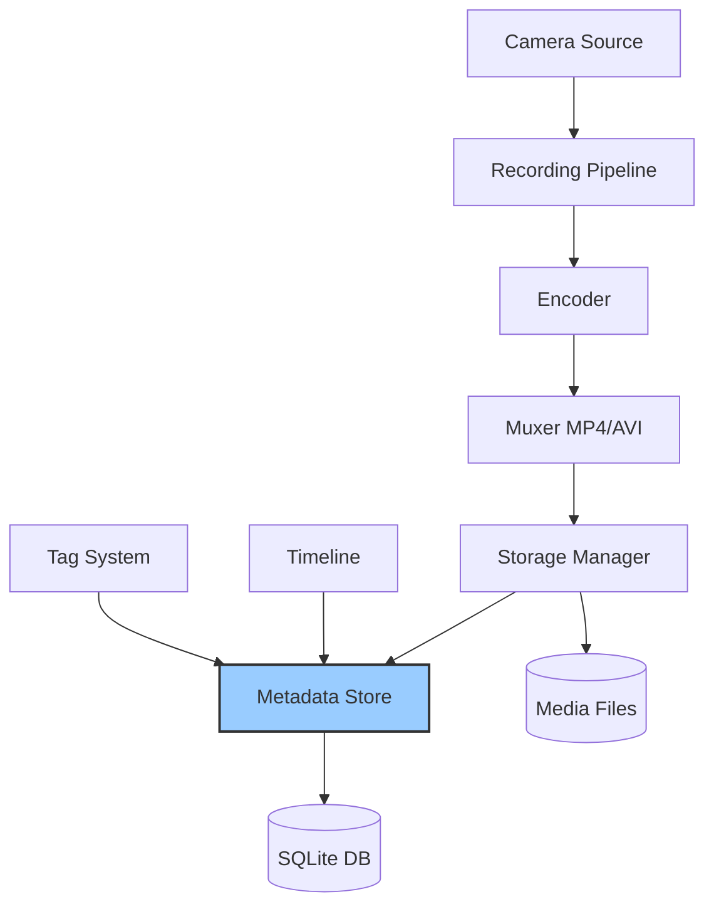

# Recording

## Overview

The C Pro recording system captures video from camera sources and stores it to local or network storage. It supports multiple recording modes, formats, and metadata tagging for efficient organization and retrieval.

## Recording Architecture



## Recording Modes

### Video Recording

Standard video recording with audio:

```nim
# src/state/rc_recording.nim
proc initRecording*() =
  initObservable("recordingState",
    permissionRead = {Media_r, Media_rw},
    permissionWrite = {Media_rw},
    default = %"stopped",  # stopped, recording, paused
    validateType = String
  )
  
  initObservable("recordingMode",
    permissionRead = {Media_r, Media_rw},
    permissionWrite = {Media_rw},
    default = %"video",  # video, timelapse, slowmotion
    validateType = String
  )
```

### Timelapse Recording

Capture frames at intervals for timelapse video:

```nim
initObservable("timelapseInterval",
  permissionRead = {Media_r, Media_rw},
  permissionWrite = {Media_rw},
  default = %5000,  # milliseconds between frames
  validateType = Int
)

initObservable("timelapseDuration",
  permissionRead = {Media_r, Media_rw},
  permissionWrite = {Media_rw},
  default = %3600000,  # 1 hour in milliseconds
  validateType = Int
)
```

### Slow Motion Recording

High framerate capture for slow motion playback:

```nim
initObservable("slowMotionFps",
  permissionRead = {Media_r, Media_rw},
  permissionWrite = {Media_rw},
  default = %120,  # Capture at 120fps, playback at 30fps = 4x slow
  validateType = Int
)
```

## Recording Pipeline

### GStreamer Recording Pipeline

```nim
# src/camserver/streamer.nim
proc createRecordingPipeline*(config: RecordConfig): string =
  let audioSrc = if config.includeAudio:
    "alsasrc device=hw:0,0 ! audioconvert ! audioresample ! audio/x-raw,rate=48000 ! voaacenc ! aacparse ! queue !"
  else:
    ""
  
  result = fmt"""
    v4l2src device={config.device} !
    video/x-raw,format=NV12,width={config.width},height={config.height},framerate={config.fps}/1 !
    v4l2h264enc extra-controls="controls,video_bitrate={config.bitrate}" !
    h264parse ! queue !
    mux.video_0
    
    {audioSrc} mux.audio_0
    
    mp4mux name=mux !
    filesink location={config.outputPath}
  """
```

### Format Support

**MP4 Container**:
- Video: H.264, H.265
- Audio: AAC, MP3
- Best for streaming and compatibility

**AVI Container**:
- Video: H.264, MJPEG
- Audio: PCM, MP3
- Best for frame-accurate editing

## Metadata Management

### Record Metadata Structure

```nim
# src/state/record_data.nim
type
  RecordMetadata* = object
    id*: int64
    mediaType*: MetadataMediaType      # video, timelapse, slowmotion, image, backup
    mediaEncoding*: MetadataMediaEncoding  # mp4, avi, jpg, jpeg, png
    timestampStartMs*: int64
    timestampEndMs*: int64
    durationMs*: int64
    size*: int64
    filename*: string
    resolution*: string
    fps*: float32
    state*: RecordMediaState           # defect, recording, ready
    tagMarkers*: uint32               # Number of associated tags
```

### SQLite Metadata Storage

```nim
# src/storage/metadata_store.nim
proc createMetadataSchema*() =
  db.exec(sql"""
    CREATE TABLE IF NOT EXISTS records (
      id INTEGER PRIMARY KEY,
      filename TEXT NOT NULL,
      media_type TEXT,
      encoding TEXT,
      timestamp_start INTEGER,
      timestamp_end INTEGER,
      duration INTEGER,
      size INTEGER,
      resolution TEXT,
      fps REAL,
      state TEXT,
      tag_markers INTEGER
    );
    
    CREATE INDEX idx_timestamp ON records(timestamp_start, timestamp_end);
    CREATE INDEX idx_state ON records(state);
  """)
```

### Tag System

```nim
type
  RecordTag* = object
    id*: int64
    category*: int64              # Reference to category
    timestamp*: int64             # Milliseconds into recording
    title*: string
    note*: string
    createdBy*: string            # Username
```

**Tag Categories**:
```nim
# src/state/rc_tag_category.nim
type
  Category* = object
    id*: int
    name*: string
    color*: string

# Issue #150 fix: Categories persist across factory reset
proc initRCTagCategories*() =
  initObservable("categories",
    permissionRead = {Media_r, Media_rw},
    permissionWrite = {},
    save = true,  # Persisted in LocalStorage
    default = newJObject()
  )
```

## Recording Control

### Start Recording

```nim
proc startRecording*(config: RecordingConfig): bool =
  # Check storage space
  if not hasEnoughSpace(config.estimatedSize):
    StateLogger.error("Insufficient storage space")
    return false
  
  # Check if already recording
  if State.get("recordingState").value.getStr == "recording":
    StateLogger.warn("Already recording")
    return false
  
  # Generate filename
  let filename = generateRecordingFilename(config)
  let filepath = getMediaPath() / filename
  
  # Create GStreamer pipeline
  let pipeline = createRecordingPipeline(RecordConfig(
    device: config.device,
    width: config.resolution.width,
    height: config.resolution.height,
    fps: config.fps,
    bitrate: config.bitrate,
    outputPath: filepath,
    includeAudio: config.includeAudio
  ))
  
  # Start pipeline
  if startGStreamerPipeline(pipeline):
    # Create metadata entry
    createRecordMetadata(filename, config)
    
    # Update state
    State.get("recordingState").updateValue(%"recording")
    State.get("currentRecordingFile").updateValue(%filename)
    
    return true
  
  return false
```

### Stop Recording

```nim
proc stopRecording*(): bool =
  if State.get("recordingState").value.getStr != "recording":
    return false
  
  # Send EOS (End of Stream) to pipeline
  sendEosToGStreamerPipeline()
  
  # Wait for pipeline to finish
  waitForPipelineEos()
  
  # Stop pipeline
  stopGStreamerPipeline()
  
  # Finalize metadata
  finalizeRecordMetadata()
  
  # Update state
  State.get("recordingState").updateValue(%"stopped")
  State.get("currentRecordingFile").updateValue(%"")
  
  return true
```

### Pause/Resume

```nim
proc pauseRecording*(): bool =
  if State.get("recordingState").value.getStr != "recording":
    return false
  
  pauseGStreamerPipeline()
  State.get("recordingState").updateValue(%"paused")
  return true

proc resumeRecording*(): bool =
  if State.get("recordingState").value.getStr != "paused":
    return false
  
  resumeGStreamerPipeline()
  State.get("recordingState").updateValue(%"recording")
  return true
```

## Storage Management

### Storage Location

```nim
# src/state/rc_storage.nim
proc initStoragePaths*() =
  initObservable("recordingStorage",
    permissionRead = {Storage_r, Storage_rw},
    permissionWrite = {Storage_rw},
    default = %{
      "primary": "/media/data/recordings",
      "backup": "/media/backup/recordings",
      "network": ""
    }
  )
```

### Space Monitoring

```nim
proc getStorageSpace*(path: string): StorageSpace =
  when defined(embeddedSystem):
    let stat = statvfs(path)
    result.total = stat.f_blocks * stat.f_frsize
    result.available = stat.f_bavail * stat.f_frsize
    result.used = result.total - result.available
  else:
    # Simulated values for development
    result.total = 100_000_000_000  # 100 GB
    result.available = 50_000_000_000  # 50 GB
    result.used = 50_000_000_000

proc hasEnoughSpace*(requiredBytes: int64): bool =
  let space = getStorageSpace(getMediaPath())
  let minFreeSpace = 1_000_000_000  # 1 GB minimum
  result = space.available > (requiredBytes + minFreeSpace)
```

### Automatic Cleanup

```nim
proc cleanupOldRecordings*(retentionDays: int) =
  let cutoffTime = now() - initDuration(days = retentionDays)
  
  for record in getAllRecords():
    if record.timestampStartMs < cutoffTime.toUnix() * 1000:
      # Check if record has tags
      if record.tagMarkers == 0:
        # Delete unmarked old recordings
        deleteRecording(record.id)
        StateLogger.info("Deleted old recording: ", record.filename)
```

## File Organization

### Directory Structure

```
/media/data/recordings/
├── 2025/
│   ├── 01/  (January)
│   │   ├── 01/  (Day)
│   │   │   ├── recording_20250101_080000.mp4
│   │   │   ├── recording_20250101_100000.mp4
│   │   │   └── ...
│   │   └── .metadata/
│   │       ├── metadata_20250101.bin
│   │       └── tags_20250101.bin
│   └── 02/
└── .metadata/
    └── metadata.db  (SQLite database)
```

### Filename Convention

```nim
proc generateRecordingFilename*(config: RecordingConfig): string =
  let now = now()
  let dateStr = now.format("yyyyMMdd")
  let timeStr = now.format("HHmmss")
  let ext = case config.format:
    of mp4: "mp4"
    of avi: "avi"
    else: "mp4"
  
  result = fmt"recording_{dateStr}_{timeStr}.{ext}"
```

## Recording Modes Configuration

### Mode-Specific Settings

```nim
# src/state/rc_recording_modes.nim
proc initRecordingModes*() =
  initObservable("videoRecordingSettings",
    default = %{
      "resolution": "1920x1080",
      "fps": 60,
      "bitrate": 8000000,
      "audio": true,
      "format": "mp4"
    }
  )
  
  initObservable("timelapseSettings",
    default = %{
      "interval": 5000,      # 5 seconds between frames
      "resolution": "1920x1080",
      "duration": 3600000,   # 1 hour
      "format": "mp4"
    }
  )
  
  initObservable("slowMotionSettings",
    default = %{
      "captureFps": 120,
      "playbackFps": 30,
      "resolution": "1920x1080",
      "bitrate": 12000000,
      "format": "mp4"
    }
  )
```

## API Integration

### Start Recording via API

```typescript
// POST /api/recording/start
{
  "mode": "video",  // video, timelapse, slowmotion
  "resolution": "1920x1080",
  "fps": 60,
  "bitrate": 8000000,
  "includeAudio": true,
  "format": "mp4"
}

// Response
{
  "success": true,
  "recordingId": 12345,
  "filename": "recording_20250101_120000.mp4",
  "estimatedSize": 1073741824
}
```

### Stop Recording

```typescript
// POST /api/recording/stop
{
  "finalize": true
}

// Response
{
  "success": true,
  "recordingId": 12345,
  "duration": 3600000,  // milliseconds
  "size": 1073741824,   // bytes
  "path": "/media/data/recordings/2025/01/01/recording_20250101_120000.mp4"
}
```

### Add Tag During Recording

```typescript
// POST /api/recording/tag
{
  "category": "surgical-milestone",
  "title": "Incision Started",
  "note": "Primary incision at 10:23:45",
  "timestamp": 623450  // milliseconds into recording
}
```

## Performance Optimization

### Encoding Performance

**Hardware Encoding**:
```nim
# Use V4L2 hardware encoder on embedded systems
let encoder = when defined(embeddedSystem):
  "v4l2h264enc"
else:
  "x264enc speed-preset=fast tune=zerolatency"
```

**Buffer Tuning**:
```nim
initObservable("recordingBufferSize",
  default = %4194304,  # 4 MB
  validateType = Int
)

initObservable("recordingQueueSize",
  default = %10,  # Number of frames to buffer
  validateType = Int
)
```

### Storage Performance

**Write Caching**:
```nim
proc optimizeWritePerformance*() =
  # Use larger write buffers for better performance
  when defined(embeddedSystem):
    discard execCmd("echo 16384 > /proc/sys/vm/dirty_background_ratio")
    discard execCmd("echo 32768 > /proc/sys/vm/dirty_ratio")
```

## Troubleshooting

### Recording Won't Start

**Symptoms**: Start recording command fails.

**Solutions**:
- Check storage space: `df -h /media/data`
- Verify camera is available: `v4l2-ctl --list-devices`
- Check permissions on recording directory
- Review logs: `journalctl -u rotordream | grep recording`

### Dropped Frames

**Symptoms**: Warning messages about dropped frames.

**Solutions**:
- Reduce bitrate
- Lower resolution or framerate
- Check CPU usage
- Verify storage write speed
- Use hardware encoding

### File Corruption

**Symptoms**: Recording files won't play or are incomplete.

**Solutions**:
- Ensure proper EOS (End of Stream) handling
- Check storage health
- Verify filesystem is not full
- Use MP4 faststart for better compatibility

### Metadata Not Saved

**Symptoms**: Tags or metadata missing after recording.

**Solutions**:
- Verify SQLite database is writable
- Check metadata directory permissions
- Review metadata store logs
- Ensure recording was properly finalized

## Related Documentation

- [Hardware Interface](hardware-interface.md)
- [Streaming](streaming.md)
- [Metadata Storage](../architecture/metadata-sqlite.md)
- [Storage Configuration](../configuration/storage-backup.md)
