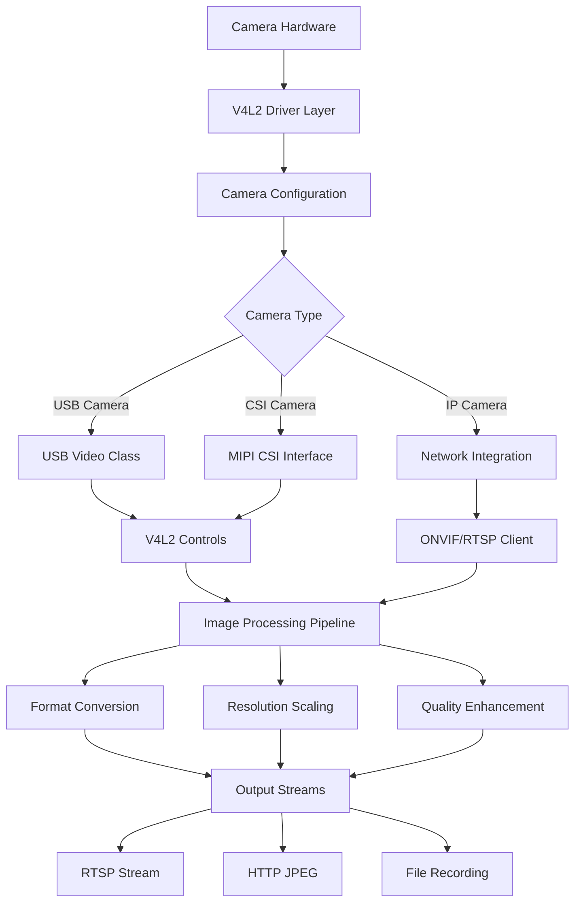

# Camera System Configuration

**Comprehensive camera hardware setup, calibration, and optimization.**

## Overview

The C Pro camera system supports various camera hardware configurations with V4L2 integration, providing flexible control over capture parameters, image processing, and streaming capabilities.



## Camera Hardware Detection

### Automatic Discovery

**V4L2 Device Enumeration**:
```bash
# List all video devices
v4l2-ctl --list-devices

# Get device capabilities
v4l2-ctl --device=/dev/video0 --list-ctrls

# Check supported formats
v4l2-ctl --device=/dev/video0 --list-formats-ext

# Device information
v4l2-ctl --device=/dev/video0 --info
```

**Camera Detection via API**:
```bash
# Get camera status
curl -H "Authorization: Bearer 1a2B3c4D5e6f7G8h" \
     http://192.168.1.100:8080/api/camera/status

# Response example
{
  "cameras": [
    {
      "id": 0,
      "connected": true,
      "device": "/dev/video0",
      "name": "USB Camera",
      "driver": "uvcvideo",
      "resolution": "1920x1080",
      "framerate": 30,
      "format": "YUYV",
      "capabilities": ["video_capture", "streaming"]
    }
  ],
  "active_camera": 0,
  "streaming": true
}
```

### Manual Configuration

**Device Configuration File**:
```ini
# /etc/rotordream/camera.conf
[camera0]
enabled = true
device = /dev/video0
name = "Primary Camera"
type = usb
priority = 10

# Default capture settings
default_width = 1920
default_height = 1080
default_framerate = 30
default_format = YUYV

# Supported resolutions
resolutions = 1920x1080,1280x720,640x480
framerates = 30,25,15,10

[camera1]
enabled = false
device = /dev/video1
name = "Secondary Camera"
type = usb
priority = 5
```

## Capture Parameters

### Resolution and Frame Rate

**Supported Resolutions**:
```json
{
  "resolutions": [
    {
      "width": 1920,
      "height": 1080,
      "framerates": [30, 25, 15],
      "formats": ["YUYV", "MJPG"]
    },
    {
      "width": 1280,
      "height": 720,
      "framerates": [60, 30, 25, 15],
      "formats": ["YUYV", "MJPG"]
    },
    {
      "width": 640,
      "height": 480,
      "framerates": [60, 30, 25, 15],
      "formats": ["YUYV", "MJPG"]
    }
  ]
}
```

**Set Resolution via API**:
```bash
# Change resolution
curl -X PUT "http://192.168.1.100:8080/api/camera/config" \
     -H "Authorization: Bearer 1a2B3c4D5e6f7G8h" \
     -H "Content-Type: application/json" \
     -d '{
       "resolution": "1920x1080",
       "framerate": 30,
       "format": "YUYV"
     }'

# Get current configuration
curl -H "Authorization: Bearer 1a2B3c4D5e6f7G8h" \
     http://192.168.1.100:8080/api/camera/config
```

**Command Line Configuration**:
```bash
# Set resolution with v4l2-ctl
v4l2-ctl --device=/dev/video0 --set-fmt-video=width=1920,height=1080,pixelformat=YUYV

# Set frame rate
v4l2-ctl --device=/dev/video0 --set-parm=30

# Verify settings
v4l2-ctl --device=/dev/video0 --get-fmt-video
v4l2-ctl --device=/dev/video0 --get-parm
```

### Image Quality Controls

**Exposure Control**:
```bash
# Auto exposure
v4l2-ctl --device=/dev/video0 --set-ctrl=exposure_auto=3

# Manual exposure
v4l2-ctl --device=/dev/video0 --set-ctrl=exposure_auto=1
v4l2-ctl --device=/dev/video0 --set-ctrl=exposure_absolute=156

# Via API
curl -X PUT "http://192.168.1.100:8080/api/camera/controls" \
     -H "Authorization: Bearer 1a2B3c4D5e6f7G8h" \
     -H "Content-Type: application/json" \
     -d '{
       "exposure_auto": "auto",
       "exposure_absolute": 156
     }'
```

**White Balance**:
```bash
# Auto white balance
v4l2-ctl --device=/dev/video0 --set-ctrl=white_balance_temperature_auto=1

# Manual white balance
v4l2-ctl --device=/dev/video0 --set-ctrl=white_balance_temperature_auto=0
v4l2-ctl --device=/dev/video0 --set-ctrl=white_balance_temperature=4000

# Via API
curl -X PUT "http://192.168.1.100:8080/api/camera/controls" \
     -H "Authorization: Bearer 1a2B3c4D5e6f7G8h" \
     -H "Content-Type: application/json" \
     -d '{
       "white_balance_auto": true,
       "white_balance_temperature": 4000
     }'
```

**Brightness, Contrast, Saturation**:
```bash
# Adjust image parameters
v4l2-ctl --device=/dev/video0 --set-ctrl=brightness=128
v4l2-ctl --device=/dev/video0 --set-ctrl=contrast=128
v4l2-ctl --device=/dev/video0 --set-ctrl=saturation=128
v4l2-ctl --device=/dev/video0 --set-ctrl=hue=0

# Via API
curl -X PUT "http://192.168.1.100:8080/api/camera/controls" \
     -H "Authorization: Bearer 1a2B3c4D5e6f7G8h" \
     -H "Content-Type: application/json" \
     -d '{
       "brightness": 128,
       "contrast": 128,
       "saturation": 128,
       "hue": 0
     }'
```

**Focus Control**:
```bash
# Auto focus
v4l2-ctl --device=/dev/video0 --set-ctrl=focus_auto=1

# Manual focus
v4l2-ctl --device=/dev/video0 --set-ctrl=focus_auto=0
v4l2-ctl --device=/dev/video0 --set-ctrl=focus_absolute=250

# Via API
curl -X PUT "http://192.168.1.100:8080/api/camera/controls" \
     -H "Authorization: Bearer 1a2B3c4D5e6f7G8h" \
     -H "Content-Type: application/json" \
     -d '{
       "focus_auto": false,
       "focus_absolute": 250
     }'
```

## Camera Profiles

### Predefined Profiles

**Profile Configuration**:
```json
{
  "profiles": {
    "indoor": {
      "name": "Indoor Lighting",
      "description": "Optimized for indoor environments",
      "settings": {
        "exposure_auto": "auto",
        "white_balance_auto": true,
        "brightness": 120,
        "contrast": 110,
        "saturation": 120,
        "backlight_compensation": 2
      }
    },
    "outdoor": {
      "name": "Outdoor Daylight",
      "description": "Optimized for outdoor daylight",
      "settings": {
        "exposure_auto": "auto",
        "white_balance_temperature": 5500,
        "brightness": 100,
        "contrast": 120,
        "saturation": 110,
        "backlight_compensation": 0
      }
    },
    "low_light": {
      "name": "Low Light",
      "description": "Optimized for low light conditions",
      "settings": {
        "exposure_auto": "manual",
        "exposure_absolute": 500,
        "gain": 200,
        "brightness": 140,
        "contrast": 90,
        "saturation": 100
      }
    },
    "microscopy": {
      "name": "Microscopy",
      "description": "Optimized for microscope imaging",
      "settings": {
        "resolution": "1920x1080",
        "framerate": 15,
        "exposure_auto": "manual",
        "exposure_absolute": 100,
        "white_balance_auto": false,
        "white_balance_temperature": 3200,
        "brightness": 100,
        "contrast": 130,
        "saturation": 90,
        "sharpness": 150
      }
    }
  }
}
```

**Apply Profile via API**:
```bash
# Apply predefined profile
curl -X POST "http://192.168.1.100:8080/api/camera/profile" \
     -H "Authorization: Bearer 1a2B3c4D5e6f7G8h" \
     -H "Content-Type: application/json" \
     -d '{
       "profile": "microscopy"
     }'

# Get available profiles
curl -H "Authorization: Bearer 1a2B3c4D5e6f7G8h" \
     http://192.168.1.100:8080/api/camera/profiles

# Save current settings as profile
curl -X POST "http://192.168.1.100:8080/api/camera/profiles" \
     -H "Authorization: Bearer 1a2B3c4D5e6f7G8h" \
     -H "Content-Type: application/json" \
     -d '{
       "name": "custom_profile",
       "description": "My custom settings",
       "save_current": true
     }'
```

## Image Processing Pipeline

### Format Conversion

**Supported Pixel Formats**:
- **YUYV** - YUV 4:2:2 packed format
- **MJPG** - Motion JPEG compressed
- **RGB24** - 24-bit RGB
- **BGR24** - 24-bit BGR
- **GRAY** - 8-bit grayscale

**Format Conversion Configuration**:
```ini
# /etc/rotordream/pipeline.conf
[conversion]
input_format = YUYV
output_formats = RGB24,MJPG,GRAY

# JPEG compression settings
jpeg_quality = 85
jpeg_progressive = false
jpeg_optimize = true

# Scaling options
scaling_algorithm = bilinear  # nearest, bilinear, bicubic, lanczos
maintain_aspect_ratio = true
```

### Image Enhancement

**Real-time Filters**:
```json
{
  "image_processing": {
    "enabled": true,
    "filters": [
      {
        "name": "noise_reduction",
        "enabled": true,
        "strength": 0.3
      },
      {
        "name": "sharpening",
        "enabled": true,
        "strength": 0.2
      },
      {
        "name": "color_correction",
        "enabled": true,
        "gamma": 1.0,
        "color_matrix": [
          [1.0, 0.0, 0.0],
          [0.0, 1.0, 0.0],
          [0.0, 0.0, 1.0]
        ]
      }
    ]
  }
}
```

**Apply Processing via API**:
```bash
# Enable/disable processing
curl -X PUT "http://192.168.1.100:8080/api/camera/processing" \
     -H "Authorization: Bearer 1a2B3c4D5e6f7G8h" \
     -H "Content-Type: application/json" \
     -d '{
       "enabled": true,
       "filters": {
         "noise_reduction": 0.3,
         "sharpening": 0.2,
         "gamma_correction": 1.2
       }
     }'
```

## Recording Configuration

### Video Encoding Settings

**H.264 Encoder Parameters**:
```ini
# /etc/rotordream/encoder.conf
[h264]
enabled = true
profile = main  # baseline, main, high
level = 4.0
bitrate_mode = vbr  # cbr, vbr, crf
target_bitrate = 4000000
max_bitrate = 8000000
min_bitrate = 1000000
gop_size = 30
b_frames = 2

# Rate control
rate_control = auto  # auto, cbr, vbr, crf
crf_value = 23  # 0-51, lower = better quality
preset = medium  # ultrafast, superfast, veryfast, faster, fast, medium, slow, slower, veryslow

[mjpeg]
enabled = true
quality = 85
progressive = false
optimize_huffman = true
```

**Encoder Configuration via API**:
```bash
# Set H.264 parameters
curl -X PUT "http://192.168.1.100:8080/api/camera/encoder" \
     -H "Authorization: Bearer 1a2B3c4D5e6f7G8h" \
     -H "Content-Type: application/json" \
     -d '{
       "codec": "h264",
       "profile": "main",
       "bitrate": 4000000,
       "gop_size": 30,
       "quality": "high"
     }'
```

### Recording Modes

**Continuous Recording**:
```json
{
  "recording_mode": "continuous",
  "segment_duration": 900,
  "max_segments": 96,
  "filename_pattern": "recording_%Y%m%d_%H%M%S.avi",
  "storage_path": "/media/data/recordings",
  "auto_cleanup": true,
  "cleanup_policy": {
    "max_age_days": 7,
    "max_size_gb": 50,
    "keep_minimum": 5
  }
}
```

**Triggered Recording**:
```json
{
  "recording_mode": "triggered",
  "trigger_sources": ["motion", "external", "api"],
  "pre_record_duration": 5,
  "post_record_duration": 10,
  "min_recording_duration": 30,
  "max_recording_duration": 300
}
```

## Camera Calibration

### Geometric Calibration

**Calibration Process**:
```bash
# Capture calibration images
curl -X POST "http://192.168.1.100:8080/api/camera/calibration/capture" \
     -H "Authorization: Bearer 1a2B3c4D5e6f7G8h" \
     -H "Content-Type: application/json" \
     -d '{
       "pattern_type": "chessboard",
       "pattern_size": [9, 6],
       "square_size": 25.0,
       "num_images": 20
     }'

# Start calibration process
curl -X POST "http://192.168.1.100:8080/api/camera/calibration/compute" \
     -H "Authorization: Bearer 1a2B3c4D5e6f7G8h"

# Get calibration results
curl -H "Authorization: Bearer 1a2B3c4D5e6f7G8h" \
     http://192.168.1.100:8080/api/camera/calibration/results
```

**Calibration Data Format**:
```json
{
  "calibration": {
    "camera_matrix": [
      [800.0, 0.0, 320.0],
      [0.0, 800.0, 240.0],
      [0.0, 0.0, 1.0]
    ],
    "distortion_coefficients": [-0.2, 0.1, 0.0, 0.0, 0.0],
    "image_size": [640, 480],
    "reprojection_error": 0.15,
    "calibration_date": "2025-01-15T10:30:00Z"
  }
}
```

### Color Calibration

**White Balance Calibration**:
```bash
# Capture white reference
curl -X POST "http://192.168.1.100:8080/api/camera/calibration/white_balance" \
     -H "Authorization: Bearer 1a2B3c4D5e6f7G8h" \
     -H "Content-Type: application/json" \
     -d '{
       "method": "white_patch",
       "reference_illuminant": "D65"
     }'
```

## Multi-Camera Configuration

### Camera Array Setup

**Multi-Camera Configuration**:
```json
{
  "camera_array": {
    "enabled": true,
    "cameras": [
      {
        "id": 0,
        "device": "/dev/video0",
        "role": "primary",
        "position": "center",
        "resolution": "1920x1080",
        "framerate": 30
      },
      {
        "id": 1,
        "device": "/dev/video1",
        "role": "secondary",
        "position": "left",
        "resolution": "1280x720",
        "framerate": 25
      }
    ],
    "synchronization": {
      "enabled": true,
      "master_camera": 0,
      "sync_tolerance_ms": 16
    }
  }
}
```

**Switch Active Camera**:
```bash
# Switch to camera 1
curl -X POST "http://192.168.1.100:8080/api/camera/switch" \
     -H "Authorization: Bearer 1a2B3c4D5e6f7G8h" \
     -H "Content-Type: application/json" \
     -d '{
       "camera_id": 1
     }'
```

## Troubleshooting

### Common Issues

**Camera Not Detected**:
```bash
# Check USB connections
lsusb | grep -i camera

# Check V4L2 devices
ls -la /dev/video*

# Check kernel modules
lsmod | grep uvcvideo

# Check dmesg for errors
dmesg | grep -i video
```

**Poor Image Quality**:
```bash
# Check current settings
v4l2-ctl --device=/dev/video0 --list-ctrls-menus

# Reset to defaults
v4l2-ctl --device=/dev/video0 --set-ctrl=restore_factory_default=1

# Check USB bandwidth
cat /sys/kernel/debug/usb/devices | grep -A 20 "Product=.*Camera"
```

**Frame Rate Issues**:
```bash
# Monitor actual frame rate
gst-launch-1.0 v4l2src device=/dev/video0 ! \
    video/x-raw,width=1920,height=1080,framerate=30/1 ! \
    fpsdisplaysink

# Check USB version and bandwidth
lsusb -v | grep -A 5 "bcdUSB"
```

### Performance Optimization

**USB Configuration**:
```bash
# Increase USB buffer size
echo 128 > /sys/module/usbcore/parameters/usbfs_memory_mb

# Set USB autosuspend delay
echo 0 > /sys/bus/usb/devices/*/power/autosuspend_delay_ms
```

**V4L2 Buffer Optimization**:
```bash
# Increase buffer count
v4l2-ctl --device=/dev/video0 --set-fmt-video=width=1920,height=1080
v4l2-ctl --device=/dev/video0 --reqbufs=8

# Check buffer status
cat /proc/*/fd/* 2>/dev/null | grep video0
```

## Related Documentation

- [Camera Pipeline Architecture](../architecture/camera-pipeline.md) - Technical implementation details
- [RTSP Streaming](../api/rtsp-streaming.md) - Video streaming configuration
- [Performance Tuning](../operations/performance.md) - System optimization
- [Testing Strategy](../testing/testing-strategy.md) - Camera system testing

---

*Camera configuration documentation based on V4L2, GStreamer, and OpenCV integration*
