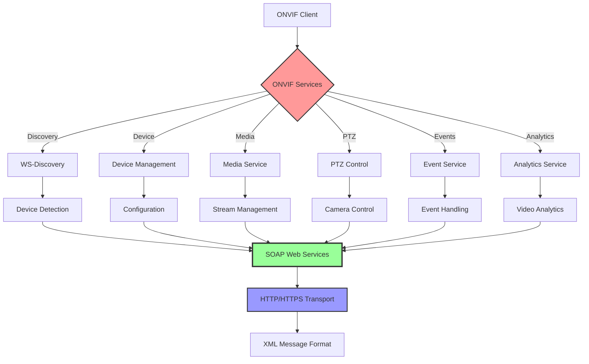

# ONVIF Protocol Integration

**Comprehensive ONVIF (Open Network Video Interface Forum) protocol implementation for interoperability with standard IP cameras and video management systems.**

## Overview

C Pro implements ONVIF standards for seamless integration with third-party cameras, NVRs, and video management systems, providing standardized device discovery, configuration, and streaming capabilities.



## ONVIF Services Implementation

### Device Management Service

**Device Information and Capabilities**:
```bash
# Get device information
curl -X POST "http://192.168.1.100:8080/onvif/device_service" \
     -H "Content-Type: application/soap+xml" \
     -H "SOAPAction: http://www.onvif.org/ver10/device/wsdl/GetDeviceInformation" \
     -d '<?xml version="1.0" encoding="UTF-8"?>
<soap:Envelope xmlns:soap="http://www.w3.org/2003/05/soap-envelope"
               xmlns:tds="http://www.onvif.org/ver10/device/wsdl">
  <soap:Header/>
  <soap:Body>
    <tds:GetDeviceInformation/>
  </soap:Body>
</soap:Envelope>'

# Response format
<?xml version="1.0" encoding="UTF-8"?>
<soap:Envelope xmlns:soap="http://www.w3.org/2003/05/soap-envelope">
  <soap:Body>
    <tds:GetDeviceInformationResponse>
      <tds:Manufacturer>C Pro</tds:Manufacturer>
      <tds:Model>RD-CAM-001</tds:Model>
      <tds:FirmwareVersion>1.0.0</tds:FirmwareVersion>
      <tds:SerialNumber>RD001234567890</tds:SerialNumber>
      <tds:HardwareId>RD-HW-V1</tds:HardwareId>
    </tds:GetDeviceInformationResponse>
  </soap:Body>
</soap:Envelope>
```

**Service Capabilities**:
```bash
# Get service capabilities
curl -X POST "http://192.168.1.100:8080/onvif/device_service" \
     -H "Content-Type: application/soap+xml" \
     -H "SOAPAction: http://www.onvif.org/ver10/device/wsdl/GetCapabilities" \
     -d '<?xml version="1.0" encoding="UTF-8"?>
<soap:Envelope xmlns:soap="http://www.w3.org/2003/05/soap-envelope"
               xmlns:tds="http://www.onvif.org/ver10/device/wsdl">
  <soap:Header/>
  <soap:Body>
    <tds:GetCapabilities>
      <tds:Category>All</tds:Category>
    </tds:GetCapabilities>
  </soap:Body>
</soap:Envelope>'
```

**Network Configuration**:
```bash
# Get network interfaces
curl -X POST "http://192.168.1.100:8080/onvif/device_service" \
     -H "Content-Type: application/soap+xml" \
     -H "SOAPAction: http://www.onvif.org/ver10/device/wsdl/GetNetworkInterfaces" \
     -d '<?xml version="1.0" encoding="UTF-8"?>
<soap:Envelope xmlns:soap="http://www.w3.org/2003/05/soap-envelope"
               xmlns:tds="http://www.onvif.org/ver10/device/wsdl">
  <soap:Header/>
  <soap:Body>
    <tds:GetNetworkInterfaces/>
  </soap:Body>
</soap:Envelope>'

# Set network interface configuration
curl -X POST "http://192.168.1.100:8080/onvif/device_service" \
     -H "Content-Type: application/soap+xml" \
     -H "SOAPAction: http://www.onvif.org/ver10/device/wsdl/SetNetworkInterfaces" \
     -d '<?xml version="1.0" encoding="UTF-8"?>
<soap:Envelope xmlns:soap="http://www.w3.org/2003/05/soap-envelope"
               xmlns:tds="http://www.onvif.org/ver10/device/wsdl"
               xmlns:tt="http://www.onvif.org/ver10/schema">
  <soap:Header/>
  <soap:Body>
    <tds:SetNetworkInterfaces>
      <tds:InterfaceToken>eth0</tds:InterfaceToken>
      <tds:NetworkInterface>
        <tt:Enabled>true</tt:Enabled>
        <tt:IPv4>
          <tt:Enabled>true</tt:Enabled>
          <tt:Config>
            <tt:Manual>
              <tt:Address>192.168.1.100</tt:Address>
              <tt:PrefixLength>24</tt:PrefixLength>
            </tt:Manual>
            <tt:DHCP>false</tt:DHCP>
          </tt:Config>
        </tt:IPv4>
      </tds:NetworkInterface>
    </tds:SetNetworkInterfaces>
  </soap:Body>
</soap:Envelope>'
```

### Media Service

**Media Profiles Management**:
```bash
# Get media profiles
curl -X POST "http://192.168.1.100:8080/onvif/media_service" \
     -H "Content-Type: application/soap+xml" \
     -H "SOAPAction: http://www.onvif.org/ver10/media/wsdl/GetProfiles" \
     -d '<?xml version="1.0" encoding="UTF-8"?>
<soap:Envelope xmlns:soap="http://www.w3.org/2003/05/soap-envelope"
               xmlns:trt="http://www.onvif.org/ver10/media/wsdl">
  <soap:Header/>
  <soap:Body>
    <trt:GetProfiles/>
  </soap:Body>
</soap:Envelope>'

# Response includes available profiles
<?xml version="1.0" encoding="UTF-8"?>
<soap:Envelope xmlns:soap="http://www.w3.org/2003/05/soap-envelope">
  <soap:Body>
    <trt:GetProfilesResponse>
      <trt:Profiles token="Profile_1" fixed="true">
        <tt:Name>Main Stream</tt:Name>
        <tt:VideoSourceConfiguration token="VideoSource_1">
          <tt:Name>Primary Video Source</tt:Name>
          <tt:UseCount>1</tt:UseCount>
          <tt:SourceToken>VideoSource_1</tt:SourceToken>
          <tt:Bounds x="0" y="0" width="1920" height="1080"/>
        </tt:VideoSourceConfiguration>
        <tt:VideoEncoderConfiguration token="VideoEncoder_1">
          <tt:Name>H264 Encoder</tt:Name>
          <tt:UseCount>1</tt:UseCount>
          <tt:Encoding>H264</tt:Encoding>
          <tt:Resolution>
            <tt:Width>1920</tt:Width>
            <tt:Height>1080</tt:Height>
          </tt:Resolution>
          <tt:Quality>50</tt:Quality>
          <tt:RateControl>
            <tt:FrameRateLimit>30</tt:FrameRateLimit>
            <tt:EncodingInterval>1</tt:EncodingInterval>
            <tt:BitrateLimit>5000</tt:BitrateLimit>
          </tt:RateControl>
        </tt:VideoEncoderConfiguration>
      </trt:Profiles>
    </trt:GetProfilesResponse>
  </soap:Body>
</soap:Envelope>
```

**Stream URI Generation**:
```bash
# Get stream URI
curl -X POST "http://192.168.1.100:8080/onvif/media_service" \
     -H "Content-Type: application/soap+xml" \
     -H "SOAPAction: http://www.onvif.org/ver10/media/wsdl/GetStreamUri" \
     -d '<?xml version="1.0" encoding="UTF-8"?>
<soap:Envelope xmlns:soap="http://www.w3.org/2003/05/soap-envelope"
               xmlns:trt="http://www.onvif.org/ver10/media/wsdl"
               xmlns:tt="http://www.onvif.org/ver10/schema">
  <soap:Header/>
  <soap:Body>
    <trt:GetStreamUri>
      <trt:StreamSetup>
        <tt:Stream>RTP-Unicast</tt:Stream>
        <tt:Transport>
          <tt:Protocol>RTSP</tt:Protocol>
        </tt:Transport>
      </trt:StreamSetup>
      <trt:ProfileToken>Profile_1</trt:ProfileToken>
    </trt:GetStreamUri>
  </soap:Body>
</soap:Envelope>'

# Response with RTSP URI
<?xml version="1.0" encoding="UTF-8"?>
<soap:Envelope xmlns:soap="http://www.w3.org/2003/05/soap-envelope">
  <soap:Body>
    <trt:GetStreamUriResponse>
      <trt:MediaUri>
        <tt:Uri>rtsp://192.168.1.100:554/onvif/profile_1</tt:Uri>
        <tt:InvalidAfterConnect>false</tt:InvalidAfterConnect>
        <tt:InvalidAfterReboot>false</tt:InvalidAfterReboot>
        <tt:Timeout>PT60S</tt:Timeout>
      </trt:MediaUri>
    </trt:GetStreamUriResponse>
  </soap:Body>
</soap:Envelope>
```

**Video Source Configuration**:
```bash
# Get video source configuration
curl -X POST "http://192.168.1.100:8080/onvif/media_service" \
     -H "Content-Type: application/soap+xml" \
     -H "SOAPAction: http://www.onvif.org/ver10/media/wsdl/GetVideoSourceConfiguration" \
     -d '<?xml version="1.0" encoding="UTF-8"?>
<soap:Envelope xmlns:soap="http://www.w3.org/2003/05/soap-envelope"
               xmlns:trt="http://www.onvif.org/ver10/media/wsdl">
  <soap:Header/>
  <soap:Body>
    <trt:GetVideoSourceConfiguration>
      <trt:ConfigurationToken>VideoSource_1</trt:ConfigurationToken>
    </trt:GetVideoSourceConfiguration>
  </soap:Body>
</soap:Envelope>'

# Set video source configuration
curl -X POST "http://192.168.1.100:8080/onvif/media_service" \
     -H "Content-Type: application/soap+xml" \
     -H "SOAPAction: http://www.onvif.org/ver10/media/wsdl/SetVideoSourceConfiguration" \
     -d '<?xml version="1.0" encoding="UTF-8"?>
<soap:Envelope xmlns:soap="http://www.w3.org/2003/05/soap-envelope"
               xmlns:trt="http://www.onvif.org/ver10/media/wsdl"
               xmlns:tt="http://www.onvif.org/ver10/schema">
  <soap:Header/>
  <soap:Body>
    <trt:SetVideoSourceConfiguration>
      <trt:Configuration token="VideoSource_1">
        <tt:Name>Primary Video Source</tt:Name>
        <tt:UseCount>1</tt:UseCount>
        <tt:SourceToken>VideoSource_1</tt:SourceToken>
        <tt:Bounds x="0" y="0" width="1920" height="1080"/>
      </trt:Configuration>
      <trt:ForcePersistence>true</trt:ForcePersistence>
    </trt:SetVideoSourceConfiguration>
  </soap:Body>
</soap:Envelope>'
```

### PTZ Service

**PTZ Capabilities**:
```bash
# Get PTZ configuration
curl -X POST "http://192.168.1.100:8080/onvif/ptz_service" \
     -H "Content-Type: application/soap+xml" \
     -H "SOAPAction: http://www.onvif.org/ver20/ptz/wsdl/GetConfiguration" \
     -d '<?xml version="1.0" encoding="UTF-8"?>
<soap:Envelope xmlns:soap="http://www.w3.org/2003/05/soap-envelope"
               xmlns:tptz="http://www.onvif.org/ver20/ptz/wsdl">
  <soap:Header/>
  <soap:Body>
    <tptz:GetConfiguration>
      <tptz:PTZConfigurationToken>PTZ_1</tptz:PTZConfigurationToken>
    </tptz:GetConfiguration>
  </soap:Body>
</soap:Envelope>'
```

**PTZ Control Commands**:
```bash
# Absolute move
curl -X POST "http://192.168.1.100:8080/onvif/ptz_service" \
     -H "Content-Type: application/soap+xml" \
     -H "SOAPAction: http://www.onvif.org/ver20/ptz/wsdl/AbsoluteMove" \
     -d '<?xml version="1.0" encoding="UTF-8"?>
<soap:Envelope xmlns:soap="http://www.w3.org/2003/05/soap-envelope"
               xmlns:tptz="http://www.onvif.org/ver20/ptz/wsdl"
               xmlns:tt="http://www.onvif.org/ver10/schema">
  <soap:Header/>
  <soap:Body>
    <tptz:AbsoluteMove>
      <tptz:ProfileToken>Profile_1</tptz:ProfileToken>
      <tptz:Position>
        <tt:PanTilt x="0.5" y="0.3" space="http://www.onvif.org/ver10/tptz/PanTiltSpaces/PositionGenericSpace"/>
        <tt:Zoom x="0.8" space="http://www.onvif.org/ver10/tptz/ZoomSpaces/PositionGenericSpace"/>
      </tptz:Position>
      <tptz:Speed>
        <tt:PanTilt x="0.5" y="0.5" space="http://www.onvif.org/ver10/tptz/PanTiltSpaces/GenericSpeedSpace"/>
        <tt:Zoom x="0.5" space="http://www.onvif.org/ver10/tptz/ZoomSpaces/ZoomGenericSpeedSpace"/>
      </tptz:Speed>
    </tptz:AbsoluteMove>
  </soap:Body>
</soap:Envelope>'

# Continuous move
curl -X POST "http://192.168.1.100:8080/onvif/ptz_service" \
     -H "Content-Type: application/soap+xml" \
     -H "SOAPAction: http://www.onvif.org/ver20/ptz/wsdl/ContinuousMove" \
     -d '<?xml version="1.0" encoding="UTF-8"?>
<soap:Envelope xmlns:soap="http://www.w3.org/2003/05/soap-envelope"
               xmlns:tptz="http://www.onvif.org/ver20/ptz/wsdl"
               xmlns:tt="http://www.onvif.org/ver10/schema">
  <soap:Header/>
  <soap:Body>
    <tptz:ContinuousMove>
      <tptz:ProfileToken>Profile_1</tptz:ProfileToken>
      <tptz:Velocity>
        <tt:PanTilt x="0.1" y="0.0" space="http://www.onvif.org/ver10/tptz/PanTiltSpaces/VelocityGenericSpace"/>
        <tt:Zoom x="0.0" space="http://www.onvif.org/ver10/tptz/ZoomSpaces/VelocityGenericSpace"/>
      </tptz:Velocity>
      <tptz:Timeout>PT5S</tptz:Timeout>
    </tptz:ContinuousMove>
  </soap:Body>
</soap:Envelope>'

# Stop PTZ movement
curl -X POST "http://192.168.1.100:8080/onvif/ptz_service" \
     -H "Content-Type: application/soap+xml" \
     -H "SOAPAction: http://www.onvif.org/ver20/ptz/wsdl/Stop" \
     -d '<?xml version="1.0" encoding="UTF-8"?>
<soap:Envelope xmlns:soap="http://www.w3.org/2003/05/soap-envelope"
               xmlns:tptz="http://www.onvif.org/ver20/ptz/wsdl">
  <soap:Header/>
  <soap:Body>
    <tptz:Stop>
      <tptz:ProfileToken>Profile_1</tptz:ProfileToken>
      <tptz:PanTilt>true</tptz:PanTilt>
      <tptz:Zoom>true</tptz:Zoom>
    </tptz:Stop>
  </soap:Body>
</soap:Envelope>'
```

**Preset Management**:
```bash
# Set preset
curl -X POST "http://192.168.1.100:8080/onvif/ptz_service" \
     -H "Content-Type: application/soap+xml" \
     -H "SOAPAction: http://www.onvif.org/ver20/ptz/wsdl/SetPreset" \
     -d '<?xml version="1.0" encoding="UTF-8"?>
<soap:Envelope xmlns:soap="http://www.w3.org/2003/05/soap-envelope"
               xmlns:tptz="http://www.onvif.org/ver20/ptz/wsdl">
  <soap:Header/>
  <soap:Body>
    <tptz:SetPreset>
      <tptz:ProfileToken>Profile_1</tptz:ProfileToken>
      <tptz:PresetName>Home Position</tptz:PresetName>
    </tptz:SetPreset>
  </soap:Body>
</soap:Envelope>'

# Goto preset
curl -X POST "http://192.168.1.100:8080/onvif/ptz_service" \
     -H "Content-Type: application/soap+xml" \
     -H "SOAPAction: http://www.onvif.org/ver20/ptz/wsdl/GotoPreset" \
     -d '<?xml version="1.0" encoding="UTF-8"?>
<soap:Envelope xmlns:soap="http://www.w3.org/2003/05/soap-envelope"
               xmlns:tptz="http://www.onvif.org/ver20/ptz/wsdl">
  <soap:Header/>
  <soap:Body>
    <tptz:GotoPreset>
      <tptz:ProfileToken>Profile_1</tptz:ProfileToken>
      <tptz:PresetToken>1</tptz:PresetToken>
      <tptz:Speed>
        <tt:PanTilt x="0.5" y="0.5" space="http://www.onvif.org/ver10/tptz/PanTiltSpaces/GenericSpeedSpace"/>
        <tt:Zoom x="0.5" space="http://www.onvif.org/ver10/tptz/ZoomSpaces/ZoomGenericSpeedSpace"/>
      </tptz:Speed>
    </tptz:GotoPreset>
  </soap:Body>
</soap:Envelope>'
```

## Device Discovery

### WS-Discovery Implementation

**Discovery Probe**:
```bash
# Send discovery probe (multicast UDP)
echo '<?xml version="1.0" encoding="UTF-8"?>
<soap:Envelope xmlns:soap="http://www.w3.org/2003/05/soap-envelope"
               xmlns:wsa="http://schemas.xmlsoap.org/ws/2004/08/addressing"
               xmlns:wsd="http://schemas.xmlsoap.org/ws/2005/04/discovery"
               xmlns:tdn="http://www.onvif.org/ver10/network/wsdl">
  <soap:Header>
    <wsa:Action>http://schemas.xmlsoap.org/ws/2005/04/discovery/Probe</wsa:Action>
    <wsa:MessageID>urn:uuid:$(uuidgen)</wsa:MessageID>
    <wsa:To>urn:schemas-xmlsoap-org:ws:2005:04:discovery</wsa:To>
  </soap:Header>
  <soap:Body>
    <wsd:Probe>
      <wsd:Types>tdn:NetworkVideoTransmitter</wsd:Types>
    </wsd:Probe>
  </soap:Body>
</soap:Envelope>' | nc -u 239.255.255.250 3702
```

**Discovery Response**:
```xml
<?xml version="1.0" encoding="UTF-8"?>
<soap:Envelope xmlns:soap="http://www.w3.org/2003/05/soap-envelope"
               xmlns:wsa="http://schemas.xmlsoap.org/ws/2004/08/addressing"
               xmlns:wsd="http://schemas.xmlsoap.org/ws/2005/04/discovery"
               xmlns:tdn="http://www.onvif.org/ver10/network/wsdl">
  <soap:Header>
    <wsa:Action>http://schemas.xmlsoap.org/ws/2005/04/discovery/ProbeMatches</wsa:Action>
    <wsa:MessageID>urn:uuid:12345678-1234-1234-1234-123456789012</wsa:MessageID>
    <wsa:RelatesTo>urn:uuid:sender-message-id</wsa:RelatesTo>
    <wsa:To>http://schemas.xmlsoap.org/ws/2004/08/addressing/role/anonymous</wsa:To>
  </soap:Header>
  <soap:Body>
    <wsd:ProbeMatches>
      <wsd:ProbeMatch>
        <wsa:EndpointReference>
          <wsa:Address>urn:uuid:device-12345678-1234-1234-1234-123456789012</wsa:Address>
        </wsa:EndpointReference>
        <wsd:Types>tdn:NetworkVideoTransmitter</wsd:Types>
        <wsd:Scopes>onvif://www.onvif.org/type/Network_Video_Transmitter onvif://www.onvif.org/hardware/RD-CAM-001 onvif://www.onvif.org/name/Cpro_Camera onvif://www.onvif.org/location/Building_A</wsd:Scopes>
        <wsd:XAddrs>http://192.168.1.100:8080/onvif/device_service</wsd:XAddrs>
        <wsd:MetadataVersion>1</wsd:MetadataVersion>
      </wsd:ProbeMatch>
    </wsd:ProbeMatches>
  </soap:Body>
</soap:Envelope>
```

### Discovery Configuration

**ONVIF Discovery Settings**:
```bash
# Configure ONVIF discovery
curl -X PUT "http://192.168.1.100:8080/api/onvif/discovery/config" \
     -H "Authorization: Bearer 1a2B3c4D5e6f7G8h" \
     -H "Content-Type: application/json" \
     -d '{
       "enabled": true,
       "multicast_address": "239.255.255.250",
       "multicast_port": 3702,
       "device_uuid": "12345678-1234-1234-1234-123456789012",
       "device_name": "C Pro Camera",
       "hardware_id": "RD-CAM-001",
       "location": "Building A",
       "scopes": [
         "onvif://www.onvif.org/type/Network_Video_Transmitter",
         "onvif://www.onvif.org/hardware/RD-CAM-001",
         "onvif://www.onvif.org/name/Cpro_Camera",
         "onvif://www.onvif.org/location/Building_A"
       ]
     }'
```

## Event Service

### Event Handling

**Subscribe to Events**:
```bash
# Subscribe to events
curl -X POST "http://192.168.1.100:8080/onvif/event_service" \
     -H "Content-Type: application/soap+xml" \
     -H "SOAPAction: http://www.onvif.org/ver10/events/wsdl/Subscribe" \
     -d '<?xml version="1.0" encoding="UTF-8"?>
<soap:Envelope xmlns:soap="http://www.w3.org/2003/05/soap-envelope"
               xmlns:tev="http://www.onvif.org/ver10/events/wsdl"
               xmlns:wsnt="http://docs.oasis-open.org/wsn/b-2">
  <soap:Header/>
  <soap:Body>
    <tev:Subscribe>
      <tev:ConsumerReference>
        <wsa:Address>http://192.168.1.200:8080/events/callback</wsa:Address>
      </tev:ConsumerReference>
      <tev:Filter>
        <wsnt:TopicExpression Dialect="http://www.onvif.org/ver10/tev/topicExpression/ConcreteSet">
          tns1:VideoSource/MotionAlarm
        </wsnt:TopicExpression>
      </tev:Filter>
      <tev:InitialTerminationTime>PT600S</tev:InitialTerminationTime>
    </tev:Subscribe>
  </soap:Body>
</soap:Envelope>'
```

**Event Notification**:
```xml
<?xml version="1.0" encoding="UTF-8"?>
<soap:Envelope xmlns:soap="http://www.w3.org/2003/05/soap-envelope"
               xmlns:wsnt="http://docs.oasis-open.org/wsn/b-2"
               xmlns:tt="http://www.onvif.org/ver10/schema">
  <soap:Header/>
  <soap:Body>
    <wsnt:Notify>
      <wsnt:NotificationMessage>
        <wsnt:Topic Dialect="http://www.onvif.org/ver10/tev/topicExpression/ConcreteSet">
          tns1:VideoSource/MotionAlarm
        </wsnt:Topic>
        <wsnt:ProducerReference>
          <wsa:Address>urn:uuid:device-12345678-1234-1234-1234-123456789012</wsa:Address>
        </wsnt:ProducerReference>
        <wsnt:Message>
          <tt:Message UtcTime="2025-01-15T10:30:00Z" PropertyOperation="Changed">
            <tt:Source>
              <tt:SimpleItem Name="VideoSourceConfigurationToken" Value="VideoSource_1"/>
            </tt:Source>
            <tt:Data>
              <tt:SimpleItem Name="State" Value="true"/>
            </tt:Data>
          </tt:Message>
        </wsnt:Message>
      </wsnt:NotificationMessage>
    </wsnt:Notify>
  </soap:Body>
</soap:Envelope>
```

### Event Configuration

**Motion Detection Events**:
```bash
# Configure motion detection
curl -X PUT "http://192.168.1.100:8080/api/onvif/events/motion" \
     -H "Authorization: Bearer 1a2B3c4D5e6f7G8h" \
     -H "Content-Type: application/json" \
     -d '{
       "enabled": true,
       "sensitivity": 50,
       "regions": [
         {
           "name": "Region1",
           "polygon": [
             {"x": 0.1, "y": 0.1},
             {"x": 0.9, "y": 0.1},
             {"x": 0.9, "y": 0.9},
             {"x": 0.1, "y": 0.9}
           ],
           "sensitivity": 60
         }
       ],
       "notification": {
         "enabled": true,
         "topic": "tns1:VideoSource/MotionAlarm"
       }
     }'
```

## Analytics Service

### Video Analytics Configuration

**Analytics Capabilities**:
```bash
# Get analytics capabilities
curl -X POST "http://192.168.1.100:8080/onvif/analytics_service" \
     -H "Content-Type: application/soap+xml" \
     -H "SOAPAction: http://www.onvif.org/ver20/analytics/wsdl/GetServiceCapabilities" \
     -d '<?xml version="1.0" encoding="UTF-8"?>
<soap:Envelope xmlns:soap="http://www.w3.org/2003/05/soap-envelope"
               xmlns:tan="http://www.onvif.org/ver20/analytics/wsdl">
  <soap:Header/>
  <soap:Body>
    <tan:GetServiceCapabilities/>
  </soap:Body>
</soap:Envelope>'
```

**Supported Analytics Modules**:
```bash
# Get supported analytics modules
curl -X POST "http://192.168.1.100:8080/onvif/analytics_service" \
     -H "Content-Type: application/soap+xml" \
     -H "SOAPAction: http://www.onvif.org/ver20/analytics/wsdl/GetSupportedAnalyticsModules" \
     -d '<?xml version="1.0" encoding="UTF-8"?>
<soap:Envelope xmlns:soap="http://www.w3.org/2003/05/soap-envelope"
               xmlns:tan="http://www.onvif.org/ver20/analytics/wsdl">
  <soap:Header/>
  <soap:Body>
    <tan:GetSupportedAnalyticsModules>
      <tan:ConfigurationToken>AnalyticsConfig_1</tan:ConfigurationToken>
    </tan:GetSupportedAnalyticsModules>
  </soap:Body>
</soap:Envelope>'
```

## ONVIF Client Integration

### Python ONVIF Client

**Basic Client Implementation**:
```python
#!/usr/bin/env python3
# onvif_client.py

import requests
import xml.etree.ElementTree as ET
from urllib.parse import urlparse
import uuid

class ONVIFClient:
    def __init__(self, host, port=8080, username=None, password=None):
        self.host = host
        self.port = port
        self.username = username
        self.password = password
        self.base_url = f"http://{host}:{port}/onvif"
        
        # Service endpoints
        self.device_service = f"{self.base_url}/device_service"
        self.media_service = f"{self.base_url}/media_service"
        self.ptz_service = f"{self.base_url}/ptz_service"
        self.event_service = f"{self.base_url}/event_service"
        self.analytics_service = f"{self.base_url}/analytics_service"
    
    def _send_soap_request(self, service_url, action, body):
        """Send SOAP request to ONVIF service"""
        envelope = f'''<?xml version="1.0" encoding="UTF-8"?>
<soap:Envelope xmlns:soap="http://www.w3.org/2003/05/soap-envelope">
  <soap:Header/>
  <soap:Body>
    {body}
  </soap:Body>
</soap:Envelope>'''
        
        headers = {
            'Content-Type': 'application/soap+xml',
            'SOAPAction': action
        }
        
        # Add authentication if provided
        auth = None
        if self.username and self.password:
            auth = (self.username, self.password)
        
        response = requests.post(service_url, data=envelope, headers=headers, auth=auth)
        response.raise_for_status()
        
        return ET.fromstring(response.content)
    
    def get_device_information(self):
        """Get device information"""
        action = "http://www.onvif.org/ver10/device/wsdl/GetDeviceInformation"
        body = '<tds:GetDeviceInformation xmlns:tds="http://www.onvif.org/ver10/device/wsdl"/>'
        
        response = self._send_soap_request(self.device_service, action, body)
        
        # Parse response
        ns = {
            'soap': 'http://www.w3.org/2003/05/soap-envelope',
            'tds': 'http://www.onvif.org/ver10/device/wsdl'
        }
        
        info_elem = response.find('.//tds:GetDeviceInformationResponse', ns)
        if info_elem is not None:
            return {
                'manufacturer': info_elem.find('tds:Manufacturer', ns).text,
                'model': info_elem.find('tds:Model', ns).text,
                'firmware_version': info_elem.find('tds:FirmwareVersion', ns).text,
                'serial_number': info_elem.find('tds:SerialNumber', ns).text,
                'hardware_id': info_elem.find('tds:HardwareId', ns).text
            }
        
        return None
    
    def get_profiles(self):
        """Get media profiles"""
        action = "http://www.onvif.org/ver10/media/wsdl/GetProfiles"
        body = '<trt:GetProfiles xmlns:trt="http://www.onvif.org/ver10/media/wsdl"/>'
        
        response = self._send_soap_request(self.media_service, action, body)
        
        # Parse profiles
        ns = {
            'soap': 'http://www.w3.org/2003/05/soap-envelope',
            'trt': 'http://www.onvif.org/ver10/media/wsdl',
            'tt': 'http://www.onvif.org/ver10/schema'
        }
        
        profiles = []
        for profile_elem in response.findall('.//trt:Profiles', ns):
            profile = {
                'token': profile_elem.get('token'),
                'name': profile_elem.find('tt:Name', ns).text,
                'fixed': profile_elem.get('fixed') == 'true'
            }
            
            # Get video encoder configuration
            video_encoder = profile_elem.find('.//tt:VideoEncoderConfiguration', ns)
            if video_encoder is not None:
                resolution = video_encoder.find('tt:Resolution', ns)
                rate_control = video_encoder.find('tt:RateControl', ns)
                
                profile['video_encoder'] = {
                    'token': video_encoder.get('token'),
                    'name': video_encoder.find('tt:Name', ns).text,
                    'encoding': video_encoder.find('tt:Encoding', ns).text,
                    'resolution': {
                        'width': int(resolution.find('tt:Width', ns).text),
                        'height': int(resolution.find('tt:Height', ns).text)
                    },
                    'quality': int(video_encoder.find('tt:Quality', ns).text),
                    'rate_control': {
                        'frame_rate_limit': int(rate_control.find('tt:FrameRateLimit', ns).text),
                        'encoding_interval': int(rate_control.find('tt:EncodingInterval', ns).text),
                        'bitrate_limit': int(rate_control.find('tt:BitrateLimit', ns).text)
                    }
                }
            
            profiles.append(profile)
        
        return profiles
    
    def get_stream_uri(self, profile_token, protocol='RTSP'):
        """Get stream URI for profile"""
        action = "http://www.onvif.org/ver10/media/wsdl/GetStreamUri"
        body = f'''<trt:GetStreamUri xmlns:trt="http://www.onvif.org/ver10/media/wsdl"
                                      xmlns:tt="http://www.onvif.org/ver10/schema">
          <trt:StreamSetup>
            <tt:Stream>RTP-Unicast</tt:Stream>
            <tt:Transport>
              <tt:Protocol>{protocol}</tt:Protocol>
            </tt:Transport>
          </trt:StreamSetup>
          <trt:ProfileToken>{profile_token}</trt:ProfileToken>
        </trt:GetStreamUri>'''
        
        response = self._send_soap_request(self.media_service, action, body)
        
        # Parse URI
        ns = {
            'soap': 'http://www.w3.org/2003/05/soap-envelope',
            'trt': 'http://www.onvif.org/ver10/media/wsdl',
            'tt': 'http://www.onvif.org/ver10/schema'
        }
        
        uri_elem = response.find('.//tt:Uri', ns)
        if uri_elem is not None:
            return uri_elem.text
        
        return None
    
    def ptz_absolute_move(self, profile_token, pan, tilt, zoom, speed=0.5):
        """Perform absolute PTZ move"""
        action = "http://www.onvif.org/ver20/ptz/wsdl/AbsoluteMove"
        body = f'''<tptz:AbsoluteMove xmlns:tptz="http://www.onvif.org/ver20/ptz/wsdl"
                                      xmlns:tt="http://www.onvif.org/ver10/schema">
          <tptz:ProfileToken>{profile_token}</tptz:ProfileToken>
          <tptz:Position>
            <tt:PanTilt x="{pan}" y="{tilt}" space="http://www.onvif.org/ver10/tptz/PanTiltSpaces/PositionGenericSpace"/>
            <tt:Zoom x="{zoom}" space="http://www.onvif.org/ver10/tptz/ZoomSpaces/PositionGenericSpace"/>
          </tptz:Position>
          <tptz:Speed>
            <tt:PanTilt x="{speed}" y="{speed}" space="http://www.onvif.org/ver10/tptz/PanTiltSpaces/GenericSpeedSpace"/>
            <tt:Zoom x="{speed}" space="http://www.onvif.org/ver10/tptz/ZoomSpaces/ZoomGenericSpeedSpace"/>
          </tptz:Speed>
        </tptz:AbsoluteMove>'''
        
        return self._send_soap_request(self.ptz_service, action, body)

# Example usage
if __name__ == "__main__":
    # Create ONVIF client
    client = ONVIFClient("192.168.1.100", 8080)
    
    # Get device information
    device_info = client.get_device_information()
    print("Device Info:", device_info)
    
    # Get media profiles
    profiles = client.get_profiles()
    print("Profiles:", profiles)
    
    # Get stream URI for first profile
    if profiles:
        stream_uri = client.get_stream_uri(profiles[0]['token'])
        print("Stream URI:", stream_uri)
    
    # PTZ control (if supported)
    if profiles:
        client.ptz_absolute_move(profiles[0]['token'], 0.5, 0.3, 0.8)
        print("PTZ move command sent")
```

### JavaScript ONVIF Client

**Web-based ONVIF Client**:
```javascript
// onvif_client.js

class ONVIFClient {
    constructor(host, port = 8080, username = null, password = null) {
        this.host = host;
        this.port = port;
        this.username = username;
        this.password = password;
        this.baseUrl = `http://${host}:${port}/onvif`;
        
        this.services = {
            device: `${this.baseUrl}/device_service`,
            media: `${this.baseUrl}/media_service`,
            ptz: `${this.baseUrl}/ptz_service`,
            event: `${this.baseUrl}/event_service`,
            analytics: `${this.baseUrl}/analytics_service`
        };
    }
    
    async sendSOAPRequest(serviceUrl, action, body) {
        const envelope = `<?xml version="1.0" encoding="UTF-8"?>
<soap:Envelope xmlns:soap="http://www.w3.org/2003/05/soap-envelope">
  <soap:Header/>
  <soap:Body>
    ${body}
  </soap:Body>
</soap:Envelope>`;
        
        const headers = {
            'Content-Type': 'application/soap+xml',
            'SOAPAction': action
        };
        
        // Add authentication if provided
        if (this.username && this.password) {
            const auth = btoa(`${this.username}:${this.password}`);
            headers['Authorization'] = `Basic ${auth}`;
        }
        
        const response = await fetch(serviceUrl, {
            method: 'POST',
            headers: headers,
            body: envelope
        });
        
        if (!response.ok) {
            throw new Error(`HTTP error! status: ${response.status}`);
        }
        
        const responseText = await response.text();
        const parser = new DOMParser();
        return parser.parseFromString(responseText, 'text/xml');
    }
    
    async getDeviceInformation() {
        const action = "http://www.onvif.org/ver10/device/wsdl/GetDeviceInformation";
        const body = '<tds:GetDeviceInformation xmlns:tds="http://www.onvif.org/ver10/device/wsdl"/>';
        
        const response = await this.sendSOAPRequest(this.services.device, action, body);
        
        const infoElement = response.querySelector('GetDeviceInformationResponse');
        if (infoElement) {
            return {
                manufacturer: infoElement.querySelector('Manufacturer')?.textContent,
                model: infoElement.querySelector('Model')?.textContent,
                firmwareVersion: infoElement.querySelector('FirmwareVersion')?.textContent,
                serialNumber: infoElement.querySelector('SerialNumber')?.textContent,
                hardwareId: infoElement.querySelector('HardwareId')?.textContent
            };
        }
        
        return null;
    }
    
    async getProfiles() {
        const action = "http://www.onvif.org/ver10/media/wsdl/GetProfiles";
        const body = '<trt:GetProfiles xmlns:trt="http://www.onvif.org/ver10/media/wsdl"/>';
        
        const response = await this.sendSOAPRequest(this.services.media, action, body);
        
        const profiles = [];
        const profileElements = response.querySelectorAll('Profiles');
        
        profileElements.forEach(profileElem => {
            const profile = {
                token: profileElem.getAttribute('token'),
                name: profileElem.querySelector('Name')?.textContent,
                fixed: profileElem.getAttribute('fixed') === 'true'
            };
            
            const videoEncoder = profileElem.querySelector('VideoEncoderConfiguration');
            if (videoEncoder) {
                const resolution = videoEncoder.querySelector('Resolution');
                const rateControl = videoEncoder.querySelector('RateControl');
                
                profile.videoEncoder = {
                    token: videoEncoder.getAttribute('token'),
                    name: videoEncoder.querySelector('Name')?.textContent,
                    encoding: videoEncoder.querySelector('Encoding')?.textContent,
                    resolution: {
                        width: parseInt(resolution?.querySelector('Width')?.textContent || '0'),
                        height: parseInt(resolution?.querySelector('Height')?.textContent || '0')
                    },
                    quality: parseInt(videoEncoder.querySelector('Quality')?.textContent || '0'),
                    rateControl: {
                        frameRateLimit: parseInt(rateControl?.querySelector('FrameRateLimit')?.textContent || '0'),
                        encodingInterval: parseInt(rateControl?.querySelector('EncodingInterval')?.textContent || '0'),
                        bitrateLimit: parseInt(rateControl?.querySelector('BitrateLimit')?.textContent || '0')
                    }
                };
            }
            
            profiles.push(profile);
        });
        
        return profiles;
    }
    
    async getStreamUri(profileToken, protocol = 'RTSP') {
        const action = "http://www.onvif.org/ver10/media/wsdl/GetStreamUri";
        const body = `<trt:GetStreamUri xmlns:trt="http://www.onvif.org/ver10/media/wsdl"
                                        xmlns:tt="http://www.onvif.org/ver10/schema">
          <trt:StreamSetup>
            <tt:Stream>RTP-Unicast</tt:Stream>
            <tt:Transport>
              <tt:Protocol>${protocol}</tt:Protocol>
            </tt:Transport>
          </trt:StreamSetup>
          <trt:ProfileToken>${profileToken}</trt:ProfileToken>
        </trt:GetStreamUri>`;
        
        const response = await this.sendSOAPRequest(this.services.media, action, body);
        
        const uriElement = response.querySelector('Uri');
        return uriElement?.textContent || null;
    }
    
    async ptzAbsoluteMove(profileToken, pan, tilt, zoom, speed = 0.5) {
        const action = "http://www.onvif.org/ver20/ptz/wsdl/AbsoluteMove";
        const body = `<tptz:AbsoluteMove xmlns:tptz="http://www.onvif.org/ver20/ptz/wsdl"
                                        xmlns:tt="http://www.onvif.org/ver10/schema">
          <tptz:ProfileToken>${profileToken}</tptz:ProfileToken>
          <tptz:Position>
            <tt:PanTilt x="${pan}" y="${tilt}" space="http://www.onvif.org/ver10/tptz/PanTiltSpaces/PositionGenericSpace"/>
            <tt:Zoom x="${zoom}" space="http://www.onvif.org/ver10/tptz/ZoomSpaces/PositionGenericSpace"/>
          </tptz:Position>
          <tptz:Speed>
            <tt:PanTilt x="${speed}" y="${speed}" space="http://www.onvif.org/ver10/tptz/PanTiltSpaces/GenericSpeedSpace"/>
            <tt:Zoom x="${speed}" space="http://www.onvif.org/ver10/tptz/ZoomSpaces/ZoomGenericSpeedSpace"/>
          </tptz:Speed>
        </tptz:AbsoluteMove>`;
        
        return await this.sendSOAPRequest(this.services.ptz, action, body);
    }
}

// Example usage
async function demonstrateONVIF() {
    const client = new ONVIFClient('192.168.1.100', 8080);
    
    try {
        // Get device information
        const deviceInfo = await client.getDeviceInformation();
        console.log('Device Info:', deviceInfo);
        
        // Get media profiles
        const profiles = await client.getProfiles();
        console.log('Profiles:', profiles);
        
        // Get stream URI
        if (profiles.length > 0) {
            const streamUri = await client.getStreamUri(profiles[0].token);
            console.log('Stream URI:', streamUri);
        }
        
    } catch (error) {
        console.error('ONVIF Error:', error);
    }
}
```

## Configuration and Security

### ONVIF Authentication

**WS-Username Token Authentication**:
```xml
<soap:Header>
  <wsse:Security xmlns:wsse="http://docs.oasis-open.org/wss/2004/01/oasis-200401-wss-wssecurity-secext-1.0.xsd">
    <wsse:UsernameToken>
      <wsse:Username>admin</wsse:Username>
      <wsse:Password Type="http://docs.oasis-open.org/wss/2004/01/oasis-200401-wss-username-token-profile-1.0#PasswordDigest">base64encodeddigest</wsse:Password>
      <wsse:Nonce>base64encodednonce</wsse:Nonce>
      <wsu:Created xmlns:wsu="http://docs.oasis-open.org/wss/2004/01/oasis-200401-wss-wssecurity-utility-1.0.xsd">2025-01-15T10:30:00Z</wsu:Created>
    </wsse:UsernameToken>
  </wsse:Security>
</soap:Header>
```

**ONVIF Security Configuration**:
```bash
# Configure ONVIF security
curl -X PUT "http://192.168.1.100:8080/api/onvif/security" \
     -H "Authorization: Bearer 1a2B3c4D5e6f7G8h" \
     -H "Content-Type: application/json" \
     -d '{
       "authentication": {
         "enabled": true,
         "methods": ["digest", "basic"],
         "users": [
           {
             "username": "admin",
             "password": "admin123",
             "role": "administrator"
           },
           {
             "username": "operator",
             "password": "operator123", 
             "role": "operator"
           }
         ]
       },
       "https": {
         "enabled": true,
         "port": 8443,
         "certificate": "/etc/rotordream/ssl/server.crt",
         "private_key": "/etc/rotordream/ssl/server.key"
       }
     }'
```

## Testing and Validation

### ONVIF Compliance Testing

**Device Test Tool (DUT)**:
```bash
# Test ONVIF compliance using ONVIF Device Test Tool
# This would typically be done with the official ONVIF DUT

# Test device discovery
python3 -c "
import socket
import time

# Send WS-Discovery probe
sock = socket.socket(socket.AF_INET, socket.SOCK_DGRAM)
sock.setsockopt(socket.SOL_SOCKET, socket.SO_BROADCAST, 1)
sock.settimeout(5)

probe_msg = '''<?xml version=\"1.0\" encoding=\"UTF-8\"?>
<soap:Envelope xmlns:soap=\"http://www.w3.org/2003/05/soap-envelope\">
  <soap:Header>
    <wsa:Action xmlns:wsa=\"http://schemas.xmlsoap.org/ws/2004/08/addressing\">http://schemas.xmlsoap.org/ws/2005/04/discovery/Probe</wsa:Action>
    <wsa:MessageID xmlns:wsa=\"http://schemas.xmlsoap.org/ws/2004/08/addressing\">urn:uuid:test-probe-001</wsa:MessageID>
    <wsa:To xmlns:wsa=\"http://schemas.xmlsoap.org/ws/2004/08/addressing\">urn:schemas-xmlsoap-org:ws:2005:04:discovery</wsa:To>
  </soap:Header>
  <soap:Body>
    <wsd:Probe xmlns:wsd=\"http://schemas.xmlsoap.org/ws/2005/04/discovery\">
      <wsd:Types xmlns:tdn=\"http://www.onvif.org/ver10/network/wsdl\">tdn:NetworkVideoTransmitter</wsd:Types>
    </wsd:Probe>
  </soap:Body>
</soap:Envelope>'''

sock.sendto(probe_msg.encode(), ('239.255.255.250', 3702))

try:
    response, addr = sock.recvfrom(4096)
    print(f'Discovery response from {addr}: {response.decode()}')
except socket.timeout:
    print('No discovery response received')

sock.close()
"
```

**Profile S/G/T Validation**:
```bash
# Test Profile S compliance (streaming)
curl -X POST "http://192.168.1.100:8080/onvif/media_service" \
     -H "Content-Type: application/soap+xml" \
     -d '<?xml version="1.0" encoding="UTF-8"?>
<soap:Envelope xmlns:soap="http://www.w3.org/2003/05/soap-envelope"
               xmlns:trt="http://www.onvif.org/ver10/media/wsdl">
  <soap:Header/>
  <soap:Body>
    <trt:GetVideoEncoderConfigurations/>
  </soap:Body>
</soap:Envelope>'

# Validate required capabilities are present
# - GetProfiles
# - GetStreamUri
# - GetVideoEncoderConfigurations
# - GetVideoSourceConfigurations
```

## Related Documentation

- [API Reference](../api/http-api.md) - REST API integration alongside ONVIF
- [Streaming](../api/rtsp-streaming.md) - RTSP streaming implementation
- [Network Configuration](../configuration/network.md) - Network setup for ONVIF
- [Security](../configuration/authentication.md) - Authentication and authorization

---

*ONVIF integration documentation following ONVIF Profile S/G/T specifications and industry standards*
