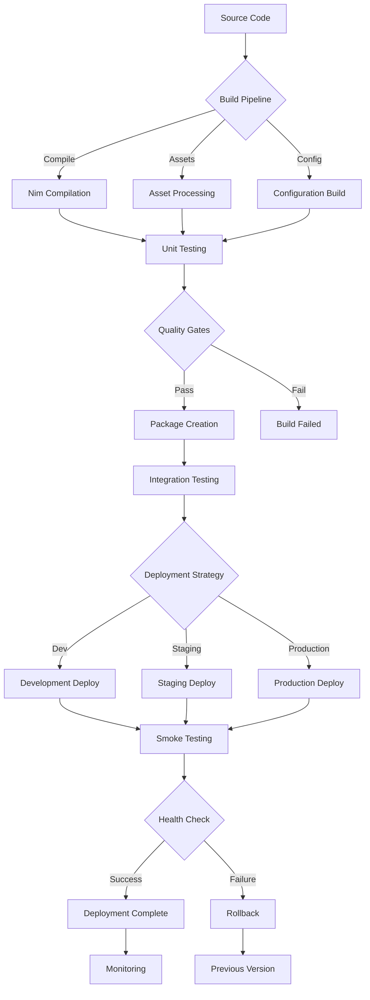

# Build and Deployment Guide

**Comprehensive guide for building, testing, and deploying C Pro camera system.**

## Overview

This guide covers the complete build and deployment process, from source compilation to production deployment, including continuous integration and deployment strategies.



## Development Environment Setup

### Prerequisites

**System Requirements**:
```bash
# Ubuntu/Debian
sudo apt update
sudo apt install -y build-essential git curl wget
sudo apt install -y libssl-dev libusb-1.0-0-dev
sudo apt install -y pkg-config cmake ninja-build

# Install Nim compiler
curl https://nim-lang.org/choosenim/init.sh -sSf | sh
echo 'export PATH=$HOME/.nimble/bin:$PATH' >> ~/.bashrc
source ~/.bashrc

# Verify installation
nim --version
nimble --version
```

**Dependencies Installation**:
```bash
# Install system dependencies
sudo apt install -y \
    libv4l-dev \
    libgstreamer1.0-dev \
    libgstreamer-plugins-base1.0-dev \
    libavformat-dev \
    libavcodec-dev \
    libavutil-dev

# Install Nim packages
nimble install -y httpbeast
nimble install -y ws
nimble install -y json
nimble install -y yaml
nimble install -y crunchy
```

### Build Configuration

**Project Structure**:
```
rotordream/
├── src/                    # Source code
├── tests/                  # Test files
├── config/                 # Configuration files
├── assets/                 # Static assets
├── tools/                  # Build tools
├── docs/                   # Documentation
├── rotordream.nimble       # Package definition
├── config.nims             # Nim configuration
├── nim.cfg                 # Compiler settings
└── Makefile               # Build automation
```

**Build Configuration Files**:
```nim
# config.nims
when defined(release):
  --opt:speed
  --define:release
  --passC:"-march=native"
  --passC:"-mtune=native"
  --gc:arc

when defined(debug):
  --debuginfo
  --lineDir:on
  --stackTrace:on
  --linetrace:on

# Enable threading
--threads:on
--tlsEmulation:off

# Link libraries
--passL:"-lv4l2"
--passL:"-lgstreamer-1.0"
--passL:"-lgobject-2.0"
--passL:"-lglib-2.0"
```

## Build Process

### Local Development Build

**Quick Development Build**:
```bash
# Clone repository
git clone https://github.com/company/rotordream.git
cd rotordream

# Build for development
nimble build

# Run with development configuration
./rotordream --config config/development.ini

# Build with debug information
nim c -d:debug --debuginfo --lineDir:on src/rotordream.nim
```

**Development Tasks**:
```bash
# Run tests
nimble test

# Run specific test
nim c -r tests/test_camera.nim

# Check code formatting
nim fmt src/

# Run linter
nim check src/rotordream.nim

# Generate documentation
nim doc --project --out:docs/api src/rotordream.nim
```

### Production Build

**Optimized Build**:
```bash
# Build for production with optimizations
nim c -d:release --opt:speed --app:console --cpu:amd64 \
    --os:linux --gc:arc --threads:on \
    --passC:"-march=native -mtune=native -O3" \
    --passL:"-s -static-libgcc" \
    --out:bin/rotordream src/rotordream.nim

# Cross-compile for ARM
nim c -d:release --opt:speed --cpu:arm64 --os:linux \
    --passC:"-march=armv8-a -mtune=cortex-a72" \
    --out:bin/rotordream-arm64 src/rotordream.nim

# Build with specific features
nim c -d:release -d:ssl -d:camera_v4l2 -d:streaming_gst \
    --out:bin/rotordream-full src/rotordream.nim
```

**Build Scripts**:
```bash
#!/bin/bash
# tools/build.sh

set -e

BUILD_TYPE=${1:-release}
TARGET_ARCH=${2:-x86_64}
OUTPUT_DIR="build/${TARGET_ARCH}"

echo "Building C Pro (${BUILD_TYPE}) for ${TARGET_ARCH}"

# Create output directory
mkdir -p ${OUTPUT_DIR}

# Build flags
FLAGS=""
case ${BUILD_TYPE} in
    debug)
        FLAGS="-d:debug --debuginfo --lineDir:on"
        ;;
    release)
        FLAGS="-d:release --opt:speed"
        ;;
    *)
        echo "Unknown build type: ${BUILD_TYPE}"
        exit 1
        ;;
esac

# Architecture-specific flags
case ${TARGET_ARCH} in
    x86_64)
        FLAGS="${FLAGS} --cpu:amd64 --passC:'-march=native -mtune=native'"
        ;;
    arm64)
        FLAGS="${FLAGS} --cpu:arm64 --passC:'-march=armv8-a'"
        ;;
    armhf)
        FLAGS="${FLAGS} --cpu:arm --passC:'-march=armv7-a'"
        ;;
esac

# Compile
nim c ${FLAGS} --out:${OUTPUT_DIR}/rotordream src/rotordream.nim

# Copy assets
cp -r assets ${OUTPUT_DIR}/
cp -r config ${OUTPUT_DIR}/

echo "Build complete: ${OUTPUT_DIR}/rotordream"
```

## Testing

### Unit Testing

**Test Structure**:
```nim
# tests/test_camera.nim
import unittest, asynctest
import ../src/camera

suite "Camera Tests":
  setup:
    discard

  teardown:
    discard

  test "camera initialization":
    let camera = newCamera()
    check camera != nil

  test "camera capture":
    let camera = newCamera()
    camera.initialize()
    let frame = await camera.captureFrame()
    check frame.data.len > 0

  test "camera settings":
    let camera = newCamera()
    camera.setResolution(1920, 1080)
    let (width, height) = camera.getResolution()
    check width == 1920
    check height == 1080
```

**Running Tests**:
```bash
# Run all tests
nimble test

# Run specific test suite
nim c -r tests/test_camera.nim

# Run tests with coverage
nim c --passC:"-fprofile-arcs -ftest-coverage" \
    --passL:"-lgcov" -r tests/test_camera.nim

# Generate coverage report
gcov tests/test_camera.nim
```

### Integration Testing

**Integration Test Setup**:
```bash
#!/bin/bash
# tests/integration/run_tests.sh

# Start test environment
docker-compose -f tests/docker-compose.test.yml up -d

# Wait for services
sleep 10

# Run API tests
cd tests/integration
python test_api.py
python test_streaming.py
python test_recording.py

# Cleanup
docker-compose -f tests/docker-compose.test.yml down
```

**API Integration Tests**:
```python
# tests/integration/test_api.py
import requests
import time
import unittest

class APIIntegrationTest(unittest.TestCase):
    BASE_URL = "http://localhost:8080/api"
    
    def setUp(self):
        # Wait for service to be ready
        timeout = 30
        while timeout > 0:
            try:
                response = requests.get(f"{self.BASE_URL}/status")
                if response.status_code == 200:
                    break
            except requests.ConnectionError:
                pass
            time.sleep(1)
            timeout -= 1
        
        if timeout == 0:
            self.fail("Service did not start in time")
    
    def test_system_status(self):
        response = requests.get(f"{self.BASE_URL}/status")
        self.assertEqual(response.status_code, 200)
        data = response.json()
        self.assertIn("status", data)
    
    def test_camera_info(self):
        response = requests.get(f"{self.BASE_URL}/camera/info")
        self.assertEqual(response.status_code, 200)
        data = response.json()
        self.assertIn("camera", data)
    
    def test_streaming_endpoints(self):
        response = requests.get(f"{self.BASE_URL}/streaming/endpoints")
        self.assertEqual(response.status_code, 200)
        data = response.json()
        self.assertIn("rtsp_url", data)

if __name__ == "__main__":
    unittest.main()
```

### Performance Testing

**Load Testing**:
```bash
#!/bin/bash
# tests/performance/load_test.sh

# API load test
echo "Starting API load test..."
ab -n 1000 -c 10 http://localhost:8080/api/status

# Streaming load test
echo "Starting streaming load test..."
for i in {1..10}; do
    ffmpeg -f lavfi -i testsrc -t 30 -f rtsp rtsp://localhost:554/test_$i &
done
wait

# Memory usage test
echo "Starting memory usage test..."
valgrind --tool=memcheck --leak-check=full \
    ./bin/rotordream --config tests/test.ini &
PID=$!
sleep 60
kill $PID
```

## Packaging

### Debian Package

**Package Structure**:
```
rotordream_1.0.0/
├── DEBIAN/
│   ├── control
│   ├── postinst
│   ├── prerm
│   └── postrm
├── usr/
│   ├── bin/
│   │   └── rotordream
│   ├── lib/
│   │   └── rotordream/
│   └── share/
│       ├── doc/rotordream/
│       └── man/man1/
├── etc/
│   ├── rotordream/
│   │   ├── config.ini
│   │   └── logging.conf
│   └── systemd/system/
│       └── rotordream.service
└── var/
    └── lib/rotordream/
```

**Control File**:
```
# DEBIAN/control
Package: rotordream
Version: 1.0.0
Section: video
Priority: optional
Architecture: amd64
Depends: libv4l-0, libgstreamer1.0-0, libssl1.1
Maintainer: Rotoclear Team <support@rotordream.com>
Description: Professional camera management system
 C Pro provides comprehensive camera control, streaming,
 and recording capabilities for professional applications.
```

**Build Package**:
```bash
#!/bin/bash
# tools/build_deb.sh

VERSION="1.0.0"
ARCH="amd64"
PACKAGE_NAME="rotordream_${VERSION}_${ARCH}"

# Create package directory structure
mkdir -p ${PACKAGE_NAME}/{DEBIAN,usr/bin,usr/lib/rotordream,etc/rotordream,etc/systemd/system}

# Copy binary
cp bin/rotordream ${PACKAGE_NAME}/usr/bin/

# Copy configuration
cp config/*.ini ${PACKAGE_NAME}/etc/rotordream/
cp config/rotordream.service ${PACKAGE_NAME}/etc/systemd/system/

# Copy assets
cp -r assets ${PACKAGE_NAME}/usr/lib/rotordream/

# Create control file
cat > ${PACKAGE_NAME}/DEBIAN/control << EOF
Package: rotordream
Version: ${VERSION}
Section: video
Priority: optional
Architecture: ${ARCH}
Depends: libv4l-0, libgstreamer1.0-0, libssl1.1
Maintainer: Rotoclear Team <support@rotordream.com>
Description: Professional camera management system
EOF

# Create postinstall script
cat > ${PACKAGE_NAME}/DEBIAN/postinst << 'EOF'
#!/bin/bash
systemctl daemon-reload
systemctl enable rotordream
groupadd -f rotordream
usermod -a -G video rotordream
chown -R rotordream:rotordream /var/lib/rotordream
EOF

chmod +x ${PACKAGE_NAME}/DEBIAN/postinst

# Build package
dpkg-deb --build ${PACKAGE_NAME}

echo "Package created: ${PACKAGE_NAME}.deb"
```

### Docker Image

**Dockerfile**:
```dockerfile
# Multi-stage build
FROM ubuntu:22.04 AS builder

# Install build dependencies
RUN apt-get update && apt-get install -y \
    build-essential \
    curl \
    git \
    libssl-dev \
    libv4l-dev \
    libgstreamer1.0-dev \
    pkg-config

# Install Nim
RUN curl https://nim-lang.org/choosenim/init.sh -sSf | sh
ENV PATH="/root/.nimble/bin:$PATH"

# Copy source
WORKDIR /build
COPY . .

# Build application
RUN nimble build -d:release --opt:speed

# Runtime image
FROM ubuntu:22.04

# Install runtime dependencies
RUN apt-get update && apt-get install -y \
    libv4l-0 \
    libgstreamer1.0-0 \
    libgstreamer-plugins-base1.0-0 \
    libssl3 \
    ca-certificates \
    && rm -rf /var/lib/apt/lists/*

# Create user
RUN groupadd -r rotordream && useradd -r -g rotordream rotordream

# Copy application
COPY --from=builder /build/rotordream /usr/local/bin/
COPY --from=builder /build/config /etc/rotordream/
COPY --from=builder /build/assets /usr/share/rotordream/

# Create directories
RUN mkdir -p /var/lib/rotordream /var/log/rotordream
RUN chown -R rotordream:rotordream /var/lib/rotordream /var/log/rotordream

# Expose ports
EXPOSE 8080 8081 554

# Health check
HEALTHCHECK --interval=30s --timeout=3s --start-period=5s --retries=3 \
    CMD curl -f http://localhost:8080/api/status || exit 1

USER rotordream
WORKDIR /var/lib/rotordream

CMD ["/usr/local/bin/rotordream", "--config", "/etc/rotordream/config.ini"]
```

**Build Docker Image**:
```bash
#!/bin/bash
# tools/build_docker.sh

VERSION=${1:-latest}
REGISTRY=${2:-localhost:5000}

echo "Building Docker image: ${REGISTRY}/rotordream:${VERSION}"

# Build image
docker build -t ${REGISTRY}/rotordream:${VERSION} .

# Tag as latest if version specified
if [ "$VERSION" != "latest" ]; then
    docker tag ${REGISTRY}/rotordream:${VERSION} ${REGISTRY}/rotordream:latest
fi

# Push to registry
if [ "$REGISTRY" != "localhost:5000" ]; then
    docker push ${REGISTRY}/rotordream:${VERSION}
    if [ "$VERSION" != "latest" ]; then
        docker push ${REGISTRY}/rotordream:latest
    fi
fi

echo "Docker image built and pushed successfully"
```

## Deployment

### Standalone Deployment

**Installation Script**:
```bash
#!/bin/bash
# tools/install.sh

set -e

VERSION="1.0.0"
INSTALL_DIR="/opt/rotordream"
CONFIG_DIR="/etc/rotordream"
DATA_DIR="/var/lib/rotordream"
LOG_DIR="/var/log/rotordream"

echo "Installing C Pro ${VERSION}..."

# Create directories
sudo mkdir -p ${INSTALL_DIR} ${CONFIG_DIR} ${DATA_DIR} ${LOG_DIR}

# Create user
sudo groupadd -f rotordream
sudo useradd -r -g rotordream -d ${DATA_DIR} -s /bin/false rotordream || true

# Copy files
sudo cp bin/rotordream ${INSTALL_DIR}/
sudo cp -r assets ${INSTALL_DIR}/
sudo cp config/*.ini ${CONFIG_DIR}/
sudo cp config/rotordream.service /etc/systemd/system/

# Set permissions
sudo chown -R rotordream:rotordream ${DATA_DIR} ${LOG_DIR}
sudo chmod +x ${INSTALL_DIR}/rotordream

# Enable and start service
sudo systemctl daemon-reload
sudo systemctl enable rotordream
sudo systemctl start rotordream

echo "Installation complete!"
echo "Service status: $(sudo systemctl is-active rotordream)"
echo "Configuration: ${CONFIG_DIR}/config.ini"
echo "Logs: ${LOG_DIR}/"
```

**Systemd Service**:
```ini
# /etc/systemd/system/rotordream.service
[Unit]
Description=C Pro Camera System
After=network.target
Wants=network-online.target

[Service]
Type=simple
User=rotordream
Group=rotordream
WorkingDirectory=/var/lib/rotordream
ExecStart=/opt/rotordream/rotordream --config /etc/rotordream/config.ini
Restart=always
RestartSec=10
StandardOutput=journal
StandardError=journal
SyslogIdentifier=rotordream

# Resource limits
LimitNOFILE=65536
MemoryMax=2G
CPUQuota=200%

# Security
NoNewPrivileges=true
ProtectSystem=strict
ProtectHome=true
ReadWritePaths=/var/lib/rotordream /var/log/rotordream /tmp

[Install]
WantedBy=multi-user.target
```

### Container Deployment

**Docker Compose**:
```yaml
# docker-compose.yml
version: '3.8'

services:
  rotordream:
    image: rotordream:latest
    container_name: rotordream
    restart: unless-stopped
    
    ports:
      - "8080:8080"   # HTTP API
      - "8081:8081"   # WebSocket
      - "554:554"     # RTSP
    
    volumes:
      - rotordream_data:/var/lib/rotordream
      - rotordream_logs:/var/log/rotordream
      - ./config:/etc/rotordream:ro
      - /dev/video0:/dev/video0  # Camera device
    
    devices:
      - /dev/video0:/dev/video0
    
    environment:
      - ROTORDREAM_LOG_LEVEL=info
      - ROTORDREAM_CONFIG=/etc/rotordream/config.ini
    
    healthcheck:
      test: ["CMD", "curl", "-f", "http://localhost:8080/api/status"]
      interval: 30s
      timeout: 10s
      retries: 3
      start_period: 40s
    
    networks:
      - rotordream_net

  nginx:
    image: nginx:alpine
    container_name: rotordream_proxy
    restart: unless-stopped
    
    ports:
      - "80:80"
      - "443:443"
    
    volumes:
      - ./nginx.conf:/etc/nginx/nginx.conf:ro
      - ./ssl:/etc/nginx/ssl:ro
    
    depends_on:
      - rotordream
    
    networks:
      - rotordream_net

volumes:
  rotordream_data:
  rotordream_logs:

networks:
  rotordream_net:
    driver: bridge
```

**Kubernetes Deployment**:
```yaml
# k8s/deployment.yaml
apiVersion: apps/v1
kind: Deployment
metadata:
  name: rotordream
  labels:
    app: rotordream
spec:
  replicas: 1
  selector:
    matchLabels:
      app: rotordream
  template:
    metadata:
      labels:
        app: rotordream
    spec:
      containers:
      - name: rotordream
        image: rotordream:1.0.0
        ports:
        - containerPort: 8080
        - containerPort: 8081
        - containerPort: 554
        
        env:
        - name: ROTORDREAM_CONFIG
          value: "/etc/rotordream/config.ini"
        
        volumeMounts:
        - name: config
          mountPath: /etc/rotordream
          readOnly: true
        - name: data
          mountPath: /var/lib/rotordream
        - name: logs
          mountPath: /var/log/rotordream
        
        resources:
          requests:
            memory: "512Mi"
            cpu: "500m"
          limits:
            memory: "2Gi"
            cpu: "2000m"
        
        livenessProbe:
          httpGet:
            path: /api/status
            port: 8080
          initialDelaySeconds: 30
          periodSeconds: 30
        
        readinessProbe:
          httpGet:
            path: /api/ready
            port: 8080
          initialDelaySeconds: 5
          periodSeconds: 5
      
      volumes:
      - name: config
        configMap:
          name: rotordream-config
      - name: data
        persistentVolumeClaim:
          claimName: rotordream-data
      - name: logs
        persistentVolumeClaim:
          claimName: rotordream-logs

---
apiVersion: v1
kind: Service
metadata:
  name: rotordream-service
spec:
  selector:
    app: rotordream
  ports:
  - name: http
    port: 8080
    targetPort: 8080
  - name: websocket
    port: 8081
    targetPort: 8081
  - name: rtsp
    port: 554
    targetPort: 554
  type: LoadBalancer
```

## Continuous Integration/Deployment

### GitHub Actions

**CI/CD Pipeline**:
```yaml
# .github/workflows/ci-cd.yml
name: CI/CD Pipeline

on:
  push:
    branches: [ main, develop ]
  pull_request:
    branches: [ main ]
  release:
    types: [ published ]

env:
  REGISTRY: ghcr.io
  IMAGE_NAME: ${{ github.repository }}

jobs:
  test:
    runs-on: ubuntu-latest
    
    steps:
    - uses: actions/checkout@v3
    
    - name: Install Nim
      run: |
        curl https://nim-lang.org/choosenim/init.sh -sSf | sh
        echo "$HOME/.nimble/bin" >> $GITHUB_PATH
    
    - name: Install dependencies
      run: |
        sudo apt-get update
        sudo apt-get install -y libv4l-dev libgstreamer1.0-dev
        nimble install -y --depsOnly
    
    - name: Run tests
      run: nimble test
    
    - name: Upload coverage
      uses: codecov/codecov-action@v3
      with:
        file: ./coverage.xml

  build:
    needs: test
    runs-on: ubuntu-latest
    
    outputs:
      image-digest: ${{ steps.build.outputs.digest }}
    
    steps:
    - uses: actions/checkout@v3
    
    - name: Set up Docker Buildx
      uses: docker/setup-buildx-action@v2
    
    - name: Log in to Container Registry
      uses: docker/login-action@v2
      with:
        registry: ${{ env.REGISTRY }}
        username: ${{ github.actor }}
        password: ${{ secrets.GITHUB_TOKEN }}
    
    - name: Extract metadata
      id: meta
      uses: docker/metadata-action@v4
      with:
        images: ${{ env.REGISTRY }}/${{ env.IMAGE_NAME }}
        tags: |
          type=ref,event=branch
          type=ref,event=pr
          type=semver,pattern={{version}}
          type=semver,pattern={{major}}.{{minor}}
    
    - name: Build and push Docker image
      id: build
      uses: docker/build-push-action@v4
      with:
        context: .
        push: true
        tags: ${{ steps.meta.outputs.tags }}
        labels: ${{ steps.meta.outputs.labels }}
        cache-from: type=gha
        cache-to: type=gha,mode=max

  deploy-staging:
    if: github.ref == 'refs/heads/develop'
    needs: build
    runs-on: ubuntu-latest
    environment: staging
    
    steps:
    - name: Deploy to staging
      run: |
        echo "Deploying to staging environment"
        # Add deployment commands here

  deploy-production:
    if: github.event_name == 'release'
    needs: build
    runs-on: ubuntu-latest
    environment: production
    
    steps:
    - name: Deploy to production
      run: |
        echo "Deploying to production environment"
        # Add deployment commands here
```

### Automated Deployment

**Deployment Script**:
```bash
#!/bin/bash
# tools/deploy.sh

set -e

ENVIRONMENT=${1:-staging}
VERSION=${2:-latest}
CONFIG_FILE="config/${ENVIRONMENT}.env"

echo "Deploying C Pro ${VERSION} to ${ENVIRONMENT}"

# Load environment configuration
if [ -f "$CONFIG_FILE" ]; then
    source "$CONFIG_FILE"
else
    echo "Configuration file not found: $CONFIG_FILE"
    exit 1
fi

# Pre-deployment checks
echo "Running pre-deployment checks..."
curl -f "$HEALTH_CHECK_URL" || echo "Warning: Service not responding"

# Backup current deployment
echo "Creating backup..."
kubectl create backup rotordream-backup-$(date +%Y%m%d-%H%M%S) || true

# Deploy new version
echo "Deploying new version..."
kubectl set image deployment/rotordream rotordream=$REGISTRY/rotordream:$VERSION

# Wait for rollout
echo "Waiting for rollout to complete..."
kubectl rollout status deployment/rotordream --timeout=300s

# Post-deployment verification
echo "Running post-deployment verification..."
sleep 30

# Health check
HEALTH_URL="$SERVICE_URL/api/status"
for i in {1..10}; do
    if curl -f "$HEALTH_URL"; then
        echo "Deployment successful!"
        exit 0
    fi
    echo "Health check attempt $i failed, retrying..."
    sleep 30
done

echo "Deployment verification failed!"
echo "Rolling back..."
kubectl rollout undo deployment/rotordream
exit 1
```

## Monitoring Deployment

### Health Checks

**Application Health**:
```bash
# Health check endpoint
curl http://localhost:8080/api/health

# Response format
{
  "status": "healthy",
  "timestamp": "2025-01-15T10:30:00Z",
  "version": "1.0.0",
  "uptime": 86400,
  "components": {
    "camera": "healthy",
    "storage": "healthy",
    "network": "healthy"
  }
}
```

**Deployment Monitoring**:
```bash
# Monitor deployment status
kubectl get deployments
kubectl describe deployment rotordream
kubectl get pods -l app=rotordream

# Check logs
kubectl logs -f deployment/rotordream
kubectl logs --previous deployment/rotordream

# Resource usage
kubectl top pods -l app=rotordream
kubectl top nodes
```

## Rollback Procedures

### Automated Rollback

**Rollback Script**:
```bash
#!/bin/bash
# tools/rollback.sh

ENVIRONMENT=${1:-staging}
TARGET_VERSION=${2:-previous}

echo "Rolling back C Pro in ${ENVIRONMENT} to ${TARGET_VERSION}"

case "$TARGET_VERSION" in
    "previous")
        kubectl rollout undo deployment/rotordream
        ;;
    *)
        kubectl set image deployment/rotordream rotordream=$REGISTRY/rotordream:$TARGET_VERSION
        ;;
esac

# Wait for rollback
kubectl rollout status deployment/rotordream --timeout=300s

# Verify rollback
HEALTH_URL="$SERVICE_URL/api/status"
curl -f "$HEALTH_URL" || {
    echo "Rollback verification failed!"
    exit 1
}

echo "Rollback completed successfully"
```

## Related Documentation

- [Configuration](../configuration/) - System configuration guides
- [Operations](../operations/) - Operational procedures
- [API Reference](../api/) - API documentation for integration
- [Testing](../testing/) - Testing strategies and procedures

---

*Build and deployment documentation following DevOps best practices and industry standards*
