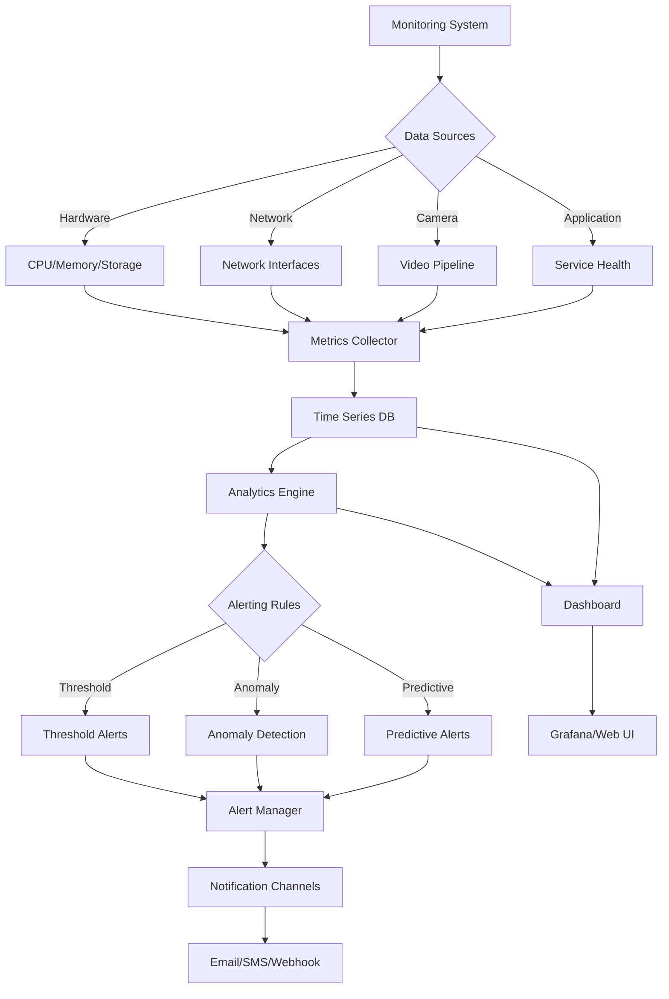

# System Monitoring and Performance

**Comprehensive monitoring system with metrics collection, alerting, and performance analysis.**

## Overview

RotorDream monitoring provides real-time system metrics, performance analytics, and proactive alerting to ensure optimal camera system operation.



## System Metrics Collection

### Hardware Monitoring

**CPU and Memory Metrics**:
```bash
# Get system performance metrics
curl -H "Authorization: Bearer 1a2B3c4D5e6f7G8h" \
     http://192.168.1.100:8080/api/monitoring/system

# Response format
{
  "system": {
    "timestamp": "2025-01-15T10:30:00Z",
    "cpu": {
      "usage_percent": 45.2,
      "load_average": [1.2, 1.1, 0.9],
      "cores": 4,
      "temperature": 52.3,
      "frequency_mhz": 1800
    },
    "memory": {
      "total_mb": 8192,
      "used_mb": 3072,
      "available_mb": 5120,
      "usage_percent": 37.5,
      "swap_total_mb": 2048,
      "swap_used_mb": 0
    },
    "storage": {
      "total_gb": 256,
      "used_gb": 128,
      "available_gb": 128,
      "usage_percent": 50.0,
      "io_read_bps": 1048576,
      "io_write_bps": 2097152
    }
  }
}
```

**Hardware Health Monitoring**:
```bash
# System temperature monitoring
curl -H "Authorization: Bearer 1a2B3c4D5e6f7G8h" \
     http://192.168.1.100:8080/api/monitoring/hardware

# Response includes
{
  "hardware": {
    "temperatures": {
      "cpu": 52.3,
      "gpu": 48.1,
      "storage": 35.2,
      "ambient": 28.5
    },
    "voltages": {
      "core": 1.2,
      "memory": 1.35,
      "io": 3.3
    },
    "fans": {
      "cpu_fan": 2800,
      "case_fan": 1200
    },
    "power": {
      "consumption_watts": 25.6,
      "efficiency_percent": 87.2
    }
  }
}
```

### Network Performance

**Network Interface Monitoring**:
```bash
# Get network statistics
curl -H "Authorization: Bearer 1a2B3c4D5e6f7G8h" \
     http://192.168.1.100:8080/api/monitoring/network

# Response format
{
  "network": {
    "interfaces": {
      "eth0": {
        "status": "up",
        "speed_mbps": 1000,
        "duplex": "full",
        "mtu": 1500,
        "bytes_sent": 1073741824,
        "bytes_received": 2147483648,
        "packets_sent": 1000000,
        "packets_received": 1500000,
        "errors_send": 0,
        "errors_receive": 0,
        "dropped_send": 0,
        "dropped_receive": 0
      }
    },
    "connections": {
      "established": 15,
      "listening": 8,
      "time_wait": 2
    },
    "bandwidth": {
      "current_upload_mbps": 5.2,
      "current_download_mbps": 12.8,
      "peak_upload_mbps": 85.6,
      "peak_download_mbps": 156.3
    }
  }
}
```

**Connection Quality Metrics**:
```bash
# Network quality assessment
curl -H "Authorization: Bearer 1a2B3c4D5e6f7G8h" \
     http://192.168.1.100:8080/api/monitoring/network/quality

# Response includes latency, jitter, packet loss
{
  "quality": {
    "ping_tests": [
      {
        "target": "8.8.8.8",
        "avg_latency_ms": 12.3,
        "max_latency_ms": 45.2,
        "min_latency_ms": 8.1,
        "jitter_ms": 2.1,
        "packet_loss_percent": 0.0
      }
    ],
    "dns_resolution_ms": 5.2,
    "throughput_test": {
      "download_mbps": 95.6,
      "upload_mbps": 35.2,
      "test_duration_seconds": 10
    }
  }
}
```

### Camera System Monitoring

**Video Pipeline Performance**:
```bash
# Get camera performance metrics
curl -H "Authorization: Bearer 1a2B3c4D5e6f7G8h" \
     http://192.168.1.100:8080/api/monitoring/camera

# Response format
{
  "camera_performance": {
    "capture": {
      "fps_current": 29.97,
      "fps_target": 30.0,
      "frames_captured": 1080000,
      "frames_dropped": 15,
      "frame_drop_rate": 0.0014
    },
    "encoding": {
      "bitrate_kbps": 5000,
      "bitrate_target": 5000,
      "encoding_time_ms": 8.5,
      "queue_size": 2,
      "encoder_errors": 0
    },
    "streaming": {
      "active_clients": 3,
      "bytes_sent": 536870912,
      "packets_sent": 500000,
      "retransmissions": 12,
      "buffer_underruns": 0
    },
    "storage": {
      "recording_active": true,
      "write_speed_mbps": 12.5,
      "files_written": 156,
      "write_errors": 0
    }
  }
}
```

**Camera Health Status**:
```bash
# Camera health diagnostics
curl -H "Authorization: Bearer 1a2B3c4D5e6f7G8h" \
     http://192.168.1.100:8080/api/monitoring/camera/health

# Response includes sensor status, lens condition, etc.
{
  "health": {
    "sensor": {
      "status": "healthy",
      "temperature": 42.1,
      "dead_pixels": 0,
      "sensitivity": "normal"
    },
    "lens": {
      "focus_quality": "excellent",
      "auto_focus_time_ms": 250,
      "zoom_position": 1.0,
      "iris_position": 2.8
    },
    "processing": {
      "image_quality_score": 95.2,
      "noise_level": "low",
      "exposure_accuracy": "good",
      "white_balance": "accurate"
    }
  }
}
```

## Application Monitoring

### Service Health

**Service Status Monitoring**:
```bash
# Get service health status
curl -H "Authorization: Bearer 1a2B3c4D5e6f7G8h" \
     http://192.168.1.100:8080/api/monitoring/services

# Response format
{
  "services": {
    "camera_service": {
      "status": "running",
      "uptime_seconds": 86400,
      "memory_usage_mb": 256,
      "cpu_usage_percent": 15.2,
      "threads": 8,
      "file_descriptors": 45
    },
    "web_server": {
      "status": "running",
      "uptime_seconds": 86400,
      "active_connections": 15,
      "total_requests": 50000,
      "error_rate_percent": 0.02
    },
    "stream_server": {
      "status": "running",
      "uptime_seconds": 86400,
      "active_streams": 3,
      "total_bytes_sent": 1073741824,
      "bandwidth_mbps": 12.5
    }
  }
}
```

**Application Performance Metrics**:
```bash
# Get detailed application metrics
curl -H "Authorization: Bearer 1a2B3c4D5e6f7G8h" \
     http://192.168.1.100:8080/api/monitoring/application

# Response includes API response times, error rates, etc.
{
  "application": {
    "api_performance": {
      "avg_response_time_ms": 45.2,
      "95th_percentile_ms": 120.5,
      "99th_percentile_ms": 250.1,
      "requests_per_second": 12.5,
      "error_rate_percent": 0.15
    },
    "database": {
      "connection_pool_size": 10,
      "active_connections": 3,
      "query_time_avg_ms": 5.2,
      "slow_queries": 0
    },
    "cache": {
      "hit_rate_percent": 89.5,
      "memory_usage_mb": 128,
      "operations_per_second": 250
    }
  }
}
```

### Resource Utilization

**Process Monitoring**:
```bash
# Monitor specific processes
curl -H "Authorization: Bearer 1a2B3c4D5e6f7G8h" \
     "http://192.168.1.100:8080/api/monitoring/processes?name=rotordream"

# Response format
{
  "processes": [
    {
      "pid": 1234,
      "name": "rotordream",
      "status": "running",
      "cpu_percent": 15.2,
      "memory_mb": 256,
      "memory_percent": 3.1,
      "uptime_seconds": 86400,
      "threads": 8,
      "file_descriptors": 45,
      "command_line": "/usr/bin/rotordream --config /etc/rotordream/config.ini"
    }
  ]
}
```

## Performance Analytics

### Historical Data

**Time Series Metrics**:
```bash
# Get historical performance data
curl -H "Authorization: Bearer 1a2B3c4D5e6f7G8h" \
     "http://192.168.1.100:8080/api/monitoring/history?metric=cpu_usage&period=24h&interval=5m"

# Response format
{
  "metric": "cpu_usage",
  "period": "24h",
  "interval": "5m",
  "data_points": [
    {
      "timestamp": "2025-01-15T10:00:00Z",
      "value": 45.2,
      "min": 12.1,
      "max": 78.5,
      "avg": 42.3
    }
  ]
}
```

**Performance Trends**:
```bash
# Get performance trend analysis
curl -H "Authorization: Bearer 1a2B3c4D5e6f7G8h" \
     http://192.168.1.100:8080/api/monitoring/trends

# Response includes performance trends and predictions
{
  "trends": {
    "cpu_usage": {
      "trend": "increasing",
      "change_percent": 12.5,
      "confidence": 0.85,
      "prediction_24h": 52.3
    },
    "memory_usage": {
      "trend": "stable",
      "change_percent": 1.2,
      "confidence": 0.95,
      "prediction_24h": 38.1
    },
    "storage_usage": {
      "trend": "increasing",
      "change_percent": 8.5,
      "confidence": 0.92,
      "prediction_7d": 58.2
    }
  }
}
```

### Performance Optimization

**Bottleneck Detection**:
```bash
# Identify performance bottlenecks
curl -H "Authorization: Bearer 1a2B3c4D5e6f7G8h" \
     http://192.168.1.100:8080/api/monitoring/bottlenecks

# Response format
{
  "bottlenecks": [
    {
      "type": "cpu",
      "severity": "medium",
      "description": "CPU usage consistently above 80%",
      "recommendation": "Consider reducing video quality or frame rate",
      "impact": "May cause frame drops in video stream"
    },
    {
      "type": "storage_io",
      "severity": "low",
      "description": "Storage write speed below optimal",
      "recommendation": "Check storage device health and consider upgrade",
      "impact": "Recording quality may be affected during high activity"
    }
  ]
}
```

**Performance Recommendations**:
```bash
# Get optimization recommendations
curl -H "Authorization: Bearer 1a2B3c4D5e6f7G8h" \
     http://192.168.1.100:8080/api/monitoring/recommendations

# Response includes specific optimization suggestions
{
  "recommendations": [
    {
      "category": "video_encoding",
      "priority": "high",
      "title": "Optimize encoding parameters",
      "description": "Current encoding settings are CPU-intensive",
      "actions": [
        "Reduce bitrate from 5000 to 4000 kbps",
        "Enable hardware acceleration if available",
        "Consider using H.265 codec for better compression"
      ],
      "expected_improvement": "25% CPU usage reduction"
    }
  ]
}
```

## Alerting System

### Alert Configuration

**Alert Rules**:
```json
{
  "alert_rules": [
    {
      "name": "high_cpu_usage",
      "description": "CPU usage above 80% for 5 minutes",
      "metric": "cpu_usage_percent",
      "condition": "> 80",
      "duration": "5m",
      "severity": "warning",
      "enabled": true
    },
    {
      "name": "memory_critical",
      "description": "Memory usage above 95%",
      "metric": "memory_usage_percent", 
      "condition": "> 95",
      "duration": "1m",
      "severity": "critical",
      "enabled": true
    },
    {
      "name": "storage_full",
      "description": "Storage usage above 90%",
      "metric": "storage_usage_percent",
      "condition": "> 90",
      "duration": "0s",
      "severity": "critical",
      "enabled": true
    },
    {
      "name": "camera_offline",
      "description": "Camera not responding",
      "metric": "camera_status",
      "condition": "== 'offline'",
      "duration": "30s",
      "severity": "critical",
      "enabled": true
    }
  ]
}
```

**Configure Alerts**:
```bash
# Create alert rule
curl -X POST "http://192.168.1.100:8080/api/monitoring/alerts/rules" \
     -H "Authorization: Bearer 1a2B3c4D5e6f7G8h" \
     -H "Content-Type: application/json" \
     -d '{
       "name": "network_latency_high",
       "description": "Network latency above 100ms",
       "metric": "network_latency_ms",
       "condition": "> 100",
       "duration": "2m",
       "severity": "warning",
       "actions": ["email", "webhook"]
     }'

# Update alert rule
curl -X PUT "http://192.168.1.100:8080/api/monitoring/alerts/rules/high_cpu_usage" \
     -H "Authorization: Bearer 1a2B3c4D5e6f7G8h" \
     -H "Content-Type: application/json" \
     -d '{
       "condition": "> 85",
       "duration": "3m",
       "enabled": true
     }'
```

### Notification Channels

**Email Notifications**:
```json
{
  "email_config": {
    "enabled": true,
    "smtp_server": "mail.company.com",
    "smtp_port": 587,
    "username": "alerts@company.com",
    "password_file": "/etc/rotordream/smtp_password",
    "use_tls": true,
    "from_address": "camera-alerts@company.com",
    "recipients": [
      "admin@company.com",
      "ops@company.com"
    ]
  }
}
```

**Webhook Notifications**:
```bash
# Configure webhook alerts
curl -X PUT "http://192.168.1.100:8080/api/monitoring/alerts/webhooks" \
     -H "Authorization: Bearer 1a2B3c4D5e6f7G8h" \
     -H "Content-Type: application/json" \
     -d '{
       "webhooks": [
         {
           "name": "slack_alerts",
           "url": "https://hooks.slack.com/services/YOUR_WORKSPACE_ID/YOUR_CHANNEL_ID/YOUR_WEBHOOK_TOKEN",
           "method": "POST",
           "headers": {
             "Content-Type": "application/json"
           },
           "body_template": {
             "text": "Alert: {{.AlertName}} - {{.Description}}",
             "channel": "#monitoring",
             "username": "RotorDream"
           },
           "enabled": true
         }
       ]
     }'
```

**SMS/Push Notifications**:
```json
{
  "sms_config": {
    "enabled": true,
    "provider": "twilio",
    "account_sid": "ACxxxxxxxxxxxxxxxxxxxxxxxxxxxxxxxx",
    "auth_token_file": "/etc/rotordream/twilio_token",
    "from_number": "+15551234567",
    "recipients": [
      "+15559876543"
    ]
  }
}
```

### Alert Management

**View Active Alerts**:
```bash
# Get current alerts
curl -H "Authorization: Bearer 1a2B3c4D5e6f7G8h" \
     http://192.168.1.100:8080/api/monitoring/alerts

# Response format
{
  "alerts": [
    {
      "id": "alert_001",
      "rule_name": "high_cpu_usage",
      "severity": "warning",
      "status": "firing",
      "started": "2025-01-15T10:25:00Z",
      "current_value": 85.2,
      "threshold": 80,
      "description": "CPU usage above 80% for 5 minutes"
    }
  ]
}

# Acknowledge alert
curl -X POST "http://192.168.1.100:8080/api/monitoring/alerts/alert_001/acknowledge" \
     -H "Authorization: Bearer 1a2B3c4D5e6f7G8h" \
     -H "Content-Type: application/json" \
     -d '{
       "user": "admin",
       "comment": "Investigating high CPU usage"
     }'

# Silence alert
curl -X POST "http://192.168.1.100:8080/api/monitoring/alerts/silence" \
     -H "Authorization: Bearer 1a2B3c4D5e6f7G8h" \
     -H "Content-Type: application/json" \
     -d '{
       "rule_name": "high_cpu_usage",
       "duration": "1h",
       "reason": "Scheduled maintenance"
     }'
```

## Monitoring Dashboard

### Web Dashboard

**Dashboard Configuration**:
```json
{
  "dashboard": {
    "enabled": true,
    "port": 8082,
    "refresh_interval": 30,
    "widgets": [
      {
        "type": "system_overview",
        "title": "System Overview",
        "position": {"x": 0, "y": 0, "w": 6, "h": 4},
        "metrics": ["cpu_usage", "memory_usage", "storage_usage"]
      },
      {
        "type": "camera_status",
        "title": "Camera Status",
        "position": {"x": 6, "y": 0, "w": 6, "h": 4},
        "metrics": ["fps", "bitrate", "active_streams"]
      },
      {
        "type": "network_performance",
        "title": "Network Performance",
        "position": {"x": 0, "y": 4, "w": 12, "h": 3},
        "metrics": ["bandwidth_in", "bandwidth_out", "latency"]
      }
    ]
  }
}
```

**Access Dashboard**:
```bash
# Dashboard URL
http://192.168.1.100:8082/monitoring

# API for dashboard data
curl -H "Authorization: Bearer 1a2B3c4D5e6f7G8h" \
     http://192.168.1.100:8080/api/monitoring/dashboard
```

### Grafana Integration

**Grafana Configuration**:
```yaml
# docker-compose.yml for Grafana
version: '3.8'
services:
  grafana:
    image: grafana/grafana:latest
    ports:
      - "3000:3000"
    environment:
      - GF_SECURITY_ADMIN_PASSWORD=admin123
    volumes:
      - grafana-storage:/var/lib/grafana
      - ./grafana/datasources:/etc/grafana/provisioning/datasources
      - ./grafana/dashboards:/etc/grafana/provisioning/dashboards

volumes:
  grafana-storage:
```

**Data Source Configuration**:
```yaml
# grafana/datasources/rotordream.yml
apiVersion: 1
datasources:
  - name: RotorDream
    type: prometheus
    url: http://192.168.1.100:8080/api/monitoring/prometheus
    access: proxy
    basicAuth: false
    httpHeaderName1: Authorization
    httpHeaderValue1: Bearer 1a2B3c4D5e6f7G8h
```

## Log Analysis

### Log Aggregation

**Log Collection**:
```bash
# Get system logs
curl -H "Authorization: Bearer 1a2B3c4D5e6f7G8h" \
     "http://192.168.1.100:8080/api/monitoring/logs?service=camera&level=error&limit=100"

# Response format
{
  "logs": [
    {
      "timestamp": "2025-01-15T10:30:00Z",
      "level": "error",
      "service": "camera",
      "message": "Failed to capture frame",
      "context": {
        "camera_id": "camera_001",
        "error_code": "CAPTURE_TIMEOUT",
        "retry_count": 3
      }
    }
  ]
}
```

**Log Analysis**:
```bash
# Analyze error patterns
curl -H "Authorization: Bearer 1a2B3c4D5e6f7G8h" \
     http://192.168.1.100:8080/api/monitoring/logs/analysis

# Response includes error frequency, patterns, trends
{
  "analysis": {
    "error_frequency": {
      "total_errors": 156,
      "errors_per_hour": 6.5,
      "trend": "increasing"
    },
    "error_types": [
      {
        "type": "CAPTURE_TIMEOUT",
        "count": 45,
        "percentage": 28.8
      },
      {
        "type": "ENCODING_ERROR",
        "count": 23,
        "percentage": 14.7
      }
    ]
  }
}
```

## Performance Tuning

### Optimization Monitoring

**Performance Baselines**:
```bash
# Establish performance baseline
curl -X POST "http://192.168.1.100:8080/api/monitoring/baseline" \
     -H "Authorization: Bearer 1a2B3c4D5e6f7G8h" \
     -H "Content-Type: application/json" \
     -d '{
       "duration": "24h",
       "metrics": ["cpu_usage", "memory_usage", "fps", "bitrate"]
     }'

# Compare against baseline
curl -H "Authorization: Bearer 1a2B3c4D5e6f7G8h" \
     http://192.168.1.100:8080/api/monitoring/baseline/compare
```

**Load Testing**:
```bash
# Stress test camera system
curl -X POST "http://192.168.1.100:8080/api/monitoring/stress-test" \
     -H "Authorization: Bearer 1a2B3c4D5e6f7G8h" \
     -H "Content-Type: application/json" \
     -d '{
       "test_type": "concurrent_streams",
       "parameters": {
         "stream_count": 10,
         "duration_minutes": 30,
         "monitor_metrics": true
       }
     }'
```

## Troubleshooting

### Common Monitoring Issues

**High Resource Usage**:
```bash
# Identify resource-heavy processes
curl -H "Authorization: Bearer 1a2B3c4D5e6f7G8h" \
     http://192.168.1.100:8080/api/monitoring/top-processes

# Get detailed process analysis
curl -H "Authorization: Bearer 1a2B3c4D5e6f7G8h" \
     "http://192.168.1.100:8080/api/monitoring/process-analysis?pid=1234"
```

**Monitoring System Health**:
```bash
# Check monitoring system status
curl -H "Authorization: Bearer 1a2B3c4D5e6f7G8h" \
     http://192.168.1.100:8080/api/monitoring/health

# Reset monitoring counters
curl -X POST "http://192.168.1.100:8080/api/monitoring/reset" \
     -H "Authorization: Bearer 1a2B3c4D5e6f7G8h"
```

## Related Documentation

- [Performance Tuning](./performance.md) - System optimization guidelines
- [Troubleshooting](./troubleshooting.md) - Problem diagnosis and resolution
- [API Reference](../api/http-api.md) - Monitoring API endpoints
- [Storage Configuration](../configuration/storage-backup.md) - Storage monitoring

---

*Monitoring documentation based on modern observability practices and industry standards*
