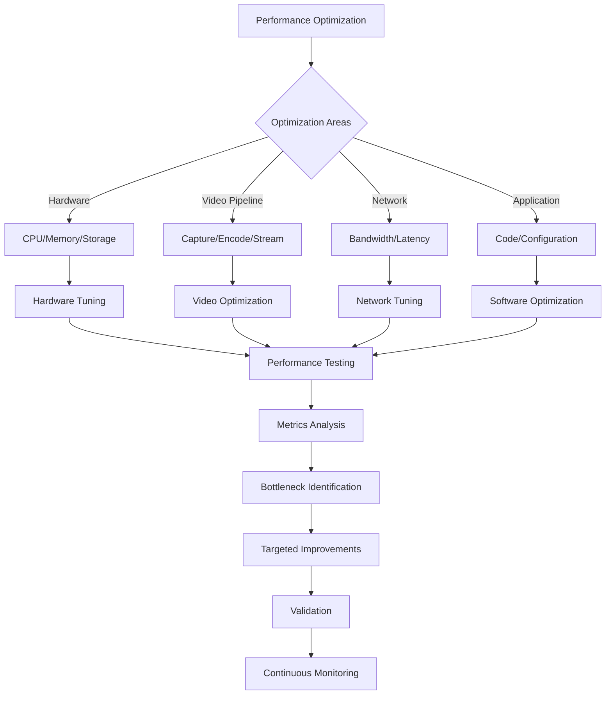

# Performance Tuning Guide

**Comprehensive performance optimization strategies for hardware, software, and network components.**

## Overview

This guide provides systematic approaches to optimize RotorDream camera system performance across all components for maximum efficiency and reliability.



## Hardware Optimization

### CPU Performance Tuning

**CPU Governor and Frequency Scaling**:
```bash
# Check current CPU governor
cat /sys/devices/system/cpu/cpu0/cpufreq/scaling_governor

# Set performance governor for maximum performance
echo performance | sudo tee /sys/devices/system/cpu/cpu*/cpufreq/scaling_governor

# Or use powersave for battery efficiency
echo powersave | sudo tee /sys/devices/system/cpu/cpu*/cpufreq/scaling_governor

# Set specific frequency (if supported)
echo 1800000 | sudo tee /sys/devices/system/cpu/cpu*/cpufreq/scaling_setspeed

# Check available frequencies
cat /sys/devices/system/cpu/cpu0/cpufreq/scaling_available_frequencies
```

**CPU Affinity and Process Scheduling**:
```bash
# Set CPU affinity for camera process
taskset -cp 0,1 $(pgrep rotordream)

# Set high priority for camera process
renice -10 $(pgrep rotordream)

# Use systemd to set CPU affinity permanently
# /etc/systemd/system/rotordream.service
[Service]
CPUAffinity=0 1
Nice=-10
IOSchedulingClass=1
IOSchedulingPriority=4
```

**CPU Configuration via API**:
```bash
# Get CPU optimization recommendations
curl -H "Authorization: Bearer 1a2B3c4D5e6f7G8h" \
     http://192.168.1.100:8080/api/performance/cpu/recommendations

# Apply CPU optimizations
curl -X POST "http://192.168.1.100:8080/api/performance/cpu/optimize" \
     -H "Authorization: Bearer 1a2B3c4D5e6f7G8h" \
     -H "Content-Type: application/json" \
     -d '{
       "governor": "performance",
       "affinity": [0, 1],
       "priority": "high"
     }'
```

### Memory Optimization

**Memory Management**:
```bash
# Check memory usage and fragmentation
cat /proc/meminfo
cat /proc/buddyinfo

# Tune virtual memory parameters
echo 10 > /proc/sys/vm/swappiness
echo 1 > /proc/sys/vm/drop_caches  # Clear caches (temporary)

# Optimize for video workloads
echo 5 > /proc/sys/vm/dirty_background_ratio
echo 20 > /proc/sys/vm/dirty_ratio
echo 1500 > /proc/sys/vm/dirty_expire_centisecs
```

**Memory Pool Configuration**:
```json
{
  "memory_pools": {
    "frame_buffers": {
      "count": 16,
      "size_mb": 8,
      "alignment": 4096,
      "location": "dma_coherent"
    },
    "encoding_buffers": {
      "count": 8,
      "size_mb": 4,
      "alignment": 1024,
      "location": "contiguous"
    },
    "network_buffers": {
      "count": 32,
      "size_kb": 64,
      "alignment": 512,
      "location": "normal"
    }
  }
}
```

**Memory Optimization API**:
```bash
# Configure memory pools
curl -X PUT "http://192.168.1.100:8080/api/performance/memory/pools" \
     -H "Authorization: Bearer 1a2B3c4D5e6f7G8h" \
     -H "Content-Type: application/json" \
     -d '{
       "frame_buffer_count": 16,
       "frame_buffer_size_mb": 8,
       "enable_zero_copy": true,
       "memory_mapping": "contiguous"
     }'

# Get memory utilization
curl -H "Authorization: Bearer 1a2B3c4D5e6f7G8h" \
     http://192.168.1.100:8080/api/performance/memory/status
```

### Storage Performance

**I/O Scheduler Optimization**:
```bash
# Check current I/O scheduler
cat /sys/block/mmcblk0/queue/scheduler

# Set deadline scheduler for better video I/O
echo deadline > /sys/block/mmcblk0/queue/scheduler

# Tune scheduler parameters
echo 50 > /sys/block/mmcblk0/queue/iosched/read_expire
echo 250 > /sys/block/mmcblk0/queue/iosched/write_expire
echo 1 > /sys/block/mmcblk0/queue/iosched/writes_starved
echo 2 > /sys/block/mmcblk0/queue/iosched/fifo_batch
```

**File System Optimization**:
```bash
# Mount with optimized options for video
mount -o remount,noatime,nodiratime,commit=60,barrier=0 /media/data

# Tune ext4 for large files
tune2fs -o journal_data_writeback /dev/mmcblk0p2
tune2fs -c 0 -i 0 /dev/mmcblk0p2  # Disable fsck intervals

# Adjust read-ahead
echo 4096 > /sys/block/mmcblk0/queue/read_ahead_kb
```

**Storage Performance API**:
```bash
# Configure storage optimization
curl -X PUT "http://192.168.1.100:8080/api/performance/storage/config" \
     -H "Authorization: Bearer 1a2B3c4D5e6f7G8h" \
     -H "Content-Type: application/json" \
     -d '{
       "io_scheduler": "deadline",
       "write_cache": true,
       "read_ahead_kb": 4096,
       "sync_mode": "async"
     }'

# Test storage performance
curl -X POST "http://192.168.1.100:8080/api/performance/storage/benchmark" \
     -H "Authorization: Bearer 1a2B3c4D5e6f7G8h"
```

## Video Pipeline Optimization

### Camera Capture Optimization

**V4L2 Buffer Configuration**:
```bash
# Configure capture buffers via API
curl -X PUT "http://192.168.1.100:8080/api/camera/capture/buffers" \
     -H "Authorization: Bearer 1a2B3c4D5e6f7G8h" \
     -H "Content-Type: application/json" \
     -d '{
       "buffer_count": 8,
       "buffer_size": 8388608,
       "memory_type": "mmap",
       "queue_length": 4
     }'

# Optimize capture parameters
curl -X PUT "http://192.168.1.100:8080/api/camera/capture/optimize" \
     -H "Authorization: Bearer 1a2B3c4D5e6f7G8h" \
     -H "Content-Type: application/json" \
     -d '{
       "frame_rate": 30,
       "resolution": "1920x1080",
       "pixel_format": "NV12",
       "capture_mode": "streaming"
     }'
```

**Sensor and Timing Optimization**:
```json
{
  "sensor_optimization": {
    "exposure_mode": "auto",
    "exposure_time_us": 33333,
    "gain_mode": "auto",
    "gain_value": 1.0,
    "white_balance_mode": "auto",
    "focus_mode": "continuous"
  },
  "timing_optimization": {
    "frame_rate_target": 30.0,
    "frame_rate_tolerance": 0.1,
    "timing_source": "hardware",
    "vsync_enabled": true
  }
}
```

### Encoding Optimization

**H.264/H.265 Encoder Tuning**:
```bash
# Configure video encoding parameters
curl -X PUT "http://192.168.1.100:8080/api/camera/encoding/config" \
     -H "Authorization: Bearer 1a2B3c4D5e6f7G8h" \
     -H "Content-Type: application/json" \
     -d '{
       "codec": "h264",
       "bitrate_kbps": 5000,
       "quality_preset": "medium",
       "rate_control": "cbr",
       "gop_size": 30,
       "b_frames": 0,
       "hardware_acceleration": true
     }'

# Advanced encoding options
curl -X PUT "http://192.168.1.100:8080/api/camera/encoding/advanced" \
     -H "Authorization: Bearer 1a2B3c4D5e6f7G8h" \
     -H "Content-Type: application/json" \
     -d '{
       "profile": "baseline",
       "level": "4.0",
       "entropy_coding": "cavlc",
       "motion_estimation": "hex",
       "subpixel_refinement": 2,
       "reference_frames": 1
     }'
```

**Encoding Performance Profiles**:
```json
{
  "encoding_profiles": {
    "low_latency": {
      "preset": "ultrafast",
      "tune": "zerolatency",
      "keyframe_interval": 1,
      "b_frames": 0,
      "reference_frames": 1,
      "threads": 2
    },
    "high_quality": {
      "preset": "medium", 
      "tune": "film",
      "keyframe_interval": 30,
      "b_frames": 2,
      "reference_frames": 3,
      "threads": 4
    },
    "low_power": {
      "preset": "fast",
      "tune": "stillimage",
      "keyframe_interval": 60,
      "b_frames": 0,
      "reference_frames": 1,
      "hardware_acceleration": true
    }
  }
}
```

### Streaming Optimization

**Network Protocol Optimization**:
```bash
# Configure RTSP streaming parameters
curl -X PUT "http://192.168.1.100:8080/api/streaming/rtsp/config" \
     -H "Authorization: Bearer 1a2B3c4D5e6f7G8h" \
     -H "Content-Type: application/json" \
     -d '{
       "transport": "udp",
       "packet_size": 1316,
       "buffer_size": 1048576,
       "timeout_ms": 5000,
       "retransmission": true
     }'

# WebRTC optimization
curl -X PUT "http://192.168.1.100:8080/api/streaming/webrtc/config" \
     -H "Authorization: Bearer 1a2B3c4D5e6f7G8h" \
     -H "Content-Type: application/json" \
     -d '{
       "ice_servers": ["stun:stun.l.google.com:19302"],
       "video_codec": "h264",
       "audio_codec": "opus",
       "bandwidth_kbps": 5000,
       "adaptive_bitrate": true
     }'
```

**Buffer Management**:
```json
{
  "buffer_configuration": {
    "capture_buffers": 8,
    "encode_buffers": 4,
    "stream_buffers": 16,
    "network_buffers": 32,
    "buffer_size_kb": 64,
    "zero_copy_enabled": true,
    "memory_mapping": "dma_coherent"
  }
}
```

## Network Performance Tuning

### Network Interface Optimization

**Interface Configuration**:
```bash
# Optimize network interface
ethtool -G eth0 rx 1024 tx 1024
ethtool -K eth0 tso on gso on gro on lro on
ethtool -C eth0 rx-usecs 50 tx-usecs 50

# Set network buffer sizes
echo 262144 > /proc/sys/net/core/rmem_max
echo 262144 > /proc/sys/net/core/wmem_max
echo "4096 65536 262144" > /proc/sys/net/ipv4/tcp_rmem
echo "4096 65536 262144" > /proc/sys/net/ipv4/tcp_wmem
```

**Network API Configuration**:
```bash
# Configure network performance
curl -X PUT "http://192.168.1.100:8080/api/performance/network/config" \
     -H "Authorization: Bearer 1a2B3c4D5e6f7G8h" \
     -H "Content-Type: application/json" \
     -d '{
       "tcp_buffer_size": 262144,
       "udp_buffer_size": 131072,
       "enable_tcp_offload": true,
       "enable_jumbo_frames": false,
       "mtu_size": 1500
     }'
```

### Bandwidth Management

**Quality of Service (QoS)**:
```bash
# Setup traffic shaping for video streams
tc qdisc add dev eth0 root handle 1: htb default 30
tc class add dev eth0 parent 1: classid 1:1 htb rate 100mbit
tc class add dev eth0 parent 1:1 classid 1:10 htb rate 80mbit ceil 100mbit
tc class add dev eth0 parent 1:1 classid 1:20 htb rate 15mbit ceil 20mbit
tc class add dev eth0 parent 1:1 classid 1:30 htb rate 5mbit ceil 10mbit

# Prioritize video traffic
tc filter add dev eth0 protocol ip parent 1:0 prio 1 u32 match ip dport 554 0xffff flowid 1:10
```

**Adaptive Bitrate Configuration**:
```bash
# Configure adaptive streaming
curl -X PUT "http://192.168.1.100:8080/api/streaming/adaptive" \
     -H "Authorization: Bearer 1a2B3c4D5e6f7G8h" \
     -H "Content-Type: application/json" \
     -d '{
       "enabled": true,
       "min_bitrate_kbps": 1000,
       "max_bitrate_kbps": 8000,
       "step_size_kbps": 500,
       "adjustment_interval_ms": 5000,
       "quality_threshold": 0.95
     }'
```

### Latency Optimization

**Low-Latency Configuration**:
```bash
# Configure for minimum latency
curl -X PUT "http://192.168.1.100:8080/api/performance/latency/config" \
     -H "Authorization: Bearer 1a2B3c4D5e6f7G8h" \
     -H "Content-Type: application/json" \
     -d '{
       "target_latency_ms": 100,
       "buffer_strategy": "minimal",
       "encoding_preset": "ultrafast",
       "network_protocol": "udp",
       "frame_buffering": 1
     }'

# Test end-to-end latency
curl -X POST "http://192.168.1.100:8080/api/performance/latency/test" \
     -H "Authorization: Bearer 1a2B3c4D5e6f7G8h"
```

## Software Optimization

### Application Performance

**Thread and Process Optimization**:
```json
{
  "thread_configuration": {
    "capture_threads": 2,
    "encode_threads": 4,
    "stream_threads": 2,
    "io_threads": 2,
    "worker_threads": 4,
    "thread_affinity": {
      "capture": [0, 1],
      "encode": [2, 3],
      "stream": [0, 1],
      "io": [2, 3]
    }
  }
}
```

**Memory Management**:
```bash
# Configure application memory settings
curl -X PUT "http://192.168.1.100:8080/api/performance/memory/config" \
     -H "Authorization: Bearer 1a2B3c4D5e6f7G8h" \
     -H "Content-Type: application/json" \
     -d '{
       "heap_size_mb": 512,
       "stack_size_kb": 1024,
       "gc_threshold_mb": 256,
       "memory_mapping": "shared",
       "preallocation": true
     }'
```

### Configuration Optimization

**Runtime Configuration**:
```ini
# /etc/rotordream/performance.conf
[runtime]
worker_threads = 4
max_connections = 100
connection_timeout = 30
keepalive_timeout = 60
request_timeout = 30

[video_pipeline]
frame_buffer_count = 16
encode_buffer_count = 8
stream_buffer_count = 32
zero_copy_enabled = true
hardware_acceleration = true

[network]
tcp_nodelay = true
tcp_cork = false
socket_buffer_size = 262144
max_packet_size = 1316
```

**Performance Profiles**:
```bash
# Apply performance profile
curl -X POST "http://192.168.1.100:8080/api/performance/profile/apply" \
     -H "Authorization: Bearer 1a2B3c4D5e6f7G8h" \
     -H "Content-Type: application/json" \
     -d '{
       "profile": "high_performance",
       "components": ["cpu", "memory", "video", "network"]
     }'

# Available profiles: "balanced", "high_performance", "low_power", "low_latency"
```

## Performance Testing

### Benchmarking

**System Benchmarks**:
```bash
# CPU benchmark
curl -X POST "http://192.168.1.100:8080/api/performance/benchmark/cpu" \
     -H "Authorization: Bearer 1a2B3c4D5e6f7G8h" \
     -H "Content-Type: application/json" \
     -d '{
       "duration_seconds": 60,
       "threads": 4,
       "workload": "video_encoding"
     }'

# Memory benchmark
curl -X POST "http://192.168.1.100:8080/api/performance/benchmark/memory" \
     -H "Authorization: Bearer 1a2B3c4D5e6f7G8h" \
     -H "Content-Type: application/json" \
     -d '{
       "test_size_mb": 1024,
       "pattern": "sequential",
       "operations": ["read", "write", "copy"]
     }'

# Storage benchmark
curl -X POST "http://192.168.1.100:8080/api/performance/benchmark/storage" \
     -H "Authorization: Bearer 1a2B3c4D5e6f7G8h" \
     -H "Content-Type: application/json" \
     -d '{
       "file_size_mb": 1024,
       "block_size_kb": 1024,
       "test_type": "sequential_write"
     }'
```

**Video Pipeline Benchmarks**:
```bash
# Encoding performance test
curl -X POST "http://192.168.1.100:8080/api/performance/benchmark/encoding" \
     -H "Authorization: Bearer 1a2B3c4D5e6f7G8h" \
     -H "Content-Type: application/json" \
     -d '{
       "input_resolution": "1920x1080",
       "output_bitrate": 5000,
       "duration_seconds": 60,
       "codec": "h264"
     }'

# Streaming performance test
curl -X POST "http://192.168.1.100:8080/api/performance/benchmark/streaming" \
     -H "Authorization: Bearer 1a2B3c4D5e6f7G8h" \
     -H "Content-Type: application/json" \
     -d '{
       "concurrent_streams": 10,
       "stream_duration_seconds": 300,
       "bitrate_kbps": 5000
     }'
```

### Load Testing

**Stress Testing**:
```bash
# System stress test
curl -X POST "http://192.168.1.100:8080/api/performance/stress-test" \
     -H "Authorization: Bearer 1a2B3c4D5e6f7G8h" \
     -H "Content-Type: application/json" \
     -d '{
       "test_type": "full_system",
       "duration_minutes": 30,
       "load_level": 90,
       "components": ["cpu", "memory", "storage", "network"]
     }'

# API load test
curl -X POST "http://192.168.1.100:8080/api/performance/load-test" \
     -H "Authorization: Bearer 1a2B3c4D5e6f7G8h" \
     -H "Content-Type: application/json" \
     -d '{
       "requests_per_second": 100,
       "duration_minutes": 10,
       "endpoints": ["/api/camera/status", "/api/streaming/info"]
     }'
```

## Performance Monitoring

### Real-time Metrics

**Performance Dashboard**:
```bash
# Get real-time performance metrics
curl -H "Authorization: Bearer 1a2B3c4D5e6f7G8h" \
     http://192.168.1.100:8080/api/performance/metrics/realtime

# Response includes current performance data
{
  "performance": {
    "cpu_usage_percent": 45.2,
    "memory_usage_percent": 62.1,
    "video_fps": 29.97,
    "encoding_time_ms": 8.5,
    "network_latency_ms": 12.3,
    "storage_io_mbps": 25.6
  }
}
```

**Performance Alerts**:
```bash
# Configure performance alerts
curl -X PUT "http://192.168.1.100:8080/api/performance/alerts/config" \
     -H "Authorization: Bearer 1a2B3c4D5e6f7G8h" \
     -H "Content-Type: application/json" \
     -d '{
       "cpu_threshold": 80,
       "memory_threshold": 85,
       "fps_threshold": 25,
       "latency_threshold": 100,
       "alert_cooldown_minutes": 5
     }'
```

### Performance Analysis

**Bottleneck Detection**:
```bash
# Analyze performance bottlenecks
curl -H "Authorization: Bearer 1a2B3c4D5e6f7G8h" \
     http://192.168.1.100:8080/api/performance/analysis/bottlenecks

# Get optimization recommendations
curl -H "Authorization: Bearer 1a2B3c4D5e6f7G8h" \
     http://192.168.1.100:8080/api/performance/analysis/recommendations
```

**Performance Trending**:
```bash
# Get performance trends
curl -H "Authorization: Bearer 1a2B3c4D5e6f7G8h" \
     "http://192.168.1.100:8080/api/performance/trends?period=24h"

# Performance regression detection
curl -H "Authorization: Bearer 1a2B3c4D5e6f7G8h" \
     http://192.168.1.100:8080/api/performance/regression/detect
```

## Best Practices

### Performance Guidelines

**Hardware Recommendations**:
- Use dedicated hardware for video processing when possible
- Ensure adequate cooling for sustained performance
- Use high-speed storage (SSD preferred) for video recording
- Allocate sufficient RAM for frame buffering
- Consider hardware-accelerated encoding

**Software Configuration**:
- Use appropriate thread counts for your hardware
- Configure memory pools to avoid allocation overhead
- Enable zero-copy operations where supported
- Use hardware acceleration when available
- Optimize buffer sizes for your use case

**Network Optimization**:
- Use dedicated network interfaces for video streaming
- Configure QoS to prioritize video traffic
- Use appropriate protocols (UDP for low latency, TCP for reliability)
- Monitor and tune network buffer sizes
- Consider network topology for multi-camera setups

### Troubleshooting Performance Issues

**Common Problems**:
```bash
# High CPU usage
curl -H "Authorization: Bearer 1a2B3c4D5e6f7G8h" \
     http://192.168.1.100:8080/api/performance/troubleshoot/cpu

# Memory leaks
curl -H "Authorization: Bearer 1a2B3c4D5e6f7G8h" \
     http://192.168.1.100:8080/api/performance/troubleshoot/memory

# Storage I/O issues
curl -H "Authorization: Bearer 1a2B3c4D5e6f7G8h" \
     http://192.168.1.100:8080/api/performance/troubleshoot/storage

# Network bottlenecks
curl -H "Authorization: Bearer 1a2B3c4D5e6f7G8h" \
     http://192.168.1.100:8080/api/performance/troubleshoot/network
```

## Related Documentation

- [Monitoring](./monitoring.md) - Performance monitoring and alerting
- [Troubleshooting](./troubleshooting.md) - Problem diagnosis and resolution
- [Camera Configuration](../configuration/camera-system.md) - Video pipeline optimization
- [Network Configuration](../configuration/network.md) - Network performance tuning

---

*Performance tuning documentation based on Linux performance optimization and video processing best practices*
