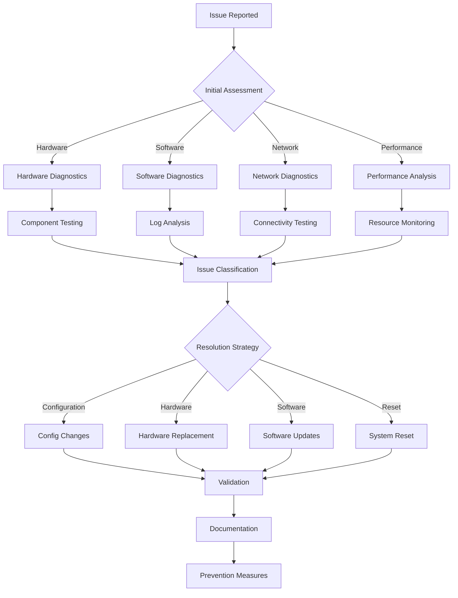

# Troubleshooting Guide

**Comprehensive troubleshooting procedures for common issues, diagnostic tools, and resolution strategies.**

## Overview

This guide provides systematic approaches to diagnose and resolve common problems in the RotorDream camera system, from basic connectivity issues to complex performance problems.



## Common Issues and Solutions

### Camera Not Responding

**Symptoms**:
- API endpoints return timeout errors
- No video stream available
- Camera status shows as offline

**Diagnostic Steps**:
```bash
# Check camera service status
curl -H "Authorization: Bearer 1a2B3c4D5e6f7G8h" \
     http://192.168.1.100:8080/api/camera/status

# Check camera hardware connectivity
curl -H "Authorization: Bearer 1a2B3c4D5e6f7G8h" \
     http://192.168.1.100:8080/api/camera/hardware/detect

# Check system logs for camera errors
curl -H "Authorization: Bearer 1a2B3c4D5e6f7G8h" \
     "http://192.168.1.100:8080/api/logs?service=camera&level=error&limit=50"
```

**Resolution Steps**:
```bash
# 1. Restart camera service
curl -X POST "http://192.168.1.100:8080/api/camera/restart" \
     -H "Authorization: Bearer 1a2B3c4D5e6f7G8h"

# 2. Reset camera hardware
curl -X POST "http://192.168.1.100:8080/api/camera/hardware/reset" \
     -H "Authorization: Bearer 1a2B3c4D5e6f7G8h"

# 3. Reinitialize camera with default settings
curl -X POST "http://192.168.1.100:8080/api/camera/initialize" \
     -H "Authorization: Bearer 1a2B3c4D5e6f7G8h" \
     -H "Content-Type: application/json" \
     -d '{
       "use_defaults": true,
       "force_reset": true
     }'

# 4. Check for hardware issues
curl -H "Authorization: Bearer 1a2B3c4D5e6f7G8h" \
     http://192.168.1.100:8080/api/diagnostics/hardware/camera
```

### Network Connectivity Issues

**Symptoms**:
- Cannot access web interface
- API calls fail with connection errors
- Streaming interruptions

**Network Diagnostics**:
```bash
# Test basic connectivity
ping -c 4 192.168.1.100

# Check port accessibility
nmap -p 8080,443,554,8081 192.168.1.100

# Test API connectivity
curl -v http://192.168.1.100:8080/api/status

# Check DNS resolution (if using hostname)
nslookup camera.local
```

**Network Interface Diagnostics**:
```bash
# Get network interface status
curl -H "Authorization: Bearer 1a2B3c4D5e6f7G8h" \
     http://192.168.1.100:8080/api/network/interfaces

# Test network performance
curl -H "Authorization: Bearer 1a2B3c4D5e6f7G8h" \
     http://192.168.1.100:8080/api/network/test

# Check network configuration
curl -H "Authorization: Bearer 1a2B3c4D5e6f7G8h" \
     http://192.168.1.100:8080/api/network/config
```

**Resolution Steps**:
```bash
# 1. Reset network configuration
curl -X POST "http://192.168.1.100:8080/api/network/reset" \
     -H "Authorization: Bearer 1a2B3c4D5e6f7G8h"

# 2. Reconfigure network interface
curl -X PUT "http://192.168.1.100:8080/api/network/interfaces/eth0" \
     -H "Authorization: Bearer 1a2B3c4D5e6f7G8h" \
     -H "Content-Type: application/json" \
     -d '{
       "method": "static",
       "ip_address": "192.168.1.100",
       "netmask": "255.255.255.0",
       "gateway": "192.168.1.1",
       "dns_servers": ["8.8.8.8", "8.8.4.4"]
     }'

# 3. Restart network services
curl -X POST "http://192.168.1.100:8080/api/network/restart" \
     -H "Authorization: Bearer 1a2B3c4D5e6f7G8h"
```

### Video Stream Problems

**Symptoms**:
- No video output
- Poor video quality
- Stuttering or frame drops
- Encoding errors

**Stream Diagnostics**:
```bash
# Check stream status
curl -H "Authorization: Bearer 1a2B3c4D5e6f7G8h" \
     http://192.168.1.100:8080/api/streaming/status

# Test stream endpoints
curl -H "Authorization: Bearer 1a2B3c4D5e6f7G8h" \
     http://192.168.1.100:8080/api/streaming/endpoints

# Check encoding performance
curl -H "Authorization: Bearer 1a2B3c4D5e6f7G8h" \
     http://192.168.1.100:8080/api/camera/encoding/status

# Analyze stream quality
curl -H "Authorization: Bearer 1a2B3c4D5e6f7G8h" \
     http://192.168.1.100:8080/api/streaming/quality/analysis
```

**Resolution Steps**:
```bash
# 1. Reset video pipeline
curl -X POST "http://192.168.1.100:8080/api/camera/pipeline/reset" \
     -H "Authorization: Bearer 1a2B3c4D5e6f7G8h"

# 2. Adjust encoding parameters
curl -X PUT "http://192.168.1.100:8080/api/camera/encoding" \
     -H "Authorization: Bearer 1a2B3c4D5e6f7G8h" \
     -H "Content-Type: application/json" \
     -d '{
       "bitrate": 3000,
       "quality": "medium",
       "frame_rate": 25,
       "resolution": "1280x720"
     }'

# 3. Optimize for current conditions
curl -X POST "http://192.168.1.100:8080/api/camera/optimize" \
     -H "Authorization: Bearer 1a2B3c4D5e6f7G8h" \
     -H "Content-Type: application/json" \
     -d '{
       "target": "quality",
       "auto_adjust": true
     }'
```

### High Resource Usage

**Symptoms**:
- High CPU usage (>80%)
- Memory exhaustion
- Storage full warnings
- System slowdown

**Resource Diagnostics**:
```bash
# Check system resources
curl -H "Authorization: Bearer 1a2B3c4D5e6f7G8h" \
     http://192.168.1.100:8080/api/system/resources

# Identify resource-heavy processes
curl -H "Authorization: Bearer 1a2B3c4D5e6f7G8h" \
     http://192.168.1.100:8080/api/system/processes/top

# Check memory usage patterns
curl -H "Authorization: Bearer 1a2B3c4D5e6f7G8h" \
     http://192.168.1.100:8080/api/system/memory/analysis

# Storage usage breakdown
curl -H "Authorization: Bearer 1a2B3c4D5e6f7G8h" \
     http://192.168.1.100:8080/api/storage/usage/breakdown
```

**Resolution Steps**:
```bash
# 1. Free up resources immediately
curl -X POST "http://192.168.1.100:8080/api/system/cleanup" \
     -H "Authorization: Bearer 1a2B3c4D5e6f7G8h" \
     -H "Content-Type: application/json" \
     -d '{
       "clear_cache": true,
       "cleanup_temp": true,
       "compress_logs": true
     }'

# 2. Optimize performance settings
curl -X POST "http://192.168.1.100:8080/api/performance/optimize" \
     -H "Authorization: Bearer 1a2B3c4D5e6f7G8h" \
     -H "Content-Type: application/json" \
     -d '{
       "target": "resource_usage",
       "aggressive": false
     }'

# 3. Adjust quality settings to reduce load
curl -X PUT "http://192.168.1.100:8080/api/camera/quality" \
     -H "Authorization: Bearer 1a2B3c4D5e6f7G8h" \
     -H "Content-Type: application/json" \
     -d '{
       "resolution": "1280x720",
       "frame_rate": 20,
       "bitrate": 2000
     }'
```

## Diagnostic Tools

### System Health Check

**Comprehensive Health Assessment**:
```bash
# Run full system health check
curl -X POST "http://192.168.1.100:8080/api/diagnostics/health-check" \
     -H "Authorization: Bearer 1a2B3c4D5e6f7G8h" \
     -H "Content-Type: application/json" \
     -d '{
       "components": ["hardware", "software", "network", "storage"],
       "detailed": true
     }'

# Response format
{
  "health_check": {
    "overall_status": "warning",
    "timestamp": "2025-01-15T10:30:00Z",
    "components": {
      "hardware": {
        "status": "healthy",
        "cpu_temperature": 52.3,
        "memory_errors": 0,
        "storage_health": "good"
      },
      "software": {
        "status": "healthy",
        "service_status": "running",
        "process_count": 15,
        "memory_leaks": false
      },
      "network": {
        "status": "warning",
        "interface_status": "up",
        "packet_loss": 0.5,
        "latency_ms": 85.2
      },
      "storage": {
        "status": "healthy",
        "usage_percent": 75.2,
        "write_speed": "normal",
        "errors": 0
      }
    }
  }
}
```

### Log Analysis Tools

**Automated Log Analysis**:
```bash
# Analyze logs for error patterns
curl -X POST "http://192.168.1.100:8080/api/diagnostics/log-analysis" \
     -H "Authorization: Bearer 1a2B3c4D5e6f7G8h" \
     -H "Content-Type: application/json" \
     -d '{
       "time_range": "24h",
       "log_levels": ["error", "warning"],
       "analyze_patterns": true
     }'

# Get specific error details
curl -H "Authorization: Bearer 1a2B3c4D5e6f7G8h" \
     "http://192.168.1.100:8080/api/logs/errors?type=camera&count=10"

# Search logs for specific issues
curl -H "Authorization: Bearer 1a2B3c4D5e6f7G8h" \
     "http://192.168.1.100:8080/api/logs/search?query=timeout&service=network"
```

### Performance Profiling

**Real-time Performance Analysis**:
```bash
# Start performance profiling
curl -X POST "http://192.168.1.100:8080/api/diagnostics/profiling/start" \
     -H "Authorization: Bearer 1a2B3c4D5e6f7G8h" \
     -H "Content-Type: application/json" \
     -d '{
       "duration_seconds": 300,
       "components": ["cpu", "memory", "io", "network"],
       "sampling_rate": "1s"
     }'

# Get profiling results
curl -H "Authorization: Bearer 1a2B3c4D5e6f7G8h" \
     http://192.168.1.100:8080/api/diagnostics/profiling/results

# Generate performance report
curl -H "Authorization: Bearer 1a2B3c4D5e6f7G8h" \
     http://192.168.1.100:8080/api/diagnostics/performance-report
```

### Hardware Testing

**Hardware Component Tests**:
```bash
# Test camera hardware
curl -X POST "http://192.168.1.100:8080/api/diagnostics/hardware/camera-test" \
     -H "Authorization: Bearer 1a2B3c4D5e6f7G8h" \
     -H "Content-Type: application/json" \
     -d '{
       "test_type": "comprehensive",
       "include_capture": true,
       "duration_seconds": 60
     }'

# Test storage performance
curl -X POST "http://192.168.1.100:8080/api/diagnostics/hardware/storage-test" \
     -H "Authorization: Bearer 1a2B3c4D5e6f7G8h" \
     -H "Content-Type: application/json" \
     -d '{
       "test_type": "read_write",
       "file_size_mb": 100,
       "iterations": 5
     }'

# Test network interfaces
curl -X POST "http://192.168.1.100:8080/api/diagnostics/hardware/network-test" \
     -H "Authorization: Bearer 1a2B3c4D5e6f7G8h" \
     -H "Content-Type: application/json" \
     -d '{
       "test_type": "throughput",
       "target_host": "192.168.1.1",
       "duration_seconds": 30
     }'
```

## Error Code Reference

### Camera Error Codes

**Error Code Definitions**:
```json
{
  "camera_errors": {
    "CAM_001": {
      "description": "Camera initialization failed",
      "severity": "critical",
      "causes": ["Hardware disconnected", "Driver issues", "Permission problems"],
      "solutions": ["Check connections", "Restart service", "Check permissions"]
    },
    "CAM_002": {
      "description": "Frame capture timeout",
      "severity": "warning", 
      "causes": ["Hardware overload", "USB bandwidth limit", "Driver instability"],
      "solutions": ["Reduce frame rate", "Check USB connections", "Update drivers"]
    },
    "CAM_003": {
      "description": "Encoding failure",
      "severity": "error",
      "causes": ["Insufficient resources", "Codec issues", "Hardware acceleration"],
      "solutions": ["Reduce quality", "Check CPU usage", "Disable hardware encoding"]
    }
  }
}
```

**Error Code Lookup**:
```bash
# Get error code information
curl -H "Authorization: Bearer 1a2B3c4D5e6f7G8h" \
     "http://192.168.1.100:8080/api/diagnostics/error-codes/CAM_001"

# Search for errors by symptom
curl -H "Authorization: Bearer 1a2B3c4D5e6f7G8h" \
     "http://192.168.1.100:8080/api/diagnostics/error-search?symptom=frame+drops"
```

### Network Error Codes

**Network-specific Errors**:
```json
{
  "network_errors": {
    "NET_001": {
      "description": "Connection timeout",
      "severity": "warning",
      "causes": ["Network congestion", "Firewall blocking", "Service overload"],
      "solutions": ["Check network", "Review firewall", "Restart services"]
    },
    "NET_002": {
      "description": "Streaming buffer overflow",
      "severity": "error",
      "causes": ["High bitrate", "Network limitations", "Client processing"],
      "solutions": ["Reduce bitrate", "Check bandwidth", "Optimize network"]
    }
  }
}
```

### System Error Codes

**System-level Errors**:
```json
{
  "system_errors": {
    "SYS_001": {
      "description": "Insufficient memory",
      "severity": "critical",
      "causes": ["Memory leak", "High load", "Configuration"],
      "solutions": ["Restart service", "Check processes", "Adjust settings"]
    },
    "SYS_002": {
      "description": "Storage full",
      "severity": "critical",
      "causes": ["Excessive recording", "Failed cleanup", "Large files"],
      "solutions": ["Clean storage", "Adjust retention", "Check cleanup"]
    }
  }
}
```

## Recovery Procedures

### Service Recovery

**Automatic Recovery**:
```bash
# Enable automatic recovery
curl -X PUT "http://192.168.1.100:8080/api/system/recovery/config" \
     -H "Authorization: Bearer 1a2B3c4D5e6f7G8h" \
     -H "Content-Type: application/json" \
     -d '{
       "auto_recovery": true,
       "recovery_attempts": 3,
       "recovery_delay_seconds": 30,
       "escalation_enabled": true
     }'

# Manual service recovery
curl -X POST "http://192.168.1.100:8080/api/system/recovery/service" \
     -H "Authorization: Bearer 1a2B3c4D5e6f7G8h" \
     -H "Content-Type: application/json" \
     -d '{
       "service": "camera",
       "recovery_method": "restart",
       "preserve_state": true
     }'
```

### Configuration Recovery

**Backup and Restore Configuration**:
```bash
# Create configuration backup
curl -X POST "http://192.168.1.100:8080/api/system/backup/config" \
     -H "Authorization: Bearer 1a2B3c4D5e6f7G8h" \
     -H "Content-Type: application/json" \
     -d '{
       "backup_name": "pre_troubleshoot",
       "include_logs": false
     }'

# Restore from backup
curl -X POST "http://192.168.1.100:8080/api/system/restore/config" \
     -H "Authorization: Bearer 1a2B3c4D5e6f7G8h" \
     -H "Content-Type: application/json" \
     -d '{
       "backup_name": "pre_troubleshoot",
       "restart_services": true
     }'

# Reset to factory defaults
curl -X POST "http://192.168.1.100:8080/api/system/factory-reset" \
     -H "Authorization: Bearer 1a2B3c4D5e6f7G8h" \
     -H "Content-Type: application/json" \
     -d '{
       "preserve_network": true,
       "preserve_users": true,
       "confirm": true
     }'
```

### Data Recovery

**Recording Recovery**:
```bash
# Check for corrupted recordings
curl -X POST "http://192.168.1.100:8080/api/storage/verify" \
     -H "Authorization: Bearer 1a2B3c4D5e6f7G8h" \
     -H "Content-Type: application/json" \
     -d '{
       "check_integrity": true,
       "repair_files": true
     }'

# Recover from backup
curl -X POST "http://192.168.1.100:8080/api/storage/recover" \
     -H "Authorization: Bearer 1a2B3c4D5e6f7G8h" \
     -H "Content-Type: application/json" \
     -d '{
       "source": "backup",
       "date_range": {
         "start": "2025-01-14T00:00:00Z",
         "end": "2025-01-15T00:00:00Z"
       }
     }'
```

## Maintenance Procedures

### Preventive Maintenance

**Regular Maintenance Tasks**:
```bash
# Schedule maintenance
curl -X PUT "http://192.168.1.100:8080/api/maintenance/schedule" \
     -H "Authorization: Bearer 1a2B3c4D5e6f7G8h" \
     -H "Content-Type: application/json" \
     -d '{
       "tasks": [
         {
           "name": "log_cleanup",
           "schedule": "0 2 * * 0",
           "enabled": true
         },
         {
           "name": "storage_optimization",
           "schedule": "0 3 * * 0",
           "enabled": true
         },
         {
           "name": "health_check",
           "schedule": "0 */6 * * *",
           "enabled": true
         }
       ]
     }'

# Run maintenance manually
curl -X POST "http://192.168.1.100:8080/api/maintenance/run" \
     -H "Authorization: Bearer 1a2B3c4D5e6f7G8h" \
     -H "Content-Type: application/json" \
     -d '{
       "tasks": ["cleanup", "optimization", "verification"],
       "maintenance_window": 30
     }'
```

### System Updates

**Update Procedures**:
```bash
# Check for updates
curl -H "Authorization: Bearer 1a2B3c4D5e6f7G8h" \
     http://192.168.1.100:8080/api/system/updates/check

# Download and install updates
curl -X POST "http://192.168.1.100:8080/api/system/updates/install" \
     -H "Authorization: Bearer 1a2B3c4D5e6f7G8h" \
     -H "Content-Type: application/json" \
     -d '{
       "update_id": "v1.2.3",
       "backup_config": true,
       "restart_after": true
     }'

# Rollback to previous version
curl -X POST "http://192.168.1.100:8080/api/system/updates/rollback" \
     -H "Authorization: Bearer 1a2B3c4D5e6f7G8h" \
     -H "Content-Type: application/json" \
     -d '{
       "target_version": "v1.2.2",
       "preserve_data": true
     }'
```

## Escalation Procedures

### Support Information Collection

**Diagnostic Data Collection**:
```bash
# Generate support bundle
curl -X POST "http://192.168.1.100:8080/api/support/bundle" \
     -H "Authorization: Bearer 1a2B3c4D5e6f7G8h" \
     -H "Content-Type: application/json" \
     -d '{
       "include_logs": true,
       "include_config": true,
       "include_metrics": true,
       "time_range": "24h",
       "anonymize": true
     }'

# Download support bundle
curl -H "Authorization: Bearer 1a2B3c4D5e6f7G8h" \
     http://192.168.1.100:8080/api/support/bundle/download/support_20250115.zip \
     --output support_bundle.zip
```

**Remote Access Setup**:
```bash
# Enable remote support access
curl -X POST "http://192.168.1.100:8080/api/support/remote-access" \
     -H "Authorization: Bearer 1a2B3c4D5e6f7G8h" \
     -H "Content-Type: application/json" \
     -d '{
       "duration_hours": 4,
       "access_level": "diagnostic",
       "allow_configuration": false
     }'
```

## Prevention Strategies

### Monitoring and Alerting

**Proactive Monitoring Setup**:
```bash
# Configure predictive alerts
curl -X PUT "http://192.168.1.100:8080/api/monitoring/predictive" \
     -H "Authorization: Bearer 1a2B3c4D5e6f7G8h" \
     -H "Content-Type: application/json" \
     -d '{
       "enabled": true,
       "prediction_window": "4h",
       "confidence_threshold": 0.8,
       "alert_early": true
     }'

# Set up health monitoring
curl -X PUT "http://192.168.1.100:8080/api/monitoring/health" \
     -H "Authorization: Bearer 1a2B3c4D5e6f7G8h" \
     -H "Content-Type: application/json" \
     -d '{
       "check_interval": 300,
       "alert_thresholds": {
         "cpu_usage": 80,
         "memory_usage": 85,
         "storage_usage": 90,
         "error_rate": 5
       }
     }'
```

### Best Practices

**System Hardening**:
- Regular firmware and software updates
- Proper environmental controls (temperature, power)
- Network security configuration
- Regular backup verification
- Performance baseline establishment
- Documentation of all changes

**Operational Procedures**:
- Change management process
- Regular health checks
- Capacity planning
- Incident response procedures
- Staff training on common issues

## Related Documentation

- [Monitoring](./monitoring.md) - System monitoring and alerting
- [Performance Tuning](./performance.md) - Performance optimization
- [Security Configuration](../configuration/authentication.md) - Security troubleshooting
- [API Reference](../api/http-api.md) - Diagnostic API endpoints

---

*Troubleshooting documentation based on systematic problem-solving methodologies and best practices*
