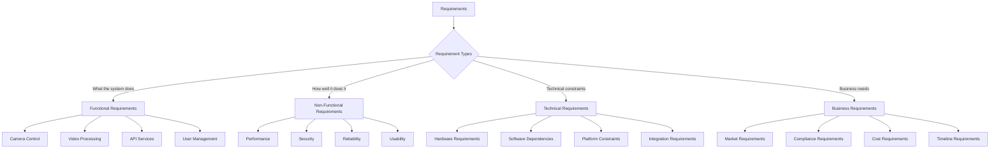

# Requirements

**Comprehensive system requirements specification for the RotorDream camera system, covering functional, non-functional, technical, and business requirements.**

## Overview

This document defines all requirements for the RotorDream camera system, providing a complete specification for system capabilities, constraints, and quality attributes.



## Functional Requirements

### FR-001: Camera Control and Configuration

#### FR-001.1: Camera Device Management
**Priority**: Critical  
**Description**: The system shall provide comprehensive camera device management capabilities.

**Requirements**:
- **FR-001.1.1**: System shall automatically detect available camera devices on startup
- **FR-001.1.2**: System shall support V4L2-compatible camera devices
- **FR-001.1.3**: System shall support USB UVC camera devices
- **FR-001.1.4**: System shall provide device capability enumeration
- **FR-001.1.5**: System shall handle device connection/disconnection events
- **FR-001.1.6**: System shall support multiple camera devices simultaneously

**Acceptance Criteria**:
- Camera detection completes within 5 seconds of system startup
- All connected V4L2/UVC devices are properly identified
- Device capabilities (resolutions, formats, frame rates) are accurately reported
- System gracefully handles device disconnection without crashing
- Support for minimum 4 concurrent camera devices

#### FR-001.2: Video Resolution and Quality Control
**Priority**: High  
**Description**: The system shall provide configurable video resolution and quality settings.

**Requirements**:
- **FR-001.2.1**: Support for standard resolutions: 640x480, 1280x720, 1920x1080, 3840x2160
- **FR-001.2.2**: Support for custom resolution configuration within device limits
- **FR-001.2.3**: Configurable frame rates: 15, 25, 30, 60 FPS
- **FR-001.2.4**: Adjustable video quality/bitrate settings
- **FR-001.2.5**: Real-time resolution changes without system restart
- **FR-001.2.6**: Automatic fallback to supported resolutions if requested unavailable

**Acceptance Criteria**:
- Resolution changes applied within 3 seconds
- Frame rate adjustments take effect immediately
- Quality settings affect file size appropriately
- Unsupported settings gracefully rejected with error message

#### FR-001.3: Video Format Support
**Priority**: High  
**Description**: The system shall support multiple video formats for streaming and recording.

**Requirements**:
- **FR-001.3.1**: H.264 video encoding for streaming and recording
- **FR-001.3.2**: MJPEG support for legacy compatibility
- **FR-001.3.3**: Raw YUV format support for uncompressed capture
- **FR-001.3.4**: Configurable compression levels for each format
- **FR-001.3.5**: Format-specific parameter configuration (GOP size, profile, level)

**Acceptance Criteria**:
- All specified formats produce valid video output
- Format switching without service interruption
- Compression parameters affect output as expected
- Format compatibility with standard players/viewers

### FR-002: Video Streaming

#### FR-002.1: RTSP Streaming Service
**Priority**: Critical  
**Description**: The system shall provide RTSP-based video streaming capabilities.

**Requirements**:
- **FR-002.1.1**: RTSP server on configurable port (default 554)
- **FR-002.1.2**: Support for multiple concurrent RTSP clients
- **FR-002.1.3**: RTP/UDP and RTP/TCP transport options
- **FR-002.1.4**: RTSP authentication support
- **FR-002.1.5**: Multiple streaming profiles (live, playback)
- **FR-002.1.6**: Stream URL format: `rtsp://host:port/[profile]`

**Acceptance Criteria**:
- RTSP service starts within 2 seconds
- Minimum 10 concurrent clients supported
- Authentication properly restricts access
- Standard RTSP clients can connect and view streams
- Stream latency under 500ms on local network

#### FR-002.2: WebRTC Streaming
**Priority**: Medium  
**Description**: The system shall provide WebRTC streaming for browser-based clients.

**Requirements**:
- **FR-002.2.1**: WebRTC peer connection establishment
- **FR-002.2.2**: ICE candidate exchange via WebSocket signaling
- **FR-002.2.3**: STUN/TURN server support for NAT traversal
- **FR-002.2.4**: Adaptive bitrate streaming based on network conditions
- **FR-002.2.5**: Browser compatibility (Chrome, Firefox, Safari, Edge)

**Acceptance Criteria**:
- WebRTC connection established within 5 seconds
- Stream quality adapts to network conditions
- Works through NAT/firewall configurations
- Low latency streaming (under 200ms)

### FR-003: Video Recording and Storage

#### FR-003.1: Local Recording
**Priority**: High  
**Description**: The system shall provide local video recording capabilities.

**Requirements**:
- **FR-003.1.1**: On-demand recording start/stop via API
- **FR-003.1.2**: Scheduled recording based on time/date rules
- **FR-003.1.3**: Motion-triggered recording
- **FR-003.1.4**: Multiple video container formats (MP4, AVI, MKV)
- **FR-003.1.5**: Configurable recording duration and segmentation
- **FR-003.1.6**: Automatic file naming with timestamp

**Acceptance Criteria**:
- Recording starts within 1 second of command
- Files saved in specified format and location
- Automatic cleanup based on retention policies
- Recording continues during system restart (recovery)

#### FR-003.2: Recording Management
**Priority**: High  
**Description**: The system shall provide comprehensive recording management.

**Requirements**:
- **FR-003.2.1**: Recording file listing and metadata retrieval
- **FR-003.2.2**: Recording file download via HTTP API
- **FR-003.2.3**: Recording file deletion and cleanup
- **FR-003.2.4**: Storage space monitoring and alerts
- **FR-003.2.5**: Automatic retention policy enforcement
- **FR-003.2.6**: Recording file integrity verification

**Acceptance Criteria**:
- File operations complete within reasonable time
- Metadata accurately reflects recording content
- Storage monitoring provides accurate space usage
- Retention policies automatically enforced

### FR-004: API Services

#### FR-004.1: REST API
**Priority**: Critical  
**Description**: The system shall provide a comprehensive REST API for all operations.

**Requirements**:
- **FR-004.1.1**: RESTful HTTP API following OpenAPI 3.0 specification
- **FR-004.1.2**: JSON request/response format
- **FR-004.1.3**: Comprehensive endpoint coverage for all functionality
- **FR-004.1.4**: Proper HTTP status codes and error responses
- **FR-004.1.5**: API versioning support
- **FR-004.1.6**: Request/response validation

**API Endpoints Required**:
```
GET    /api/v1/status              - System status
GET    /api/v1/camera/info         - Camera information
POST   /api/v1/camera/start        - Start streaming
POST   /api/v1/camera/stop         - Stop streaming
PUT    /api/v1/camera/settings     - Update settings
GET    /api/v1/camera/settings     - Get settings
POST   /api/v1/camera/snapshot     - Capture snapshot
GET    /api/v1/recordings          - List recordings
DELETE /api/v1/recordings/{id}     - Delete recording
POST   /api/v1/recording/start     - Start recording
POST   /api/v1/recording/stop      - Stop recording
GET    /api/v1/users               - List users
POST   /api/v1/users               - Create user
PUT    /api/v1/users/{id}          - Update user
DELETE /api/v1/users/{id}          - Delete user
POST   /api/v1/auth/login          - User login
POST   /api/v1/auth/logout         - User logout
```

#### FR-004.2: WebSocket API
**Priority**: High  
**Description**: The system shall provide real-time communication via WebSocket API.

**Requirements**:
- **FR-004.2.1**: WebSocket endpoint for real-time communication
- **FR-004.2.2**: Event subscription/unsubscription mechanism
- **FR-004.2.3**: Real-time status updates
- **FR-004.2.4**: Command execution via WebSocket
- **FR-004.2.5**: Message authentication and authorization
- **FR-004.2.6**: Connection state management and recovery

**Supported Events**:
- Camera status changes
- Recording start/stop events
- Motion detection events
- System alerts and errors
- Configuration changes
- User authentication events

#### FR-004.3: ONVIF Protocol Support
**Priority**: Medium  
**Description**: The system shall provide ONVIF protocol compliance for VMS integration.

**Requirements**:
- **FR-004.3.1**: ONVIF Profile S compliance
- **FR-004.3.2**: Device discovery via WS-Discovery
- **FR-004.3.3**: Device service implementation
- **FR-004.3.4**: Media service implementation
- **FR-004.3.5**: PTZ service implementation (if hardware supports)
- **FR-004.3.6**: Event service implementation

**ONVIF Services**:
- Device Service: Device information and capabilities
- Media Service: Video streaming profiles and configuration
- PTZ Service: Pan/tilt/zoom control (hardware dependent)
- Event Service: Event handling and notifications

### FR-005: User Management and Authentication

#### FR-005.1: User Account Management
**Priority**: High  
**Description**: The system shall provide comprehensive user account management.

**Requirements**:
- **FR-005.1.1**: User registration and account creation
- **FR-005.1.2**: User profile management (username, email, role)
- **FR-005.1.3**: Password management and reset functionality
- **FR-005.1.4**: Account activation/deactivation
- **FR-005.1.5**: User role assignment and management
- **FR-005.1.6**: Account audit logging

**User Roles**:
- **Administrator**: Full system access and user management
- **Operator**: Camera control and configuration access
- **Viewer**: Read-only access to streams and recordings

#### FR-005.2: Authentication and Session Management
**Priority**: Critical  
**Description**: The system shall provide secure authentication and session management.

**Requirements**:
- **FR-005.2.1**: JWT-based authentication tokens
- **FR-005.2.2**: Configurable session timeout
- **FR-005.2.3**: Password complexity requirements
- **FR-005.2.4**: Account lockout after failed attempts
- **FR-005.2.5**: Two-factor authentication support
- **FR-005.2.6**: Session invalidation on logout

**Password Requirements**:
- Minimum 8 characters
- Mix of uppercase and lowercase letters
- At least one number
- At least one special character
- Cannot be previous 5 passwords

### FR-006: Configuration Management

#### FR-006.1: System Configuration
**Priority**: High  
**Description**: The system shall provide comprehensive configuration management.

**Requirements**:
- **FR-006.1.1**: JSON-based configuration files
- **FR-006.1.2**: Runtime configuration updates without restart
- **FR-006.1.3**: Configuration validation and error handling
- **FR-006.1.4**: Configuration backup and restore
- **FR-006.1.5**: Default configuration templates
- **FR-006.1.6**: Configuration change auditing

**Configuration Categories**:
- Network settings (ports, protocols, addresses)
- Camera settings (resolution, format, quality)
- Storage settings (paths, retention, limits)
- Security settings (authentication, encryption)
- Logging settings (levels, outputs, rotation)

## Non-Functional Requirements

### NFR-001: Performance Requirements

#### NFR-001.1: Video Streaming Performance
**Priority**: Critical  
**Description**: The system shall meet specified performance criteria for video streaming.

**Requirements**:
- **NFR-001.1.1**: Stream latency shall not exceed 500ms on local network
- **NFR-001.1.2**: System shall support minimum 4 concurrent streams at 1080p@30fps
- **NFR-001.1.3**: Frame rate shall remain stable within ±5% of configured value
- **NFR-001.1.4**: CPU usage shall not exceed 80% during normal streaming
- **NFR-001.1.5**: Memory usage shall not exceed 512MB for single stream
- **NFR-001.1.6**: Network bandwidth usage shall be configurable and enforced

#### NFR-001.2: API Response Performance
**Priority**: High  
**Description**: The system shall provide responsive API performance.

**Requirements**:
- **NFR-001.2.1**: GET requests shall respond within 100ms
- **NFR-001.2.2**: POST/PUT requests shall respond within 500ms
- **NFR-001.2.3**: WebSocket messages shall be delivered within 50ms
- **NFR-001.2.4**: API shall support minimum 50 concurrent requests
- **NFR-001.2.5**: Database queries shall complete within 200ms
- **NFR-001.2.6**: File operations shall not block API responses

#### NFR-001.3: System Resource Usage
**Priority**: High  
**Description**: The system shall operate within specified resource constraints.

**Requirements**:
- **NFR-001.3.1**: Total system memory usage shall not exceed 2GB
- **NFR-001.3.2**: Storage space growth shall be predictable and manageable
- **NFR-001.3.3**: Network bandwidth usage shall be optimized
- **NFR-001.3.4**: Battery life impact minimized for mobile deployments
- **NFR-001.3.5**: Heat generation shall be within acceptable limits
- **NFR-001.3.6**: System shall operate on ARM and x86 architectures

### NFR-002: Security Requirements

#### NFR-002.1: Data Security
**Priority**: Critical  
**Description**: The system shall protect all data with appropriate security measures.

**Requirements**:
- **NFR-002.1.1**: All network communication shall be encrypted using TLS 1.2+
- **NFR-002.1.2**: User passwords shall be hashed using bcrypt with minimum 12 rounds
- **NFR-002.1.3**: Sensitive configuration data shall be encrypted at rest
- **NFR-002.1.4**: API keys and tokens shall be securely generated and stored
- **NFR-002.1.5**: Recording files shall support optional encryption
- **NFR-002.1.6**: Database connections shall use encryption

#### NFR-002.2: Access Control
**Priority**: Critical  
**Description**: The system shall implement robust access control mechanisms.

**Requirements**:
- **NFR-002.2.1**: All API endpoints shall require authentication
- **NFR-002.2.2**: Role-based access control shall be enforced
- **NFR-002.2.3**: Administrative functions shall require elevated privileges
- **NFR-002.2.4**: Session management shall prevent token reuse
- **NFR-002.2.5**: Rate limiting shall prevent abuse
- **NFR-002.2.6**: Audit logging shall track all access attempts

#### NFR-002.3: Security Compliance
**Priority**: High  
**Description**: The system shall comply with security standards and best practices.

**Requirements**:
- **NFR-002.3.1**: Input validation shall prevent injection attacks
- **NFR-002.3.2**: Output encoding shall prevent XSS attacks
- **NFR-002.3.3**: CSRF protection shall be implemented
- **NFR-002.3.4**: Security headers shall be included in HTTP responses
- **NFR-002.3.5**: Regular security updates shall be supported
- **NFR-002.3.6**: Penetration testing compatibility shall be maintained

### NFR-003: Reliability Requirements

#### NFR-003.1: System Availability
**Priority**: High  
**Description**: The system shall provide high availability and reliability.

**Requirements**:
- **NFR-003.1.1**: System uptime shall exceed 99.5% (monthly)
- **NFR-003.1.2**: Planned maintenance windows shall not exceed 4 hours
- **NFR-003.1.3**: System shall recover from failures within 30 seconds
- **NFR-003.1.4**: No single point of failure for critical components
- **NFR-003.1.5**: Graceful degradation during component failures
- **NFR-003.1.6**: Health monitoring and alerting implemented

#### NFR-003.2: Error Handling and Recovery
**Priority**: High  
**Description**: The system shall handle errors gracefully and recover automatically.

**Requirements**:
- **NFR-003.2.1**: All errors shall be properly logged with context
- **NFR-003.2.2**: System shall recover from hardware disconnections
- **NFR-003.2.3**: Network interruptions shall not cause system failure
- **NFR-003.2.4**: Corrupted files shall be detected and isolated
- **NFR-003.2.5**: Resource exhaustion shall be handled gracefully
- **NFR-003.2.6**: Automatic restart mechanisms for critical services

#### NFR-003.3: Data Integrity
**Priority**: Critical  
**Description**: The system shall maintain data integrity under all conditions.

**Requirements**:
- **NFR-003.3.1**: Recording files shall include integrity checksums
- **NFR-003.3.2**: Configuration changes shall be atomic
- **NFR-003.3.3**: Database transactions shall maintain ACID properties
- **NFR-003.3.4**: File corruption shall be detected and reported
- **NFR-003.3.5**: Backup and restore operations shall verify integrity
- **NFR-003.3.6**: System state shall be consistent across restarts

### NFR-004: Usability Requirements

#### NFR-004.1: User Interface
**Priority**: Medium  
**Description**: The system shall provide intuitive and efficient user interfaces.

**Requirements**:
- **NFR-004.1.1**: Web interface shall be responsive and mobile-friendly
- **NFR-004.1.2**: API documentation shall be comprehensive and interactive
- **NFR-004.1.3**: Error messages shall be clear and actionable
- **NFR-004.1.4**: Configuration interfaces shall provide validation feedback
- **NFR-004.1.5**: System status shall be clearly visible
- **NFR-004.1.6**: Help documentation shall be accessible

#### NFR-004.2: Operational Usability
**Priority**: Medium  
**Description**: The system shall be easy to deploy, configure, and maintain.

**Requirements**:
- **NFR-004.2.1**: Installation shall be automated with minimal user input
- **NFR-004.2.2**: Configuration shall use self-documenting formats
- **NFR-004.2.3**: Logs shall be structured and searchable
- **NFR-004.2.4**: Monitoring integration shall be straightforward
- **NFR-004.2.5**: Updates shall be non-disruptive when possible
- **NFR-004.2.6**: Troubleshooting guides shall be comprehensive

## Technical Requirements

### TR-001: Hardware Requirements

#### TR-001.1: Minimum Hardware Specifications
**Priority**: Critical  
**Description**: The system shall operate on specified minimum hardware.

**Requirements**:
- **TR-001.1.1**: ARM64 or x86_64 processor architecture
- **TR-001.1.2**: Minimum 2GB RAM for basic operation
- **TR-001.1.3**: Minimum 8GB storage for system and short-term recordings
- **TR-001.1.4**: USB 2.0+ or integrated camera interface
- **TR-001.1.5**: Ethernet or Wi-Fi network connectivity
- **TR-001.1.6**: Optional: GPIO pins for external device control

#### TR-001.2: Recommended Hardware Specifications
**Priority**: Medium  
**Description**: Recommended hardware for optimal performance.

**Requirements**:
- **TR-001.2.1**: Multi-core processor (4+ cores) for concurrent streams
- **TR-001.2.2**: 4GB+ RAM for multiple streams and analytics
- **TR-001.2.3**: SSD storage for improved I/O performance
- **TR-001.2.4**: Gigabit Ethernet for high-quality streaming
- **TR-001.2.5**: Hardware video encoding support (e.g., Intel Quick Sync)
- **TR-001.2.6**: UPS or backup power for reliability

#### TR-001.3: Camera Hardware Requirements
**Priority**: High  
**Description**: Supported camera hardware specifications.

**Requirements**:
- **TR-001.3.1**: USB Video Class (UVC) compatible cameras
- **TR-001.3.2**: Video4Linux2 (V4L2) compatible devices
- **TR-001.3.3**: Minimum resolution support: 640x480
- **TR-001.3.4**: Preferred resolution support: 1920x1080
- **TR-001.3.5**: Minimum frame rate: 15 FPS
- **TR-001.3.6**: Preferred frame rate: 30 FPS

### TR-002: Software Dependencies

#### TR-002.1: Operating System Requirements
**Priority**: Critical  
**Description**: Supported operating system platforms.

**Requirements**:
- **TR-002.1.1**: Linux kernel 4.14+ (Ubuntu 18.04+, Debian 10+, CentOS 8+)
- **TR-002.1.2**: Docker container support
- **TR-002.1.3**: SystemD service management
- **TR-002.1.4**: V4L2 kernel modules loaded
- **TR-002.1.5**: Network stack with TCP/UDP support
- **TR-002.1.6**: File system with extended attributes support

#### TR-002.2: Runtime Dependencies
**Priority**: Critical  
**Description**: Required runtime libraries and tools.

**Requirements**:
- **TR-002.2.1**: GStreamer 1.14+ multimedia framework
- **TR-002.2.2**: FFmpeg 4.0+ for video processing
- **TR-002.2.3**: OpenSSL 1.1+ for cryptography
- **TR-002.2.4**: SQLite 3.24+ for data storage
- **TR-002.2.5**: libv4l2 for camera device access
- **TR-002.2.6**: libc6 2.27+ standard C library

#### TR-002.3: Development Dependencies
**Priority**: Medium  
**Description**: Required tools for building and development.

**Requirements**:
- **TR-002.3.1**: Nim compiler 1.6.14+
- **TR-002.3.2**: GCC 7+ or Clang 6+ for C dependencies
- **TR-002.3.3**: CMake 3.10+ for build configuration
- **TR-002.3.4**: Git for version control
- **TR-002.3.5**: pkg-config for library detection
- **TR-002.3.6**: Make for build automation

### TR-003: Network Requirements

#### TR-003.1: Network Protocols
**Priority**: Critical  
**Description**: Required network protocol support.

**Requirements**:
- **TR-003.1.1**: HTTP/HTTPS protocol support
- **TR-003.1.2**: WebSocket protocol support
- **TR-003.1.3**: RTSP/RTP protocol support
- **TR-003.1.4**: UDP multicast support for discovery
- **TR-003.1.5**: TCP reliable transport support
- **TR-003.1.6**: DNS resolution support

#### TR-003.2: Network Configuration
**Priority**: High  
**Description**: Network configuration requirements.

**Requirements**:
- **TR-003.2.1**: Configurable port assignments
- **TR-003.2.2**: Static IP address configuration
- **TR-003.2.3**: DHCP client support
- **TR-003.2.4**: Firewall rule configuration
- **TR-003.2.5**: NAT traversal capabilities
- **TR-003.2.6**: Quality of Service (QoS) support

### TR-004: Integration Requirements

#### TR-004.1: Video Management System Integration
**Priority**: High  
**Description**: Requirements for VMS integration capabilities.

**Requirements**:
- **TR-004.1.1**: ONVIF Profile S compliance
- **TR-004.1.2**: RTSP streaming compatibility
- **TR-004.1.3**: Standard video format support
- **TR-004.1.4**: PTZ control interface (if supported)
- **TR-004.1.5**: Event notification mechanisms
- **TR-004.1.6**: Device discovery protocols

#### TR-004.2: Third-Party API Integration
**Priority**: Medium  
**Description**: Requirements for external system integration.

**Requirements**:
- **TR-004.2.1**: RESTful API client capabilities
- **TR-004.2.2**: Webhook delivery mechanisms
- **TR-004.2.3**: MQTT message broker support
- **TR-004.2.4**: Database integration options
- **TR-004.2.5**: Cloud service API support
- **TR-004.2.6**: Authentication protocol support (OAuth, SAML)

## Business Requirements

### BR-001: Market Requirements

#### BR-001.1: Target Markets
**Priority**: High  
**Description**: Primary target markets and use cases.

**Requirements**:
- **BR-001.1.1**: Small to medium business surveillance
- **BR-001.1.2**: Home automation and security
- **BR-001.1.3**: Educational institution monitoring
- **BR-001.1.4**: Retail and hospitality surveillance
- **BR-001.1.5**: Industrial facility monitoring
- **BR-001.1.6**: IoT and edge computing applications

#### BR-001.2: Competitive Positioning
**Priority**: Medium  
**Description**: Competitive advantages and differentiators.

**Requirements**:
- **BR-001.2.1**: Open source licensing for transparency
- **BR-001.2.2**: High-performance native code implementation
- **BR-001.2.3**: Comprehensive API for integration
- **BR-001.2.4**: Low resource consumption
- **BR-001.2.5**: Standards-based interoperability
- **BR-001.2.6**: Flexible deployment options

### BR-002: Compliance Requirements

#### BR-002.1: Data Protection Compliance
**Priority**: Critical  
**Description**: Data protection and privacy regulation compliance.

**Requirements**:
- **BR-002.1.1**: GDPR compliance for European deployments
- **BR-002.1.2**: CCPA compliance for California deployments
- **BR-002.1.3**: Data retention policy configuration
- **BR-002.1.4**: Right to be forgotten implementation
- **BR-002.1.5**: Data portability features
- **BR-002.1.6**: Privacy by design principles

#### BR-002.2: Industry Standards Compliance
**Priority**: High  
**Description**: Relevant industry standard compliance.

**Requirements**:
- **BR-002.2.1**: ONVIF Profile S certification eligible
- **BR-002.2.2**: RTSP RFC 2326 compliance
- **BR-002.2.3**: HTTP RFC 7230-7235 compliance
- **BR-002.2.4**: WebSocket RFC 6455 compliance
- **BR-002.2.5**: TLS RFC 8446 compliance
- **BR-002.2.6**: OAuth 2.0 RFC 6749 compliance

### BR-003: Cost and Resource Requirements

#### BR-003.1: Development Cost Constraints
**Priority**: Medium  
**Description**: Development budget and resource constraints.

**Requirements**:
- **BR-003.1.1**: Open source dependencies to minimize licensing costs
- **BR-003.1.2**: Single developer capability for core features
- **BR-003.1.3**: Minimal external service dependencies
- **BR-003.1.4**: Efficient development toolchain
- **BR-003.1.5**: Automated testing to reduce manual QA costs
- **BR-003.1.6**: Community contribution enablement

#### BR-003.2: Operational Cost Optimization
**Priority**: Medium  
**Description**: Minimize operational costs for end users.

**Requirements**:
- **BR-003.2.1**: Low power consumption for embedded deployments
- **BR-003.2.2**: Minimal bandwidth usage with configurable quality
- **BR-003.2.3**: Efficient storage utilization
- **BR-003.2.4**: Automated maintenance to reduce admin overhead
- **BR-003.2.5**: Cloud deployment cost optimization
- **BR-003.2.6**: Hardware requirement flexibility

### BR-004: Timeline and Delivery Requirements

#### BR-004.1: Development Phases
**Priority**: High  
**Description**: Phased development and delivery timeline.

**Requirements**:
- **BR-004.1.1**: Phase 1: Core camera functionality (Month 1-2)
- **BR-004.1.2**: Phase 2: Streaming and API development (Month 3-4)
- **BR-004.1.3**: Phase 3: User management and security (Month 5-6)
- **BR-004.1.4**: Phase 4: ONVIF and integration features (Month 7-8)
- **BR-004.1.5**: Phase 5: Testing and documentation (Month 9-10)
- **BR-004.1.6**: Phase 6: Release preparation and deployment (Month 11-12)

#### BR-004.2: Milestone Requirements
**Priority**: Medium  
**Description**: Key milestone deliverables and acceptance criteria.

**Requirements**:
- **BR-004.2.1**: MVP: Basic camera streaming and recording
- **BR-004.2.2**: Alpha: Full API functionality with authentication
- **BR-004.2.3**: Beta: ONVIF compliance and third-party integration
- **BR-004.2.4**: RC: Complete testing and documentation
- **BR-004.2.5**: GA: Production-ready release with support
- **BR-004.2.6**: Updates: Regular maintenance releases

## Requirements Traceability Matrix

| Requirement ID | Priority | Category | Validation Method | Test Coverage |
|---------------|----------|----------|-------------------|---------------|
| FR-001.1.1 | Critical | Functional | Unit Test | ✓ |
| FR-001.1.2 | Critical | Functional | Integration Test | ✓ |
| FR-001.2.1 | High | Functional | System Test | ✓ |
| FR-002.1.1 | Critical | Functional | Integration Test | ✓ |
| FR-003.1.1 | High | Functional | System Test | ✓ |
| FR-004.1.1 | Critical | Functional | API Test | ✓ |
| FR-005.1.1 | High | Functional | Security Test | ✓ |
| NFR-001.1.1 | Critical | Performance | Performance Test | ✓ |
| NFR-002.1.1 | Critical | Security | Security Test | ✓ |
| NFR-003.1.1 | High | Reliability | Reliability Test | ✓ |
| TR-001.1.1 | Critical | Technical | Compatibility Test | ✓ |
| BR-001.1.1 | High | Business | Market Validation | ○ |

**Legend**: ✓ = Covered, ○ = Partial Coverage, ✗ = Not Covered

## Requirements Validation

### Validation Methods

1. **Unit Testing**: Individual component functionality
2. **Integration Testing**: Component interaction testing
3. **System Testing**: End-to-end system validation
4. **Performance Testing**: Non-functional requirement validation
5. **Security Testing**: Security requirement compliance
6. **User Acceptance Testing**: Business requirement validation

### Acceptance Criteria

Each requirement must meet the following acceptance criteria:
- Functionality implemented as specified
- Performance meets or exceeds targets
- Security measures properly implemented
- Error handling covers edge cases
- Documentation complete and accurate
- Test coverage meets minimum threshold (80%)

## Related Documentation

- [Architecture Overview](../architecture/overview.md) - System architecture
- [API Reference](../api/http-api.md) - API implementation
- [Test Cases](../testing/test-cases.md) - Validation test cases
- [Performance](../operations/performance.md) - Performance specifications

---

*Comprehensive requirements specification defining all aspects of the RotorDream camera system functionality, quality, and constraints*
