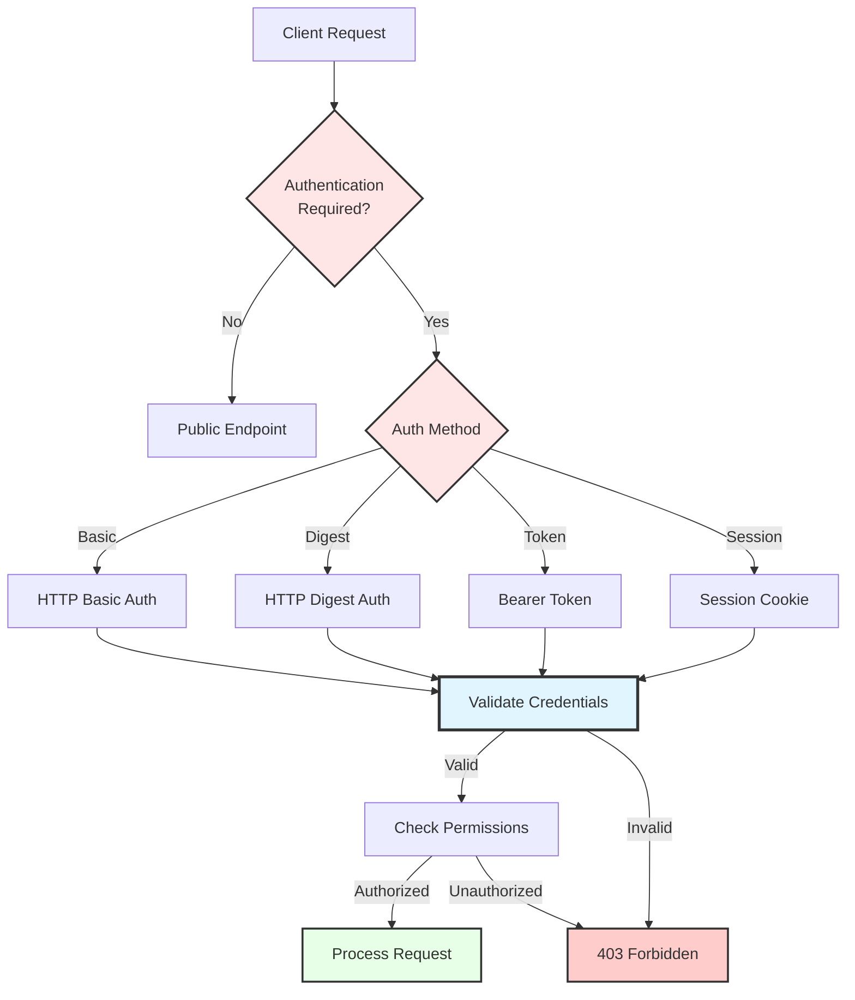

# Authentication

## Overview

The C Pro camera system implements a multi-layered authentication system to secure access to device functionality, video streams, and configuration. Authentication is required for web interface, API endpoints, ONVIF services, and RTSP streams.

## Authentication Architecture



## User Management

### User Storage

```nim
# src/state/rc_user.nim
proc initUserManagement*() =
  initObservable("users",
    permissionRead = {User_r, User_rw},
    permissionWrite = {User_rw},
    save = true,
    default = %{}
  )
  
  initObservable("userPasswords",
    permissionRead = {},  # Never readable
    permissionWrite = {User_rw},
    save = true,
    default = %{}
  )
```

### Default Users

**Administrator** (created on first boot):
```json
{
  "username": "admin",
  "role": "administrator",
  "permissions": ["*"],  // All permissions
  "created": "2025-01-01T00:00:00Z",
  "lastLogin": null
}
```

**Operator** (optional):
```json
{
  "username": "operator",
  "role": "operator",
  "permissions": ["Media_rw", "Device_r", "Storage_r"],
  "created": "2025-01-01T00:00:00Z"
}
```

**Viewer** (read-only):
```json
{
  "username": "viewer",
  "role": "viewer",
  "permissions": ["Media_r", "Device_r"],
  "created": "2025-01-01T00:00:00Z"
}
```

### Password Hashing

```nim
import std/sha1
import std/base64

proc hashPassword*(password: string, salt: string): string =
  # Use SHA-256 with salt
  let combined = password & salt
  let hash = secureHash(combined)
  result = base64.encode($hash)

proc generateSalt*(): string =
  # Generate random salt
  var bytes: array[16, byte]
  randomize()
  for i in 0..<16:
    bytes[i] = rand(255).byte
  result = base64.encode(bytes)

proc createUser*(username, password: string, role: string): bool =
  # Check if user exists
  let users = State.get("users").value
  if users.hasKey(username):
    return false
  
  # Generate salt and hash password
  let salt = generateSalt()
  let hash = hashPassword(password, salt)
  
  # Store user
  users[username] = %{
    "role": %role,
    "salt": %salt,
    "created": %now().format("yyyy-MM-dd'T'HH:mm:ss'Z'")
  }
  State.get("users").updateValue(users)
  
  # Store password hash separately
  let passwords = State.get("userPasswords").value
  passwords[username] = %hash
  State.get("userPasswords").updateValue(passwords)
  
  return true
```

## Authentication Methods

### HTTP Basic Authentication

Used for:
- Web interface login
- RTSP streams
- REST API calls
- ONVIF services

**Implementation**:
```nim
proc validateBasicAuth*(authHeader: string): Option[string] =
  # Parse "Basic base64(username:password)"
  if not authHeader.startsWith("Basic "):
    return none(string)
  
  let encoded = authHeader[6..^1]
  let decoded = base64.decode(encoded)
  let parts = decoded.split(':', 1)
  
  if parts.len != 2:
    return none(string)
  
  let username = parts[0]
  let password = parts[1]
  
  if validateCredentials(username, password):
    return some(username)
  
  return none(string)

proc validateCredentials*(username, password: string): bool =
  let users = State.get("users").value
  if not users.hasKey(username):
    return false
  
  let salt = users[username]["salt"].getStr
  let expectedHash = State.get("userPasswords").value[username].getStr
  let actualHash = hashPassword(password, salt)
  
  return expectedHash == actualHash
```

### HTTP Digest Authentication

Used for:
- ONVIF authentication
- Enhanced security for RTSP

**Implementation**:
```nim
proc validateDigestAuth*(authHeader: string, method: string, uri: string): Option[string] =
  # Parse digest authentication header
  let params = parseDigestParams(authHeader)
  
  let username = params.getOrDefault("username", "")
  let realm = params.getOrDefault("realm", "C Pro")
  let nonce = params.getOrDefault("nonce", "")
  let response = params.getOrDefault("response", "")
  
  # Calculate expected response
  let users = State.get("users").value
  if not users.hasKey(username):
    return none(string)
  
  let password = getPassword(username)  # Internal function
  let ha1 = secureHash(username & ":" & realm & ":" & password)
  let ha2 = secureHash(method & ":" & uri)
  let expectedResponse = secureHash($ha1 & ":" & nonce & ":" & $ha2)
  
  if $expectedResponse == response:
    return some(username)
  
  return none(string)
```

### Bearer Token Authentication

Used for:
- API tokens
- Long-lived access
- Service-to-service communication

**Token Generation**:
```nim
import std/times
import std/random

type
  ApiToken* = object
    token*: string
    username*: string
    created*: Time
    expires*: Time
    permissions*: set[StatePermission]

proc generateApiToken*(username: string, durationDays: int): ApiToken =
  # Generate random token
  randomize()
  var tokenBytes: array[32, byte]
  for i in 0..<32:
    tokenBytes[i] = rand(255).byte
  
  result.token = base64.encode(tokenBytes)
  result.username = username
  result.created = now()
  result.expires = now() + initDuration(days = durationDays)
  
  # Copy user permissions
  let user = State.get("users").value[username]
  result.permissions = getUserPermissions(username)

proc validateBearerToken*(authHeader: string): Option[string] =
  if not authHeader.startsWith("Bearer "):
    return none(string)
  
  let token = authHeader[7..^1]
  
  # Look up token
  let tokens = State.get("apiTokens").value
  if not tokens.hasKey(token):
    return none(string)
  
  let tokenData = tokens[token]
  let expires = tokenData["expires"].getInt
  
  if now().toUnix() > expires:
    # Token expired
    return none(string)
  
  return some(tokenData["username"].getStr)
```

### Session Cookie Authentication

Used for:
- Web interface persistence
- WebSocket connections

**Session Management**:
```nim
# src/servers/clients.nim
type
  SessionData* = object
    id*: string
    username*: string
    created*: Time
    lastActivity*: Time
    ipAddress*: string

var sessions*: Table[string, SessionData]

proc createSession*(username: string, ipAddress: string): string =
  let sessionId = generateSecureRandomString(32)
  
  sessions[sessionId] = SessionData(
    id: sessionId,
    username: username,
    created: now(),
    lastActivity: now(),
    ipAddress: ipAddress
  )
  
  # Save sessions to LocalStorage
  saveSessionsToStorage()
  
  return sessionId

proc validateSession*(sessionId: string): Option[string] =
  if not sessions.hasKey(sessionId):
    return none(string)
  
  var session = sessions[sessionId]
  
  # Check session timeout (30 minutes of inactivity)
  if (now() - session.lastActivity).inMinutes > 30:
    sessions.del(sessionId)
    return none(string)
  
  # Update last activity
  session.lastActivity = now()
  sessions[sessionId] = session
  
  return some(session.username)
```

## Authorization & Permissions

### Permission Model

```nim
# src/state/permissions.nim
type
  StatePermission* = enum
    # Device permissions
    Device_r     # Read device info
    Device_rw    # Control device

    # Media permissions
    Media_r      # View media
    Media_rw     # Record/delete media

    # User permissions
    User_r       # View users
    User_rw      # Manage users

    # Network permissions
    Network_r    # View network settings
    Network_rw   # Configure network

    # Storage permissions
    Storage_r    # View storage info
    Storage_rw   # Manage storage

    # System permissions
    System_r     # View system info
    System_rw    # System configuration

    # Firmware permissions
    FirmwareUpdate_r   # View firmware info
    FirmwareUpdate_rw  # Update firmware

    # Reboot permission
    Reboot_rw    # Reboot system

  StatePermissions* = set[StatePermission]
```

### Role-Based Access

```nim
proc getRolePermissions*(role: string): StatePermissions =
  case role:
  of "administrator":
    result = {
      Device_r, Device_rw,
      Media_r, Media_rw,
      User_r, User_rw,
      Network_r, Network_rw,
      Storage_r, Storage_rw,
      System_r, System_rw,
      FirmwareUpdate_r, FirmwareUpdate_rw,
      Reboot_rw
    }
  
  of "operator":
    result = {
      Device_r, Device_rw,
      Media_r, Media_rw,
      Storage_r,
      System_r,
      Reboot_rw
    }
  
  of "viewer":
    result = {
      Device_r,
      Media_r,
      Storage_r,
      System_r
    }
  
  else:
    result = {}
```

### Permission Checking

```nim
proc hasPermission*(username: string, permission: StatePermission): bool =
  let users = State.get("users").value
  if not users.hasKey(username):
    return false
  
  let role = users[username]["role"].getStr
  let permissions = getRolePermissions(role)
  
  return permission in permissions

proc checkStatePermission*(observable: Observable, username: string, write: bool): bool =
  let permissions = getUserPermissions(username)
  
  if write:
    return permissions.canWrite(observable)
  else:
    return permissions.canRead(observable)
```

## Password Policies

### Password Requirements

```nim
proc validatePasswordStrength*(password: string): (bool, string) =
  # Minimum length
  if password.len < 8:
    return (false, "Password must be at least 8 characters")
  
  # Require uppercase
  if not password.anyIt(it.isUpperAscii):
    return (false, "Password must contain uppercase letter")
  
  # Require lowercase
  if not password.anyIt(it.isLowerAscii):
    return (false, "Password must contain lowercase letter")
  
  # Require digit
  if not password.anyIt(it.isDigit):
    return (false, "Password must contain digit")
  
  # Require special character
  if not password.anyIt(not it.isAlphaNumeric):
    return (false, "Password must contain special character")
  
  return (true, "")
```

### Password Change

```nim
proc changePassword*(username: string, oldPassword: string, newPassword: string): bool =
  # Validate old password
  if not validateCredentials(username, oldPassword):
    return false
  
  # Validate new password strength
  let (valid, msg) = validatePasswordStrength(newPassword)
  if not valid:
    StateLogger.error("Password change failed: ", msg)
    return false
  
  # Generate new salt and hash
  let salt = generateSalt()
  let hash = hashPassword(newPassword, salt)
  
  # Update user
  let users = State.get("users").value
  users[username]["salt"] = %salt
  State.get("users").updateValue(users)
  
  # Update password
  let passwords = State.get("userPasswords").value
  passwords[username] = %hash
  State.get("userPasswords").updateValue(passwords)
  
  # Invalidate all sessions for this user
  invalidateUserSessions(username)
  
  return true
```

## API Authentication Examples

### cURL with Basic Auth

```bash
# Login and get session
curl -u admin:password http://rotoclear.local:8080/api/login

# Access protected endpoint
curl -u admin:password http://rotoclear.local:8080/api/recording/start
```

### Python with Bearer Token

```python
import requests

# Get API token
response = requests.post(
    'http://rotoclear.local:8080/api/token',
    auth=('admin', 'password'),
    json={'duration_days': 30}
)
token = response.json()['token']

# Use token for subsequent requests
headers = {'Authorization': f'Bearer {token}'}
response = requests.get(
    'http://rotoclear.local:8080/api/system/info',
    headers=headers
)
```

### JavaScript with Session

```javascript
// Login
const response = await fetch('/api/login', {
    method: 'POST',
    headers: {'Content-Type': 'application/json'},
    body: JSON.stringify({
        username: 'admin',
        password: 'password'
    }),
    credentials: 'include'  // Include cookies
});

// Session cookie is automatically stored

// Subsequent requests include session cookie
const data = await fetch('/api/recording/list', {
    credentials: 'include'
});
```

## Security Best Practices

### Secure Defaults

- Default admin password must be changed on first login
- Passwords never transmitted in plain text (HTTPS required)
- Sessions expire after 30 minutes of inactivity
- Failed login attempts are logged and rate-limited

### Rate Limiting

```nim
var loginAttempts: Table[string, seq[Time]]

proc checkRateLimit*(ipAddress: string): bool =
  let now = now()
  
  if not loginAttempts.hasKey(ipAddress):
    loginAttempts[ipAddress] = @[]
  
  # Remove attempts older than 15 minutes
  loginAttempts[ipAddress] = loginAttempts[ipAddress].filterIt(
    (now - it).inMinutes < 15
  )
  
  # Check if too many attempts
  if loginAttempts[ipAddress].len >= 5:
    return false
  
  # Add this attempt
  loginAttempts[ipAddress].add(now)
  return true
```

### Audit Logging

```nim
proc auditLog*(username: string, action: string, success: bool, details: JsonNode = nil) =
  StateLogger.info("AUDIT", %{
    "timestamp": %now().format("yyyy-MM-dd'T'HH:mm:ss'Z'"),
    "username": %username,
    "action": %action,
    "success": %success,
    "details": details
  })

# Log authentication attempts
auditLog("admin", "login", true, %{"ip": "192.168.1.100"})
auditLog("unknown", "login", false, %{"ip": "192.168.1.200", "reason": "invalid_credentials"})
```

## Troubleshooting

### Cannot Login

**Symptoms**: Login fails with correct credentials.

**Solutions**:
- Verify username and password
- Check if account is locked (too many failed attempts)
- Verify user exists: check `users` observable
- Review audit logs for login attempts
- Try admin account if available

### Session Expires Too Quickly

**Symptoms**: Logged out frequently.

**Solutions**:
- Check session timeout settings
- Verify system time is correct
- Review browser cookie settings
- Check for multiple browser tabs causing conflicts

### Permission Denied

**Symptoms**: 403 Forbidden errors despite being logged in.

**Solutions**:
- Verify user role and permissions
- Check observable permission requirements
- Review audit logs for authorization failures
- Ensure using correct authentication method

## Related Documentation

- [Permissions](permissions.md)
- [SSL Certificates](ssl-certificates.md)
- [User Management](../operations/user-management.md)
- [API Reference](../api/http-api.md)
