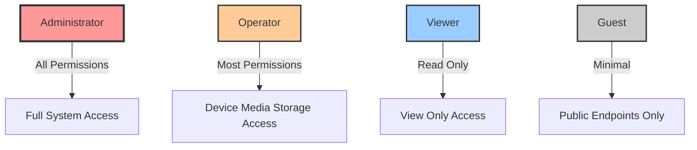

# Permissions

## Overview

The C Pro permission system implements fine-grained access control for all system observables and API endpoints. Permissions are assigned to users based on their roles and control read/write access to device functionality.

## Permission Model

### Permission Enumeration

```nim
# src/state/permissions.nim
type
  StatePermission* = enum
    # Device Control
    Device_r         # Read device information (status, capabilities)
    Device_rw        # Control device (camera settings, motors, lights)
    
    # Media Management
    Media_r          # View recordings, tags, metadata
    Media_rw         # Create recordings, add tags, modify metadata
    
    # User Management
    User_r           # View user list and roles
    User_rw          # Create/modify/delete users
    
    # Network Configuration
    Network_r        # View network settings
    Network_rw       # Configure network (IP, hostname, etc.)
    
    # Storage Management
    Storage_r        # View storage status and recordings
    Storage_rw       # Configure storage, delete recordings
    
    # System Administration
    System_r         # View system information
    System_rw        # Configure system settings
    
    # Firmware Management
    FirmwareUpdate_r   # View firmware version
    FirmwareUpdate_rw  # Upload and install firmware updates
    
    # System Power
    Reboot_rw        # Reboot/restart system

  StatePermissions* = set[StatePermission]
```

## Role-Based Access Control (RBAC)

### Predefined Roles



### Administrator Role

**Full system access**:

```nim
proc getAdministratorPermissions*(): StatePermissions =
  result = {
    Device_r, Device_rw,
    Media_r, Media_rw,
    User_r, User_rw,
    Network_r, Network_rw,
    Storage_r, Storage_rw,
    System_r, System_rw,
    FirmwareUpdate_r, FirmwareUpdate_rw,
    Reboot_rw
  }
```

**Capabilities**:
- Full device control
- User management
- System configuration
- Firmware updates
- Network configuration
- Storage management
- All media operations

### Operator Role

**Operational access without system administration**:

```nim
proc getOperatorPermissions*(): StatePermissions =
  result = {
    Device_r, Device_rw,
    Media_r, Media_rw,
    Storage_r,
    System_r,
    Reboot_rw
  }
```

**Capabilities**:
- Start/stop recording
- Control camera settings
- Add tags and notes
- View storage status
- Reboot system
- No user management
- No network configuration

### Viewer Role

**Read-only access**:

```nim
proc getViewerPermissions*(): StatePermissions =
  result = {
    Device_r,
    Media_r,
    Storage_r,
    System_r
  }
```

**Capabilities**:
- View live streams
- View recorded media
- View device status
- View system information
- No modifications allowed

### Guest Role

**Minimal access**:

```nim
proc getGuestPermissions*(): StatePermissions =
  result = {}  # No permissions by default
```

**Capabilities**:
- Access public endpoints only
- No authenticated operations

## Observable Permission Assignment

### Defining Observable Permissions

Each observable specifies required permissions:

```nim
# Example: Recording control
initObservable("recordingState",
  permissionRead = {Media_r, Media_rw},      # Can read if has Media_r OR Media_rw
  permissionWrite = {Media_rw},              # Can write only if has Media_rw
  isOnlyAskState = false,
  save = false,
  default = %"stopped"
)

# Example: User management
initObservable("users",
  permissionRead = {User_r, User_rw},
  permissionWrite = {User_rw},
  save = true,
  default = %{}
)

# Example: System reboot
initObservable("restart",
  permissionRead = {Reboot_rw},
  permissionWrite = {Reboot_rw},
  isOnlyAskState = true,
  default = %false
)
```

### Permission Checking

```nim
# Check if user can read observable
template canRead*(permissions: StatePermissions, state: Observable): bool =
  ((state.permissionRead * permissions).len > 0)

# Check if user can write observable
template canWrite*(permissions: StatePermissions, state: Observable): bool =
  ((state.permissionWrite * permissions).len > 0)

# Usage
let userPerms = getUserPermissions("operator")
let recordingState = State.get("recordingState")

if userPerms.canRead(recordingState):
  echo "Can read recording state"

if userPerms.canWrite(recordingState):
  echo "Can start/stop recording"
```

## API Endpoint Protection

### HTTP API Permissions

```nim
# src/servers/httpapi.nim
proc requirePermission*(req: Request, permission: StatePermission): bool =
  # Get authenticated user
  let username = authenticateRequest(req)
  if username.isNone:
    req.respond(Http401, "Authentication required")
    return false
  
  # Check permission
  let permissions = getUserPermissions(username.get)
  if permission notin permissions:
    req.respond(Http403, "Permission denied")
    return false
  
  return true

# Example route protection
proc handleStartRecording*(req: Request) =
  if not req.requirePermission(Media_rw):
    return
  
  # Process recording start
  startRecording()
  req.respond(Http200, "Recording started")
```

### WebSocket API Permissions

```nim
# src/servers/websocketApiV1Handler.nim
proc handleWebSocketMessage*(client: Client, msg: JsonNode) =
  let action = msg["action"].getStr
  
  case action:
  of "setState":
    let key = msg["key"].getStr
    let state = State.get(key)
    
    # Check write permission
    if not client.permissions.canWrite(state):
      client.send(%{"error": "Permission denied", "key": key})
      return
    
    # Update state
    state.set(msg["value"])
  
  of "getState":
    let key = msg["key"].getStr
    let state = State.get(key)
    
    # Check read permission
    if not client.permissions.canRead(state):
      client.send(%{"error": "Permission denied", "key": key})
      return
    
    # Send state value
    client.send(%{"key": key, "value": state.value})
```

### ONVIF Permissions

```nim
# src/servers/onvif.nim
proc checkOnvifPermission*(req: OnvifRequest, permission: StatePermission): bool =
  let username = req.getAuthenticatedUser()
  let permissions = getUserPermissions(username)
  return permission in permissions

# Media profile operations require Media_r
proc getProfiles*(req: OnvifRequest): string =
  if not checkOnvifPermission(req, Media_r):
    return generateOnvifFault("NotAuthorized", "Insufficient permissions")
  
  # Return profiles
  return generateProfilesResponse()

# Configuration changes require Device_rw
proc setVideoEncoderConfiguration*(req: OnvifRequest): string =
  if not checkOnvifPermission(req, Device_rw):
    return generateOnvifFault("NotAuthorized", "Insufficient permissions")
  
  # Apply configuration
  applyEncoderConfig(req.config)
  return generateSuccessResponse()
```

## Custom Permission Sets

### Creating Custom Roles

```nim
proc createCustomRole*(roleName: string, permissions: StatePermissions): bool =
  let roles = State.get("customRoles").value
  
  if roles.hasKey(roleName):
    return false  # Role already exists
  
  roles[roleName] = %{
    "permissions": %permissions.toSeq().mapIt(ord(it)),
    "created": %now().format("yyyy-MM-dd'T'HH:mm:ss'Z'")
  }
  
  State.get("customRoles").updateValue(roles)
  return true

# Example: Create "Technician" role
createCustomRole("technician", {
  Device_r, Device_rw,
  System_r,
  Network_r,
  FirmwareUpdate_r, FirmwareUpdate_rw
})
```

### User-Specific Permissions

```nim
proc grantUserPermission*(username: string, permission: StatePermission): bool =
  let users = State.get("users").value
  if not users.hasKey(username):
    return false
  
  var user = users[username]
  if not user.hasKey("additionalPermissions"):
    user["additionalPermissions"] = %[]
  
  var perms = user["additionalPermissions"].to(seq[int])
  if ord(permission) notin perms:
    perms.add(ord(permission))
  
  user["additionalPermissions"] = %perms
  users[username] = user
  State.get("users").updateValue(users)
  return true

proc getUserPermissions*(username: string): StatePermissions =
  let users = State.get("users").value
  if not users.hasKey(username):
    return {}
  
  let user = users[username]
  let role = user["role"].getStr
  
  # Start with role permissions
  result = getRolePermissions(role)
  
  # Add user-specific permissions
  if user.hasKey("additionalPermissions"):
    for perm in user["additionalPermissions"]:
      result.incl(StatePermission(perm.getInt))
```

## Permission Matrix

### Complete Permission Mapping

| Observable | Read Permissions | Write Permissions | Description |
|------------|------------------|-------------------|-------------|
| `recordingState` | Media_r, Media_rw | Media_rw | Recording status |
| `streamEnabled` | Media_r, Media_rw | Media_rw | Streaming control |
| `cameraSettings` | Device_r, Device_rw | Device_rw | Camera configuration |
| `users` | User_r, User_rw | User_rw | User management |
| `networkSettings` | Network_r, Network_rw | Network_rw | Network config |
| `storageDevices` | Storage_r, Storage_rw | - | Storage info |
| `systemInfo` | System_r, System_rw | - | System information |
| `firmwareVersion` | FirmwareUpdate_r, FirmwareUpdate_rw | - | Firmware version |
| `restart` | Reboot_rw | Reboot_rw | System reboot |
| `reset` | FirmwareUpdate_rw | FirmwareUpdate_rw | Factory reset |

### Role Permission Matrix

| Permission | Admin | Operator | Viewer | Guest |
|------------|-------|----------|--------|-------|
| Device_r | ✓ | ✓ | ✓ | - |
| Device_rw | ✓ | ✓ | - | - |
| Media_r | ✓ | ✓ | ✓ | - |
| Media_rw | ✓ | ✓ | - | - |
| User_r | ✓ | - | - | - |
| User_rw | ✓ | - | - | - |
| Network_r | ✓ | - | - | - |
| Network_rw | ✓ | - | - | - |
| Storage_r | ✓ | ✓ | ✓ | - |
| Storage_rw | ✓ | - | - | - |
| System_r | ✓ | ✓ | ✓ | - |
| System_rw | ✓ | - | - | - |
| FirmwareUpdate_r | ✓ | - | - | - |
| FirmwareUpdate_rw | ✓ | - | - | - |
| Reboot_rw | ✓ | ✓ | - | - |

## Audit and Compliance

### Permission Audit Logging

```nim
proc auditPermissionCheck*(
  username: string,
  observable: string,
  permission: StatePermission,
  granted: bool
) =
  StateLogger.info("PERMISSION_AUDIT", %{
    "timestamp": %now().format("yyyy-MM-dd'T'HH:mm:ss'Z'"),
    "username": %username,
    "observable": %observable,
    "permission": %($permission),
    "granted": %granted
  })

# Automatic logging on permission checks
proc canWrite*(permissions: StatePermissions, state: Observable): bool =
  result = ((state.permissionWrite * permissions).len > 0)
  
  # Log permission check
  let username = getCurrentUser()
  auditPermissionCheck(username, state.key, Media_rw, result)
```

### Permission Change Logging

```nim
proc logPermissionChange*(
  admin: string,
  targetUser: string,
  permission: StatePermission,
  action: string  # "granted" or "revoked"
) =
  StateLogger.info("PERMISSION_CHANGE", %{
    "timestamp": %now().format("yyyy-MM-dd'T'HH:mm:ss'Z'"),
    "admin": %admin,
    "targetUser": %targetUser,
    "permission": %($permission),
    "action": %action
  })
```

## Best Practices

### Principle of Least Privilege

Always assign minimum necessary permissions:

```nim
# Bad: Giving operator admin permissions for convenience
createUser("operator1", "password", "administrator")

# Good: Use appropriate role
createUser("operator1", "password", "operator")

# Better: Custom role with exact permissions needed
createCustomRole("recording_operator", {
  Device_r, Device_rw,
  Media_rw
})
createUser("operator1", "password", "recording_operator")
```

### Regular Permission Audits

```nim
proc auditUserPermissions*(): JsonNode =
  result = newJObject()
  let users = State.get("users").value
  
  for username, userData in users.pairs:
    let role = userData["role"].getStr
    let permissions = getUserPermissions(username)
    
    result[username] = %{
      "role": %role,
      "permissions": %permissions.toSeq().mapIt($it),
      "lastLogin": userData{"lastLogin"}
    }
```

### Secure Defaults

```nim
# New users default to viewer role
proc createUser*(username, password: string, role: string = "viewer"): bool =
  # ...implementation...

# Observables default to requiring permissions
proc initObservable*(
  key: string,
  permissionRead: StatePermissions = {},   # No access by default
  permissionWrite: StatePermissions = {},  # No access by default
  # ...other params...
): Observable =
  # ...implementation...
```

## Troubleshooting

### Permission Denied Errors

**Symptoms**: 403 Forbidden or "Permission denied" messages.

**Diagnosis**:
```nim
# Check user permissions
let perms = getUserPermissions("username")
echo "User permissions: ", perms

# Check observable requirements
let obs = State.get("recordingState")
echo "Read permissions required: ", obs.permissionRead
echo "Write permissions required: ", obs.permissionWrite

# Test permission
echo "Can read: ", perms.canRead(obs)
echo "Can write: ", perms.canWrite(obs)
```

**Solutions**:
- Verify user role is correct
- Grant additional permissions if needed
- Check observable permission requirements
- Review audit logs for permission checks

### Missing Permissions After Role Change

**Symptoms**: User can't access features after role change.

**Solutions**:
- Invalidate and refresh user sessions
- Verify role permissions are correct
- Check for cached permission data
- Force re-authentication

## Related Documentation

- [Authentication](authentication.md)
- [User Management](../operations/user-management.md)
- [State Management](../architecture/state-management.md)
- [Security Best Practices](security-best-practices.md)
