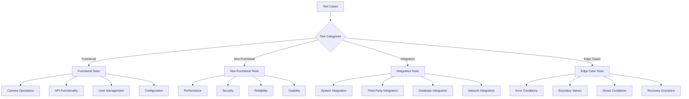

# Test Cases

**Comprehensive test case specifications for functional, non-functional, and edge case testing of the RotorDream camera system.**

## Overview

This document provides detailed test cases organized by functional areas, ensuring comprehensive coverage of all system components, user scenarios, and edge conditions.



## Functional Test Cases

### Camera Operations

#### TC_CAM_001: Camera Initialization
**Objective**: Verify camera device initialization and configuration  
**Priority**: High  
**Prerequisites**: Camera device available at `/dev/video0`

**Test Steps**:
1. Initialize camera system
2. Detect available camera devices
3. Configure camera with default settings
4. Verify camera status

**Expected Results**:
- Camera device detected successfully
- Default configuration applied
- Camera status shows "Ready"
- No error messages in logs

**Test Data**:
```json
{
  "device_path": "/dev/video0",
  "expected_capabilities": ["streaming", "recording", "snapshot"],
  "default_resolution": {"width": 1920, "height": 1080},
  "default_framerate": 30
}
```

#### TC_CAM_002: Video Streaming Start/Stop
**Objective**: Verify video streaming functionality  
**Priority**: High  
**Prerequisites**: Camera initialized and configured

**Test Steps**:
1. Send start streaming command via API
2. Verify RTSP endpoint becomes available
3. Connect to RTSP stream with client
4. Verify video frames are received
5. Send stop streaming command
6. Verify RTSP endpoint closes properly

**Expected Results**:
- Streaming starts within 3 seconds
- RTSP URL `rtsp://camera_ip:554/live` accessible
- Video frames received at configured framerate
- Streaming stops cleanly without errors
- Resources properly released

**Test Data**:
```json
{
  "stream_config": {
    "resolution": {"width": 1280, "height": 720},
    "framerate": 25,
    "bitrate": 2000000,
    "format": "h264"
  },
  "expected_rtsp_url": "rtsp://192.168.1.100:554/live",
  "timeout_seconds": 3
}
```

#### TC_CAM_003: Recording Functionality
**Objective**: Verify video recording and playback  
**Priority**: High  
**Prerequisites**: Camera streaming active

**Test Steps**:
1. Start recording via API
2. Record for specified duration
3. Stop recording
4. Verify recording file created
5. Check file size and format
6. Playback recording to verify content

**Expected Results**:
- Recording starts immediately
- File created in configured directory
- File size matches expected range
- Recording contains valid video data
- Playback shows recorded content

**Test Data**:
```json
{
  "recording_config": {
    "duration": 30,
    "format": "mp4",
    "quality": "high",
    "audio": false
  },
  "expected_file_pattern": "recording_YYYYMMDD_HHMMSS.mp4",
  "min_file_size": 1048576,
  "storage_path": "/var/recordings"
}
```

#### TC_CAM_004: Snapshot Capture
**Objective**: Verify snapshot image capture  
**Priority**: Medium  
**Prerequisites**: Camera streaming or ready

**Test Steps**:
1. Request snapshot via API
2. Verify image is returned
3. Check image format and size
4. Validate image contains current camera view
5. Save snapshot to storage

**Expected Results**:
- Snapshot captured within 1 second
- Image format is JPEG
- Image resolution matches camera setting
- Image contains valid visual data
- File saved successfully if requested

**Test Data**:
```json
{
  "snapshot_config": {
    "format": "jpeg",
    "quality": 85,
    "resolution": {"width": 1920, "height": 1080},
    "save_to_storage": true
  },
  "expected_content_type": "image/jpeg",
  "max_response_time": 1.0
}
```

#### TC_CAM_005: Camera Settings Configuration
**Objective**: Verify camera settings can be changed  
**Priority**: High  
**Prerequisites**: Camera system initialized

**Test Steps**:
1. Get current camera settings
2. Modify resolution setting
3. Apply new settings
4. Verify settings are applied
5. Test with different parameter combinations
6. Reset to default settings

**Expected Results**:
- Current settings retrieved successfully
- New settings applied without errors
- Camera operates with new settings
- Settings persist across sessions
- Default reset works properly

**Test Data**:
```json
{
  "test_settings": [
    {"resolution": {"width": 1920, "height": 1080}, "framerate": 30},
    {"resolution": {"width": 1280, "height": 720}, "framerate": 25},
    {"resolution": {"width": 640, "height": 480}, "framerate": 15}
  ],
  "invalid_settings": [
    {"resolution": {"width": -1, "height": 1080}},
    {"framerate": 0},
    {"quality": 101}
  ]
}
```

### API Functionality

#### TC_API_001: Authentication and Authorization
**Objective**: Verify API authentication mechanisms  
**Priority**: Critical  
**Prerequisites**: User accounts configured

**Test Steps**:
1. Attempt API access without authentication
2. Login with valid credentials
3. Use returned JWT token for API calls
4. Test with invalid/expired tokens
5. Test role-based access control
6. Logout and verify token invalidation

**Expected Results**:
- Unauthenticated requests return 401
- Valid login returns JWT token
- Token allows access to permitted endpoints
- Invalid tokens rejected with 401
- Role restrictions enforced
- Logout invalidates token

**Test Data**:
```json
{
  "test_users": [
    {"username": "admin", "password": "admin123", "role": "administrator"},
    {"username": "operator", "password": "oper123", "role": "operator"},
    {"username": "viewer", "password": "view123", "role": "viewer"}
  ],
  "protected_endpoints": [
    {"path": "/api/admin/users", "required_role": "administrator"},
    {"path": "/api/camera/settings", "required_role": "operator"},
    {"path": "/api/camera/status", "required_role": "viewer"}
  ]
}
```

#### TC_API_002: HTTP API Endpoints
**Objective**: Verify all HTTP API endpoints function correctly  
**Priority**: High  
**Prerequisites**: System running, authenticated user

**Test Steps**:
1. Test GET endpoints (status, info, settings)
2. Test POST endpoints (commands, uploads)
3. Test PUT endpoints (configuration updates)
4. Test DELETE endpoints (resource removal)
5. Verify request/response formats
6. Test error handling

**Expected Results**:
- All endpoints respond correctly
- JSON responses well-formed
- HTTP status codes appropriate
- Error responses include details
- Request validation works
- Documentation matches implementation

**Test Data**:
```json
{
  "api_endpoints": [
    {"method": "GET", "path": "/api/status", "expected_status": 200},
    {"method": "GET", "path": "/api/camera/info", "expected_status": 200},
    {"method": "POST", "path": "/api/camera/start", "expected_status": 200},
    {"method": "PUT", "path": "/api/camera/settings", "expected_status": 200},
    {"method": "DELETE", "path": "/api/recordings/1", "expected_status": 204}
  ]
}
```

#### TC_API_003: WebSocket Real-time Communication
**Objective**: Verify WebSocket functionality for real-time updates  
**Priority**: High  
**Prerequisites**: WebSocket endpoint available

**Test Steps**:
1. Establish WebSocket connection
2. Subscribe to status updates
3. Subscribe to event notifications
4. Send commands via WebSocket
5. Verify real-time message delivery
6. Test connection handling and recovery

**Expected Results**:
- WebSocket connects successfully
- Subscription confirmations received
- Real-time updates delivered promptly
- Commands executed correctly
- Connection recovers from interruptions
- Clean disconnection possible

**Test Data**:
```json
{
  "websocket_tests": [
    {
      "action": "subscribe",
      "channel": "status",
      "expected_response": "subscription_confirmed"
    },
    {
      "action": "command",
      "command": "camera_start",
      "expected_response": "command_response"
    }
  ]
}
```

#### TC_API_004: ONVIF Protocol Compliance
**Objective**: Verify ONVIF protocol implementation  
**Priority**: Medium  
**Prerequisites**: ONVIF services enabled

**Test Steps**:
1. ONVIF device discovery
2. GetDeviceInformation request
3. GetProfiles request
4. GetStreamUri request
5. PTZ control commands (if supported)
6. Event subscription

**Expected Results**:
- Device discovered via WS-Discovery
- SOAP responses valid and compliant
- Profiles returned correctly
- Stream URIs functional
- PTZ commands work if supported
- Events delivered properly

**Test Data**:
```json
{
  "onvif_tests": [
    {
      "service": "device",
      "operation": "GetDeviceInformation",
      "expected_fields": ["Manufacturer", "Model", "SerialNumber"]
    },
    {
      "service": "media",
      "operation": "GetProfiles",
      "expected_profiles": 2
    }
  ]
}
```

### User Management

#### TC_USER_001: User Registration and Login
**Objective**: Verify user account management  
**Priority**: High  
**Prerequisites**: Administrative access

**Test Steps**:
1. Create new user account
2. Verify user can login
3. Test password requirements
4. Test username uniqueness
5. Test email validation
6. Test account activation

**Expected Results**:
- User account created successfully
- Login works with correct credentials
- Password policy enforced
- Duplicate usernames rejected
- Invalid emails rejected
- Account activation required

**Test Data**:
```json
{
  "valid_users": [
    {
      "username": "newuser",
      "email": "newuser@example.com",
      "password": "SecurePass123!",
      "role": "operator"
    }
  ],
  "invalid_users": [
    {"username": "", "email": "test@example.com", "password": "pass"},
    {"username": "user", "email": "invalid-email", "password": "pass"},
    {"username": "user", "email": "test@example.com", "password": "123"}
  ]
}
```

#### TC_USER_002: Role-Based Access Control
**Objective**: Verify user role permissions  
**Priority**: Critical  
**Prerequisites**: Users with different roles

**Test Steps**:
1. Login as administrator
2. Test admin-only operations
3. Login as operator
4. Test operator permissions
5. Login as viewer
6. Test viewer restrictions

**Expected Results**:
- Admin can access all functions
- Operator can control camera, not manage users
- Viewer can only view status and streams
- Unauthorized operations rejected
- Role changes take effect immediately
- Proper error messages for denied access

**Test Data**:
```json
{
  "role_permissions": {
    "administrator": ["*"],
    "operator": ["camera.*", "recording.*", "settings.read"],
    "viewer": ["status.read", "stream.view", "camera.info"]
  },
  "test_operations": [
    {"operation": "user.create", "admin": true, "operator": false, "viewer": false},
    {"operation": "camera.start", "admin": true, "operator": true, "viewer": false},
    {"operation": "status.read", "admin": true, "operator": true, "viewer": true}
  ]
}
```

### Configuration Management

#### TC_CONFIG_001: Network Configuration
**Objective**: Verify network settings configuration  
**Priority**: High  
**Prerequisites**: Administrative access

**Test Steps**:
1. View current network settings
2. Modify HTTP port configuration
3. Modify RTSP port configuration
4. Test static IP configuration
5. Test DHCP configuration
6. Verify settings persistence

**Expected Results**:
- Current settings displayed correctly
- Port changes applied successfully
- Services restart on new ports
- IP configuration works
- Settings saved to persistent storage
- Invalid configurations rejected

**Test Data**:
```json
{
  "network_tests": [
    {"http_port": 8080, "rtsp_port": 554, "valid": true},
    {"http_port": 9090, "rtsp_port": 8554, "valid": true},
    {"http_port": 65536, "rtsp_port": 554, "valid": false},
    {"http_port": -1, "rtsp_port": 554, "valid": false}
  ]
}
```

#### TC_CONFIG_002: Storage Configuration
**Objective**: Verify storage settings and management  
**Priority**: High  
**Prerequisites**: File system access

**Test Steps**:
1. Configure storage location
2. Set storage limits
3. Configure retention policies
4. Test automatic cleanup
5. Test storage full conditions
6. Verify backup configurations

**Expected Results**:
- Storage location set correctly
- Limits enforced properly
- Old files cleaned up automatically
- System handles storage full gracefully
- Backup settings work
- Configuration persists

**Test Data**:
```json
{
  "storage_tests": [
    {
      "path": "/var/recordings",
      "max_size": "10GB",
      "retention_days": 30,
      "cleanup_enabled": true
    },
    {
      "path": "/invalid/path",
      "max_size": "10GB",
      "valid": false
    }
  ]
}
```

## Non-Functional Test Cases

### Performance Test Cases

#### TC_PERF_001: Streaming Performance
**Objective**: Verify streaming performance under various conditions  
**Priority**: High  
**Prerequisites**: Camera system operational

**Test Steps**:
1. Start single stream
2. Measure frame rate consistency
3. Start multiple concurrent streams
4. Monitor CPU and memory usage
5. Test with different resolutions
6. Measure latency

**Expected Results**:
- Frame rate within 5% of configured value
- CPU usage < 80% for single stream
- Memory usage stable over time
- Multiple streams supported
- Latency < 500ms for local network
- No frame drops under normal load

**Test Data**:
```json
{
  "performance_targets": {
    "single_stream_cpu": 80,
    "single_stream_memory": 200,
    "max_concurrent_streams": 4,
    "max_latency_ms": 500,
    "frame_rate_tolerance": 0.05
  }
}
```

#### TC_PERF_002: API Response Times
**Objective**: Verify API response performance  
**Priority**: Medium  
**Prerequisites**: System under normal load

**Test Steps**:
1. Test all API endpoints
2. Measure response times
3. Test with concurrent requests
4. Monitor during high load
5. Test database operations
6. Measure WebSocket latency

**Expected Results**:
- GET requests < 100ms
- POST requests < 500ms
- Database queries < 200ms
- WebSocket messages < 50ms
- Performance consistent under load
- No timeout errors

**Test Data**:
```json
{
  "response_time_targets": {
    "get_requests": 100,
    "post_requests": 500,
    "database_queries": 200,
    "websocket_latency": 50,
    "concurrent_users": 20
  }
}
```

### Security Test Cases

#### TC_SEC_001: Authentication Security
**Objective**: Verify authentication mechanism security  
**Priority**: Critical  
**Prerequisites**: System with authentication enabled

**Test Steps**:
1. Test password complexity requirements
2. Test account lockout after failed attempts
3. Test session timeout
4. Test token expiration
5. Test password reset security
6. Test brute force protection

**Expected Results**:
- Weak passwords rejected
- Account locked after failed attempts
- Sessions expire properly
- Tokens expire as configured
- Password reset secure
- Brute force attempts blocked

**Test Data**:
```json
{
  "security_policies": {
    "password_min_length": 8,
    "password_complexity": true,
    "max_login_attempts": 5,
    "lockout_duration": 300,
    "token_expiry": 3600,
    "session_timeout": 1800
  }
}
```

#### TC_SEC_002: Data Protection
**Objective**: Verify data encryption and protection  
**Priority**: High  
**Prerequisites**: HTTPS/TLS configured

**Test Steps**:
1. Verify HTTPS enforcement
2. Test TLS certificate validation
3. Test data encryption at rest
4. Test password hashing
5. Test API key security
6. Test data transmission security

**Expected Results**:
- HTTP redirects to HTTPS
- Valid TLS certificates
- Sensitive data encrypted
- Passwords properly hashed
- API keys not exposed
- All transmissions encrypted

**Test Data**:
```json
{
  "encryption_tests": {
    "tls_version": "1.2",
    "cipher_suites": ["AES128-GCM-SHA256"],
    "password_hash": "bcrypt",
    "data_encryption": "AES-256",
    "certificate_validity": true
  }
}
```

### Reliability Test Cases

#### TC_REL_001: System Stability
**Objective**: Verify system stability over extended periods  
**Priority**: High  
**Prerequisites**: Fully configured system

**Test Steps**:
1. Run continuous streaming for 24 hours
2. Monitor memory leaks
3. Monitor resource usage
4. Test automatic recovery
5. Test log rotation
6. Monitor error rates

**Expected Results**:
- System runs without crashes
- Memory usage stable
- No resource exhaustion
- Automatic recovery works
- Logs rotate properly
- Error rate < 0.1%

**Test Data**:
```json
{
  "stability_metrics": {
    "test_duration": 86400,
    "max_memory_growth": "10MB",
    "max_cpu_sustained": 75,
    "max_error_rate": 0.001,
    "recovery_time": 30
  }
}
```

#### TC_REL_002: Fault Tolerance
**Objective**: Verify system handles failures gracefully  
**Priority**: High  
**Prerequisites**: System with fault injection capability

**Test Steps**:
1. Simulate camera disconnect
2. Simulate network interruption  
3. Simulate disk full condition
4. Simulate power interruption
5. Test database connection loss
6. Test service crashes

**Expected Results**:
- Camera disconnect detected
- Network reconnection automatic
- Disk full handled gracefully
- System recovers from power loss
- Database reconnection works
- Services restart automatically

**Test Data**:
```json
{
  "fault_scenarios": [
    {"type": "camera_disconnect", "recovery_time": 10},
    {"type": "network_loss", "recovery_time": 30},
    {"type": "disk_full", "cleanup_enabled": true},
    {"type": "service_crash", "restart_enabled": true}
  ]
}
```

## Edge Case Test Cases

### Boundary Value Testing

#### TC_EDGE_001: Configuration Limits
**Objective**: Test system behavior at configuration boundaries  
**Priority**: Medium  
**Prerequisites**: System with configurable parameters

**Test Steps**:
1. Test minimum resolution values
2. Test maximum resolution values
3. Test minimum frame rate
4. Test maximum frame rate
5. Test storage size limits
6. Test user account limits

**Expected Results**:
- Minimum values accepted
- Maximum values accepted
- Values beyond limits rejected
- Appropriate error messages
- System remains stable
- Default values used for invalid input

**Test Data**:
```json
{
  "boundary_tests": [
    {"parameter": "resolution_width", "min": 320, "max": 3840},
    {"parameter": "resolution_height", "min": 240, "max": 2160},
    {"parameter": "framerate", "min": 1, "max": 60},
    {"parameter": "storage_size", "min": "1GB", "max": "10TB"},
    {"parameter": "max_users", "min": 1, "max": 1000}
  ]
}
```

### Error Condition Testing

#### TC_ERROR_001: Hardware Failure Simulation
**Objective**: Test behavior when hardware components fail  
**Priority**: High  
**Prerequisites**: Mockable hardware interfaces

**Test Steps**:
1. Simulate camera hardware failure
2. Simulate storage device failure
3. Simulate network interface failure
4. Test invalid device paths
5. Test permission denied errors
6. Test device busy conditions

**Expected Results**:
- Hardware failures detected
- Error messages informative
- System continues other operations
- Recovery possible when hardware returns
- No crashes or hangs
- User notified of issues

**Test Data**:
```json
{
  "hardware_errors": [
    {"device": "/dev/video0", "error": "no_such_device"},
    {"device": "/dev/video0", "error": "permission_denied"},
    {"device": "/dev/video0", "error": "device_busy"},
    {"storage": "/recordings", "error": "read_only"},
    {"network": "eth0", "error": "interface_down"}
  ]
}
```

#### TC_ERROR_002: Resource Exhaustion
**Objective**: Test behavior under resource constraints  
**Priority**: High  
**Prerequisites**: Resource monitoring capability

**Test Steps**:
1. Fill disk to capacity
2. Exhaust available memory
3. Consume all CPU resources
4. Exceed network bandwidth
5. Reach file descriptor limits
6. Test concurrent connection limits

**Expected Results**:
- Resource exhaustion detected
- Graceful degradation of service
- Error messages clear
- Recovery when resources available
- No system crashes
- Cleanup mechanisms work

**Test Data**:
```json
{
  "resource_limits": [
    {"resource": "disk_space", "threshold": "95%", "action": "cleanup"},
    {"resource": "memory", "threshold": "90%", "action": "reduce_quality"},
    {"resource": "cpu", "threshold": "95%", "action": "limit_streams"},
    {"resource": "connections", "limit": 100, "action": "reject_new"}
  ]
}
```

## Test Execution Framework

### Test Case Template

```nim
# Test case template for RotorDream
import unittest2, asynctest, json
import ../config

suite "Test Suite Name":
  var env: TestEnvironment
  
  setup:
    env = setupTestEnvironment()
    # Test-specific setup
  
  teardown:
    cleanupTestEnvironment(env)
    # Test-specific cleanup
  
  test "TC_XXX_001: Test Case Description":
    # Test case ID: TC_XXX_001
    # Priority: High/Medium/Low
    # Category: Functional/Performance/Security/etc.
    
    # Arrange
    let testData = loadTestData("test_case_data.json")
    
    # Act
    let result = performTestAction(testData)
    
    # Assert
    check result.success == true
    check result.data != nil
    
    # Verify expected results
    verifyTestResults(result, testData.expectedResults)
```

### Test Data Management

```json
{
  "test_case_metadata": {
    "TC_CAM_001": {
      "title": "Camera Initialization",
      "priority": "High",
      "category": "Functional",
      "estimated_duration": 30,
      "prerequisites": ["camera_available"],
      "automation_status": "automated"
    }
  },
  "test_execution_config": {
    "parallel_execution": true,
    "max_parallel_tests": 4,
    "retry_failed_tests": 3,
    "capture_screenshots": true,
    "generate_reports": true
  }
}
```

### Test Metrics and Reporting

```nim
# test_metrics.nim
type
  TestResult* = object
    testId*: string
    status*: TestStatus
    duration*: float
    errorMessage*: string
    timestamp*: DateTime
  
  TestMetrics* = object
    totalTests*: int
    passedTests*: int
    failedTests*: int
    skippedTests*: int
    totalDuration*: float
    coverage*: float

proc generateTestReport*(results: seq[TestResult]): TestMetrics =
  ## Generate comprehensive test report
  result = TestMetrics(
    totalTests: results.len,
    passedTests: results.filter(r => r.status == Passed).len,
    failedTests: results.filter(r => r.status == Failed).len,
    skippedTests: results.filter(r => r.status == Skipped).len,
    totalDuration: results.map(r => r.duration).sum
  )
  
  # Calculate pass rate
  let passRate = result.passedTests.float / result.totalTests.float * 100
  echo f"Test Pass Rate: {passRate:.2f}%"
```

## Related Documentation

- [Testing Strategies](./strategies.md) - Overall testing approach
- [Validation Procedures](./validation.md) - System validation
- [API Reference](../api/http-api.md) - API testing reference
- [Performance](../operations/performance.md) - Performance testing

---

*Comprehensive test case specifications ensuring thorough system validation and quality assurance*
