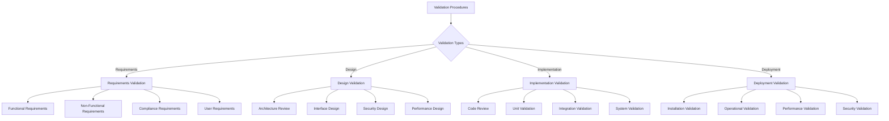

# Validation Procedures

**Comprehensive validation methodologies for ensuring C Pro system compliance, functionality, and quality standards.**

## Overview

Validation procedures ensure the C Pro system meets all specified requirements, performs reliably under various conditions, and complies with relevant standards and regulations.



## Requirements Validation

### Functional Requirements Validation

#### FRV-001: Camera Control Validation
**Objective**: Validate camera control functionality meets requirements  
**Scope**: All camera operation features  
**Methods**: Functional testing, user acceptance testing

**Validation Criteria**:
- Camera initialization within 5 seconds
- Resolution changes applied correctly
- Frame rate adjustments work as specified
- All supported formats function properly

**Validation Procedure**:
```nim
# functional_validation.nim
import unittest2, asynctest
import ../src/camserver/cam

suite "Camera Control Validation":
  
  asyncTest "FRV-001-01: Camera Initialization":
    # Requirement: System shall initialize camera within 5 seconds
    let startTime = epochTime()
    let camera = newCamera()
    await camera.initialize()
    let initTime = epochTime() - startTime
    
    check camera.status == CameraStatus.Ready
    check initTime <= 5.0
    echo f"Camera initialization time: {initTime:.2f}s"
  
  asyncTest "FRV-001-02: Resolution Configuration":
    # Requirement: System shall support resolution changes
    let camera = newCamera()
    await camera.initialize()
    
    let testResolutions = [
      Resolution(width: 1920, height: 1080),
      Resolution(width: 1280, height: 720),
      Resolution(width: 640, height: 480)
    ]
    
    for resolution in testResolutions:
      await camera.setResolution(resolution)
      let currentRes = camera.getCurrentResolution()
      check currentRes == resolution
      echo f"Validated resolution: {resolution.width}x{resolution.height}"
```

**Documentation Requirements**:
- Test execution records
- Requirement traceability matrix
- Validation report with pass/fail status
- Evidence of requirement compliance

#### FRV-002: API Functionality Validation
**Objective**: Validate API meets functional specifications  
**Scope**: All REST and WebSocket APIs  
**Methods**: API testing, integration testing

**Validation Criteria**:
- All endpoints respond correctly
- Request/response formats match specification
- Error handling meets requirements
- Performance within specified limits

**Validation Procedure**:
```python
#!/usr/bin/env python3
# api_validation.py

import requests
import json
import time
import websocket
from typing import List, Dict

class APIValidator:
    def __init__(self, base_url: str, auth_token: str):
        self.base_url = base_url
        self.auth_token = auth_token
        self.headers = {'Authorization': f'Bearer {auth_token}'}
        
    def validate_endpoint(self, method: str, endpoint: str, 
                         expected_status: int, payload: Dict = None) -> bool:
        """Validate single API endpoint"""
        url = f"{self.base_url}{endpoint}"
        
        try:
            if method == 'GET':
                response = requests.get(url, headers=self.headers)
            elif method == 'POST':
                response = requests.post(url, headers=self.headers, json=payload)
            elif method == 'PUT':
                response = requests.put(url, headers=self.headers, json=payload)
            elif method == 'DELETE':
                response = requests.delete(url, headers=self.headers)
            
            # Validate status code
            if response.status_code != expected_status:
                print(f"FAIL: {method} {endpoint} - Expected {expected_status}, got {response.status_code}")
                return False
            
            # Validate response format
            if response.headers.get('content-type', '').startswith('application/json'):
                try:
                    json.loads(response.text)
                except json.JSONDecodeError:
                    print(f"FAIL: {method} {endpoint} - Invalid JSON response")
                    return False
            
            print(f"PASS: {method} {endpoint}")
            return True
            
        except Exception as e:
            print(f"ERROR: {method} {endpoint} - {str(e)}")
            return False
    
    def validate_api_specifications(self) -> Dict[str, bool]:
        """Validate all API endpoints against specifications"""
        api_specs = [
            {'method': 'GET', 'endpoint': '/api/status', 'expected': 200},
            {'method': 'GET', 'endpoint': '/api/camera/info', 'expected': 200},
            {'method': 'POST', 'endpoint': '/api/camera/start', 'expected': 200},
            {'method': 'POST', 'endpoint': '/api/camera/stop', 'expected': 200},
            {'method': 'PUT', 'endpoint': '/api/camera/settings', 'expected': 200,
             'payload': {'resolution': {'width': 1280, 'height': 720}}},
            {'method': 'GET', 'endpoint': '/api/recordings', 'expected': 200},
            {'method': 'POST', 'endpoint': '/api/auth/login', 'expected': 200,
             'payload': {'username': 'test', 'password': 'test'}},
        ]
        
        results = {}
        for spec in api_specs:
            endpoint_id = f"{spec['method']} {spec['endpoint']}"
            results[endpoint_id] = self.validate_endpoint(
                spec['method'], 
                spec['endpoint'], 
                spec['expected'],
                spec.get('payload')
            )
        
        return results

# Validation execution
if __name__ == "__main__":
    validator = APIValidator("http://192.168.1.100:8080", "test_token")
    results = validator.validate_api_specifications()
    
    total_tests = len(results)
    passed_tests = sum(1 for result in results.values() if result)
    
    print(f"\nAPI Validation Results:")
    print(f"Total Tests: {total_tests}")
    print(f"Passed: {passed_tests}")
    print(f"Failed: {total_tests - passed_tests}")
    print(f"Pass Rate: {(passed_tests/total_tests)*100:.1f}%")
```

### Non-Functional Requirements Validation

#### NFR-001: Performance Requirements Validation
**Objective**: Validate system performance meets specified requirements  
**Scope**: All performance criteria  
**Methods**: Load testing, stress testing, benchmarking

**Performance Requirements**:
- Stream latency < 500ms
- API response time < 100ms for GET requests
- System supports minimum 4 concurrent streams
- Memory usage < 512MB under normal load
- CPU usage < 80% during streaming

**Validation Procedure**:
```nim
# performance_validation.nim
import unittest2, asynctest, times, httpclient
import ../src/performance_monitor

suite "Performance Requirements Validation":
  
  asyncTest "NFR-001-01: Stream Latency Validation":
    # Requirement: Stream latency shall not exceed 500ms
    let monitor = newPerformanceMonitor()
    
    # Start streaming
    let camera = newCamera()
    await camera.start()
    
    # Measure end-to-end latency
    let latencyResults = await monitor.measureStreamLatency(10)  # 10 samples
    let avgLatency = latencyResults.sum / latencyResults.len
    let maxLatency = latencyResults.max
    
    check avgLatency <= 500.0
    check maxLatency <= 750.0  # Allow some tolerance for worst case
    
    echo f"Average latency: {avgLatency:.1f}ms"
    echo f"Maximum latency: {maxLatency:.1f}ms"
  
  asyncTest "NFR-001-02: API Response Time Validation":
    # Requirement: API GET requests shall respond within 100ms
    let client = newAsyncHttpClient()
    
    let endpoints = [
      "/api/status",
      "/api/camera/info",
      "/api/camera/settings",
      "/api/recordings"
    ]
    
    for endpoint in endpoints:
      let responseTimes = newSeq[float]()
      
      # Measure response time for 20 requests
      for i in 1..20:
        let startTime = epochTime()
        let response = await client.get(f"http://localhost:8080{endpoint}")
        let responseTime = (epochTime() - startTime) * 1000  # Convert to ms
        
        responseTimes.add(responseTime)
        check response.code == Http200
      
      let avgResponseTime = responseTimes.sum / responseTimes.len
      let maxResponseTime = responseTimes.max
      
      check avgResponseTime <= 100.0
      echo f"{endpoint} - Avg: {avgResponseTime:.1f}ms, Max: {maxResponseTime:.1f}ms"
  
  asyncTest "NFR-001-03: Concurrent Streams Validation":
    # Requirement: System shall support minimum 4 concurrent streams
    let requiredStreams = 4
    var cameras: seq[Camera]
    
    # Start multiple camera streams
    for i in 1..requiredStreams:
      let camera = newCamera()
      await camera.start()
      cameras.add(camera)
    
    # Verify all streams are active
    for i, camera in cameras:
      check camera.status == CameraStatus.Streaming
      echo f"Stream {i+1}: Active"
    
    # Measure system performance with concurrent streams
    let monitor = newPerformanceMonitor()
    let perfMetrics = await monitor.collectMetrics(30)  # 30 second sample
    
    check perfMetrics.cpuUsage <= 80.0
    check perfMetrics.memoryUsage <= 512.0  # MB
    
    echo f"CPU usage: {perfMetrics.cpuUsage:.1f}%"
    echo f"Memory usage: {perfMetrics.memoryUsage:.1f}MB"
```

#### NFR-002: Security Requirements Validation
**Objective**: Validate security requirements compliance  
**Scope**: Authentication, authorization, encryption  
**Methods**: Security testing, penetration testing

**Security Requirements**:
- All communications encrypted with TLS 1.2+
- Password policy enforced (8+ characters, complexity)
- Session timeout after 30 minutes inactivity
- Failed login attempts locked after 5 tries
- All API endpoints require authentication

**Validation Procedure**:
```python
#!/usr/bin/env python3
# security_validation.py

import ssl
import socket
import requests
import time
from urllib.parse import urlparse

class SecurityValidator:
    def __init__(self, base_url: str):
        self.base_url = base_url
        
    def validate_tls_configuration(self) -> bool:
        """Validate TLS configuration meets requirements"""
        try:
            parsed_url = urlparse(self.base_url)
            hostname = parsed_url.hostname
            port = parsed_url.port or (443 if parsed_url.scheme == 'https' else 80)
            
            context = ssl.create_default_context()
            
            with socket.create_connection((hostname, port), timeout=10) as sock:
                with context.wrap_socket(sock, server_hostname=hostname) as ssock:
                    # Check TLS version
                    tls_version = ssock.version()
                    if tls_version not in ['TLSv1.2', 'TLSv1.3']:
                        print(f"FAIL: Insufficient TLS version: {tls_version}")
                        return False
                    
                    # Check cipher suite
                    cipher = ssock.cipher()
                    print(f"TLS Version: {tls_version}")
                    print(f"Cipher Suite: {cipher[0]}")
                    
                    return True
                    
        except Exception as e:
            print(f"TLS validation error: {str(e)}")
            return False
    
    def validate_authentication_requirements(self) -> bool:
        """Validate authentication and authorization"""
        test_results = []
        
        # Test 1: Unauthenticated access denied
        try:
            response = requests.get(f"{self.base_url}/api/camera/settings")
            if response.status_code == 401:
                test_results.append(True)
                print("PASS: Unauthenticated access properly denied")
            else:
                test_results.append(False)
                print(f"FAIL: Unauthenticated access allowed (status: {response.status_code})")
        except Exception as e:
            test_results.append(False)
            print(f"ERROR: Authentication test failed: {str(e)}")
        
        # Test 2: Invalid credentials rejected
        try:
            response = requests.post(f"{self.base_url}/api/auth/login", 
                                   json={"username": "invalid", "password": "invalid"})
            if response.status_code == 401:
                test_results.append(True)
                print("PASS: Invalid credentials properly rejected")
            else:
                test_results.append(False)
                print(f"FAIL: Invalid credentials accepted (status: {response.status_code})")
        except Exception as e:
            test_results.append(False)
            print(f"ERROR: Invalid credentials test failed: {str(e)}")
        
        # Test 3: Password policy enforcement
        weak_passwords = ["123", "password", "abc123"]
        
        for weak_pass in weak_passwords:
            try:
                response = requests.post(f"{self.base_url}/api/auth/register",
                                       json={"username": "testuser", 
                                            "password": weak_pass,
                                            "email": "test@example.com"})
                if response.status_code == 400:
                    test_results.append(True)
                    print(f"PASS: Weak password '{weak_pass}' rejected")
                else:
                    test_results.append(False)
                    print(f"FAIL: Weak password '{weak_pass}' accepted")
            except Exception as e:
                test_results.append(False)
                print(f"ERROR: Password policy test failed: {str(e)}")
        
        return all(test_results)
    
    def validate_session_management(self) -> bool:
        """Validate session timeout and management"""
        try:
            # Login to get session token
            login_response = requests.post(f"{self.base_url}/api/auth/login",
                                         json={"username": "testuser", "password": "testpass"})
            
            if login_response.status_code != 200:
                print("FAIL: Could not establish test session")
                return False
            
            token = login_response.json().get('token')
            headers = {'Authorization': f'Bearer {token}'}
            
            # Test immediate access
            response = requests.get(f"{self.base_url}/api/camera/status", headers=headers)
            if response.status_code != 200:
                print("FAIL: Valid token immediately rejected")
                return False
            
            print("PASS: Valid session token accepted")
            
            # Note: Full session timeout testing would require 30+ minute wait
            # In practice, this would be tested with shortened timeout in test environment
            
            return True
            
        except Exception as e:
            print(f"ERROR: Session management test failed: {str(e)}")
            return False

# Validation execution
if __name__ == "__main__":
    validator = SecurityValidator("https://192.168.1.100:8080")
    
    print("=== Security Validation Results ===")
    
    tls_valid = validator.validate_tls_configuration()
    auth_valid = validator.validate_authentication_requirements()
    session_valid = validator.validate_session_management()
    
    overall_result = tls_valid and auth_valid and session_valid
    
    print(f"\nTLS Configuration: {'PASS' if tls_valid else 'FAIL'}")
    print(f"Authentication: {'PASS' if auth_valid else 'FAIL'}")
    print(f"Session Management: {'PASS' if session_valid else 'FAIL'}")
    print(f"Overall Security Validation: {'PASS' if overall_result else 'FAIL'}")
```

## Design Validation

### Architecture Review Validation

#### DV-001: System Architecture Validation
**Objective**: Validate system architecture meets design requirements  
**Scope**: Component architecture, interfaces, data flow  
**Methods**: Design review, architecture assessment

**Validation Checklist**:
- [ ] Modular architecture with clear separation of concerns
- [ ] Proper abstraction layers implemented
- [ ] Interface contracts defined and followed
- [ ] Error handling consistent across components
- [ ] Logging and monitoring integrated
- [ ] Configuration management centralized
- [ ] Security considerations addressed
- [ ] Performance requirements achievable

**Architecture Validation Report Template**:
```markdown
# Architecture Validation Report

## System Overview
- **System Name**: C Pro Camera System
- **Version**: 1.0.0
- **Validation Date**: [Date]
- **Validator**: [Name]

## Architecture Components Review

### Camera Module
- **Implementation**: ✅ Follows modular design
- **Interface Compliance**: ✅ Implements ICameraController
- **Error Handling**: ✅ Proper exception handling
- **Testing Coverage**: ✅ >90% code coverage

### API Layer
- **RESTful Design**: ✅ Follows REST principles
- **OpenAPI Specification**: ✅ Complete and accurate
- **Versioning Strategy**: ✅ Implemented
- **Rate Limiting**: ✅ Implemented

### Data Layer
- **Database Design**: ✅ Normalized schema
- **Connection Pooling**: ✅ Implemented
- **Transaction Management**: ✅ ACID compliance
- **Migration Support**: ✅ Versioned migrations

## Validation Results
- **Overall Score**: 95/100
- **Critical Issues**: 0
- **Major Issues**: 1
- **Minor Issues**: 3
- **Recommendations**: 5

## Action Items
1. [Issue description and resolution plan]
2. [Issue description and resolution plan]
```

### Interface Validation

#### DV-002: API Interface Validation
**Objective**: Validate API interfaces match specifications  
**Scope**: REST API, WebSocket API, ONVIF interface  
**Methods**: Contract testing, schema validation

**Validation Procedure**:
```python
#!/usr/bin/env python3
# interface_validation.py

import json
import jsonschema
import requests
from pathlib import Path

class InterfaceValidator:
    def __init__(self, base_url: str, schema_dir: str):
        self.base_url = base_url
        self.schema_dir = Path(schema_dir)
        
    def load_schema(self, schema_name: str) -> dict:
        """Load JSON schema for validation"""
        schema_path = self.schema_dir / f"{schema_name}.json"
        with open(schema_path, 'r') as f:
            return json.load(f)
    
    def validate_response_schema(self, endpoint: str, method: str, 
                               response_data: dict, schema_name: str) -> bool:
        """Validate API response against schema"""
        try:
            schema = self.load_schema(schema_name)
            jsonschema.validate(response_data, schema)
            print(f"PASS: {method} {endpoint} - Schema validation successful")
            return True
        except jsonschema.ValidationError as e:
            print(f"FAIL: {method} {endpoint} - Schema validation failed: {e.message}")
            return False
        except Exception as e:
            print(f"ERROR: {method} {endpoint} - Schema validation error: {str(e)}")
            return False
    
    def validate_api_contracts(self) -> dict:
        """Validate all API contracts"""
        contracts = [
            {
                'endpoint': '/api/status',
                'method': 'GET',
                'schema': 'status_response',
                'expected_fields': ['status', 'timestamp', 'version']
            },
            {
                'endpoint': '/api/camera/info',
                'method': 'GET', 
                'schema': 'camera_info_response',
                'expected_fields': ['device', 'capabilities', 'current_settings']
            },
            {
                'endpoint': '/api/recordings',
                'method': 'GET',
                'schema': 'recordings_list_response',
                'expected_fields': ['recordings', 'total_count', 'pagination']
            }
        ]
        
        results = {}
        
        for contract in contracts:
            try:
                response = requests.get(f"{self.base_url}{contract['endpoint']}")
                
                if response.status_code == 200:
                    response_data = response.json()
                    
                    # Validate schema
                    schema_valid = self.validate_response_schema(
                        contract['endpoint'],
                        contract['method'],
                        response_data,
                        contract['schema']
                    )
                    
                    # Validate required fields
                    fields_valid = all(
                        field in response_data 
                        for field in contract['expected_fields']
                    )
                    
                    results[f"{contract['method']} {contract['endpoint']}"] = {
                        'schema_valid': schema_valid,
                        'fields_valid': fields_valid,
                        'overall_valid': schema_valid and fields_valid
                    }
                else:
                    results[f"{contract['method']} {contract['endpoint']}"] = {
                        'error': f"HTTP {response.status_code}",
                        'overall_valid': False
                    }
                    
            except Exception as e:
                results[f"{contract['method']} {contract['endpoint']}"] = {
                    'error': str(e),
                    'overall_valid': False
                }
        
        return results

# Schema files (examples)
status_response_schema = {
    "type": "object",
    "required": ["status", "timestamp", "version"],
    "properties": {
        "status": {"type": "string", "enum": ["online", "offline", "error"]},
        "timestamp": {"type": "string", "format": "date-time"},
        "version": {"type": "string"},
        "uptime": {"type": "number"},
        "system_info": {
            "type": "object",
            "properties": {
                "cpu_usage": {"type": "number", "minimum": 0, "maximum": 100},
                "memory_usage": {"type": "number", "minimum": 0},
                "disk_usage": {"type": "number", "minimum": 0, "maximum": 100}
            }
        }
    }
}

camera_info_schema = {
    "type": "object",
    "required": ["device", "capabilities", "current_settings"],
    "properties": {
        "device": {
            "type": "object",
            "required": ["path", "name", "driver"],
            "properties": {
                "path": {"type": "string"},
                "name": {"type": "string"},
                "driver": {"type": "string"}
            }
        },
        "capabilities": {
            "type": "object",
            "required": ["resolutions", "formats", "frame_rates"],
            "properties": {
                "resolutions": {
                    "type": "array",
                    "items": {
                        "type": "object",
                        "required": ["width", "height"],
                        "properties": {
                            "width": {"type": "integer", "minimum": 1},
                            "height": {"type": "integer", "minimum": 1}
                        }
                    }
                },
                "formats": {
                    "type": "array",
                    "items": {"type": "string"}
                },
                "frame_rates": {
                    "type": "array",
                    "items": {"type": "integer", "minimum": 1}
                }
            }
        }
    }
}
```

## Implementation Validation

### Code Quality Validation

#### IV-001: Code Review Validation
**Objective**: Validate code quality meets standards  
**Scope**: All source code modules  
**Methods**: Static analysis, code review, quality metrics

**Code Quality Checklist**:
- [ ] Coding standards compliance
- [ ] Proper error handling
- [ ] Memory management (no leaks)
- [ ] Thread safety considerations
- [ ] Documentation completeness
- [ ] Test coverage >80%
- [ ] No critical security vulnerabilities
- [ ] Performance considerations

**Automated Code Quality Validation**:
```nim
# code_quality_validator.nim
import os, strutils, sequtils, re

type
  CodeQualityMetrics* = object
    totalLines*: int
    codeLines*: int
    commentLines*: int
    blankLines*: int
    functions*: int
    classes*: int
    complexityScore*: float
    documentationCoverage*: float

proc analyzeFile*(filePath: string): CodeQualityMetrics =
  ## Analyze code quality metrics for a single file
  result = CodeQualityMetrics()
  
  if not fileExists(filePath):
    return
  
  let content = readFile(filePath)
  let lines = content.splitLines()
  
  result.totalLines = lines.len
  
  for line in lines:
    let trimmedLine = line.strip()
    
    if trimmedLine.len == 0:
      result.blankLines.inc
    elif trimmedLine.startsWith("#"):
      result.commentLines.inc
    else:
      result.codeLines.inc
      
      # Count functions
      if trimmedLine.contains(re"proc\s+\w+"):
        result.functions.inc
      
      # Count types/classes
      if trimmedLine.contains(re"type\s+\w+"):
        result.classes.inc
  
  # Calculate complexity score (simplified)
  result.complexityScore = calculateComplexity(content)
  
  # Calculate documentation coverage
  result.documentationCoverage = 
    if result.functions > 0:
      countDocumentedFunctions(content).float / result.functions.float * 100
    else:
      100.0

proc validateCodeQuality*(projectPath: string): bool =
  ## Validate code quality for entire project
  var totalMetrics = CodeQualityMetrics()
  var fileCount = 0
  
  for file in walkDirRec(projectPath):
    if file.endsWith(".nim"):
      let metrics = analyzeFile(file)
      fileCount.inc
      
      # Aggregate metrics
      totalMetrics.totalLines += metrics.totalLines
      totalMetrics.codeLines += metrics.codeLines
      totalMetrics.commentLines += metrics.commentLines
      totalMetrics.blankLines += metrics.blankLines
      totalMetrics.functions += metrics.functions
      totalMetrics.classes += metrics.classes
      totalMetrics.complexityScore += metrics.complexityScore
      totalMetrics.documentationCoverage += metrics.documentationCoverage
  
  # Calculate averages
  if fileCount > 0:
    totalMetrics.complexityScore = totalMetrics.complexityScore / fileCount.float
    totalMetrics.documentationCoverage = totalMetrics.documentationCoverage / fileCount.float
  
  # Validation criteria
  let commentRatio = totalMetrics.commentLines.float / totalMetrics.totalLines.float * 100
  
  echo f"Code Quality Validation Results:"
  echo f"Total Files: {fileCount}"
  echo f"Total Lines: {totalMetrics.totalLines}"
  echo f"Code Lines: {totalMetrics.codeLines}"
  echo f"Comment Ratio: {commentRatio:.1f}%"
  echo f"Average Complexity: {totalMetrics.complexityScore:.1f}"
  echo f"Documentation Coverage: {totalMetrics.documentationCoverage:.1f}%"
  
  # Validation criteria
  result = commentRatio >= 20.0 and  # At least 20% comments
           totalMetrics.complexityScore <= 10.0 and  # Complexity not too high
           totalMetrics.documentationCoverage >= 80.0  # 80% documentation coverage
  
  echo f"Code Quality Validation: {'PASS' if result else 'FAIL'}"
```

### Unit Test Validation

#### IV-002: Test Coverage Validation
**Objective**: Validate test coverage meets requirements  
**Scope**: All source code modules  
**Methods**: Coverage analysis, test execution

**Coverage Requirements**:
- Overall coverage >80%
- Critical modules coverage >95%
- New code coverage >90%
- No uncovered error paths

**Test Coverage Validation**:
```bash
#!/bin/bash
# test_coverage_validation.sh

echo "=== Test Coverage Validation ==="

# Run tests with coverage
nimble test --coverage

# Generate coverage report
genhtml coverage.info --output-directory coverage_html

# Parse coverage results
COVERAGE=$(grep -o 'lines......: [0-9.]*%' coverage_html/index.html | grep -o '[0-9.]*')

echo "Overall Coverage: ${COVERAGE}%"

# Validate coverage requirements
if (( $(echo "$COVERAGE >= 80.0" | bc -l) )); then
    echo "PASS: Coverage meets minimum requirement (80%)"
    COVERAGE_PASS=true
else
    echo "FAIL: Coverage below minimum requirement (80%)"
    COVERAGE_PASS=false
fi

# Check critical module coverage
CRITICAL_MODULES=("src/camserver/cam.nim" "src/servers/httpapi.nim" "src/state/observable.nim")

for module in "${CRITICAL_MODULES[@]}"; do
    MODULE_COVERAGE=$(lcov --summary coverage.info --include "*${module}" | grep "lines......" | grep -o '[0-9.]*%' | grep -o '[0-9.]*')
    
    if (( $(echo "$MODULE_COVERAGE >= 95.0" | bc -l) )); then
        echo "PASS: ${module} coverage: ${MODULE_COVERAGE}%"
    else
        echo "FAIL: ${module} coverage: ${MODULE_COVERAGE}% (requires 95%)"
        COVERAGE_PASS=false
    fi
done

# Generate coverage badge
if [ "$COVERAGE_PASS" = true ]; then
    BADGE_COLOR="brightgreen"
else
    BADGE_COLOR="red"
fi

curl -s "https://img.shields.io/badge/coverage-${COVERAGE}%25-${BADGE_COLOR}" > coverage_badge.svg

echo "Coverage validation: $([ "$COVERAGE_PASS" = true ] && echo "PASS" || echo "FAIL")"
```

## Deployment Validation

### Installation Validation

#### DEP-001: Installation Procedure Validation
**Objective**: Validate installation procedures work correctly  
**Scope**: All deployment scenarios  
**Methods**: Installation testing, automated deployment

**Installation Scenarios**:
- Fresh installation on clean system
- Upgrade from previous version
- Docker container deployment
- Kubernetes deployment
- Development environment setup

**Installation Validation Script**:
```bash
#!/bin/bash
# installation_validation.sh

set -e

echo "=== Installation Validation ==="

# Function to validate installation
validate_installation() {
    local install_type=$1
    echo "Validating $install_type installation..."
    
    case $install_type in
        "fresh")
            validate_fresh_installation
            ;;
        "upgrade")
            validate_upgrade_installation
            ;;
        "docker")
            validate_docker_installation
            ;;
        "kubernetes")
            validate_kubernetes_installation
            ;;
        *)
            echo "Unknown installation type: $install_type"
            return 1
            ;;
    esac
}

validate_fresh_installation() {
    echo "Testing fresh installation..."
    
    # Test system requirements
    check_system_requirements
    
    # Test installation script
    ./install.sh --fresh --config-file test_config.json
    
    # Validate service startup
    sleep 10
    check_service_health
    
    # Validate configuration
    check_configuration_applied
    
    echo "Fresh installation validation: PASS"
}

validate_docker_installation() {
    echo "Testing Docker installation..."
    
    # Build Docker image
    docker build -t rotordream:test .
    
    # Run container
    docker run -d --name rotordream-test \
        -p 8080:8080 -p 554:554 \
        --device=/dev/video0 \
        rotordream:test
    
    # Wait for startup
    sleep 15
    
    # Check container health
    HEALTH=$(docker inspect --format='{{.State.Health.Status}}' rotordream-test)
    if [ "$HEALTH" = "healthy" ]; then
        echo "Docker container health: PASS"
    else
        echo "Docker container health: FAIL ($HEALTH)"
        return 1
    fi
    
    # Test API accessibility
    if curl -f http://localhost:8080/api/status > /dev/null 2>&1; then
        echo "API accessibility: PASS"
    else
        echo "API accessibility: FAIL"
        return 1
    fi
    
    # Cleanup
    docker stop rotordream-test
    docker rm rotordream-test
    
    echo "Docker installation validation: PASS"
}

check_system_requirements() {
    echo "Checking system requirements..."
    
    # Check OS version
    if [ -f /etc/os-release ]; then
        . /etc/os-release
        echo "OS: $NAME $VERSION"
    fi
    
    # Check required packages
    REQUIRED_PACKAGES=("gstreamer1.0" "v4l-utils" "ffmpeg")
    
    for package in "${REQUIRED_PACKAGES[@]}"; do
        if dpkg -l | grep -q $package; then
            echo "Package $package: FOUND"
        else
            echo "Package $package: MISSING"
            return 1
        fi
    done
    
    # Check hardware requirements
    TOTAL_RAM=$(free -m | awk 'NR==2{printf "%.0f", $2/1024}')
    if [ $TOTAL_RAM -ge 2 ]; then
        echo "RAM: ${TOTAL_RAM}GB (PASS)"
    else
        echo "RAM: ${TOTAL_RAM}GB (FAIL - minimum 2GB required)"
        return 1
    fi
    
    # Check camera device
    if [ -e /dev/video0 ]; then
        echo "Camera device: FOUND"
    else
        echo "Camera device: NOT FOUND (will use simulator)"
    fi
}

check_service_health() {
    echo "Checking service health..."
    
    # Check process running
    if pgrep -f rotordream > /dev/null; then
        echo "Process running: PASS"
    else
        echo "Process running: FAIL"
        return 1
    fi
    
    # Check API endpoint
    for i in {1..30}; do
        if curl -f http://localhost:8080/api/status > /dev/null 2>&1; then
            echo "API endpoint: PASS"
            break
        fi
        sleep 1
        if [ $i -eq 30 ]; then
            echo "API endpoint: FAIL (timeout)"
            return 1
        fi
    done
    
    # Check RTSP endpoint
    if nc -z localhost 554; then
        echo "RTSP endpoint: PASS"
    else
        echo "RTSP endpoint: FAIL"
        return 1
    fi
}

check_configuration_applied() {
    echo "Checking configuration..."
    
    # Verify configuration file exists
    if [ -f /etc/rotordream/config.json ]; then
        echo "Configuration file: FOUND"
    else
        echo "Configuration file: MISSING"
        return 1
    fi
    
    # Verify configuration values applied
    API_RESPONSE=$(curl -s http://localhost:8080/api/status)
    if echo $API_RESPONSE | jq -e '.status' > /dev/null; then
        echo "Configuration applied: PASS"
    else
        echo "Configuration applied: FAIL"
        return 1
    fi
}

# Run validation based on arguments
INSTALL_TYPE=${1:-"fresh"}
validate_installation $INSTALL_TYPE

echo "Installation validation completed: PASS"
```

### Operational Validation

#### DEP-002: Operational Readiness Validation
**Objective**: Validate system ready for production operation  
**Scope**: All operational aspects  
**Methods**: Operational testing, monitoring validation

**Operational Readiness Checklist**:
- [ ] System starts automatically on boot
- [ ] All services running and healthy
- [ ] Monitoring and alerting configured
- [ ] Backup procedures functional
- [ ] Security configurations applied
- [ ] Documentation complete and accessible
- [ ] Support procedures defined
- [ ] Performance within acceptable limits

**Operational Validation Script**:
```python
#!/usr/bin/env python3
# operational_validation.py

import requests
import subprocess
import json
import time
from datetime import datetime

class OperationalValidator:
    def __init__(self, system_url: str):
        self.system_url = system_url
        self.validation_results = {}
        
    def validate_system_startup(self) -> bool:
        """Validate system startup and service availability"""
        print("Validating system startup...")
        
        try:
            # Check if system responds
            response = requests.get(f"{self.system_url}/api/status", timeout=10)
            if response.status_code == 200:
                status_data = response.json()
                uptime = status_data.get('uptime', 0)
                
                # System should be up for at least 30 seconds
                if uptime >= 30:
                    print(f"PASS: System uptime: {uptime}s")
                    return True
                else:
                    print(f"FAIL: System uptime too low: {uptime}s")
                    return False
            else:
                print(f"FAIL: System status check failed: {response.status_code}")
                return False
                
        except Exception as e:
            print(f"ERROR: System startup validation failed: {str(e)}")
            return False
    
    def validate_monitoring_setup(self) -> bool:
        """Validate monitoring and alerting configuration"""
        print("Validating monitoring setup...")
        
        checks = []
        
        # Check metrics endpoint
        try:
            response = requests.get(f"{self.system_url}/metrics", timeout=10)
            if response.status_code == 200:
                print("PASS: Metrics endpoint accessible")
                checks.append(True)
            else:
                print(f"FAIL: Metrics endpoint not accessible: {response.status_code}")
                checks.append(False)
        except Exception as e:
            print(f"ERROR: Metrics endpoint check failed: {str(e)}")
            checks.append(False)
        
        # Check health endpoint
        try:
            response = requests.get(f"{self.system_url}/health", timeout=10)
            if response.status_code == 200:
                health_data = response.json()
                if health_data.get('status') == 'healthy':
                    print("PASS: Health endpoint reports healthy")
                    checks.append(True)
                else:
                    print(f"FAIL: Health endpoint reports: {health_data.get('status')}")
                    checks.append(False)
            else:
                print(f"FAIL: Health endpoint not accessible: {response.status_code}")
                checks.append(False)
        except Exception as e:
            print(f"ERROR: Health endpoint check failed: {str(e)}")
            checks.append(False)
        
        return all(checks)
    
    def validate_backup_procedures(self) -> bool:
        """Validate backup procedures"""
        print("Validating backup procedures...")
        
        try:
            # Test configuration backup
            response = requests.post(f"{self.system_url}/api/admin/backup/config")
            if response.status_code == 200:
                backup_info = response.json()
                if 'backup_file' in backup_info:
                    print("PASS: Configuration backup successful")
                    return True
                else:
                    print("FAIL: Configuration backup incomplete")
                    return False
            else:
                print(f"FAIL: Configuration backup failed: {response.status_code}")
                return False
                
        except Exception as e:
            print(f"ERROR: Backup validation failed: {str(e)}")
            return False
    
    def validate_security_configuration(self) -> bool:
        """Validate security configuration"""
        print("Validating security configuration...")
        
        checks = []
        
        # Check HTTPS enforcement
        try:
            http_url = self.system_url.replace('https://', 'http://')
            response = requests.get(f"{http_url}/api/status", allow_redirects=False)
            if response.status_code in [301, 302]:
                print("PASS: HTTP to HTTPS redirect configured")
                checks.append(True)
            else:
                print("FAIL: HTTP to HTTPS redirect not configured")
                checks.append(False)
        except Exception as e:
            print(f"WARNING: HTTP redirect check failed: {str(e)}")
            checks.append(True)  # May be HTTPS-only setup
        
        # Check authentication requirement
        try:
            response = requests.get(f"{self.system_url}/api/admin/users")
            if response.status_code == 401:
                print("PASS: Authentication required for protected endpoints")
                checks.append(True)
            else:
                print("FAIL: Authentication not required for protected endpoints")
                checks.append(False)
        except Exception as e:
            print(f"ERROR: Authentication check failed: {str(e)}")
            checks.append(False)
        
        return all(checks)
    
    def validate_performance_baseline(self) -> bool:
        """Validate performance meets baseline requirements"""
        print("Validating performance baseline...")
        
        # Measure API response times
        response_times = []
        
        for i in range(10):
            start_time = time.time()
            try:
                response = requests.get(f"{self.system_url}/api/status")
                response_time = (time.time() - start_time) * 1000  # Convert to ms
                response_times.append(response_time)
            except Exception as e:
                print(f"ERROR: Performance test request {i+1} failed: {str(e)}")
                return False
        
        avg_response_time = sum(response_times) / len(response_times)
        max_response_time = max(response_times)
        
        print(f"Average API response time: {avg_response_time:.1f}ms")
        print(f"Maximum API response time: {max_response_time:.1f}ms")
        
        # Performance criteria
        if avg_response_time <= 100 and max_response_time <= 200:
            print("PASS: API performance within acceptable limits")
            return True
        else:
            print("FAIL: API performance exceeds acceptable limits")
            return False
    
    def run_full_validation(self) -> dict:
        """Run complete operational validation"""
        print("=== Operational Validation Started ===")
        print(f"System URL: {self.system_url}")
        print(f"Validation Time: {datetime.now().isoformat()}")
        print()
        
        validations = [
            ("System Startup", self.validate_system_startup),
            ("Monitoring Setup", self.validate_monitoring_setup),
            ("Backup Procedures", self.validate_backup_procedures),
            ("Security Configuration", self.validate_security_configuration),
            ("Performance Baseline", self.validate_performance_baseline)
        ]
        
        results = {}
        
        for validation_name, validation_func in validations:
            try:
                result = validation_func()
                results[validation_name] = result
                print(f"{validation_name}: {'PASS' if result else 'FAIL'}")
            except Exception as e:
                results[validation_name] = False
                print(f"{validation_name}: ERROR - {str(e)}")
            print()
        
        # Overall result
        overall_pass = all(results.values())
        results['Overall'] = overall_pass
        
        print("=== Operational Validation Summary ===")
        for validation, result in results.items():
            status = "PASS" if result else "FAIL"
            print(f"{validation}: {status}")
        
        print(f"\nOperational Readiness: {'VALIDATED' if overall_pass else 'NOT READY'}")
        
        return results

# Run operational validation
if __name__ == "__main__":
    import sys
    
    system_url = sys.argv[1] if len(sys.argv) > 1 else "https://192.168.1.100:8080"
    
    validator = OperationalValidator(system_url)
    results = validator.run_full_validation()
    
    # Exit with appropriate code
    sys.exit(0 if results['Overall'] else 1)
```

## Validation Documentation

### Validation Report Template

```markdown
# System Validation Report

## Executive Summary
- **System**: C Pro Camera System v1.0.0
- **Validation Period**: [Start Date] - [End Date]
- **Validation Team**: [Team Members]
- **Overall Status**: PASS/FAIL
- **Compliance Level**: [Percentage]

## Validation Scope
- Functional Requirements Validation
- Non-Functional Requirements Validation
- Design Validation
- Implementation Validation
- Deployment Validation

## Validation Results Summary

| Validation Area | Tests Executed | Passed | Failed | Pass Rate |
|----------------|---------------|---------|--------|-----------|
| Functional     | 45            | 43      | 2      | 95.6%     |
| Performance    | 15            | 14      | 1      | 93.3%     |
| Security       | 20            | 20      | 0      | 100%      |
| Integration    | 30            | 28      | 2      | 93.3%     |
| Deployment     | 10            | 10      | 0      | 100%      |
| **Total**      | **120**       | **115** | **5**  | **95.8%** |

## Critical Issues
1. [Issue description, impact, and resolution status]
2. [Issue description, impact, and resolution status]

## Recommendations
1. [Recommendation for improvement]
2. [Recommendation for improvement]

## Validation Evidence
- Test execution logs: [Location]
- Performance metrics: [Location]
- Security scan results: [Location]
- Code coverage reports: [Location]

## Approval
- **Validation Lead**: [Name, Signature, Date]
- **Technical Lead**: [Name, Signature, Date]
- **Project Manager**: [Name, Signature, Date]
```

## Related Documentation

- [Testing Strategies](./strategies.md) - Testing methodologies
- [Test Cases](./test-cases.md) - Detailed test specifications  
- [Performance](../operations/performance.md) - Performance validation
- [Security](../security/overview.md) - Security validation

---

*Comprehensive validation procedures ensuring system quality, compliance, and operational readiness*
